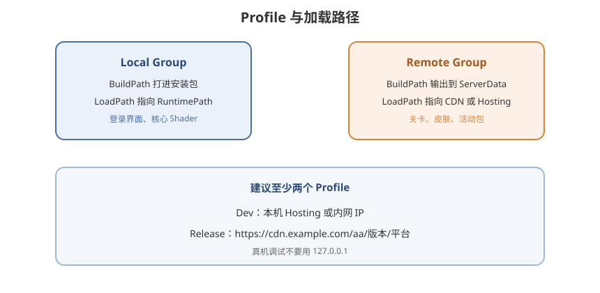

# 03 - Profile 与加载路径

## 学习目标
- 能配 Local / Remote 的 BuildPath 与 LoadPath
- 会用 Profile 在本机 HTTP 和正式 CDN 之间切换
- 理解 StreamingAssets、Cache、远程 URL 的关系

---



## 1. Profile 是什么

Profile 是一套 **路径变量**。打包时用 `BuildPath` 决定文件写到磁盘哪；运行时用 `LoadPath` 决定从哪读。

打开：

```
Addressables Groups → Profile 下拉 → 或
Window → Asset Management → Addressables → Profiles
```

常见拆分：

| Profile | 用途 |
|---------|------|
| Default / Local | 全本地，先跑通 |
| DevRemote | LoadPath 指向 `http://127.0.0.1:端口` 或内网 |
| Release | LoadPath 指向 CDN，如 `https://cdn.example.com/aa` |

切换 Profile 后 **重新 Build**，Catalog 里会写入对应 LoadPath。

---

## 2. 四个核心路径

每个 Group 的 Schema 会引用「Local」或「Remote」两套路径（1.19+ 常显示为命名路径）：

| 变量 | 含义 |
|------|------|
| Local.BuildPath | 打本地包时输出目录 |
| Local.LoadPath | 运行时读本地包 |
| Remote.BuildPath | 打远程包时输出目录（通常 `ServerData/[BuildTarget]`） |
| Remote.LoadPath | 运行时 HTTP(S) 根路径 |

`[BuildTarget]` 会替换成 `StandaloneWindows64`、`Android`、`iOS` 等。**不同平台的包不能混用。**

### 2.1 本地典型值

```
LocalBuildPath:  Library/com.unity.addressables/aa/[BuildTarget]
LocalLoadPath:   {UnityEngine.AddressableAssets.Addressables.RuntimePath}
```

`RuntimePath` 在 Player 里指向随包数据（常见是 StreamingAssets 下 Addressables 目录）。打 Player 时，Addressables 的 **Player Build** 会把本地 Group 拷进包内。

### 2.2 远程典型值

```
RemoteBuildPath:  ServerData/[BuildTarget]
RemoteLoadPath:   https://cdn.example.com/unity/aa/[BuildTarget]
```

开发期可改成：

```
RemoteLoadPath:   http://127.0.0.1:8080/[BuildTarget]
```

Build 完成后，把 `ServerData/<BuildTarget>/` **原样上传** 到 URL 对应目录（含 catalog、hash、各个 `.bundle`）。

---

## 3. 用 Hosting 在本机提供远程包

```
Window → Asset Management → Addressables → Hosting
```

启用 Hosting Service，记下端口。Dev Profile 的 `RemoteLoadPath` 填：

```
http://[PrivateIpAddress]:[HostingServicePort]
```

部分版本提供变量 `[PrivateIpAddress]`、`[HostingServicePort]`，真机连电脑调试时比写死 `localhost` 可靠（手机上的 localhost 是手机自己）。

流程：

1. Profile 切到 DevRemote
2. 远程 Group 路径用 Remote
3. New Build
4. 开 Hosting
5. Play Mode = Use Existing Build，或真机与电脑同一局域网

---

## 4. 远程 Catalog

默认 Catalog 打进本地。要热更资源，必须让客户端能拉到 **新的 Catalog**：

Addressable Asset Settings：

- **Build Remote Catalog** 勾选
- Remote Catalog 的 Build / Load Path 指向远程根目录

产物示例：

```
ServerData/Android/
├── catalog_0.1.0.hash
├── catalog_0.1.0.json
├── settings.json          （视版本而定）
└── *.bundle
```

客户端启动时 `InitializeAsync` 先读包内「从哪下载 Catalog」的信息，再请求远程 `catalog_xxx.hash`。hash 变了才下新 json，再按新目录下载缺失 Bundle。细节见 [08 - 资源热更常用方法](/Addressables/08-资源热更常用方法)。

---

## 5. 运行时改 URL

CDN 域名按渠道变化、或要加鉴权 query 时：

```csharp
using UnityEngine.AddressableAssets;

public static void SetupCdn(string root)
{
    Addressables.InternalIdTransformFunc = location =>
    {
        string id = location.InternalId;
        if (id.StartsWith("https://placeholder.example/"))
            return id.Replace("https://placeholder.example/", root);
        return id;
    };
}
```

也可实现 `WebRequestOverride`，给 `UnityWebRequest` 加 Header（Token、防盗链）。

Profile 里仍建议打一个占位根路径，运行时再替换，避免每个渠道打一套完全不同的包（Bundle 内容可相同，Catalog 里的 URL 前缀可变）。

---

## 6. 和「拷到 StreamingAssets」的关系

- **Local Group**：随 Player 走，玩家装包即有，**不占** 热更流量，但增大安装包
- **Remote Group**：安装包小，首次进入相应内容才下，依赖网络与 Cache

混合策略（常用）：

- 登录、新手关、核心 Shader → Local
- 后续关卡、皮肤、活动 → Remote

不要把所有东西放 Remote 又要求「无网能进游戏」——至少 Local 要覆盖启动链路。

---

## 7. 学习检查点

- [ ] 能独立配 Dev / Release 两套 RemoteLoadPath
- [ ] 知道 `ServerData` 要整目录上传，且按 BuildTarget 分子目录
- [ ] 会开 Hosting 让真机从电脑拉远程包
- [ ] 能说明为何热更必须 Build Remote Catalog
