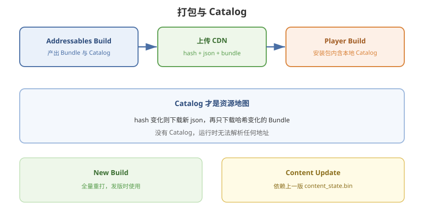

# 04 - 打包与 Catalog

## 学习目标
- 搞清 Addressables Build 和 Player Build 的顺序
- 认识 catalog / hash / bundle 各自职责
- 能选择 New Build 与 Content Update 的使用时机

---



## 1. 两次「Build」不要混

| 步骤 | 做什么 | 谁触发 |
|------|--------|--------|
| Addressables Build | 打 Bundle + 生成 Catalog | Groups 窗口 / CI 脚本 |
| Player Build | 打 APK / IPA / exe，并打进 **本地** Addressables 数据 | File → Build Settings |

正确顺序几乎永远是：

```
1. 选对 Platform（Android/iOS/Standalone）
2. 选对 Profile
3. Addressables → New Build 或 Content Update
4. 上传远程产物（若有 Remote）
5. 再 Build Player
```

只打 Player、忘了打 Addressables：包内 Catalog 与磁盘 Bundle 对不上，或远程 404。

---

## 2. Catalog 是什么

Catalog 是 **地址 → 资源位置** 的数据库（json，可再压缩）。客户端靠它知道：

- 这个 Key 在哪个 Bundle
- Bundle 的哈希、CRC、依赖
- 从 Local 读还是 HTTP 读

`.hash` 文件是 Catalog 的指纹。启动时先下（或比对）hash，没变就不必重下整份 json。

没有 Catalog，Addressables 不知道任何 Address。热更的本质通常是：**换一份 Catalog + 只下哈希变化了的 Bundle**。

---

## 3. New Build（Default Build Script）

```
Addressables Groups → Build → New Build → Default Build Script
```

效果：

- 按当前 Group 配置重新打 **全部** Bundle
- 生成新 Catalog
- 远程输出到 `RemoteBuildPath`

适合：

- 项目早期
- 改了打包规则（Group 拆分、压缩、路径）
- 不打算用官方 Content Update 工作流

代价：远程 Group 即使用户只改了一个贴图，**文件名/哈希变了的包都要重新下**（具体取决于 Bundle Mode 和是否启用哈希命名）。

---

## 4. Content Update（差量更新）

官方为「已上线、只改一部分资源」提供了：

```
Build → Check for Content Update Restrictions
Build → Update a Previous Build
```

需要一份 **上次发布的 Content State**（`addressables_content_state.bin`，打 New Build 时生成，必须归档）。

### 4.1 Static / 不可更新 Group

标记为 **Cannot Change Post Release**（或 Static Content）的 Group：

- 打进首包后，**理论上不应再改其中资源**
- 若改了，Analyze / Content Update 会警告：要么把依赖挪到可更新 Group，要么放弃差量、发新 App

适合：Shader、启动 UI、极少变的基础库。

### 4.2 可更新 Group

远程、允许 Content Update 的 Group：改动会打出 **新 Bundle**，Catalog 指向新哈希，客户端只下差值。

### 4.3 使用注意

- `addressables_content_state.bin` 按平台分别保存，发版流水线要当构建产物存档
- 丢了 state 文件 ≈ 无法做官方差量，只能 New Build
- 改 Group 结构（条目在组间移动）很容易破坏差量假设，需谨慎

完整热更步骤见 [08 - 资源热更常用方法](/Addressables/08-资源热更常用方法)。

---

## 5. 打包脚本（CI）

编辑器命令行示例：

```bash
Unity.exe -batchmode -nographics -projectPath <项目>
  -executeMethod MyEditor.AddressablesMenu.BuildAndroid
  -quit -logFile build.log
```

```csharp
using UnityEditor;
using UnityEditor.AddressableAssets;
using UnityEditor.AddressableAssets.Settings;

public static class AddressablesMenu
{
    public static void BuildAndroid()
    {
        EditorUserBuildSettings.SwitchActiveBuildTarget(
            BuildTargetGroup.Android, BuildTarget.Android);

        AddressableAssetSettings.BuildPlayerContent();
        // 或 ContentUpdateScript.BuildContentUpdate(...)
    }
}
```

`BuildPlayerContent` = New Build。Content Update 要用 `ContentUpdateScript.BuildContentUpdate(settings, contentStatePath)`。

---

## 6. 输出目录与 Player 的关系

- `Library/com.unity.addressables/`：本地中间产物，**不要**当 CDN 目录
- `ServerData/`：上传 CDN；可加入 Git LFS 或只在 CI 产物里保留
- 打 Player 时，本地 Catalog + 本地 Bundle 进入包内；远程 Bundle **不应**全部打进 APK（否则失去远程意义）

Settings 里 **Build Remote Catalog** 打开后，包内仍会留「远程 Catalog 的 URL」，运行时再拉最新目录。

---

## 7. 清理

改平台、改压缩、奇怪的 404 / CRC 失败时：

```
Addressables Groups → Build → Clean Build → All
```

再 New Build。客户端 Cache 清理见 [09 - 下载进度缓存与弱网](/Addressables/09-下载进度缓存与弱网)。

---

## 8. 学习检查点

- [ ] 能按「先 AA Build，再 Player Build」出包
- [ ] 能说明 catalog.json 与 .hash 的作用
- [ ] 知道 New Build 与 Update a Previous Build 的差别
- [ ] 会把 `addressables_content_state.bin` 当发版产物保存
