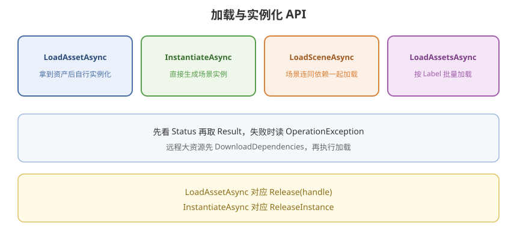

# 05 - 加载与实例化 API

## 学习目标
- 会用 Load、Instantiate、LoadScene、批量加载
- 能选 async/await、协程、Completed 回调
- 理解 MergeMode 和 LoadResourceLocations

---



## 1. 通用约定

- 几乎所有接口返回 `AsyncOperationHandle` / `AsyncOperationHandle<T>`
- 用 `await handle.Task` 或 `yield return handle`
- **必须**在不用时 `Release`（第 06 章），否则 Bundle 常驻
- Key 可以是 Address、Label、AssetReference、IResourceLocation

初始化：第一次加载会自动 Init；要自定义异常或改 URL，先 `InitializeAsync`。

---

## 2. LoadAssetAsync

加载 **资产本身**（Prefab 模板、贴图、音频、SO），不负责放到场景里。

```csharp
using UnityEngine;
using UnityEngine.AddressableAssets;
using UnityEngine.ResourceManagement.AsyncOperations;

public class LoadExamples
{
    public async void LoadPrefab()
    {
        AsyncOperationHandle<GameObject> handle =
            Addressables.LoadAssetAsync<GameObject>("prefab/cube");
        GameObject prefab = await handle.Task;

        if (handle.Status == AsyncOperationStatus.Succeeded)
        {
            Object.Instantiate(prefab);
        }

        Addressables.Release(handle);
    }
}
```

`WaitForCompletion()` 可把异步变同步，**主线程会卡住**，只建议编辑器工具或极短本地加载，不要在游戏帧里对远程资源使用。

---

## 3. InstantiateAsync

加载 Prefab **并实例化**。内部会处理依赖，释放要用 `ReleaseInstance`，不要只 `Destroy`。

```csharp
AsyncOperationHandle<GameObject> handle =
    Addressables.InstantiateAsync("prefab/cube", position, rotation, parent);
GameObject instance = await handle.Task;

// 销毁
Addressables.ReleaseInstance(instance);
// 或 Addressables.Release(handle);
```

对比：

| | Load + Instantiate | InstantiateAsync |
|--|--------------------|------------------|
| 同一 Prefab 多份实例 | 可 Load 一次，Instantiate 多次 | 每次实例化都关联句柄 |
| 释放 | Release 资产句柄要等实例都销毁 | ReleaseInstance 逐个实例 |
| 适合 | 对象池、大量重复刷怪 | 偶尔生成的单个物体 |

对象池推荐：`LoadAssetAsync` 一次，自己 `Instantiate`/`Destroy`，最后 `Release` 模板句柄。

---

## 4. 场景

```csharp
using UnityEngine.SceneManagement;
using UnityEngine.ResourceManagement.ResourceProviders;

AsyncOperationHandle<SceneInstance> handle = Addressables.LoadSceneAsync(
    "scene/level_01",
    LoadSceneMode.Additive);

SceneInstance scene = await handle.Task;

// 卸载
await Addressables.UnloadSceneAsync(handle).Task;
```

场景所在 Group 的依赖（光照、引用资源）会一并加载。`Single` 模式会卸当前场景，注意释放其它 Addressables 句柄的时机。

---

## 5. 批量与 MergeMode

```csharp
using System.Collections.Generic;

IEnumerable<object> keys = new object[] { "ui", "sfx" }; // Label 或 Address

AsyncOperationHandle<IList<GameObject>> handle = Addressables.LoadAssetsAsync<GameObject>(
    keys,
    go => { /* 每完成一个回调，可为 null */ },
    Addressables.MergeMode.Union);
```

| MergeMode | 含义 |
|-----------|------|
| Union | 任意 Key 命中的并集 |
| Intersection | 同时满足所有 Key（例如同时有 Label `level1` 和 `boss`） |
| UseFirst | 只用第一个 Key |

按 Label 下载依赖（不一定 Load 进内存）：

```csharp
AsyncOperationHandle download = Addressables.DownloadDependenciesAsync("chapter1");
await download.Task;
Addressables.Release(download);
```

---

## 6. LoadResourceLocationsAsync

先查「有哪些 Location」，再按类型过滤，避免 Label 里混杂类型：

```csharp
AsyncOperationHandle<IList<IResourceLocation>> locHandle =
    Addressables.LoadResourceLocationsAsync("chapter1", typeof(Sprite));
IList<IResourceLocation> locs = await locHandle.Task;

AsyncOperationHandle<IList<Sprite>> loadHandle =
    Addressables.LoadAssetsAsync<Sprite>(locs, null);
IList<Sprite> sprites = await loadHandle.Task;

Addressables.Release(loadHandle);
Addressables.Release(locHandle);
```

---

## 7. 进度

`handle.PercentComplete` 在 **下载 + 加载** 阶段会动，但多依赖时不是严格线性。需要「还要下多少字节」用 `GetDownloadSizeAsync`（第 08、09 章）。

```csharp
while (!handle.IsDone)
{
    float p = handle.PercentComplete;
    await System.Threading.Tasks.Task.Yield();
}
```

---

## 8. 失败处理

```csharp
Addressables.ResourceManager.ExceptionHandler = (op, ex) =>
{
    Debug.LogError(ex);
};
```

业务代码仍要判断 `handle.Status`。远程 404、CRC 失败、无网都会失败。不要假设 `Result` 非空。

---

## 9. 学习检查点

- [ ] 能区分 LoadAsset 与 InstantiateAsync 的释放方式
- [ ] 能 Additive 加载 Addressable 场景并卸载
- [ ] 能用 Label + MergeMode 做批量加载
- [ ] 知道对象池应 Load 一次模板，而不是每次 InstantiateAsync
