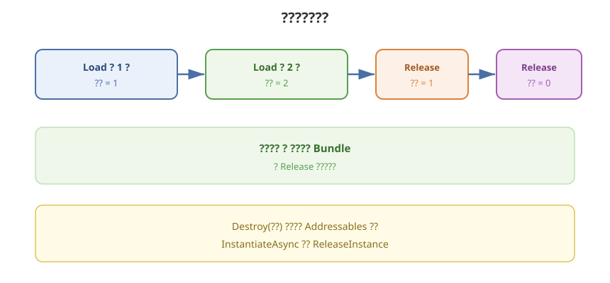

# 06 - 句柄、引用计数与释放

## 学习目标
- 理解 Addressables 用引用计数决定何时卸 Bundle
- 能配对 Load / Release，避免泄漏和过早卸载
- 分清 Release、ReleaseInstance、ClearDependencyCache

---



## 1. 为什么必须 Release

每次成功的 `LoadAssetAsync` / `LoadSceneAsync` / `DownloadDependenciesAsync` / `InstantiateAsync` 都会让相关 Bundle **引用 +1**。计数 > 0 时 Bundle 留在内存（远程包还占 Cache）。

`Release` 使计数 -1。到 0 时 Addressables 卸载该 Bundle（是否卸资产对象取决于内部策略，但对你而言：**不 Release 就等于泄漏**）。

这和手写 `AssetBundle.Unload(true)` 是同一问题，只是计数改由系统做。系统 **不会** 在场景切换时自动把你忘了的句柄清掉。

---

## 2. 同一资源加载两次

```csharp
var h1 = Addressables.LoadAssetAsync<GameObject>("prefab/cube");
var h2 = Addressables.LoadAssetAsync<GameObject>("prefab/cube");
await h1.Task;
await h2.Task;
// 该资产引用计数为 2

Addressables.Release(h1); // 仍为 1，内存还在
Addressables.Release(h2); // 为 0，可以卸载 Bundle
```

不要「只 Release 一次就以为卸干净」。有几个成功的 Load，就要几次 Release（Instantiate 则按实例）。

---

## 3. 释放 API 对照

| 加载方式 | 释放 |
|----------|------|
| `LoadAssetAsync` | `Addressables.Release(handle)` 或 `Release(handle.Result)`（需系统能反查） |
| `InstantiateAsync` | `Addressables.ReleaseInstance(go)` 或 `Release(handle)` |
| `LoadSceneAsync` | `UnloadSceneAsync(handle)` |
| `DownloadDependenciesAsync` | `Release(handle)`（下载句柄也占操作，下完应释放） |
| `InitializeAsync` | 一般不 Release Init 句柄；查当前版本文档 |
| `AssetReference.LoadAssetAsync` | `assetRef.ReleaseAsset()` |

`Destroy(instance)` **不会**减少 Addressables 计数。InstantiateAsync 出来的物体必须 `ReleaseInstance`。

---

## 4. 推荐写法：把句柄存起来

```csharp
using UnityEngine;
using UnityEngine.AddressableAssets;
using UnityEngine.ResourceManagement.AsyncOperations;

public class EnemyView : MonoBehaviour
{
    AsyncOperationHandle<GameObject> _handle;
    bool _loaded;

    public async void LoadAsync()
    {
        _handle = Addressables.LoadAssetAsync<GameObject>("char/enemy");
        await _handle.Task;
        _loaded = _handle.Status == AsyncOperationStatus.Succeeded;
        if (_loaded)
            Instantiate(_handle.Result, transform);
    }

    void OnDestroy()
    {
        if (_loaded)
            Addressables.Release(_handle);
    }
}
```

失败的 handle 是否 Release 以当前包版本为准：失败时通常仍应 `Release` 以免操作残留。稳妥写法：只要 `IsValid()` 就 Release。

```csharp
if (_handle.IsValid())
    Addressables.Release(_handle);
```

---

## 5. 过早释放

计数到 0 后，你还拿着 `handle.Result` 去 Instantiate，可能得到已卸资源或粉红丢失。规则：

- **最后一个使用者**离开时再 Release
- 对象池：池活着句柄就活着；关池时 Release
- 场景 A 加载的 UI，切到场景 B 若还显示，不要在 A 的 `OnDestroy` 里 Release（把生命周期收到全局 Resource 管理器）

---

## 6. 泄漏怎么查

- 内存 Profiler：重复进关卡后 Bundle / Texture 只增不减
- Addressables Event Viewer（包自带，版本不同菜单路径不同）：看引用
- 自己计数：封装 `Load` 必须返回 `IDisposable` 或统一 `ResourceHandle` 登记表

常见泄漏：

- 协程没跑完就 Destroy，未 Release
- 匿名 `Completed +=` 里拿到 Result，外层丢了 handle
- `LoadAssetsAsync` 成功后只 Destroy 物体

---

## 7. 清缓存不是 Release

| API | 作用 |
|-----|------|
| `Release` | 减引用，可能卸内存中的 Bundle |
| `ClearDependencyCacheAsync(key)` | 删该 Key 对应 **磁盘 Cache** |
| `Caching.ClearCache()` | 清 Unity 整个 AssetBundle Cache（影响所有缓存包） |

热更失败、CRC 对不上时可以清 Cache 再下。不要在游戏中途对正在用的资源 ClearCache。

---

## 8. 学习检查点

- [ ] 能画出 Load 两次、Release 一次时内存为何还在
- [ ] InstantiateAsync 的物体不会只用 Destroy
- [ ] 有统一的句柄存放 / `IsValid` 再 Release 的习惯
- [ ] 分清 Release 与 ClearDependencyCache
