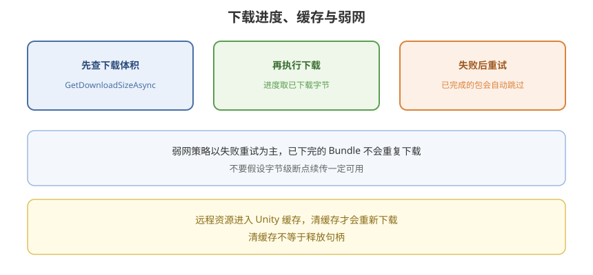

# 09 - 下载进度、缓存与弱网

## 学习目标
- 能做可用的下载进度与剩余体积
- 会处理失败重试、无网、清缓存
- 了解 Addressables 缓存与断点能力的边界

---



## 1. 先问体积，再下载

```csharp
AsyncOperationHandle<long> sizeHandle =
    Addressables.GetDownloadSizeAsync("chapter1");
long bytes = await sizeHandle.Task;
Addressables.Release(sizeHandle);

if (bytes == 0)
{
    // 已在 Cache 或全是 Local，无需下载
}
```

多个 Key 用列表：`GetDownloadSizeAsync(IEnumerable keys)`。该值包含 **尚未缓存的依赖 Bundle**。

Wi-Fi / 蜂窝提示：用 `bytes` 转 MB 展示，让玩家确认。

---

## 2. 进度

```csharp
using UnityEngine;
using UnityEngine.AddressableAssets;
using UnityEngine.ResourceManagement.AsyncOperations;

public class DownloadWithProgress : MonoBehaviour
{
    public UnityEngine.UI.Slider slider;

    public async void Download(object key)
    {
        AsyncOperationHandle handle = Addressables.DownloadDependenciesAsync(key, true);
        while (!handle.IsDone)
        {
            slider.value = handle.PercentComplete;
            await System.Threading.Tasks.Task.Yield();
        }

        if (handle.Status != AsyncOperationStatus.Succeeded)
            Debug.LogError(handle.OperationException);

        Addressables.Release(handle);
    }
}
```

`PercentComplete` 不是精确字节比，大文件依赖多时会跳。需要更细的字节进度时：

- 用 `AsyncOperationHandle.GetDownloadStatus()`（较新版本提供 `DownloadedBytes` / `TotalBytes`）
- 或自行按 Bundle 列表聚合（维护成本高）

---

## 3. 弱网与失败

典型错误：超时、404、证书、CRC 不匹配、磁盘满。

建议：

1. 设置 `Addressables.ResourceManager.ExceptionHandler` 打日志
2. 失败后 **有限次数重试**（指数退避）
3. CRC / 损坏：`ClearDependencyCacheAsync(key)` 再下
4. 无网且 `GetDownloadSizeAsync > 0`：提示，不要死循环 Initialize
5. 检查 Catalog 失败：可继续用 **上次成功的 Locator**（玩家进离线可玩部分）

```csharp
public static async System.Threading.Tasks.Task DownloadRetry(object key, int times = 3)
{
    for (int i = 0; i < times; i++)
    {
        AsyncOperationHandle handle = Addressables.DownloadDependenciesAsync(key, true);
        await handle.Task;
        bool ok = handle.Status == AsyncOperationStatus.Succeeded;
        Addressables.Release(handle);
        if (ok) return;
        await System.Threading.Tasks.Task.Delay(1000 * (i + 1));
    }
    throw new System.Exception("download failed");
}
```

---

## 4. 缓存行为

远程 Bundle 默认进 Unity `Caching`（可在 Group Schema 里关）。特点：

- 同一哈希命中则不下
- 空间受 `Caching.maximumAvailableDiskSpace` 等影响（平台差异大）
- **不是** 可靠的「断点续传保证」：底层 `UnityWebRequest` 对单文件可能支持 Range，但 Addressables 版本与平台表现不一致。弱网大文件要以「失败重试 + 已完成 Bundle 跳过」为主，不要假设字节级续传一定可用

清理：

```csharp
Addressables.ClearDependencyCacheAsync("chapter1");
// 或
Caching.ClearCache();
```

玩家「修复资源」按钮可以绑 ClearCache + 重新 Download。不要每次启动都 Clear。

---

## 5. 并发与优先级

同时 `DownloadDependenciesAsync` 很多 Label 会打满带宽、卡 UI。建议：

- 启动只下 **必更** Label
- 进入大厅后再下下一章
- 低优先级皮肤后台下，失败忽略

`DownloadDependenciesAsync` 的 `autoReleaseHandle` 参数：`true` 时完成自动 Release 下载句柄，仍要理解它 **不会** Release 你随后 `LoadAssetAsync` 的资产句柄。

---

## 6. HTTP 与 HTTPS

真机必须 HTTPS（ATS、Android 明文限制）。开发 Hosting 用 HTTP 时，Android 要配 `network_security_config` 允许调试网段，发版改回 HTTPS CDN。

证书问题表现为 Initialize 或下载直接失败，先在手机浏览器打开同一个 catalog URL 验证。

---

## 7. 学习检查点

- [ ] 能在下载前展示 MB 级体积
- [ ] 有失败重试和「修复资源」清缓存路径
- [ ] 不把 PercentComplete 当成精确计费字节
- [ ] 启动只下必更包，其它包按需/后台
