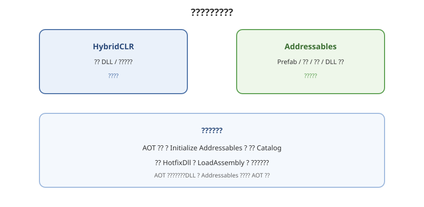

# 10 - 与 HybridCLR 协同

## 学习目标
- 能把热更 DLL 放到 Addressables 里远程加载
- 理清「代码热更」和「资源热更」的启动顺序
- 避免 AOT / 补充元数据与 Addressables 初始化互相踩脚

---



## 1. 两条热更线

| 线 | 更新什么 | 典型载体 |
|----|----------|----------|
| 资源 | Prefab、贴图、场景、配置 | Addressables Bundle |
| 代码 | 玩法逻辑程序集 | HybridCLR 热更 DLL |

可以都走 Addressables：把 `HotUpdate.dll.bytes`（或 `.dll` 改成 TextAsset）标成 Addressable，放 Remote Group `HotfixDll`。

详细 HybridCLR 见专题 [HybridCLR / 00 术语解释](/HybridCLR/00-术语解释)。本章只谈和 Addressables 的接缝。

---

## 2. 推荐启动顺序

```
1. 引擎启动、显示本地 Loading（Local 资源，不依赖热更 DLL）
2. Addressables.InitializeAsync
3. CheckForCatalogUpdates + UpdateCatalogs
4. DownloadDependencies：Label 包含 hotfix + 启动必需资源
5. LoadAssetAsync<TextAsset>("dll/hotupdate")
6. HybridCLR.LoadRuntime / Assembly.Load(dllBytes)
7. 再进入用热更代码驱动的登录/选关
```

不要在热更 DLL 里才去 `InitializeAsync`——鸡生蛋：DLL 还没下来。

启动场景、Loading UI、更新失败提示，必须在 **AOT 主工程**，且资源在 **Local Group**。

---

## 3. 把 DLL 当 Addressable

1. 构建热更程序集，输出 `HotUpdate.dll`
2. 复制为 `Assets/Hotfix/HotUpdate.dll.bytes`（Unity 才能当 TextAsset）
3. 标 Addressable，地址例如 `dll/hotupdate`
4. Group：`HotfixDll`，Remote，Pack Together
5. 每次出热更代码都更新该文件并打 Addressables（或 Content Update）

```csharp
using System.Reflection;
using UnityEngine;
using UnityEngine.AddressableAssets;
using UnityEngine.ResourceManagement.AsyncOperations;

public static class HotfixLoader
{
    public static async void LoadHotUpdateAssembly()
    {
        AsyncOperationHandle<TextAsset> handle =
            Addressables.LoadAssetAsync<TextAsset>("dll/hotupdate");
        TextAsset asset = await handle.Task;
        Assembly.Load(asset.bytes);
        Addressables.Release(handle);
    }
}
```

实际项目还要：加载 **补充元数据 DLL**、`HybridCLR.RuntimeApi.LoadMetadataForAOTAssembly`、再 Load 热更程序集。顺序以 HybridCLR 官方模板为准。

多个热更程序集：多个 Address，或一个 Label `hotfix` + `LoadAssetsAsync<TextAsset>`，按依赖顺序 Load（AOT 依赖的程序集先加载）。

---

## 4. 版本要一起规划

代码和资源经常互相依赖（新 UI Prefab + 新脚本）。建议：

- Catalog 一次发布里 **同时包含** 新 DLL 和新 Prefab
- 或资源版本号与 DLL 版本号写进自己的 `version.json`（仅作展示和强更判断），真正加载仍以 Catalog 为准
- 不要出现「只更了 Prefab、客户端还是旧 DLL」的半包；可用「最低 DLL 版本」检查

App 商店包升级（AOT 变了）后，热更 DLL 通常要 **按该 AOT 重编**，并 New Build Addressables。

---

## 5. 注意点

- IL2CPP 下不能指望编辑器那样随便 Load 任意 DLL；必须走 HybridCLR 工作流
- DLL Group 不要 Pack Together 进一个巨大 UI 包，否则改一行代码下几十 MB
- `Assembly.Load` 后旧类型还在，热更代码生效往往要 **重新进游戏逻辑**，不要假设当前场景里已实例化的旧组件会变身
- Addressables 自身是 AOT 侧调用，热更代码里也可以 `using Addressables`，但初始化仍建议在 AOT 完成

---

## 6. 学习检查点

- [ ] 能画出「先 Catalog/资源下载，再 Load DLL」的启动图
- [ ] Loading 与报错 UI 不依赖热更程序集
- [ ] 热更 DLL 独立 Group，改代码不会拖垮无关 Bundle
- [ ] 理解 AOT 大版本升级后要重出热更 DLL + Addressables
