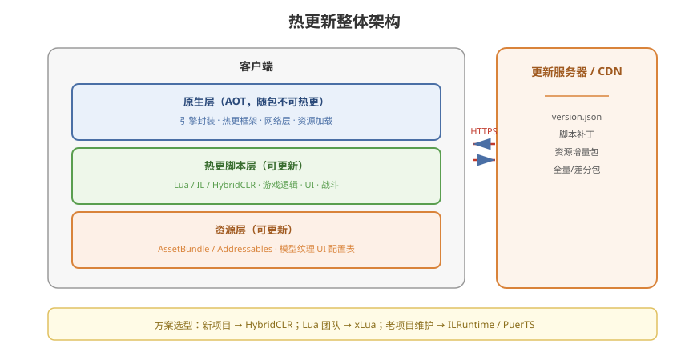

# 01 - 热更概述与原理

## 学习目标
- 理解热更新 (Hot Update) 的核心概念和必要性
- 掌握代码热更和资源热更的区别
- 了解主流热更方案的架构和选型依据

---



## 1. 什么是热更新？

热更新是指不通过应用商店重新发布，在线更新游戏逻辑、资源和修复 Bug 的技术。

### 1.1 为什么需要热更新？
| 原因 | 说明 |
|------|------|
| 绕过审核 | App Store / 各大安卓商店审核周期长 (1-7 天) |
| 紧急修复 | 线上重大 Bug 需要立即修复 |
| 活动更新 | 运营活动需要频繁更新 UI 和逻辑 |
| 内容迭代 | 新的关卡、角色、皮肤等持续更新 |
| 包体控制 | 首包尽可能小，后续按需下载 |

### 1.2 热更 vs 冷更
| | 热更新 (Hot Update) | 冷更新 (App Update) |
|------|---------------------|---------------------|
| 更新方式 | 游戏内静默下载 | 应用商店更新 |
| 审核 | 无需审核 | 需要审核 |
| 更新内容 | 代码 + 资源 | 完整 App |
| 用户体验 | 无感知 | 需要重新下载 |

---

## 2. 热更技术的分类

### 2.1 资源热更
```
[服务器资源版本] ≠ [本地资源版本]
  → 下载差异 Bundle
  → 替换本地资源
  → 新场景 / 新模型 / 新 UI 生效
```

**实现方式：AssetBundle / Addressables**

### 2.2 代码热更
```
C# 代码编译为中间语言
  → 通过热更框架加载执行
  → 绕过 App Store 的代码审核
```

**主要方案：**
| 方案 | 脚本语言 | 原理 |
|------|----------|------|
| **Lua** (xLua / ToLua / SLua) | Lua | Lua 虚拟机嵌入 Unity，解释执行 Lua |
| **ILRuntime** | C# 热更 | 解释执行 IL (中间语言) |
| **HybridCLR** (原 huatuo) | C# 热更 | IL2CPP 扩展，补充解释执行 AOT 缺失代码 |
| **PuerTS** | TypeScript/JS | V8 引擎嵌入 Unity |

---

## 3. 热更架构概览

### 3.1 经典架构
```
┌──────────────────────────────────────────────┐
│                  客户端                       │
├────────────┬──────────────┬──────────────────┤
│  原生层     │  热更脚本层    │   资源层          │
│  (C# AOT)  │  (Lua/ILR/   │  (AssetBundle/   │
│            │   HybridCLR)  │   Addressables)   │
├────────────┼──────────────┼──────────────────┤
│ 引擎底层    │              │                  │
│ 启动流程    │  游戏逻辑     │   模型/纹理/UI    │
│ 热更框架    │  战斗系统     │   音效/场景       │
│ 网络层      │  UI 系统      │   配置表          │
└────────────┴──────────────┴──────────────────┘
```

### 3.2 启动与更新流程
```
[启动 App]
    ↓
[检查更新] → 有更新？ → [下载更新包]
    ↓                        ↓
[版本校验] ←─────────────────┘
    ↓
[解压/合并资源]
    ↓
[加载热更脚本引擎]
    ↓
[执行热更入口]
    ↓
[进入游戏]
```

---

## 4. 主流热更方案对比

### 4.1 综合对比
| 方案 | 语言 | 性能 | 调试 | 包体 | 学习成本 | 推荐度 |
|------|------|------|------|------|----------|--------|
| xLua | Lua | 中 | 一般 | 小 | 中 | ★★★ |
| ILRuntime | C# | 低 | 好 | 中 | 中 | ★★★ |
| **HybridCLR** | C# | 高 | 很好 | 小 | 低 | ★★★★★ |
| PuerTS | TS/JS | 高 | 好 | 中 | 中 | ★★★★ |
| ToLua | Lua | 中 | 差 | 小 | 高 | ★★ |

### 4.2 选型建议
| 项目阶段 | 推荐方案 |
|----------|----------|
| 新项目 2024+ | **HybridCLR**（首选） |
| 已有 Lua 团队 | xLua + 资源热更 |
| 老项目维护 | ILRuntime 或保持现状 |
| 前端转 Unity | PuerTS (TypeScript 亲和) |

---

## 5. 项目实战要点

### 5.1 模块拆分
```
热更层（可更新）:
  ├── 游戏逻辑
  ├── UI 业务
  ├── 战斗系统
  ├── 运营活动
  └── 配置表读取

AOT 层（不可更新，随包）:
  ├── 引擎封装
  ├── 热更框架初始化
  ├── 网络通信
  ├── 资源加载框架
  └── 性能敏感的底层计算
```

### 5.2 性能考量
- AOT 层做性能敏感工作（寻路、物理计算）
- 热更层做业务逻辑
- 减少跨语言调用（Lua ↔ C# 交互有开销）
- HybridCLR 性能损耗最小（补充元数据方式运行）

---

## 6. 更新服务端设计

```
[CDN / OSS]
  ├── asset_bundles/
  │   ├── 1.0.0/        ← 全量版本
  │   └── patches/      ← 增量补丁
  │       ├── 1.0.0_to_1.0.1/
  │       └── 1.0.1_to_1.0.2/
  ├── scripts/
  │   └── hotfix/       ← Lua / IL / HybridCLR DLL
  └── version.json      ← 最新版本信息
```

---

## 7. 学习检查点

- [ ] 理解热更新的必要性和应用场景
- [ ] 能区分代码热更和资源热更
- [ ] 了解各方案的优劣和适用场景
- [ ] 画出完整的热更更新流程图
