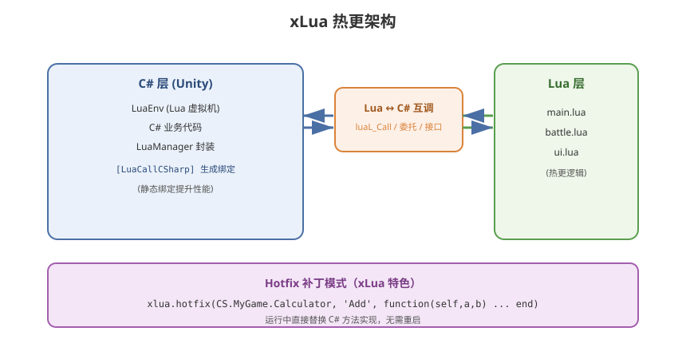

# 02 - Lua 热更方案 (xLua)

## 学习目标
- 理解 xLua 的集成方式和工作原理
- 掌握 Lua ↔ C# 互调的核心机制
- 能独立搭建基于 xLua 的热更框架

---



## 1. xLua 简介

xLua 是腾讯开源的高性能 Lua 解决方案，为 Unity 项目提供 Lua 脚本热更新能力。

### 1.1 核心特性
- **高性能**：静态绑定 + 动态优化
- **补丁模式**：直接在 Lua 中 Hotfix C# 方法
- **类 C# 语法**：`lua_call_cs` 支持在 Lua 中直接调用 C# API
- **完整文档**：开发者社区活跃

### 1.2 安装
```
GitHub: https://github.com/Tencent/xLua
下载 Releases 包 → 导入 Assets/ 目录
```

---

## 2. xLua 基础使用

### 2.1 Hello World
```csharp
// C# 执行 Lua
LuaEnv luaEnv = new LuaEnv();
luaEnv.DoString("print('Hello from Lua!')");
luaEnv.DoString("CS.UnityEngine.Debug.Log('Hello from Lua to Unity!')");
luaEnv.Dispose();
```

### 2.2 加载 Lua 文件
```csharp
LuaEnv luaEnv = new LuaEnv();

// 方式1：从 Resources 加载
TextAsset luaText = Resources.Load<TextAsset>("lua/main");
luaEnv.DoString(luaText.text);

// 方式2：从自定义路径加载（配合 AssetBundle）
luaEnv.AddLoader((ref string filepath) =>
{
    string path = Application.dataPath + "/LuaScripts/" + filepath + ".lua.txt";
    if (File.Exists(path))
    {
        return System.Text.Encoding.UTF8.GetBytes(File.ReadAllText(path));
    }
    return null;
});

luaEnv.DoString("require 'main'");
```

---

## 3. Lua 与 C# 互调

### 3.1 C# 调用 Lua
```csharp
LuaEnv luaEnv = new LuaEnv();

// 方式1：直接调全局函数
luaEnv.DoString(@"
    function add(a, b)
        return a + b
    end
");
object[] results = luaEnv.Global.Get<LuaFunction>("add").Call(10, 20);
Debug.Log(results[0]); // 30

// 方式2：通过 Delegate 映射（性能更好）
luaEnv.DoString(@"
    Player = {
        Name = 'Hero',
        HP = 100,
        Attack = function(self, target)
            return self.Name .. ' attacks ' .. target
        end
    }
");

// Delegate 映射
[XLua.CSharpCallLua]
public delegate string AttackDelegate(string target);

AttackDelegate attackFunc = luaEnv.Global.Get<AttackDelegate>("Player.Attack");
string result = attackFunc("Enemy"); // "Hero attacks Enemy"

// 方式3：映射到 Interface
[XLua.CSharpCallLua]
public interface IPlayer
{
    string Name { get; }
    int HP { get; set; }
    string Attack(string target);
}

IPlayer player = luaEnv.Global.Get<IPlayer>("Player");
Debug.Log(player.Name); // Hero
player.HP = 200;        // 修改 Lua 表中的值
Debug.Log(player.Attack("Boss")); // Hero attacks Boss
```

### 3.2 Lua 调用 C#
```lua
-- Lua 侧直接调用 C# 类
local GameObject = CS.UnityEngine.GameObject
local Vector3 = CS.UnityEngine.Vector3

local obj = GameObject('MyObject')
local transform = obj.transform
transform.position = Vector3(10, 0, 5)

-- 调用自定义 C# 方法
CS.MyNamespace.MyClass.StaticMethod(123, 'hello')

-- new 对象
local list = CS.System.Collections.Generic.List(CS.System.Int32)()
list:Add(1)
list:Add(2)
```

### 3.3 生成代码 (Generator)
```csharp
// 标记需要生成的代码
namespace MyGame
{
    [LuaCallCSharp]  // 标记类，生成 Lua 可调用的代码
    public class GameManager
    {
        public static void LoadScene(string sceneName) { }
    }
}

// 生成步骤:
// 菜单 → XLua → Generate Code
// → 生成适配代码，大幅提升跨语言调用性能
```

---

## 4. xLua Hotfix 补丁模式

xLua 最强大的功能：直接在 Lua 中替换 C# 方法实现。

### 4.1 基础 Hotfix
```csharp
// C# 原始代码
public class Calculator
{
    [Hotfix]  // 标记可热更的方法
    public int Add(int a, int b)
    {
        return a + b;
    }
}
```

```lua
-- Lua 热补丁：替换 Add 方法
xlua.hotfix(CS.MyGame.Calculator, 'Add', function(self, a, b)
    print('Hotfixed Add called!')
    return a + b + 100  -- 修改逻辑
end)
```

### 4.2 高级：替换 + 调用原始方法
```lua
local originalAdd = nil

xlua.hotfix(CS.MyGame.Calculator, 'Add', function(self, a, b)
    -- 预处理
    if a < 0 then a = 0 end

    -- 调用原方法
    local result = originalAdd(self, a, b)

    -- 后处理
    print('Result: ' .. result)
    return result
end)

-- 初始化时保存原始方法引用
xlua.hotfix(CS.MyGame.Calculator, 'Add', nil, function(original)
    originalAdd = original
end)
```

---

## 5. xLua 项目架构

### 5.1 目录结构
```
Assets/
├── Plugins/
│   └── xLua/                        ← xLua SDK
├── LuaScripts/                      ← Lua 源码（开发阶段）
│   ├── main.lua
│   ├── module/
│   │   ├── battle.lua
│   │   └── ui.lua
│   └── common/
│       ├── util.lua
│       └── class.lua                ← Lua OOP 工具
├── Scripts/
│   └── LuaManager.cs               ← Lua 管理器
└── StreamingAssets/
    └── lua/                         ← 打包后的 Lua (bytecode)
```

### 5.2 LuaManager 封装
```csharp
public class LuaManager : Singleton<LuaManager>
{
    private LuaEnv luaEnv;
    private LuaTable scriptEnv;

    public void Init()
    {
        luaEnv = new LuaEnv();

        // 注册自定义加载器（支持 AssetBundle 加载 Lua）
        luaEnv.AddLoader(CustomLoader);

        // 创建沙盒环境
        scriptEnv = luaEnv.NewTable();
        LuaTable meta = luaEnv.NewTable();
        meta.Set("__index", luaEnv.Global);
        scriptEnv.SetMetaTable(meta);
        scriptEnv.Set("self", scriptEnv);
    }

    private byte[] CustomLoader(ref string filepath)
    {
        // 优先从 AssetBundle 加载（支持热更）
        TextAsset luaText = AssetManager.Instance.LoadLua(filepath);
        if (luaText != null)
        {
            return System.Text.Encoding.UTF8.GetBytes(luaText.text);
        }
        return null;
    }

    public object[] DoString(string script, string chunkName = "chunk")
    {
        return luaEnv.DoString(script, chunkName, scriptEnv);
    }

    public LuaTable GetGlobal(string key)
    {
        return luaEnv.Global.Get<LuaTable>(key);
    }

    public void Dispose()
    {
        luaEnv?.Dispose();
        luaEnv = null;
    }

    void OnDestroy()
    {
        Dispose();
    }
}
```

---

## 6. Lua 热更流程

```
[启动] → [LuaManager.Init()]
    → [加载编码/加密的 Lua 文件]
    → [执行 require 'main']
    → [调用 Lua 入口 OnStart()]

[检测更新] → [下载新 Lua 脚本]
    → [重新 require 或 hotfix]
    → [新逻辑即时生效]
```

---

## 7. 性能优化

### 7.1 减少跨语言调用
```lua
-- 不好：循环中多次跨语言调用
for i = 1, 1000 do
    CS.UnityEngine.Debug.Log(i)
end

-- 好：批量处理或异步
local logs = {}
for i = 1, 1000 do
    table.insert(logs, i)
end
CS.MyGame.LogManager.BatchLog(logs)
```

### 7.2 使用静态绑定
```csharp
// 标记为静态绑定（避免反射，提升 10-100 倍性能）
[LuaCallCSharp]
public class StaticBinder
{
    public static List<Type> LuaCallCSharpTypes = new List<Type>()
    {
        typeof(GameObject),
        typeof(Transform),
        typeof(Vector3),
    };
}
```

---

## 8. 学习检查点

- [ ] 能在项目中集成 xLua 并运行基础示例
- [ ] 掌握 Lua ↔ C# 双向调用
- [ ] 理解 Hotfix 机制并能实践
- [ ] 能设计基于 xLua 的完整热更架构
