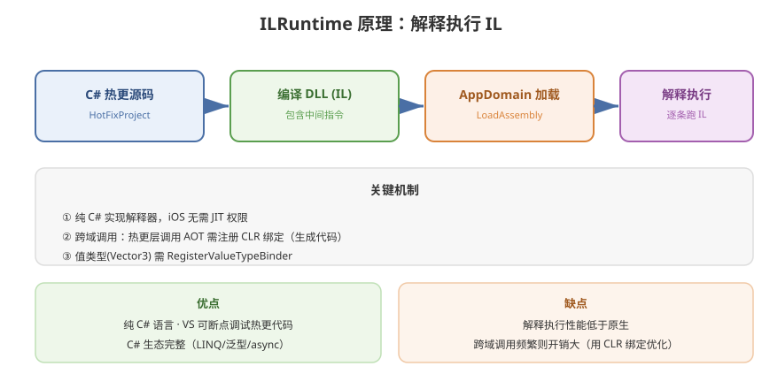

# 03 - ILRuntime 方案

## 学习目标
- 理解 ILRuntime 的 IL 解释执行原理
- 掌握 ILRuntime 的接入和使用方式
- 了解其性能瓶颈和优化手段

---



## 1. ILRuntime 简介

ILRuntime 是一个纯 C# 实现的 IL (中间语言) 解释器，允许在运行时加载和执行外部 DLL，从而实现无需 Lua 的纯 C# 热更新。

### 1.1 核心原理
```
C# 源码 → 编译为 DLL (含 IL 指令)
         ↓
      打包/放置到服务器
         ↓
      运行时下载 DLL
         ↓
ILRuntime 加载 → 逐条解释执行 IL 指令
```

### 1.2 与 Lua 方案的差异
| 维度 | Lua 方案 | ILRuntime |
|------|----------|-----------|
| 语言 | 需学 Lua | 纯 C#（团队统一） |
| 调试 | 困难 | Visual Studio 直接断点调试 |
| 性能 | 中等 | 较低（解释执行） |
| 热更粒度 | 方法级 Hotfix | 整个 DLL 替换 |
| 生态/工具 | 一般 | C# 生态完整 |

---

## 2. 快速入门

### 2.1 项目结构
```
Solution:
├── HotFixProject (DLL 项目)
│   ├── MainEntry.cs          ← 热更入口
│   ├── HotFix/
│   │   ├── GameLogic.cs
│   │   └── UI/
│   └── ...
│
└── UnityProject
    ├── Assets/
    │   ├── Plugins/
    │   │   └── ILRuntime/
    │   └── Scripts/
    │       └── ILRuntimeManager.cs
```

### 2.2 初始化 ILRuntime
```csharp
using ILRuntime.CLR.TypeSystem;
using ILRuntime.Runtime.Enviorment;

public class ILRuntimeManager : MonoBehaviour
{
    private ILRuntime.Runtime.Enviorment.AppDomain appDomain;

    void Start()
    {
        appDomain = new ILRuntime.Runtime.Enviorment.AppDomain();

        // 方式1：从本地加载 DLL
        byte[] dllBytes = File.ReadAllBytes(Application.streamingAssetsPath + "/HotFix.dll");
        byte[] pdbBytes = null;
        string pdbPath = Application.streamingAssetsPath + "/HotFix.pdb";
        if (File.Exists(pdbPath))
            pdbBytes = File.ReadAllBytes(pdbPath);

        using (var fs = new MemoryStream(dllBytes))
        {
            appDomain.LoadAssembly(fs, pdbBytes != null ? new MemoryStream(pdbBytes) : null);
        }

        // 初始化 ILRuntime 的 CLR 绑定
        ILRuntime.CLR.TypeSystem.CLRType.Initialize();

        // 调用热更入口
        appDomain.Invoke("HotFixProject.MainEntry", "Start", null, null);
    }
}
```

### 2.3 热更 DLL 入口
```csharp
// HotFixProject/MainEntry.cs
namespace HotFixProject
{
    public class MainEntry
    {
        public static void Start()
        {
            UnityEngine.Debug.Log("热更代码启动成功！");
            // 初始化游戏逻辑
        }
    }
}
```

---

## 3. 跨域调用

### 3.1 热更层调用主工程 (CLR 重定向)
```csharp
// 主工程：注册可调用的类型和方法
public class CLRBindingHelper
{
    public static void RegisterCLRBinding(ILRuntime.Runtime.Enviorment.AppDomain appDomain)
    {
        // 注册 System.Activator
        appDomain.RegisterCrossBindingAdaptor(new SystemActivatorAdaptor());

        // 注册 UnityEngine.GameObject
        appDomain.DelegateManager.RegisterMethodDelegate<UnityEngine.GameObject>();
        appDomain.DelegateManager.RegisterMethodDelegate<System.String>();
    }
}
```

### 3.2 主工程调用热更层
```csharp
// 主工程
IType type = appDomain.LoadedTypes["HotFixProject.MainEntry"];
object instance = appDomain.Instantiate("HotFixProject.MainEntry");
IType intType = appDomain.GetType(typeof(int));
appDomain.Invoke("HotFixProject.MainEntry", "OnDamage", instance, 10);
```

### 3.3 接口解耦（推荐方式）
```csharp
// 1. 定义接口（主工程 HotFix 项目中都引用）
public interface IHotFixEntry
{
    void OnStart();
    void OnUpdate();
    void OnDestroy();
}

// 2. 热更层实现
public class MainEntry : IHotFixEntry
{
    public void OnStart() { /* ... */ }
    public void OnUpdate() { /* ... */ }
    public void OnDestroy() { /* ... */ }
}

// 3. 主工程加载
appDomain.DelegateManager.RegisterMethodDelegate<System.Object, System.EventArgs>();

// 注册适配器
appDomain.RegisterCrossBindingAdaptor(new IHotFixEntryAdapter());

// 使用
IHotFixEntry entry = appDomain.Instantiate<IHotFixEntry>("HotFixProject.MainEntry");
entry.OnStart();
```

---

## 4. 值类型绑定 (ValueTypeBinding)

ILRuntime 默认不支持值类型（如 Vector3），需要注册绑定：

```csharp
// 注册常用值类型
appDomain.RegisterValueTypeBinder(typeof(Vector3), new Vector3Binder());
appDomain.RegisterValueTypeBinder(typeof(Vector2), new Vector2Binder());
appDomain.RegisterValueTypeBinder(typeof(Quaternion), new QuaternionBinder());

// 或者在 Code Generator 里统一生成绑定代码
```

---

## 5. 委托与事件

```csharp
// 注册委托
appDomain.DelegateManager.RegisterMethodDelegate<System.Single>();
appDomain.DelegateManager.RegisterFunctionDelegate<System.Int32, System.String>();

// 注册委托转换器
appDomain.DelegateManager.RegisterDelegateConvertor<UnityEngine.Events.UnityAction>((action) =>
{
    return new UnityEngine.Events.UnityAction(() =>
    {
        ((System.Action)action)();
    });
});
```

---

## 6. 性能优化

### 6.1 CLR 绑定生成
```csharp
// 使用 ILRuntime 提供的 CLR Binding 代码生成工具
// → 生成大量 glue 代码
// → 避免反射，大幅提升跨域调用性能

// 生成步骤：
// 菜单 → ILRuntime → Generate CLR Binding Code
// → 将生成的绑定代码放入项目
// → Init 时注册:
ILRuntime.Runtime.Generated.CLRBindings.Initialize(appDomain);
```

### 6.2 值类型优化
```csharp
// 使用包装结构减少装箱
// 避免在热更代码中频繁使用 Vector3 等值类型
// 将计算密集逻辑放在主工程的 Native Method 中

// 示例：在热更中避免每帧 Vector3 运算
public static class MathHelper
{
    // 这个方法运行在 AOT (主工程)，性能高
    public static Vector3 CalculatePosition(Vector3 current, Vector3 velocity, float deltaTime)
    {
        return current + velocity * deltaTime;
    }
}
```

### 6.3 常见性能陷阱
```csharp
// 1. 避免循环中使用跨域调用的 foreach
// 不好
foreach (var item in hotfixList) { /* 每步都有跨域开销 */ }

// 好：先转换为 AOT 类型
List<GameObject> nativeList = new List<GameObject>();
// ... 填充
foreach (var item in nativeList) { /* 无跨域开销 */ }

// 2. 避免频繁的 Type.GetType()
// 缓存 IType 引用
```

---

## 7. 调试与开发

### 7.1 断点调试
```
1. 热更 DLL 项目 → 生成 PDB 调试符号
2. 主工程启动 ILRuntime 时加载 PDB
3. Visual Studio 中附加 Unity 进程
4. 在热更代码中直接打断点
```

### 7.2 编译自动化
```csharp
// 编译器：每次修改热更代码后自动编译
public class BuildScript
{
    public static void BuildHotFixDLL()
    {
        // 调用 MSBuild 编译 HotFix 项目
        // 拷贝 DLL 到 StreamingAssets 或服务器
    }
}
```

---

## 8. 学习检查点

- [ ] 能搭建 ILRuntime 基础运行环境
- [ ] 理解跨域调用和 CLR 绑定的关系
- [ ] 掌握接口解耦的架构设计
- [ ] 了解 ILRuntime 的性能瓶颈和优化方向
