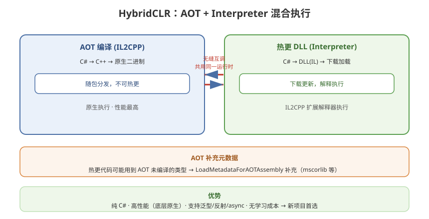

# 04 - HybridCLR 方案 (推荐)

## 学习目标
- 深入理解 HybridCLR 的 AOT + Interpreter 混合运行原理
- 掌握 HybridCLR 的完整接入流程
- 能在新项目中快速集成 HybridCLR 热更方案

---



## 1. HybridCLR 简介

HybridCLR（前身 huatuo）是一个基于 IL2CPP 的热更新方案，通过在 IL2CPP 运行时扩展解释器，使 AOT 缺失的代码可以在运行时解释执行，从而破除了 iOS 等平台对 JIT 的限制。

### 1.1 核心优势
- **纯 C# 热更**：与 Lua、ILRuntime 不同，HybridCLR 直接运行标准 C# 代码
- **极高兼容性**：支持 DLL 热更新，与原生 Unity 开发体验几乎一致
- **高性能**：底层基于 IL2CPP 原生运行，性能远超 ILRuntime
- **无额外学习成本**：无需学习新语言，无需改代码风格
- **完整 C# 特性**：支持泛型、反射、async/await、LINQ 等

### 1.2 架构对比
```
传统 IL2CPP:
  C# → C++ (AOT 编译) → 原生代码 → 不可热更

HybridCLR:
  C# (AOT 部分) → C++ 原生代码         ← 随包，不可热更
  C# (热更部分) → DLL → 解释执行        ← 可下载更新
  ─────────────────────────────────
  两者共用同一运行时，无缝互调！
```

---

## 2. 接入流程

### 2.1 安装 HybridCLR
```
方式1：Package Manager
  → Add package from git URL
  → https://github.com/focus-creative-games/hybridclr_unity.git

方式2：克隆仓库
  git clone https://github.com/focus-creative-games/hybridclr_unity.git
  → 放入 Packages/ 或手动导入
```

### 2.2 安装 IL2CPP (Mac/Windows)
```bash
# macOS
# 安装 (Unity 2021.3 LTS 为例)
dotnet tool install -g hybridclr_unity
hybridclr_unity install

# Windows
# 下载对应版本的 IL2CPP 扩展包
# 解压到 Unity 安装目录 Editor/Data/il2cpp/
```

### 2.3 项目配置
```
打开 HybridCLR → Settings
  → 配置 Hotfix Assemblies (哪些程序集需要热更)
  → 配置 AOT Metadatas (补充元数据)
  → Compile Dll (选择目标平台)
```

---

## 3. 程序集拆分

### 3.1 标准划分
```
Assembly Definition (.asmdef) 划分:

AOT 程序集 (AOTAssembly):
  ├── 引擎底层封装
  ├── 热更框架本身
  ├── 网络底层
  └── 物理计算

热更程序集 (HotFixAssembly):
  ├── 游戏逻辑
  ├── UI 系统
  ├── 战斗系统
  ├── 配置表
  └── 资源管理
```

### 3.2 asmdef 配置
```json
// HotFixAssembly.asmdef
{
    "name": "HotFixAssembly",
    "references": [
        "AOTAssembly",
        "UnityEngine.CoreModule",
        "UnityEngine.UI"
    ],
    "autoReferenced": true
}
```

### 3.3 HybridCLRSettings 配置
```csharp
// Inspector 中或代码配置
HybridCLRSettings.HotfixAssemblies = new List<string>
{
    "HotFixAssembly",
    "GameLogicAssembly",
    "UIAssembly"
};
```

---

## 4. 热更 DLL 加载

### 4.1 加载流程
```csharp
using HybridCLR;

public class HotUpdateManager
{
    public void LoadHotFixAssembly(byte[] dllBytes)
    {
        // 加载热更 DLL
        Assembly hotfixAssembly = Assembly.Load(dllBytes);
        Debug.Log($"热更程序集加载成功: {hotfixAssembly.FullName}");

        // 获取入口类型
        Type entryType = hotfixAssembly.GetType("HotFix.MainEntry");
        MethodInfo startMethod = entryType.GetMethod("Start", BindingFlags.Static | BindingFlags.Public);

        // 执行入口
        startMethod.Invoke(null, null);
    }

    public void LoadFromAssetBundle(byte[] dllBytes)
    {
        // 从 AssetBundle 中获取 DLL 字节
        LoadHotFixAssembly(dllBytes);
    }

    public void LoadFromFile(string dllPath)
    {
        byte[] dllBytes = File.ReadAllBytes(dllPath);
        LoadHotFixAssembly(dllBytes);
    }
}
```

### 4.2 完整启动流程
```csharp
public class GameBootstrap : MonoBehaviour
{
    IEnumerator Start()
    {
        // 1. 初始化 HybridCLR Runtime
        // (HybridCLR 在 IL2CPP 初始化时自动完成)

        // 2. 检查更新
        yield return StartCoroutine(CheckForUpdates());

        // 3. 加载热更元数据（AOT 补充元数据）
        LoadMetadataForAOTAssemblies();

        // 4. 加载热更 DLL
        Assembly hotfixAssembly = LoadHotfixDLL();

        // 5. 启动游戏逻辑
        Type entryType = hotfixAssembly.GetType("Game.Entry");
        entryType.GetMethod("Start").Invoke(null, null);
    }

    void LoadMetadataForAOTAssemblies()
    {
        // 加载补充元数据（让热更层能调用到 AOT 类型）
        HomologousImageMode mode = HomologousImageMode.SuperSet;
        foreach (var asset in aotMetadataAssets)
        {
            LoadImageErrorCode err = RuntimeApi.LoadMetadataForAOTAssembly(asset.bytes, mode);
            if (err != LoadImageErrorCode.OK)
                Debug.LogError($"元数据加载失败: {err}");
        }
    }
}
```

---

## 5. AOT 补充元数据

HybridCLR 的核心机制之一：热更代码可能需要调用某些 AOT 中没有编译进去的类型，需要通过补充元数据来解决。

### 5.1 原理
```
AOT 编译时只会编译 C# → IL2CPP 代码中"有静态引用"的类型
热更代码中 new 的类型可能不在 AOT 编译范围内
→ 需要预先生成这些缺失类型的元数据
```

### 5.2 生成补充元数据
```
HybridCLR → Generate → AOTGenericReference (生成引用列表)
  → Generate → SupplementaryMetadata (生成元数据 DLL)
  → 将生成的 AOTMetaAssemblies 打包为 AssetBundle
```

### 5.3 高级："全量补充"
```csharp
// 最简单的安全策略：将 mscorlib 等核心库全量补充
// 缺点：包体增大 ~10 MB
// 优点：绝对安全，不会出现 Missing Metadata 错误

// HybridCLR → Settings → AOT Meta Assemblies
// 添加: mscorlib, System, System.Core, UnityEngine.CoreModule 等
```

---

## 6. 与主工程的交互

### 6.1 接口抽象
```csharp
// 定义在主工程（AOT）
public interface IGameSystem
{
    void Initialize();
    void Update(float deltaTime);
    void Shutdown();
}

// 热更层实现（HotFix）
public class BattleSystem : IGameSystem
{
    public void Initialize()
    {
        Debug.Log("BattleSystem 初始化（热更层）");
    }

    public void Update(float deltaTime)
    {
        // 战斗逻辑
    }

    public void Shutdown() { }
}
```

### 6.2 事件总线
```csharp
// AOT 层定义事件总线
public static class EventBus
{
    private static Dictionary<string, Delegate> events = new();

    public static void Subscribe<T>(string eventName, Action<T> handler) where T : struct
    {
        if (events.TryGetValue(eventName, out var del))
            events[eventName] = Delegate.Combine(del, handler);
        else
            events[eventName] = handler;
    }

    public static void Publish<T>(string eventName, T args) where T : struct
    {
        if (events.TryGetValue(eventName, out var del))
            (del as Action<T>)?.Invoke(args);
    }
}

// 热更层订阅：
EventBus.Subscribe<PlayerDeathEvent>("Player.Death", OnPlayerDeath);
```

---

## 7. 开发与调试

### 7.1 编辑器模式
```csharp
#if UNITY_EDITOR
    // 直接加载源码程序集，无需编译 DLL
    Assembly hotfix = Assembly.Load("HotFixAssembly");
#else
    // 运行时加载 DLL
    Assembly hotfix = Assembly.Load(dllBytes);
#endif
```

### 7.2 断点调试（VS / Rider）
```
1. 热更代码 asmdef 配置生成 PDB
2. VS / Rider 附加 Unity 进程
3. 直接在热更代码中打断点（IL2CPP 解释模式下可用）
```

---

## 8. 学习检查点

- [ ] 能独立完成 HybridCLR 的安装和项目配置
- [ ] 理解 AOT 补充元数据的作用
- [ ] 能设计合理的 AOT / 热更程序集划分
- [ ] 能用 HybridCLR 跑通完整热更流程
