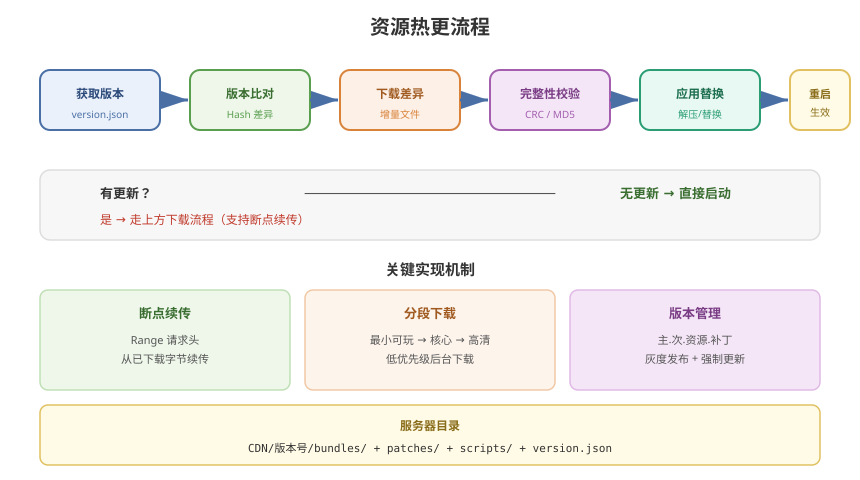

# 05 - 资源热更流程

## 学习目标
- 掌握完整的资源热更新流程设计
- 理解版本比对和增量下载机制
- 能实现从服务器下载到本地生效的全链路

---



## 1. 资源热更架构

### 1.1 整体流程
```
[App 启动]
    ↓
[获取服务端版本信息]
    ↓
[比对本地版本]
    ↓
[有更新?] → No → [继续启动]
    ↓ Yes
[下载差异文件列表]
    ↓
[下载 AssetBundle (按需 / 分段)]
    ↓
[校验完整性 (CRC / MD5)]
    ↓
[解压 / 替换本地文件]
    ↓
[更新本地版本号]
    ↓
[重启 / 重新加载资源]
    ↓
[进入游戏]
```

### 1.2 版本数据设计
```csharp
[Serializable]
public class VersionInfo
{
    public string appVersion;           // App 大版本: "1.2.0"
    public int resourceVersion;         // 资源版本号: 301
    public List<BundleInfo> bundles;    // 文件列表
    public Dictionary<string, string> patchUrls; // 补丁服务器列表
}

[Serializable]
public class BundleInfo
{
    public string name;           // Bundle 名称
    public string hash;           // 内容 Hash
    public long size;             // 文件大小 (bytes)
    public uint crc;              // CRC 校验值
    public List<string> deps;     // 依赖的 Bundle 列表
    public int priority;          // 下载优先级
}
```

---

## 2. 更新管理器实现

### 2.1 UpdateManager 核心
```csharp
public class UpdateManager : MonoBehaviour
{
    [Header("配置")]
    public string versionCheckURL = "http://your-server.com/version.json";

    public enum UpdateState
    {
        Idle,
        CheckingVersion,
        DownloadingList,
        DownloadingBundles,
        Verifying,
        Completed,
        Failed
    }

    private UpdateState state;
    private VersionInfo remoteVersion;
    private List<BundleInfo> downloadList;

    public async Task<bool> CheckAndUpdate(Action<float> onProgress, Action<string> onStatus)
    {
        // 1. 检查版本
        onStatus?.Invoke("正在检查更新...");
        remoteVersion = await FetchRemoteVersion();
        if (remoteVersion == null)
        {
            onStatus?.Invoke("版本检查失败");
            return false;
        }

        // 2. 比对差异
        downloadList = CompareVersion(remoteVersion);
        if (downloadList.Count == 0)
        {
            onStatus?.Invoke("已经是最新版本");
            return true;
        }

        onStatus?.Invoke($"发现 {downloadList.Count} 个更新文件");

        // 3. 下载
        long totalSize = downloadList.Sum(b => b.size);
        long downloadedSize = 0;

        foreach (var bundle in downloadList)
        {
            onStatus?.Invoke($"下载: {bundle.name}");
            bool success = await DownloadBundle(bundle);
            if (!success)
            {
                onStatus?.Invoke($"下载失败: {bundle.name}");
                return false;
            }

            downloadedSize += bundle.size;
            onProgress?.Invoke((float)downloadedSize / totalSize);
        }

        // 4. 校验
        onStatus?.Invoke("校验文件完整性...");
        bool valid = await VerifyBundles();
        if (!valid)
        {
            onStatus?.Invoke("文件校验失败");
            return false;
        }

        // 5. 更新版本号
        SaveLocalVersion(remoteVersion);
        onStatus?.Invoke("更新完成！");

        return true;
    }
}
```

### 2.2 版本比对
```csharp
private List<BundleInfo> CompareVersion(VersionInfo remote)
{
    List<BundleInfo> diff = new List<BundleInfo>();
    VersionInfo local = GetLocalVersion();

    foreach (var remoteBundle in remote.bundles)
    {
        var localBundle = local?.bundles?.Find(b => b.name == remoteBundle.name);
        if (localBundle == null || localBundle.hash != remoteBundle.hash)
        {
            diff.Add(remoteBundle);
        }
    }

    return diff;
}
```

### 2.3 下载实现
```csharp
private async Task<bool> DownloadBundle(BundleInfo bundleInfo)
{
    string url = $"{remoteVersion.patchUrls["primary"]}/{bundleInfo.name}";
    string savePath = Path.Combine(GetDownloadPath(), bundleInfo.name);

    using (UnityWebRequest uwr = UnityWebRequest.Get(url))
    {
        // 断点续传（可选）
        if (File.Exists(savePath))
        {
            long existingSize = new FileInfo(savePath).Length;
            uwr.SetRequestHeader("Range", $"bytes={existingSize}-");
        }

        uwr.downloadHandler = new DownloadHandlerFile(savePath, true);
        await uwr.SendWebRequest();

        if (uwr.result != UnityWebRequest.Result.Success)
        {
            Debug.LogError($"下载失败: {uwr.error}");
            return false;
        }

        // CRC 校验
        uint crc = ComputeCRC32(File.ReadAllBytes(savePath));
        if (crc != bundleInfo.crc)
        {
            Debug.LogError($"CRC 校验失败: {bundleInfo.name}");
            File.Delete(savePath);
            return false;
        }
    }

    return true;
}
```

---

## 3. 启动流程整合

```csharp
public class GameLauncher : MonoBehaviour
{
    public UpdateManager updateManager;
    public AssetManager assetManager;   // 第4章的 AssetManager

    async void Start()
    {
        // 显示更新界面
        UIManager.Instance.ShowUpdateUI();

        bool success = await updateManager.CheckAndUpdate(
            (progress) => UIManager.Instance.UpdateProgress(progress),
            (status) => UIManager.Instance.UpdateStatus(status)
        );

        if (!success && !IsNetworkAvailable())
        {
            // 离线模式：使用本地已有资源
            PopupManager.Show("网络不可用，将使用本地资源");
        }

        // 初始化资源管理器
        await assetManager.InitializeAsync();

        // 加载热更脚本
        if (IsHybridCLRMode)
        {
            LoadHybridCLRDLLs();
        }
        else if (IsLuaMode)
        {
            LuaManager.Instance.Init();
        }

        // 进入游戏
        UIManager.Instance.HideUpdateUI();
        GameEntry.Start();
    }
}
```

---

## 4. 首包与增量更新策略

### 4.1 首包最小化
```
首包 (APK/IPA) 内容:
├── 启动场景
├── 更新界面资源
├── 核心 Shader (少量)
├── 初始化配置
└── Lua 虚拟机 / HybridCLR Runtime

→ 其余资源首次启动时从服务器下载
```

### 4.2 分段下载
```csharp
public enum DownloadPhase
{
    Phase1_Minimal,     // 最小可玩（登录 + 主城）
    Phase2_CoreGame,    // 核心玩法
    Phase3_HD,          // 高清资源
    Phase4_Extra        // 扩展内容
}

// 在后台下载非关键资源
async void BackgroundDownload()
{
    var lowPriorityBundles = GetBundlesForPhase(DownloadPhase.Phase3_HD);
    foreach (var bundle in lowPriorityBundles)
    {
        await DownloadWithLowPriority(bundle);
    }
}
```

---

## 5. 容错与异常处理

### 5.1 容错机制
```csharp
public class DownloadRetry
{
    private const int MaxRetries = 3;
    private const float RetryDelay = 2.0f;

    public static async Task<bool> DownloadWithRetry(Func<Task<bool>> downloadFunc)
    {
        for (int i = 0; i < MaxRetries; i++)
        {
            try
            {
                bool result = await downloadFunc();
                if (result) return true;
            }
            catch (Exception e)
            {
                Debug.LogError($"下载失败 (第{i+1}次): {e.Message}");
            }

            if (i < MaxRetries - 1)
            {
                await Task.Delay((int)(RetryDelay * 1000));
            }
        }
        return false;
    }
}
```

### 5.2 缓存清理策略
```csharp
public static void CleanOldVersions()
{
    VersionInfo current = GetLocalVersion();
    string downloadDir = GetDownloadPath();

    foreach (string dir in Directory.GetDirectories(downloadDir))
    {
        string dirName = Path.GetFileName(dir);
        if (dirName != current.resourceVersion.ToString())
        {
            Directory.Delete(dir, true);
            Debug.Log($"清理旧版本: {dirName}");
        }
    }
}
```

---

## 6. 完整更新 UI 流程

```csharp
public class UpdateUIController : MonoBehaviour
{
    [SerializeField] private Slider progressBar;
    [SerializeField] private Text statusText;
    [SerializeField] private Text speedText;
    [SerializeField] private Text sizeText;

    public void UpdateProgress(float progress)
    {
        progressBar.value = progress;
    }

    public void UpdateStatus(string status)
    {
        statusText.text = status;
    }

    public void UpdateSpeed(long bytesPerSecond)
    {
        float mbps = bytesPerSecond / 1024.0f / 1024.0f;
        speedText.text = $"{mbps:F2} MB/s";
    }

    public void UpdateSize(long currentBytes, long totalBytes)
    {
        float currentMB = currentBytes / 1024.0f / 1024.0f;
        float totalMB = totalBytes / 1024.0f / 1024.0f;
        sizeText.text = $"{currentMB:F1} / {totalMB:F1} MB";
    }
}
```

---

## 7. 学习检查点

- [ ] 能设计完整的版本信息数据结构
- [ ] 理解版本比对和差异下载的逻辑
- [ ] 掌握断点续传和 CRC 校验的实现
- [ ] 能处理网络异常和下载失败的容错

---

## 8. 和 Addressables 热更的关系

本章讲的是 **自己管 AssetBundle + version.json** 的通用流程，适合已有自研管线、或需要完全自定义灰度/分渠道的项目。

若资源层已经使用 Addressables，不要再平行维护一套 Bundle 清单。改走官方 Catalog：

`CheckForCatalogUpdates` → `UpdateCatalogs` → `GetDownloadSizeAsync` → `DownloadDependenciesAsync`

完整步骤、Content Update、首包内置 + 后续远程，见：

- [08 - 资源热更常用方法](/Addressables/08-资源热更常用方法)
- [09 - 下载进度缓存与弱网](/Addressables/09-下载进度缓存与弱网)
