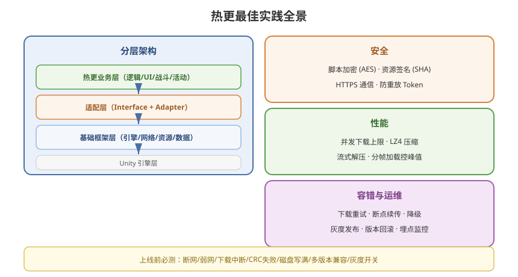

# 06 - 热更最佳实践

## 学习目标
- 掌握生产级热更方案的设计要点
- 理解安全、性能、运维角度的最佳实践
- 建立完整的热更质量保障体系

---



## 1. 代码架构最佳实践

### 1.1 分层架构
```
┌──────────────────────────────────────┐
│         热更业务层 (HotFix)           │
│   游戏逻辑 | UI | 战斗 | 活动        │
├──────────────────────────────────────┤
│         适配层 (Adapter)              │
│   Interface 定义 | Adapter 实现       │
├──────────────────────────────────────┤
│         基础框架层 (AOT)              │
│   引擎封装 | 网络 | 资源管理 | 数据   │
├──────────────────────────────────────┤
│         引擎层                        │
│   Unity Engine                       │
└──────────────────────────────────────┘
```

### 1.2 接口隔离原则
```csharp
// AOT 层定义接口（不包含任何业务逻辑）
public interface IGameSystem
{
    void Init();
    void Update(float dt);
    void Destroy();
}

public interface IDataManager
{
    T LoadConfig<T>(string path) where T : ScriptableObject;
}

// 热更层实现
public class HotFixDataManager : IDataManager
{
    public T LoadConfig<T>(string path) where T : ScriptableObject
    {
        // 热更层逻辑
    }
}
```

### 1.3 依赖注入
```csharp
// AOT 层
public static class GameFramework
{
    private static Dictionary<Type, object> services = new();

    public static void Register<TInterface>(TInterface instance)
    {
        services[typeof(TInterface)] = instance;
    }

    public static TInterface Resolve<TInterface>()
    {
        return (TInterface)services[typeof(TInterface)];
    }
}

// 使用
GameFramework.Register<IDataManager>(new HotFixDataManager());
var dataMgr = GameFramework.Resolve<IDataManager>();
```

---

## 2. 安全性最佳实践

### 2.1 代码加密
```csharp
public static class CryptoHelper
{
    private static readonly byte[] Key = { /* 16/32 bytes AES Key */ };
    private static readonly byte[] IV  = { /* 16 bytes IV */ };

    // AES 加密
    public static byte[] Encrypt(byte[] data)
    {
        using (Aes aes = Aes.Create())
        {
            aes.Key = Key;
            aes.IV = IV;
            using (MemoryStream ms = new MemoryStream())
            using (CryptoStream cs = new CryptoStream(ms, aes.CreateEncryptor(), CryptoStreamMode.Write))
            {
                cs.Write(data, 0, data.Length);
                cs.FlushFinalBlock();
                return ms.ToArray();
            }
        }
    }

    // AES 解密
    public static byte[] Decrypt(byte[] encrypted)
    {
        using (Aes aes = Aes.Create())
        {
            aes.Key = Key;
            aes.IV = IV;
            using (MemoryStream ms = new MemoryStream(encrypted))
            using (CryptoStream cs = new CryptoStream(ms, aes.CreateDecryptor(), CryptoStreamMode.Read))
            using (MemoryStream result = new MemoryStream())
            {
                cs.CopyTo(result);
                return result.ToArray();
            }
        }
    }
}
```

### 2.2 签名校验
```csharp
// 服务端生成签名
byte[] data = File.ReadAllBytes(bundlePath);
using (SHA256 sha256 = SHA256.Create())
{
    byte[] hash = sha256.ComputeHash(data);
    string signature = Convert.ToBase64String(hash);
    // 签名存入版本文件
}

// 客户端校验
public static bool VerifySignature(byte[] data, string expectedSignature)
{
    using (SHA256 sha256 = SHA256.Create())
    {
        byte[] hash = sha256.ComputeHash(data);
        string actual = Convert.ToBase64String(hash);
        return actual == expectedSignature;
    }
}
```

### 2.3 HTTPS + 自定义协议
```
- 所有与更新服务器的通信必须走 HTTPS
- 使用时间戳 + Nonce 防重放攻击
- 关键接口（版本检查）加 Token 鉴权
- 资源下载 CDN 可使用 HTTP (有 Hash 校验兜底)
```

---

## 3. 性能优化最佳实践

### 3.1 异步下载与并发控制
```csharp
public class DownloadScheduler
{
    private const int MaxConcurrent = 3;

    private async Task DownloadAll(List<BundleInfo> bundles)
    {
        using (SemaphoreSlim semaphore = new SemaphoreSlim(MaxConcurrent))
        {
            List<Task> tasks = new List<Task>();
            foreach (var bundle in bundles)
            {
                await semaphore.WaitAsync();
                Task task = DownloadWithSemaphore(bundle, semaphore);
                tasks.Add(task);
            }
            await Task.WhenAll(tasks);
        }
    }

    private async Task DownloadWithSemaphore(BundleInfo bundle, SemaphoreSlim sem)
    {
        try
        {
            await DownloadBundle(bundle);
        }
        finally
        {
            sem.Release();
        }
    }
}
```

### 3.2 流式解压
```csharp
// 使用 LZ4 的解压无需全部读入内存
// AssetBundle.LoadFromFile 自动处理流式加载
AssetBundle ab = AssetBundle.LoadFromFile(bundlePath);
// ↑ 使用 mmap 机制，不会将整个文件加载到内存
```

### 3.3 内存峰值控制
```csharp
// 每个 Bundle 下载完立即写入磁盘，不缓存完整文件
using (UnityWebRequest uwr = UnityWebRequest.Get(url))
{
    uwr.downloadHandler = new DownloadHandlerFile(tempPath, false);
    await uwr.SendWebRequest();
    // 处理完后立即释放 Handler
}

// 定期调用 GC
if (Time.frameCount % 300 == 0)
{
    System.GC.Collect();
}
```

---

## 4. 兼容性与降级策略

### 4.1 多版本兼容
```csharp
[Serializable]
public class CompatibleVersions
{
    public int minAppVersion;       // 最低 App 版本
    public int maxResourceVersion;  // 最高资源版本（当前 App 支持）
}

// 超出版本范围时提示强更
if (appVersion < compatible.minAppVersion)
{
    ShowForceUpdateDialog();  // 引导用户去应用商店更新
}
```

### 4.2 灰度发布
```csharp
public enum UpdateChannel
{
    Production,   // 全量
    GrayScale_10, // 10% 用户
    GrayScale_50, // 50% 用户
    Alpha         // 内部测试
}

// 根据用户 ID Hash 决定是否推送灰度更新
bool IsGrayUser(string userId, int percent)
{
    int hash = userId.GetHashCode() % 100;
    return Mathf.Abs(hash) < percent;
}
```

---

## 5. 测试与质量保障

### 5.1 Sandbox 测试环境
```
测试流程：
1. 本地 CDN (Python http.server / Node.js express)
2. 修改 hosts 或者配置测试服地址
3. 测试完整更新流程（版本检查 → 下载 → 校验 → 生效）
4. 测试异常场景（断网、弱网、下载中断）
```

### 5.2 自动化测试
```csharp
public static class UpdateTest
{
    [Test]
    public static void VersionCompare_WhenRemoteNewer_ReturnsDiff()
    {
        var local = new VersionInfo { resourceVersion = 1 };
        var remote = new VersionInfo { resourceVersion = 2 };

        var diff = UpdateManager.CompareVersion(local, remote);
        Assert.Greater(diff.Count, 0);
    }

    [Test]
    public static void CRC_Verification_DetectsCorruption()
    {
        byte[] data = new byte[1024];
        uint crc = UpdateManager.ComputeCRC32(data);

        data[512] ^= 0xFF; // 修改一个字节
        uint crc2 = UpdateManager.ComputeCRC32(data);

        Assert.AreNotEqual(crc, crc2);
    }
}
```

### 5.3 必测场景清单
- [ ] 首次安装 → 全量下载
- [ ] 已有旧版本 → 增量更新
- [ ] 相同版本 → 跳过更新
- [ ] 下载中断 → 断点续传
- [ ] 网络错误 → 重试 + 降级
- [ ] 磁盘写满 → 错误提示
- [ ] CRC 校验失败 → 重新下载
- [ ] 更新完成后 → 业务功能正常

---

## 6. 运维与监控

### 6.1 数据埋点
```csharp
public static class UpdateAnalytics
{
    public static void Report(string eventName, Dictionary<string, object> data)
    {
        data["platform"] = Application.platform.ToString();
        data["appVersion"] = Application.version;
        data["networkType"] = Application.internetReachability.ToString();

        // 上报到数据平台
        AnalyticsManager.Report(eventName, data);
    }

    // 关键埋点事件
    // - Update.StartCheck
    // - Update.NeedDownload (size)
    // - Update.DownloadComplete (time, size)
    // - Update.DownloadFailed (error)
    // - Update.ResourceVerifyFailed
}
```

### 6.2 监控大盘
```
需要监控的指标:
├── 更新成功率
├── 平均下载速度
├── 下载失败 Top N 错误
├── 各网络环境分布 (WiFi/4G/5G)
├── 各版本覆盖率
└── Crash 率 (按版本)
```

---

## 7. 实战 Checklist（上线前）

```
□ 加密：
  ├── DLL/Lua 脚本加密
  ├── AssetBundle 签名校验
  └── HTTPS 通信

□ 性能：
  ├── 下载并发数限制
  ├── LZ4 压缩方式
  ├── 流式加载不占内存
  └── 大文件分块下载

□ 容错：
  ├── 下载重试机制
  ├── 断点续传
  ├── 网络异常降级
  └── 磁盘空间检测

□ 运维：
  ├── 灰度发布开关
  ├── 强制/非强制更新策略
  ├── 旧版本兼容性
  └── 回滚方案

□ 测试：
  ├── 所有异常场景覆盖
  ├── 弱网环境测试
  └── 多机型兼容测试
```

---

## 8. 学习检查点

- [ ] 能画出完整项目的热更架构分层图
- [ ] 理解加密、签名、HTTPS 三层安全机制
- [ ] 掌握灰度发布和降级策略
- [ ] 能制定上线前的完整测试计划
