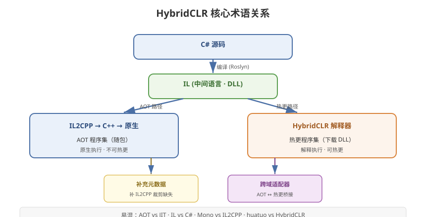

# 00 - HybridCLR 术语解释

## 学习目标
- 掌握 HybridCLR 相关核心术语的准确定义
- 理解各术语之间的关联关系
- 能看懂 HybridCLR 文档、代码和社区讨论中的专业词汇

---



## 1. 基础概念术语

### 1.1 热更新 (Hot Update)
**定义**：不通过应用商店重新发布，在线更新游戏代码、资源、修复 Bug 的技术。
**关联**：HybridCLR 属于"代码热更"方案之一。

### 1.2 代码热更 (Code Hot Update)
**定义**：仅更新游戏的逻辑代码（而非资源），绕过 App Store 审核。
**对比**：资源热更只更新图片、模型等，代码热更更新的是程序逻辑，审核限制更严。

### 1.3 AOT (Ahead-Of-Time)
**定义**：提前编译。程序在运行**之前**就被编译为原生机器码。
**Unity 场景**：IL2CPP 在打包时把 C# 编译为 C++ 再编译为原生代码，属于 AOT 编译。
**特点**：性能高、启动快、不可热更（编译产物已固化在包内）。

### 1.4 JIT (Just-In-Time)
**定义**：即时编译。程序在运行**过程中**才编译代码为机器码。
**Unity 场景**：Mono 运行模式在桌面端使用 JIT。
**限制**：iOS 禁止 JIT（内存页执行权限限制），这是 Unity 移动端要用 IL2CPP 的原因。

### 1.5 解释执行 (Interpreter)
**定义**：逐条翻译执行中间代码（IL），不预先编译为机器码。
**对比**：
| | AOT | 解释执行 |
|------|-----|----------|
| 编译时机 | 运行前 | 无需编译，逐条翻译 |
| 性能 | 高 | 中低 |
| 热更能力 | 无 | 有 |
| 代表 | IL2CPP 原生部分 | HybridCLR 解释器 / ILRuntime |

---

## 2. IL2CPP 相关术语

### 2.1 IL (Intermediate Language)
**定义**：中间语言。C# 编译后生成的中间表示（字节码）。
**别称**：MSIL (Microsoft Intermediate Language) / CIL (Common Intermediate Language)。
**载体**：DLL 文件。
**HybridCLR 意义**：热更 DLL 就是 IL 字节码，HybridCLR 解释器执行的就是 IL。

### 2.2 IL2CPP
**定义**：Unity 的脚本后端，把 C# IL 转换为 C++ 再编译为原生二进制。
**全称**：IL to C++。
**平台支持**：iOS、Android、Windows、macOS、Linux 等。
**特点**：跨平台、性能好、可规避 iOS 的 JIT 限制。

### 2.3 C# → IL → C++ → 原生代码 编译链
```
C# 源码
  → C# 编译器 (Roslyn)
  → IL (DLL 中间语言)
  → IL2CPP (IL 转 C++)
  → C++ 编译器
  → 原生机器码（随包）
```

### 2.4 Mono
**定义**：Unity 的另一套脚本后端，桌面端默认。
**对比 IL2CPP**：Mono 支持 JIT，可运行时编译；IL2CPP 是纯 AOT。
**HybridCLR 要求**：必须使用 IL2CPP，不能使用 Mono。

---

## 3. HybridCLR 核心术语

### 3.1 HybridCLR
**定义**：Unity 开源热更方案（原 huatuo），扩展 IL2CPP 加入解释器，实现 AOT + Interpreter 混合执行。
**全称含义**：Hybrid（混合）+ CLR（Common Language Runtime，公共语言运行时）。
**GitHub**：focus-creative-games/hybridclr_unity

### 3.2 huatuo（华佗）
**定义**：HybridCLR 的前身名称。因商标原因改名为 HybridCLR。
**注意**：老项目/老文档中会看到"huatuo"称呼，与 HybridCLR 是同一个东西。

### 3.3 CLR (Common Language Runtime)
**定义**：公共语言运行时。.NET 中负责加载、执行、管理托管代码的运行时。
**Unity 意义**：Mono 和 IL2CPP 都是 CLR 的实现（MonoCLR / IL2CPP runtime）。
**HybridCLR 意义**：HybridCLR 扩展了 IL2CPP 这个 CLR 实现，故得名。

### 3.4 热更程序集 (Hotfix Assembly / Hot Update Assembly)
**定义**：被标记为"可热更"的程序集，编译为 DLL，运行时下载加载。
**配置位置**：HybridCLR Settings → Hotfix Assemblies。
**特点**：通过解释器执行。

### 3.5 AOT 程序集 (AOT Assembly)
**定义**：随包编译为原生二进制的程序集，不可热更。
**作用**：提供基础框架、接口定义、性能敏感逻辑。

### 3.6 补充元数据 (AOT Metadata / Supplementary Metadata)
**定义**：为解决 IL2CPP 裁剪问题，额外生成的 AOT 程序集元数据（类型定义、方法 IL、泛型信息），运行时加载以补全缺失信息。
**加载 API**：`RuntimeApi.LoadMetadataForAOTAssembly`
**关键概念**：见第 5 章深入讲解。

### 3.7 混合执行 (Hybrid Execution)
**定义**：AOT 部分原生执行 + 热更部分解释执行的混合模式。
**意义**：HybridCLR 名称中"Hybrid"的由来。

---

## 4. 编译与构建术语

### 4.1 asmdef (Assembly Definition)
**定义**：Unity 的程序集定义文件（`.asmdef`），用于将代码划分为独立程序集。
**作用**：控制代码的引用关系、编译范围，是 AOT/热更程序集划分的基础。
**相关**：`.asmref`（Assembly Definition Reference）用于引用。

### 4.2 AOTGenericReferences
**定义**：HybridCLR 生成器生成的"泛型引用列表"文件。
**作用**：扫描热更代码引用的泛型实例化，让 IL2CPP 在打包时保留这些泛型元数据。
**注意**：这些泛型类型必须保留，否则热更运行时泛型解析失败。

### 4.3 Linker（裁剪器）
**定义**：IL2CPP 打包时的代码裁剪器，移除未引用的代码以减小包体。
**问题**：会误删被反射/热更引用的类型。
**解决**：link.xml 文件强制保留指定代码。

### 4.4 link.xml
**定义**：XML 配置文件，告诉裁剪器哪些代码必须保留。
**位置**：Assets 目录下（通常为 `Assets/link.xml`）。
**示例**：见第 9 章。

### 4.5 Stripping
**定义**：裁剪。IL2CPP 打包时移除未使用代码的优化手段。
**级别**：Disabled / Low / Medium / High。
**风险**：级别越高，热更代码可能引用的 AOT 类型越容易被裁掉。

---

## 5. 运行时术语

### 5.1 AppDomain（应用域）
**定义**：.NET 中程序集的隔离运行环境。
**Unity 意义**：IL2CPP 中通常只有一个 AppDomain，已加载的热更程序集无法卸载。
**注意**：HybridCLR 加载的 DLL 会常驻内存。

### 5.2 Assembly.Load
**定义**：.NET 中加载程序集的 API。HybridCLR 用其加载热更 DLL 字节数组。
**签名**：`Assembly.Load(byte[] rawAssembly)`。

### 5.3 CrossBindingAdaptor（跨域适配器）
**定义**：HybridCLR 用于在 AOT 与热更之间桥接的类型适配器。
**作用**：让热更对象可以被 AOT 代码以接口/基类强转调用。
**相关**：见第 6 章深入讲解。

### 5.4 跨域调用 (Cross-Domain Call / Cross-Boundary Call)
**定义**：AOT 程序集与热更程序集之间的相互调用。
**方向**：
- 热更 → AOT：直接静态调用（简单）
- AOT → 热更：需接口/委托/反射/适配器（复杂）

### 5.5 HomologousImageMode
**定义**：补充元数据加载模式的枚举，决定元数据装载程度。
**取值**：
| 值 | 说明 |
|----|------|
| `Consistent` | 仅裁剪后的元数据（省内存） |
| `ConsistentImageLoad` | 一致镜像（折中） |
| `SuperSet` | 全量元数据（最安全） |

---

## 6. 平台相关术语

### 6.1 平台前端 (Platform Frontend)
**定义**：IL2CPP 架构中，负责将 IL 转换为各平台 C++ 代码的部分。
**HybridCLR 扩展点**：HybridCLR 修改了 IL2CPP 的代码生成器（il2cpp/tiny-il2cpp），加入解释器支持。

### 6.2 解释器后端 (Interpreter Backend)
**定义**：HybridCLR 在 IL2CPP 中注入的解释执行引擎。
**作用**：执行加载的热更 IL 代码。

### 6.3 强更 (Force Update)
**定义**：必须重新安装 App 才能更新的方式（应用商店更新）。
**对比热更**：涉及 AOT 程序集/引擎层的改动时需强更，纯热更 DLL 改动可静默更新。

---

## 7. 术语关系速查

### 7.1 编译与运行流程
```
C# 源码 → IL (DLL) → IL2CPP → C++ → 原生二进制（AOT，随包）
                     └→ 热更 DLL (IL) → HybridCLR 解释器 → 运行时执行
```

### 7.2 术语关系图
```
热更方案
  ├─ Lua（xLua/ToLua）
  ├─ ILRuntime（解释执行 IL）
  ├─ PuerTS（JS/TS）
  └─ HybridCLR（AOT + 解释器）  ← 本章核心
       ├─ AOT 程序集（随包原生）
       ├─ 热更程序集（DLL + IL）
       ├─ 补充元数据（补 IL2CPP 裁剪）
       ├─ CrossBindingAdaptor（跨域桥接）
       └─ HomologousImageMode（元数据模式）
```

### 7.3 常见混淆辨析
| 术语 | 易混淆 | 区别 |
|------|--------|------|
| AOT vs JIT | 常混 | AOT 运行前编译，JIT 运行时编译 |
| IL vs C# | 常混 | C# 是源码，IL 是编译后的中间语言 |
| huatuo vs HybridCLR | 常混 | 同物异名，huatuo 是旧名 |
| Mono vs IL2CPP | 常混 | 两个不同的脚本后端 |
| 强更 vs 热更 | 常混 | 强更需装新包，热更在线更新 |
| 补充元数据 vs 热更 DLL | 常混 | 元数据是"补全信息"，DLL 是"实际代码" |

---

## 8. 学习检查点

- [ ] 能解释 AOT、JIT、解释执行三者的区别
- [ ] 理解 IL 在 HybridCLR 中的角色（热更 DLL 就是 IL）
- [ ] 掌握补充元数据、适配器、HomologousImageMode 的含义
- [ ] 能区分 huatuo/HybridCLR、Mono/IL2CPP 等易混术语
- [ ] 能画出 HybridCLR 的编译与运行流程
