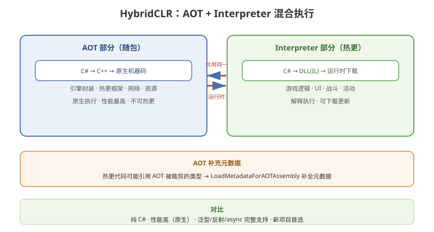

# 01 - 热更方案全览与选型

## 学习目标
- 建立热更方案全景认知
- 深入理解 HybridCLR 与 Lua / ILRuntime 的本质差异
- 掌握选型决策的完整依据

---



## 1. 热更方案全景

Unity 代码热更本质是：**让不被 App Store / 商店审核的代码可以在运行时加载执行**。

### 1.1 主流方案一览
| 方案 | 执行方式 | 语言 | 性能 | 复杂度 |
|------|----------|------|------|--------|
| **Lua** (xLua/ToLua) | 解释执行 Lua 脚本 | Lua | 中低 | 高（需 C#↔Lua 双向映射） |
| **ILRuntime** | 解释执行 IL | C# | 低 | 中 |
| **HybridCLR** | AOT + Interpreter 混合 | C# | **高** | 低 |
| **PuerTS** | JS/TS 解释执行 | TypeScript | 高 | 中 |

### 1.2 演进脉络
```
Lua (2013~2017 主流)
    → ILRuntime (2018~2020，避免学 Lua)
        → HybridCLR (2020+，官方 IL2CPP 扩展，性能与开发体验最佳)
```

---

## 2. 为什么 HybridCLR 是目前的最优解

### 2.1 核心突破：AOT + Interpreter 混合
```
传统 IL2CPP:
  C# → C++ → 原生二进制（全部 AOT 编译）→ 不可热更

HybridCLR:
  AOT 部分: C# → C++ 原生代码（随包）          ← 性能最高
  热更部分: C# → DLL(IL) → 运行时解释执行       ← 可下载更新
  ─────────────────────────────────────────────
  两部分共享同一 IL2CPP 运行时，原生与解释代码无缝互调
```

### 2.2 与其他方案的本质差异
| 维度 | Lua | ILRuntime | HybridCLR |
|------|-----|-----------|-----------|
| 语言一致性 | 需学新语言 | C# 但有边界 | **原生 C# 无边界** |
| 泛型/反射/async | 受限 | 受限 | **完整支持** |
| 调试 | 差 | 好 | **很好（VS 断点）** |
| 性能 | 中低 | 低 | **高（贴近原生）** |
| 热更粒度 | 方法级 | 程序集级 | **程序集级** |
| 学习成本 | 高 | 中 | **低** |

### 2.3 为什么能"无缝"？
HybridCLR 在 IL2CPP 中注册了一个**解释器**，当 IL2CPP 遇到以下情况时，会回调解释器执行：
- 加载的热更 DLL 中的方法
- AOT 程序集里被热更代码重新实现的泛型实例化
- 缺失的补充元数据对应的类型成员

---

## 3. 适用场景与不适用场景

### 3.1 适合
- 新立项的 Unity 项目（2021.3 LTS 及以上）
- 需要快速迭代活动/玩法内容的项目
- 需要团队统一 C# 开发的项目
- 追求热更代码与原生代码同等的性能和开发体验

### 3.2 不适合 / 需谨慎
| 场景 | 原因 |
|------|------|
| 已有大规模 Lua 业务 | 迁移成本高，Lua 生态积累不可浪费 |
| 旧 Unity 版本（2020 及以前） | HybridCLR 对 Unity 版本有严格适配要求 |
| 对包体极其敏感 | 补充元数据 + 热更 DLL 会增加少量包体 |
| WebGL / 小游戏平台 | 受限于平台运行时（部分不支持） |

---

## 4. 选型决策框架

```
新项目？
├─ 是 → 首选 HybridCLR
│    └─ 团队全是 C# → 直接上
│    └─ 已有 TS 前端团队 → 考虑 PuerTS
├─ 否（老项目）
│    ├─ 老项目已是 Lua → 继续 Lua 维护
│    ├─ 老项目纯 C# 但无法重编译 → ILRuntime 过渡
│    └─ 老项目 C# 且能整体升级 → 迁移 HybridCLR
```

### 4.1 关键决策因子
1. **Unity 版本**：HybridCLR 要求适配的 IL2CPP 版本（每个 Unity 版本一个扩展包）
2. **团队语言栈**：统一 C# 成本最低
3. **性能预算**：战斗/物理密集场景 HybridCLR 优势明显
4. **历史包袱**：存量 Lua 逻辑量决定迁移成本
5. **平台**：iOS/Android/PC 全支持，WebGL 谨慎

---

## 5. 一个完整的热更项目分层回顾

```
┌──────────────────────────────────────┐
│         热更业务程序集 (HotFix)       │  ← 可下载更新
│   游戏逻辑 | UI | 战斗 | 活动        │
├──────────────────────────────────────┤
│         适配接口层 (Interface)        │
│   IGameSystem / IDataManager ...     │
├──────────────────────────────────────┤
│         基础框架程序集 (AOT)          │
│   引擎封装 | 网络 | 资源 | 数据       │
├──────────────────────────────────────┤
│         HybridCLR Runtime            │  ← 随包
├──────────────────────────────────────┤
│         Unity 引擎 / IL2CPP          │
└──────────────────────────────────────┘
```

---

## 6. 学习检查点

- [ ] 能说清 HybridCLR 与 Lua、ILRuntime 的本质区别
- [ ] 理解 AOT + Interpreter 混合执行的含义
- [ ] 能根据项目情况做出方案选型决策
- [ ] 知道 HybridCLR 的不适用场景
