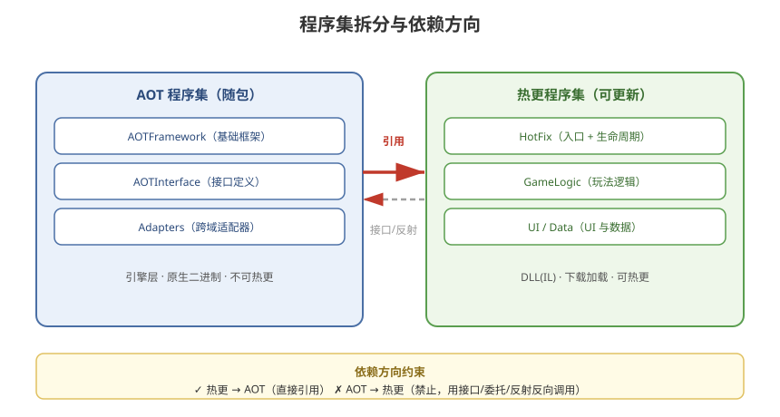

# 03 - 程序集拆分与配置

## 学习目标
- 掌握 AOT / 热更程序集的划分原则
- 熟练使用 Assembly Definition (asmdef)
- 理解热更程序集之间的依赖关系与引用方向

---



## 1. 程序集概念

Unity 通过 **Assembly Definition (asmdef)** 将代码拆分为多个程序集。HybridCLR 需要明确区分：哪些程序集随包（AOT），哪些可以被热更。

### 1.1 两类程序集
| 类型 | 编译产物 | 是否热更 | 存放位置 |
|------|----------|----------|----------|
| **AOT 程序集** | 原生二进制 | 否 | 随 App 包 |
| **热更程序集** | DLL (IL) | 是 | 服务器 → 下载加载 |

---

## 2. 拆分原则

### 2.1 核心原则：稳定边界
```
1. 框架层放 AOT，业务层放热更
2. 高频性能敏感代码放 AOT
3. 需要快速迭代的逻辑放热更
4. 接口定义放 AOT，实现放热更
```

### 2.2 推荐的拆分方案
```
AOT 程序集:
  ├─ UnityEngine.CoreModule (引擎自带)
  ├─ AOTFramework       ← 基础框架（资源/网络/事件/工具）
  ├─ AOTInterface       ← 接口定义（热更与 AOT 的桥梁）
  └─ (可选) 第三方 SDK 适配

热更程序集:
  ├─ HotFix             ← 游戏入口 + 生命周期
  ├─ GameLogic          ← 玩法逻辑（战斗/任务/背包）
  ├─ UI                 ← UI 业务逻辑
  ├─ Data               ← 配置/数据模型
  └─ ... 按功能模块拆分
```

### 2.3 拆分粒度的权衡
```
程序集过少（1 个大 DLL）:
  + 热更范围大，灵活
  - 任意修改都要重新下载整个 DLL
  - 加载/启动慢

程序集过多（几十个小 DLL）:
  + 热更粒度细，更新包小
  - 程序集间依赖管理复杂
  - asmdef 引用关系混乱
  - 跨程序集调用开销增加

推荐：3~8 个热更程序集（按模块）为佳
```

---

## 3. asmdef 配置实操

### 3.1 创建 asmdef
```
Assets/Game/Scripts/HotFix/HotFix.asmdef
Assets/Game/Scripts/AOT/AOTFramework.asmdef
Assets/Game/Scripts/AOT/AOTInterface.asmdef
```

### 3.2 热更程序集 asmdef 示例
```json
// HotFix.asmdef
{
    "name": "HotFix",
    "references": [
        "AOTInterface",
        "AOTFramework",
        "UnityEngine.CoreModule",
        "UnityEngine.UI",
        "UnityEngine.UIModule"
    ],
    "includePlatforms": [],
    "excludePlatforms": [],
    "allowUnsafeCode": false,
    "overrideReferences": false,
    "precompiledReferences": [],
    "autoReferenced": true,
    "defineConstraints": [],
    "versionDefines": [],
    "noEngineReferences": false
}
```

### 3.3 关键字段
| 字段 | 作用 |
|------|------|
| `name` | 程序集名称（须与 HybridCLR Settings 一致） |
| `references` | 引用的其他程序集 |
| `includePlatforms` | 限定的平台（留空 = 所有平台） |
| `autoReferenced` | 是否自动被其他程序集引用 |
| `defineConstraints` | 编译条件宏 |

---

## 4. 依赖方向约束（最重要）

```
引用方向只能从"热更"指向"AOT"，不能反向！

✓ 热更程序集  →  引用  →  AOT 程序集
✗ AOT 程序集  →  引用  →  热更程序集（禁止！）
```

### 4.1 为什么 AOT 不能引用热更
```
AOT 编译在打包时发生，此时热更 DLL 还没生成
→ AOT 程序集无法静态引用热更类型
→ 只能通过以下方式反向调用：
```

### 4.2 AOT 调用热更的三种方式
```csharp
// 方式1：反射（简单，性能差）
var type = hotFixAsm.GetType("HotFix.Game");
var method = type.GetMethod("Start");
method.Invoke(null, null);

// 方式2：接口（推荐！类型安全 + 性能好）
// 接口定义在 AOTInterface 程序集
public interface IGameEntry
{
    void OnStart();
    void OnUpdate(float dt);
    void OnDestroy();
}

// AOT 侧加载并调用
var type = hotFixAsm.GetType("HotFix.GameEntry");
var entry = (IGameEntry)Activator.CreateInstance(type);
entry.OnStart();

// 方式3：Delegate 委托
public delegate void GameStartDelegate();
GameStartDelegate dlg = () =>
{
    // 通过热更注册的回调
};
```

### 4.3 接口适配器（HybridCLR 跨域关键）
```csharp
// 热更程序集实现接口
public class GameEntry : IGameEntry
{
    public void OnStart() { /* 热更逻辑 */ }
    public void OnUpdate(float dt) { }
    public void OnDestroy() { }
}
```
> HybridCLR 需要为接口生成**适配器**（CrossBindingAdaptor），让解释执行的对象能被 AOT 代码以接口方式强转调用。这是后续章节会深入的内容。

---

## 5. HybridCLR Settings 与程序集同步

### 5.1 配置一致性要求
```
HybridCLR Settings 中的 Hotfix Assemblies 列表
必须 = 所有热更程序集 asmdef 名称的集合
```

### 5.2 自动生成配置
```csharp
using UnityEditor;
using HybridCLR.Editor;
using HybridCLR.Editor.Settings;

public static class AssemblyConfigGenerator
{
    [MenuItem("Tools/HybridCLR/Sync Assemblies")]
    public static void Sync()
    {
        var settings = HybridCLRSettings.Instance;

        // 扫描项目中的 asmdef，自动归类
        settings.hotUpdateAssemblies = FindAsmdefsWithDefine("HOTFIX");
        settings.aotMetaAssemblies = GetCoreAOTAssemblies();

        EditorUtility.SetDirty(settings);
        AssetDatabase.SaveAssets();
    }
}
```

---

## 6. 启动流程中的程序集加载顺序

```
1. 初始化 HybridCLR Runtime（IL2CPP 启动时自动）
2. 加载补充元数据（AOT 缺失部分）
3. 加载热更 DLL（Assembly.Load）
4. 解析入口类型 → 调用入口方法
5. 入口内完成游戏初始化
```

---

## 7. 学习检查点

- [ ] 能设计合理的 AOT / 热更程序集划分
- [ ] 理解依赖方向约束（热更 → AOT）及原因
- [ ] 掌握 asmdef 的配置方法
- [ ] 知道 AOT 调用热更的三种方式及推荐选择
