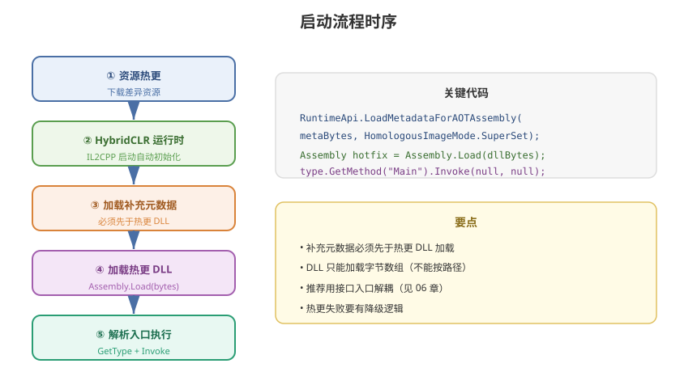

# 04 - 运行时加载与初始化

## 学习目标
- 掌握热更 DLL 的运行时加载方式
- 理解完整启动流程的正确顺序
- 熟练处理加载过程中的异常

---



## 1. 热更 DLL 加载

### 1.1 加载方式
HybridCLR 加载热更 DLL 使用标准 `Assembly.Load`，加载的是**字节数组**。

```csharp
using System.Reflection;

// 从字节数组加载
Assembly hotFixAsm = Assembly.Load(dllBytes);

// 从文件加载
byte[] bytes = File.ReadAllBytes(dllPath);
Assembly asm = Assembly.Load(bytes);

// 从 AssetBundle 加载
TextAsset dllAsset = bundle.LoadAsset<TextAsset>("HotFix.dll.bytes");
Assembly asm2 = Assembly.Load(dllAsset.bytes);
```

### 1.2 加载要点
| 要点 | 说明 |
|------|------|
| 只能加载字节数组 | 不支持按文件路径字符串加载（与标准 .NET 不同） |
| 同 DLL 多次加载 | 会产生多个程序集实例，注意缓存 |
| 卸载限制 | 已加载程序集无法卸载，热更升级需重启进程或新建 AppDomain |

---

## 2. 完整启动流程

### 2.1 标准启动时序
```
[App 启动]
    ↓
① 版本检查与资源下载（资源热更层）
    ↓
② 初始化 HybridCLR 运行时（IL2CPP 自动完成）
    ↓
③ 加载 AOT 补充元数据（关键！）
    ↓
④ 加载热更 DLL
    ↓
⑤ 解析入口类型并执行
    ↓
⑥ 进入游戏主循环
```

### 2.2 代码实现
```csharp
using System;
using System.Reflection;
using UnityEngine;

public class GameBootstrap : MonoBehaviour
{
    public string hotfixDllName = "HotFix";
    public string entryClass = "HotFix.GameEntry";
    public string entryMethod = "Main";

    private Assembly hotfixAssembly;

    IEnumerator Start()
    {
        // ① 资源热更（见 HotUpdate/05 章节）
        yield return StartCoroutine(UpdateManager.CheckAndUpdate());

        // ②③ HybridCLR 运行时 + 补充元数据
        LoadMetadataForAOTAssemblies();

        // ④ 加载热更 DLL
        hotfixAssembly = LoadHotfixAssembly();

        // ⑤ 执行入口
        if (hotfixAssembly != null)
        {
            InvokeEntry();
        }
    }

    private void LoadMetadataForAOTAssemblies()
    {
        // 加载补充元数据：让热更代码可以引用 AOT 中的类型
        // mode 参数决定元数据的裁剪程度，详见 05 章节
        foreach (var aotMetaBytes in LoadAotMetaAssetList())
        {
            HybridCLR.Runtime.HomologousImageMode mode =
                HybridCLR.Runtime.HomologousImageMode.SuperSet;

            var err = HybridCLR.Runtime.RuntimeApi.LoadMetadataForAOTAssembly(
                aotMetaBytes, mode);

            if (err != HybridCLR.LoadImageErrorCode.OK)
            {
                Debug.LogError($"补充元数据加载失败: {err}");
            }
        }
    }

    private Assembly LoadHotfixAssembly()
    {
        // 从 AssetBundle / 文件 / 加密字节 获取 DLL 字节
        byte[] dllBytes = HotfixDllProvider.GetDllBytes(hotfixDllName);
        if (dllBytes == null || dllBytes.Length == 0)
        {
            Debug.LogError("热更 DLL 字节为空");
            return null;
        }
        return Assembly.Load(dllBytes);
    }

    private void InvokeEntry()
    {
        try
        {
            var type = hotfixAssembly.GetType(entryClass);
            if (type == null)
            {
                Debug.LogError($"找不到入口类型: {entryClass}");
                return;
            }

            var method = type.GetMethod(entryMethod,
                BindingFlags.Static | BindingFlags.Public);
            if (method == null)
            {
                Debug.LogError($"找不到入口方法: {entryMethod}");
                return;
            }

            method.Invoke(null, null);
        }
        catch (Exception e)
        {
            Debug.LogError($"热更入口执行失败: {e}");
        }
    }
}
```

---

## 3. 补充元数据的加载位置

### 3.1 为什么必须先加载元数据
```
热更代码可能引用 AOT 程序集中的类型，例如：
  - 泛型 List<T> 的某个实例化
  - System.String 的某个方法
  - Unity 的某个内部类型

IL2CPP 在打包时只保留了"被静态引用"的元数据
→ 运行时需要用补充元数据"补全"这些缺失
```

### 3.2 加载顺序误区
```
✗ 先加载热更 DLL 再补元数据 → 可能导致类型解析失败
✓ 先补元数据再加载热更 DLL → 正确顺序
```

---

## 4. 入口设计模式

### 4.1 静态入口（简单）
```csharp
// 热更程序集
public class GameEntry
{
    public static void Main()
    {
        // 初始化整个游戏
        UIManager.Instance.Init();
        GameLogic.Init();
    }
}
```

### 4.2 接口入口（推荐，解耦）
```csharp
// AOT 侧定义（AOTInterface 程序集）
public interface IGameEntry
{
    void Initialize();
    void Update(float deltaTime);
    void Shutdown();
}

// AOT 主循环
public class MainLoop : MonoBehaviour
{
    private IGameEntry gameEntry;

    public void LoadGameEntry()
    {
        var type = hotfixAssembly.GetType("HotFix.GameEntry");
        gameEntry = (IGameEntry)Activator.CreateInstance(type);
        gameEntry.Initialize();
    }

    void Update()
    {
        gameEntry?.Update(Time.deltaTime);
    }

    void OnDestroy()
    {
        gameEntry?.Shutdown();
    }
}
```

### 4.3 生命周期管理（推荐）
```csharp
public interface IGameEntry
{
    void Initialize();
    void Update(float dt);
    void LateUpdate(float dt);
    void OnApplicationPause(bool paused);
    void OnApplicationQuit();
    void Shutdown();
}
```

---

## 5. 异常与容错

### 5.1 常见异常
| 异常 | 原因 | 解决 |
|------|------|------|
| `FileNotFoundException` | 依赖程序集缺失 | 检查补充元数据完整 |
| `MissingMethodException` | 方法元数据缺失 | 全量补充元数据 |
| `TypeLoadException` | 类型无法加载 | 检查 asmdef 引用 |
| `BadImageFormatException` | DLL 平台/版本不匹配 | 确认编译目标平台 |

### 5.2 错误降级
```csharp
try
{
    hotfixAssembly = Assembly.Load(dllBytes);
}
catch (Exception e)
{
    Debug.LogError($"热更加载失败: {e}");
    // 降级：使用内置的默认逻辑（不热更也能跑）
    UseFallbackLogic();
}
```

---

## 6. 学习检查点

- [ ] 能独立编写完整的启动流程代码
- [ ] 理解补充元数据必须先行加载的原因
- [ ] 掌握接口式入口的设计模式
- [ ] 能处理热更加载的常见异常和降级
