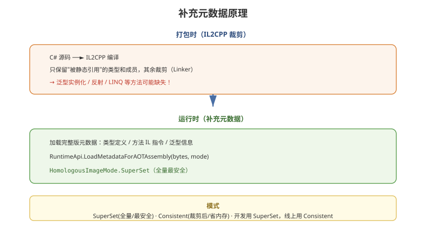

# 05 - AOT 补充元数据深入

## 学习目标
- 彻底理解补充元数据 (AOT Metadata) 的作用和原理
- 掌握 HomologousImageMode 模式的取舍
- 学会生成和配置补充元数据，并控制其内存开销

---



## 1. 为什么需要补充元数据

### 1.1 IL2CPP 的裁剪问题
```
IL2CPP 打包时：
  1. 将 C# 编译为 C++
  2. 只保留"被代码静态引用"的类型和成员
  3. 其余全部裁剪（Linker 优化，减小包体）

问题：
  热更 DLL 是运行时才加载的
  它可能引用到"未被静态引用"的 AOT 类型
  → 这些类型在打包时已被裁剪 → 运行时找不到！
```

### 1.2 典型的触发场景
```csharp
// 热更代码中使用了 LINQ
var list = new List<int> { 1, 2, 3 };
list.Where(x => x > 1);        // Where 的实现可能在 AOT 中被裁剪

// 热更代码中使用泛型实例化
Dictionary<string, MyType> dict = new(); // 该泛型实例化可能缺失

// 热更代码中使用反射
typeof(SomeAotType).GetMethod("Foo");     // 反射元数据可能被裁剪
```

---

## 2. 补充元数据的原理

### 2.1 生成时机
```
打包时，HybridCLR 额外生成一份"完整版"的 AOT 元数据
→ 打包为元数据 DLL 字节
→ 发布到服务器 / 打入首包
```

### 2.2 加载原理
```csharp
// 运行时调用，把元数据"补进" IL2CPP 运行时
RuntimeApi.LoadMetadataForAOTAssembly(metaBytes, mode);
```

### 2.3 补充的是什么
| 内容 | 说明 |
|------|------|
| 类型定义元数据 | 类型名、字段、方法签名 |
| 方法 IL 指令 | 方法体实现 |
| 泛型元数据 | 泛型实例化所需信息 |

> **注意**：补充的是**元数据**，不是重新编译这些类型。这些类型的**实现仍以原生方式运行**（AOT 部分已有），只有缺失的元数据信息被补上。

---

## 3. HomologousImageMode 模式

`LoadMetadataForAOTAssembly` 的第二个参数决定元数据的**加载程度**。

### 3.1 三种模式
| 模式 | 加载内容 | 内存 | 兼容性 |
|------|----------|------|--------|
| `Consistent` | 仅裁剪后的元数据 | 最小 | 一般 |
| `ConsistentImageLoad` | 一致的镜像 | 中 | 较好 |
| **`SuperSet`** | 全量元数据 | 最大 | 最安全 |

### 3.2 模式选择建议
```csharp
// 开发阶段：用 SuperSet（绝对安全）
// 确保功能正常
RuntimeApi.LoadMetadataForAOTAssembly(bytes,
    HomologousImageMode.SuperSet);

// 线上优化：用 Consistent（省内存）
// 需测试所有热更代码路径
RuntimeApi.LoadMetadataForAOTAssembly(bytes,
    HomologousImageMode.Consistent);
```

### 3.3 模式差异的本质
```
SuperSet:     装载所有成员 → 任何反射/泛型都能解析
Consistent:   只装载裁剪后的 → 反射不到的成员会失败
```

---

## 4. 生成补充元数据

### 4.1 菜单生成
```
HybridCLR → Generate → All（一键生成）
  ├─ 扫描 Hotfix 程序集的引用
  ├─ 生成 AOTGenericReferences（泛型引用列表）
  ├─ 生成 AOT 元数据 DLL
  └─ 输出到指定目录
```

### 4.2 脚本生成（CI 集成）
```csharp
using HybridCLR.Editor;
using HybridCLR.Editor.Generators;

public static class MetadataBuilder
{
    public static void BuildAotMetadata()
    {
        // 1. 找出所有需要补元的 AOT 程序集
        List<string> aotAssemblies = GetAotAssemblies();

        // 2. 生成元数据
        var gen = new AOTGenericReferenceGenerator();
        gen.Generate();

        var metaGen = new MetadataGenerator();
        metaGen.Generate(aotAssemblies);

        // 3. 打包为 AssetBundle
        BuildMetadataBundle();
    }
}
```

### 4.3 生成物清单
```
生成目录结构:
  HybridCLRData/
  └── AOTGenericReferences.cs    ← 泛型引用占位代码
  └── Metadata/
      ├── mscorlib.dll
      ├── System.dll
      ├── UnityEngine.CoreModule.dll
      └── ... （每个 AOT 程序集一个元数据 DLL）
```

---

## 5. 补充元数据的内存优化

### 5.1 内存构成
```
补充元数据加载后会驻留在内存中：
  每个元数据 DLL ≈ 其打包时大小（数 MB 级别）

  mscorlib + System 等核心库全量补充 ≈ 20~40 MB
```

### 5.2 优化策略
```
策略1：只补充"可能被热更引用"的程序集
  mscorlib / System.Core 必补
  第三方 SDK 视热更引用情况补

策略2：使用 Consistent 模式
  内存更小，但需充分测试

策略3：按需加载
  热更代码加载时才知道缺什么 → 分步补元数据（复杂，少用）
```

### 5.3 实测内存评估
```csharp
// 用 Profiler 观察加载前后的原生内存
long before = Profiler.GetTotalReservedMemoryLong();
LoadMetadataForAOTAssembly(metaBytes, mode);
long after = Profiler.GetTotalReservedMemoryLong();
Debug.Log($"元数据消耗: {(after - before) / 1024 / 1024} MB");
```

---

## 6. 完整补充元数据清单（推荐基线）

### 6.1 必补程序集
| 程序集 | 原因 |
|--------|------|
| mscorlib | LINQ、泛型、反射、字符串等 |
| System | 常用 BCL |
| System.Core | LINQ 扩展 |
| UnityEngine.CoreModule | 引擎基础类型 |
| UnityEngine.UI | UI 类型 |
| UnityEngine.UIModule | UI 模块 |

### 6.2 按需补充
| 程序集 | 何时补 |
|--------|--------|
| 自己写的 AOT 框架程序集 | 热更代码要引用时 |
| 第三方 SDK | 热更代码调用其泛型/反射时 |
| Newtonsoft.Json | 热更里用 JSON 反射时 |

### 6.3 常见误区
```
✗ 认为补充元数据 = 重新实现 AOT 类型
  → 错！实现仍是原生，只补元数据信息

✗ 认为补得越多越好
  → 内存开销大，应精准补充

✗ 忽略了热更引用的自定义程序集
  → 只补了核心库，业务 AOT 类型仍找不到
```

---

## 7. 学习检查点

- [ ] 能解释 IL2CPP 裁剪导致元数据缺失的原因
- [ ] 理解 HomologousImageMode 三种模式的差异
- [ ] 会生成并配置补充元数据
- [ ] 能评估和控制补充元数据的内存开销
