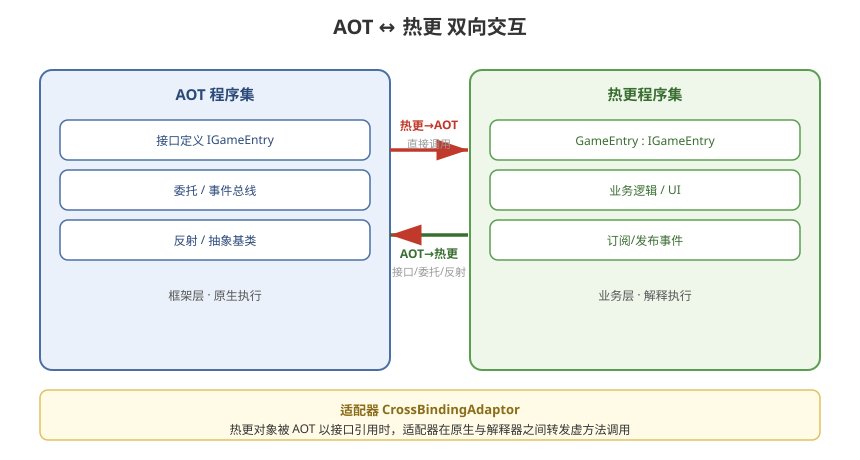

# 06 - 热更代码跨域交互

## 学习目标
- 掌握 AOT 与热更代码双向交互的完整方案
- 深入理解适配器 (CrossBindingAdaptor) 机制
- 熟练使用接口、委托、事件、泛型等高级交互

---



## 1. 跨域交互全景

```
AOT 程序集 ◄───── 热更程序集
    │  │               │  │
    │  └─ 静态调用 ────┘  │
    │                     │
    └── 接口/委托/反射 ────┘（反向，见下）
```

### 1.1 双向关系
| 方向 | 实现方式 |
|------|----------|
| 热更 → AOT | 直接静态调用（正常 C# 引用） |
| AOT → 热更 | 接口、委托、反射、抽象基类 |

---

## 2. 热更调用 AOT（简单方向）

### 2.1 直接调用
```csharp
// 热更程序集直接使用 AOT 框架
using AOTFramework;

public class BattleLogic
{
    public void Execute()
    {
        // 直接调用 AOT 中的静态方法
        ResourceManager.Instance.LoadAsset("Player");

        // 直接 new AOT 类型
        var data = new BattleData();
        data.Reset();
    }
}
```

### 2.2 泛型调用
```csharp
// 热更中使用泛型（这是最容易踩元数据坑的地方）
var dict = new Dictionary<string, PlayerInfo>();
var list = new List<int>();

// 注意：如果该泛型实例化在 AOT 中缺失，会报错
// → 需要补充元数据，或把泛型实例化放到 AOT 侧包装
```

---

## 3. AOT 调用热更（核心难点）

### 3.1 方式一：反射
```csharp
// 简单但性能差，不推荐高频调用
var type = hotfixAsm.GetType("HotFix.GameEntry");
var method = type.GetMethod("Update");
method.Invoke(instance, new object[] { dt });
```

### 3.2 方式二：接口（推荐）
```csharp
// 接口定义在 AOT 侧
public interface IGameEntry
{
    void Update(float dt);
}

// 热更侧实现
public class GameEntry : IGameEntry { ... }

// AOT 侧调用
var entry = (IGameEntry)Activator.CreateInstance(type);
entry.Update(dt);
```

### 3.3 方式三：委托（轻量）
```csharp
// AOT 定义委托
public delegate void UpdateDelegate(float dt);

// 热更侧方法签名一致，通过委托调用
UpdateDelegate dlg = (UpdateDelegate)Delegate.CreateDelegate(
    typeof(UpdateDelegate), instance, "OnUpdate");
dlg(dt);
```

### 3.4 方式四：抽象基类（继承复用）
```csharp
// AOT 定义抽象基类
public abstract class BaseBehaviour
{
    public abstract void Awake();
    public virtual void Update(float dt) { }
}

// 热更侧继承并实现
public class HeroBehaviour : BaseBehaviour
{
    public override void Awake() { }
    public override void Update(float dt) { }
}

// AOT 侧以基类引用
BaseBehaviour behaviour = (BaseBehaviour)Activator.CreateInstance(type);
behaviour.Awake();
```

---

## 4. CrossBindingAdaptor 适配器（深入）

### 4.1 为什么要适配器
```
热更对象被 AOT 以接口/基类引用时：
  IL2CPP 原生代码需要调用热更对象的虚方法
  → 需要一个"桥接"类在原生与解释器之间转发
  → 这个桥接类就是 CrossBindingAdaptor
```

### 4.2 自动生成
```csharp
// 方法1：代码生成（推荐）
// HybridCLR → Generate → 自动为接口/基类生成适配器

// 方法2：手动注册
using HybridCLR.Runtime;

public class GameEntryAdapter : CrossBindingAdaptor
{
    public override Type BaseCLRType => typeof(IGameEntry);

    public override Type AdaptorType => typeof(Adaptor);

    public override object CreateCLRInstance(ILRuntime.Runtime.Enviorment.AppDomain appdomain,
        ILTypeInstance instance)
    {
        return new Adaptor(appdomain, instance);
    }

    class Adaptor : IGameEntry, CrossBindingAdaptorType
    {
        private ILTypeInstance instance;
        // 转发调用
        public void Update(float dt)
        {
            // 调用解释器中的方法
        }
    }
}
```

### 4.3 适配器在工程中的位置
```
建议统一放在 AOT 侧的 Adapter 目录：
  Assets/Scripts/Adapters/
  └── GameEntryAdapter.cs
  └── IPlayerAdapter.cs
  └── ...
```

---

## 5. 事件系统与跨域消息

### 5.1 事件总线设计
```csharp
// AOT 侧定义事件总线（可被热更订阅/发布）
public static class EventBus
{
    private static readonly Dictionary<string, Delegate> events =
        new Dictionary<string, Delegate>();

    public static void Subscribe<T>(string key, Action<T> handler) where T : struct
    {
        if (events.TryGetValue(key, out var del))
            events[key] = Delegate.Combine(del, handler);
        else
            events[key] = handler;
    }

    public static void Publish<T>(string key, T args) where T : struct
    {
        if (events.TryGetValue(key, out var del))
            (del as Action<T>)?.Invoke(args);
    }

    public static void Unsubscribe<T>(string key, Action<T> handler) where T : struct
    {
        if (events.TryGetValue(key, out var del))
        {
            events[key] = Delegate.Remove(del, handler);
        }
    }
}

// 事件数据结构
public struct PlayerDamageEvent
{
    public int Damage;
    public int TargetId;
}
```

```csharp
// 热更侧订阅
public class BattleUI
{
    public void Init()
    {
        // 订阅跨域事件
        EventBus.Subscribe<PlayerDamageEvent>("Player.Damage", OnPlayerDamage);
    }

    private void OnPlayerDamage(PlayerDamageEvent evt)
    {
        // 更新 UI
    }
}

// AOT 侧发布
EventBus.Publish<PlayerDamageEvent>("Player.Damage", new PlayerDamageEvent
{
    Damage = 100,
    TargetId = playerId
});
```

### 5.2 委托跨域注意事项
```csharp
// 热更中的委托传给 AOT（如按钮点击）
// 需要注册委托转换器
appDomain.DelegateManager.RegisterDelegateConvertor<UnityEngine.Events.UnityAction>(
    (action) =>
    {
        return new UnityEngine.Events.UnityAction(() =>
        {
            ((System.Action)action)();
        });
    });
```

---

## 6. 泛型与反射的支持边界

### 6.1 泛型支持
| 场景 | 支持度 |
|------|--------|
| 热更内泛型 | ✓ 完整 |
| 泛型调用 AOT | ✓（需元数据） |
| AOT 泛型调用热更 | 受限（需适配器） |
| 泛型类继承/实现 | 受限 |

### 6.2 反射支持
| 场景 | 支持度 |
|------|--------|
| 读取类型元数据 | ✓ |
| 调用方法 | ✓ |
| 创建实例 | ✓ |
| 访问私有成员 | 需要额外配置 |
| 动态泛型 (MakeGenericType) | 部分 |

---

## 7. 跨域交互最佳实践

```
1. 接口定义统一放 AOT（AOTInterface 程序集）
2. 高频调用（每帧 Update）用接口/委托，不用反射
3. 事件驱动代替直接跨域调用（解耦）
4. 泛型实例化尽量收敛在 AOT 侧
5. 适配器集中管理，避免散落
6. 跨域传参用值类型/简单类型，避免复杂引用链
```

---

## 8. 学习检查点

- [ ] 掌握 AOT 调用热更的四种方式及适用场景
- [ ] 理解 CrossBindingAdaptor 的作用
- [ ] 能设计跨域事件总线
- [ ] 知道泛型和反射的支持边界
