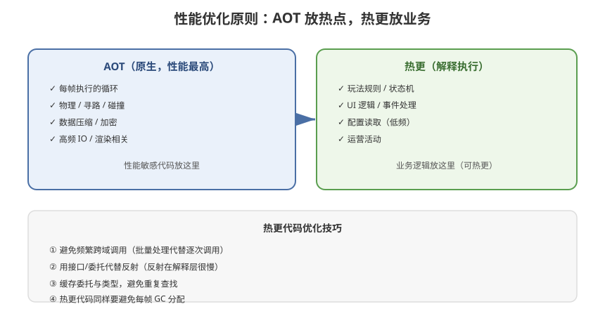

# 08 - 性能与内存优化

## 学习目标
- 理解 HybridCLR 的性能模型（AOT vs 解释执行）
- 掌握性能瓶颈定位与优化方法
- 学会控制补充元数据的内存开销

---



## 1. 性能模型

### 1.1 执行路径对比
```
AOT 代码:
  C# → C++ → 原生机器码 → 直接执行
  ≈ 原生性能（100%）

热更解释执行:
  C# → IL → 解释器逐条翻译执行
  ≈ 原生性能的 30%~60%（视代码复杂度）
```

### 1.2 性能差异原因
| 原因 | 说明 |
|------|------|
| 指令翻译开销 | 每条 IL 都要解释器处理 |
| 类型检查开销 | 解释执行时动态类型检查 |
| 调用转发开销 | 跨 AOT/热更边界有桥接开销 |
| 优化缺失 | 无法做 JIT 级别的深度优化 |

---

## 2. 性能优化原则

### 2.1 核心原则：AOT 放性能敏感，热更放业务
```
性能敏感（放 AOT）:
  ├─ 每帧执行的循环
  ├─ 物理/寻路/碰撞计算
  ├─ 数据压缩/解压
  ├─ 高频 IO
  └─ 渲染相关

业务逻辑（放热更）:
  ├─ 玩法规则
  ├─ 状态机
  ├─ UI 逻辑
  ├─ 配置读取（低频）
  └─ 事件处理
```

### 2.2 每帧调用频率划分
```
热更每帧执行的代码量 = 性能热点

高频（每帧）→ 尽量 AOT
中频（每秒）→ 热更可接受
低频（事件/操作）→ 热更完全没问题
```

---

## 3. 热更代码性能优化技巧

### 3.1 避免频繁跨域调用
```csharp
// ✗ 不好：循环内多次跨 AOT/热更边界
public void Update(float dt)
{
    for (int i = 0; i < enemies.Count; i++)
    {
        AOTFramework.MathHelper.Calc(i, enemies[i]);  // 每帧多次跨域
    }
}

// ✓ 好：批量调用，减少边界
public void Update(float dt)
{
    // 一次性把数据交给 AOT 处理
    AOTFramework.BatchProcessor.Process(enemies);
}
```

### 3.2 减少解释器的热路径指令
```csharp
// ✗ 每帧大量装箱/拆箱（解释器开销大）
object boxed = (object)someInt;

// ✗ 反射调用
methodInfo.Invoke(obj, args);  // 反射在解释层很慢

// ✓ 用接口/委托替代反射
IGameEntry entry = (IGameEntry)instance;
entry.Update(dt);
```

### 3.3 缓存委托与类型
```csharp
// ✗ 每次调用都重新查找
Type type = hotfixAsm.GetType("HotFix.Battle");

// ✓ 缓存
private static Type cachedBattleType = hotfixAsm.GetType("HotFix.Battle");
private static MethodInfo cachedInit = cachedBattleType.GetMethod("Init");
```

---

## 4. 内存优化

### 4.1 补充元数据内存（主要开销）
```
补充元数据常驻内存 ≈ 数 MB ~ 几十 MB

优化方向：
  ├─ 精准补充（只补被引用的程序集）
  ├─ 使用 Consistent 模式（见 05 章）
  ├─ 裁剪不需要的程序集
  └─ 评估后选择最小可用组合
```

### 4.2 热更 DLL 本身的占用
```
已加载程序集无法卸载（IL2CPP 限制）
→ 热更 DLL 一旦加载就常驻
→ 控制热更 DLL 数量，避免重复加载
```

### 4.3 GC 压力
```
解释执行的对象同样由 GC 管理
→ 热更代码也要避免每帧分配（和原生 C# 一样）
→ 使用对象池 / 复用临时对象
```

---

## 5. 性能剖析方法

### 5.1 Unity Profiler
```
Window → Analysis → Profiler
  ├─ CPU 模块：看热更方法耗时
  ├─ 热更方法会以对应 IL 方法名出现
  └─ 对比 AOT 与热更的执行比例
```

### 5.2 手动计时（定位热点）
```csharp
public class PerfProbe
{
    private static readonly System.Diagnostics.Stopwatch sw =
        new System.Diagnostics.Stopwatch();

    public static double Measure(System.Action action)
    {
        sw.Restart();
        action();
        sw.Stop();
        return sw.Elapsed.TotalMilliseconds;
    }
}
```

### 5.3 HybridCLR 性能采样
```
可开启 HybridCLR 的性能采样功能
→ 统计解释器每类指令的执行次数
→ 找到解释器热路径
```

---

## 6. 典型性能案例

### 6.1 案例：战斗逻辑慢
```
症状：战斗中 FPS 下降
分析：战斗逻辑在热更层每帧执行大量循环
优化：
  1. 把伤害计算核心循环移到 AOT
  2. 热更只做规则判断，数据计算交 AOT
  3. 批量处理减少跨域调用
```

### 6.2 案例：背包/列表刷新慢
```
症状：打开背包卡顿
分析：大量 UI 创建 + 排序在热更层
优化：
  1. UI 对象池（复用）
  2. 排序逻辑移 AOT
  3. 懒加载 + 分批刷新
```

---

## 7. 性能基线参考

| 场景 | 热更占比 | 表现 |
|------|----------|------|
| 纯逻辑计算 | 100% | 慢约 2~3 倍 |
| 常规游戏逻辑 | 50% | 总体可接受 |
| 每帧高频调用 | 高频 | 需优化（移 AOT） |
| 低频事件处理 | 少量 | 无感 |

> **建议**：以"热更代码占每帧 CPU 时间 < 30%"为优化目标，可保证整体流畅。

---

## 8. 学习检查点

- [ ] 理解 AOT 与解释执行的性能差异及原因
- [ ] 掌握"AOT 放性能敏感，热更放业务"原则
- [ ] 会定位热更性能热点并优化
- [ ] 能控制补充元数据的内存开销
