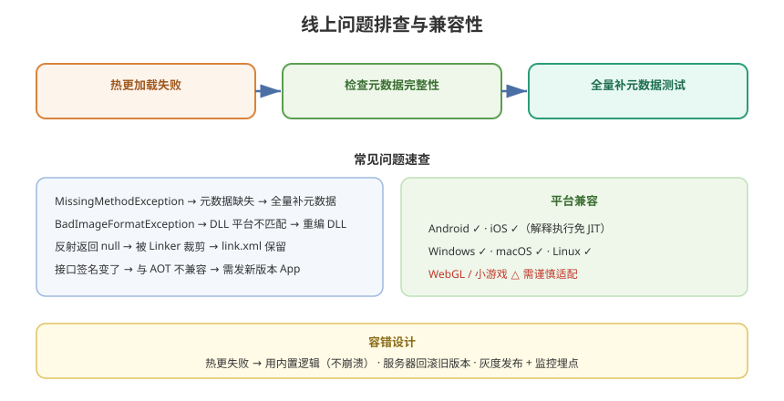

# 09 - 线上问题与兼容性

## 学习目标
- 掌握 HybridCLR 在线上环境的常见问题与排查方法
- 了解平台兼容性和版本兼容性风险
- 学会设计降级与灰度方案

---



## 1. 常见线上问题

### 1.1 热更 DLL 加载失败
| 症状 | 原因 | 排查 |
|------|------|------|
| `FileNotFoundException` | 依赖程序集缺失 | 检查补充元数据完整性 |
| `MissingMethodException` | 方法元数据缺失 | 全量补元数据测试 |
| `BadImageFormatException` | DLL 平台不匹配 | 确认编译目标平台 |
| 加载后立刻异常 | 入口类型/方法名错 | 核对 entryClass/entryMethod |

### 1.2 补充元数据问题
```
症状：运行到某行才报 MissingMethod / TypeLoad
原因：该类型/方法被裁剪，元数据未补充
解决：
  1. 全量补充（开发期）
  2. 精准补充（线上，需充分测试）
```

### 1.3 反射相关
```
症状：反射返回 null / 抛异常
原因：被反射的类型/成员被裁剪
解决：
  ├─ 补充元数据
  ├─ 使用 link.xml 保留成员
  └─ 改用接口/委托（避免反射）
```

---

## 2. link.xml 保留配置

### 2.1 为什么需要 link.xml
```
IL2CPP 裁剪器（Linker）会移除未引用代码
→ 反射用到的类型可能被裁掉
→ link.xml 强制保留
```

### 2.2 link.xml 示例
```xml
<linker>
  <!-- 保留整个程序集 -->
  <assembly fullname="MyAOTAssembly">
    <type fullname="MyNamespace.MyClass" preserve="all"/>
    <!-- 保留某类型所有成员 -->
    <type fullname="MyNamespace.MySerializer" preserve="all"/>
  </assembly>

  <!-- 保留某类型的指定成员 -->
  <assembly fullname="UnityEngine.CoreModule">
    <type fullname="UnityEngine.GameObject">
      <method name="GetComponent"/>
      <method name="Instantiate"/>
    </type>
  </assembly>
</linker>
```

### 2.3 保留策略
| 保留级别 | 说明 |
|----------|------|
| 整个程序集 | 全保留（包体大） |
| 指定类型全部 | 常用（开发期） |
| 指定成员 | 精准（线上优化） |

---

## 3. 平台兼容性

### 3.1 支持矩阵
| 平台 | 支持度 | 说明 |
|------|--------|------|
| Android | ✓ 完整 | 主流方案 |
| iOS | ✓ 完整 | 无需 JIT 权限（解释执行） |
| Windows Standalone | ✓ 完整 | 开发调试方便 |
| macOS | ✓ 完整 | |
| Linux | ✓ | |
| WebGL | △ 谨慎 | 受浏览器运行时限制 |
| 小游戏（微信等） | △ | 需额外适配 |

### 3.2 iOS 特殊说明
```
iOS 禁止 JIT（内存页可执行权限限制）
→ 但 HybridCLR 是"解释执行"，不依赖 JIT
→ 天然规避 iOS 限制（与 ILRuntime 同理）
→ 这是 HybridCLR 能在 iOS 热更的根本原因
```

### 3.3 Android 注意
```
Android 兼容性取决于：
  ├─ 不同厂商 ROM 对 JIT/解释的支持
  ├─ HybridCLR 解释执行不依赖 JIT → 兼容性好
  └─ 注意 IL2CPP 版本与 Unity 版本匹配
```

---

## 4. 版本兼容性管理

### 4.1 热更 DLL 与 App 版本
```
热更 DLL 必须与 App 的 AOT 程序集兼容
  ├─ 接口签名不能随意改（改了 AOT 引用会崩）
  ├─ 补充元数据必须覆盖热更 DLL 的引用
  └─ 版本升级策略：
      - 小更新：只换热更 DLL（接口不变）
      - 大更新：需重新安装 App
```

### 4.2 强更 vs 热更
```
判断标准：
  修改是否涉及 AOT 程序集（接口、引擎调用）
  是 → 必须发新版本 App（强更）
  否 → 只更新热更 DLL（静默热更）
```

### 4.3 版本号体系
```
建议版本号组合：
  AppVersion: 1.2.0     ← 安装包版本
  HotfixVersion: 1.2.3  ← 热更 DLL 版本
  ResourceVersion: 301  ← 资源版本

热更 DLL 需在版本检查中单独校验
```

---

## 5. 降级与回滚方案

### 5.1 热更失败降级
```csharp
public class HotUpdateController
{
    public void TryUpdate()
    {
        bool success = DownloadAndLoadHotfix();
        if (!success)
        {
            // 降级：使用内置的默认逻辑
            Debug.LogWarning("热更失败，使用内置逻辑");
            UseBuiltInFallback();
        }
    }
}
```

### 5.2 回滚策略
```
线上热更出问题：
  1. 服务器回滚热更版本（重新上传旧 DLL）
  2. 客户端版本检查比对 → 下载旧版本
  3. 热更代码本身要有"版本降级开关"
```

### 5.3 灰度发布
```csharp
// 按用户比例灰度
public static bool IsGrayUser(string userId, int percent)
{
    int hash = userId.GetHashCode() % 100;
    return Mathf.Abs(hash) < percent;
}
```

---

## 6. 线上监控与告警

### 6.1 关键指标
```
  ├─ 热更成功率
  ├─ 热更加载耗时
  ├─ 补充元数据加载失败率
  ├─ 热更层异常率
  ├─ 崩溃率（按热更版本）
  └─ 版本覆盖率（各热更版本分布）
```

### 6.2 上报接入
```csharp
public class HotfixReport
{
    public static void ReportHotfixResult(bool success, string version)
    {
        // 上报到数据平台
        Analytics.Report("Hotfix_Load", new Dictionary<string, object>
        {
            { "success", success },
            { "version", version },
            { "platform", Application.platform.ToString() },
            { "appVersion", Application.version }
        });
    }
}
```

---

## 7. 上线前检查清单

```
□ 补充元数据完整（全量测试所有热更路径）
□ link.xml 覆盖所有反射/泛型类型
□ 接口签名冻结（不再改动）
□ 降级逻辑已实现（热更失败不崩溃）
□ 版本号体系完整（App/热更/资源）
□ 灰度开关已配置
□ 监控埋点已接入
□ 回滚方案已验证
□ 真机全平台测试通过
```

---

## 8. 学习检查点

- [ ] 能排查热更加载和元数据缺失的常见问题
- [ ] 会配置 link.xml 保留反射类型
- [ ] 理解平台兼容性和版本兼容性风险
- [ ] 能设计降级、回滚和灰度方案
