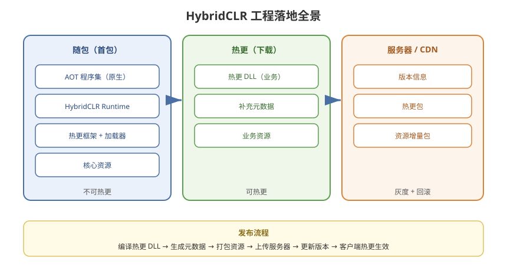

# 10 - 工程落地最佳实践

## 学习目标
- 掌握 HybridCLR + 资源热更的完整工程架构
- 能构建一个可直接上线的热更项目模板
- 理解生产级项目的团队协作与规范

---



## 1. 工程目录结构

```
Assets/
├── Game/
│   ├── AOT/                      ← AOT 程序集（随包）
│   │   ├── AOTFramework/
│   │   │   ├── AOTFramework.asmdef
│   │   │   └── ... (资源/网络/事件/工具)
│   │   ├── AOTInterface/
│   │   │   ├── AOTInterface.asmdef
│   │   │   └── IGameEntry.cs / IGameSystem.cs ...
│   │   └── Adapters/             ← CrossBindingAdaptor 集中区
│   │       ├── GameEntryAdapter.cs
│   │       └── ...
│   ├── HotFix/                   ← 热更程序集
│   │   ├── HotFix.asmdef
│   │   ├── Entry/                ← 热更入口
│   │   ├── Logic/                ← 玩法逻辑
│   │   ├── UI/
│   │   ├── Data/
│   │   └── Util/
│   └── HotfixConfig.asset        ← HybridCLR 设置
├── HybridCLRData/                ← 生成数据（自动）
│   ├── AOTGenericReferences.cs
│   └── Metadata/
└── Scripts/
    ├── Bootstrap.cs              ← 启动
    ├── HotUpdate/                ← 资源热更
    └── Editor/
        ├── BuildScript.cs
        └── HybridCLRHelper.cs
```

---

## 2. 启动流程完整实现

```csharp
using System;
using System.Collections;
using System.Reflection;
using UnityEngine;
using HybridCLR.Runtime;

public class Bootstrap : MonoBehaviour
{
    [Header("热更配置")]
    public string hotfixDllName = "HotFix";
    public string entryClass = "HotFix.Entry.GameEntry";
    public string entryMethod = "Main";

    // 依赖的服务（AOT 侧）
    private IGameEntry gameEntry;

    IEnumerator Start()
    {
        // 1. 显示启动界面
        UIManager.Instance.ShowSplash();

        // 2. 资源热更（HotUpdate/05 章节完整实现）
        yield return StartCoroutine(UpdateManager.CheckAndUpdate(
            progress => { },
            status => { }));

        // 3. 加载补充元数据
        LoadMetadata();

        // 4. 加载热更 DLL
        Assembly hotfixAsm = LoadHotfixAssembly();
        if (hotfixAsm == null)
        {
            // 降级：内置逻辑
            EnterGameWithFallback();
            yield break;
        }

        // 5. 通过接口启动热更逻辑
        var type = hotfixAsm.GetType(entryClass);
        gameEntry = (IGameEntry)Activator.CreateInstance(type);
        gameEntry.Initialize();

        // 6. 隐藏启动界面
        UIManager.Instance.HideSplash();
    }

    void Update()
    {
        gameEntry?.Update(Time.deltaTime);
    }

    void OnDestroy()
    {
        gameEntry?.Shutdown();
    }
}
```

---

## 3. 核心设计规范

### 3.1 接口清单（AOT 侧定义）
```csharp
// 统一游戏系统接口
public interface IGameSystem
{
    void Initialize();
    void Update(float deltaTime);
    void Shutdown();
}

// 具体系统接口（热更实现）
public interface IBattleSystem : IGameSystem { }
public interface IUISystem : IGameSystem { }
public interface IDataSystem : IGameSystem { }
```

### 3.2 依赖注入容器（AOT 侧）
```csharp
public static class ServiceLocator
{
    private static readonly Dictionary<Type, object> services = new();

    public static void Register<T>(T instance) where T : class
    {
        services[typeof(T)] = instance;
    }

    public static T Resolve<T>() where T : class
    {
        return (T)services[typeof(T)];
    }
}
```

### 3.3 热更侧注册（热更入口）
```csharp
namespace HotFix.Entry
{
    public class GameEntry : IGameEntry
    {
        public void Initialize()
        {
            // 注册热更服务到 AOT 容器
            ServiceLocator.Register<IBattleSystem>(new BattleSystem());
            ServiceLocator.Register<IDataSystem>(new DataSystem());

            // 初始化各系统
            ServiceLocator.Resolve<IBattleSystem>().Initialize();
        }

        public void Update(float dt)
        {
            ServiceLocator.Resolve<IBattleSystem>().Update(dt);
        }

        public void Shutdown()
        {
            ServiceLocator.Resolve<IBattleSystem>().Shutdown();
        }
    }
}
```

---

## 4. 构建发布流程（自动化）

### 4.1 完整构建脚本
```csharp
public static class ReleaseBuilder
{
    [MenuItem("Tools/Release/Build All")]
    public static void BuildAll()
    {
        // 1. 设置 Player Settings
        ConfigurePlayerSettings();

        // 2. 编译热更 DLL
        BuildHotfixDll();

        // 3. 生成补充元数据
        BuildAotMetadata();

        // 4. 打包资源（AssetBundle/Addressables）
        BuildResources();

        // 5. 生成版本信息
        GenerateVersionFile();

        // 6. 构建 App
        BuildApp();
    }

    static void BuildHotfixDll()
    {
        // 调用 HybridCLR 编译
        // 输出到 StreamingAssets 或 AssetBundle
    }

    static void BuildAotMetadata()
    {
        // 生成元数据 DLL → 打包为 AssetBundle
    }
}
```

### 4.2 更新发布流程
```
[修改热更代码]
    ↓
[编译热更 DLL + 元数据]
    ↓
[打包进 AssetBundle]
    ↓
[上传服务器]
    ↓
[更新版本信息]
    ↓
[客户端下载热更 → 生效]
```

---

## 5. 生产级注意点

### 5.1 热更包体与首包
```
首包（APK/IPA）：
  ├─ AOT 程序集（原生编译）
  ├─ HybridCLR Runtime
  ├─ 热更框架 + 加载器
  └─ 少量必要资源

热更内容（下载）：
  ├─ 热更 DLL（业务逻辑）
  ├─ 补充元数据
  └─ 业务资源
```

### 5.2 安全
```
热更 DLL 需加密（AES）防止反编译
→ 加载前解密 → Assembly.Load
```

### 5.3 团队协作规范
```
1. 接口变更走评审（影响 AOT 边界）
2. 热更程序集划分稳定（避免频繁重组）
3. 统一日志/上报格式
4. CI 自动构建 + 自动发布到测试服
5. 灰度发布 + 回滚预案
```

---

## 6. 最小可运行模板清单

```
□ Bootstrap.cs（启动流程）
□ AOTInterface 程序集（接口定义）
□ AOTFramework 程序集（基础框架）
□ HotFix 程序集（热更入口 + 示例逻辑）
□ Adapters 目录（跨域适配器）
□ UpdateManager（资源热更）
□ HybridCLR 设置（Hotfix Assemblies / AOT Metadatas）
□ 构建脚本（编译 DLL + 元数据 + 资源 + 版本）
□ 版本信息文件（version.json）
```

---

## 7. 学习检查点

- [ ] 能搭建完整的 HybridCLR 热更工程
- [ ] 掌握接口 + 依赖注入的跨域架构
- [ ] 能实现自动化构建发布流程
- [ ] 理解生产级项目的安全、规范和运维要点
