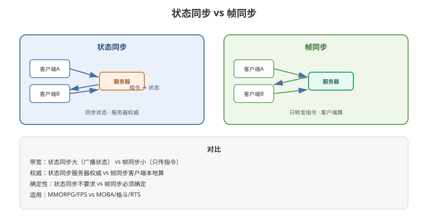

# 01 - 网络同步概述

## 学习目标
- 理解为什么需要网络同步
- 掌握网络同步的核心问题
- 建立网络同步的知识框架

---



## 1. 什么是网络同步

网络同步（Network Synchronization）是指**在多个客户端之间保持游戏世界状态一致**的技术。让所有玩家看到同一个世界、同一场战斗、同一个结果。

### 1.1 核心矛盾
```
单机游戏：逻辑在本机，无一致性问题
网络游戏：逻辑分散在多个设备，需要"达成一致"
```

### 1.2 同步的本质
```
玩家 A 移动 → 玩家 B 必须看到 A 的移动
关键：A 移动"这个事实"如何让 B 知道？

网络同步 = 传输"事实" + 保持"一致"
```

---

## 2. 为什么网络同步是游戏开发的难点

### 2.1 网络延迟（Latency）
```
物理定律：光速有限 + 设备传输
RTT (Round Trip Time)：
  - 局域网：< 10ms
  - 同城：20~50ms
  - 全国：50~100ms
  - 跨国：100~300ms
  - 最差：> 500ms

延迟意味着：信息到对方那里已经"过时"了
```

### 2.2 丢包（Packet Loss）
```
网络不稳定 → 数据包丢失
  - 有线/光纤：极低
  - WiFi：中等
  - 移动网络：较高

丢包意味着：关键操作可能"没收到"
```

### 2.3 带宽（Bandwidth）
```
服务器需要支撑：
  同时在线人数 × 每人每秒数据量 = 总带宽

10万人在线 × 10KB/s = 1 GB/s 带宽（很贵）
```

### 2.4 三要素总结
| 约束 | 影响 | 对策 |
|------|------|------|
| 延迟 | 响应慢、不同步 | 预测、插值、回滚 |
| 丢包 | 操作丢失、状态不一致 | 可靠传输、重传 |
| 带宽 | 成本高、卡顿 | 压缩、增量、UDP |

---

## 3. 网络同步的核心问题

### 3.1 五问
```
1. 同步什么？（状态 / 指令）
2. 谁来决定？（客户端 / 服务器权威）
3. 怎么传输？（TCP / UDP / 自定义协议）
4. 怎么应对延迟？（预测 / 插值 / 回滚）
5. 怎么防作弊？（服务器校验 / 加密）

这五个问题构成整个网络同步知识体系
```

### 3.2 同步的粒度
| 粒度 | 同步内容 | 适用 |
|------|----------|------|
| 状态同步 | 物体的位置/属性/状态 | MMORPG、SLG |
| 帧同步 | 玩家的操作指令 | MOBA、格斗、RTS |
| 混合同步 | 状态 + 指令结合 | 大型多人在线 |

---

## 4. 两大主流同步方案

### 4.1 状态同步 (State Synchronization)
```
原理：
  服务器是权威，计算并维护所有游戏状态
  客户端发送操作指令 → 服务器更新状态 → 广播给所有客户端

特点：
  - 服务器权威（防作弊强）
  - 客户端只负责表现
  - 带宽占用大（传输状态）
  - 典型：MMORPG、FPS
```

### 4.2 帧同步 (Lockstep / Deterministic)
```
原理：
  所有客户端执行相同逻辑（确定性）
  服务器只广播玩家的"操作指令"
  客户端用相同输入按相同规则运行 → 得到相同结果

特点：
  - 带宽占用小（只传指令）
  - 客户端承担计算
  - 要求逻辑确定性（浮点、随机数、遍历顺序）
  - 典型：MOBA、格斗、RTS
```

---

## 5. 网络同步技术栈全景

```
┌────────────────────────────────────────────┐
│            网络同步技术体系                   │
├──────────────────┬─────────────────────────┤
│  同步方案        │  延迟处理                │
│  ├─ 状态同步     │  ├─ 客户端预测           │
│  ├─ 帧同步       │  ├─ 插值（Interpolation）│
│  └─ 混合方案     │  ├─ 回滚（Rollback）     │
├──────────────────┼─────────────────────────┤
│  传输层          │  权威与安全              │
│  ├─ TCP / UDP   │  ├─ 服务器权威           │
│  ├─ WebSocket   │  ├─ 指令校验             │
│  ├─ 可靠UDP     │  ├─ 时间戳校验           │
│  └─ KCP / ENET  │  └─ 加密防外挂           │
├──────────────────┼─────────────────────────┤
│  服务器架构      │  应用层协议              │
│  ├─ 单服/分区分服│  ├─ 消息编解码           │
│  ├─ 分布式       │  ├─ Protobuf           │
│  └─ 网关/逻辑服  │  └─ 序列化/压缩         │
└──────────────────┴─────────────────────────┘
```

---

## 6. 学习路线规划

```
第 2 章  网络基础（TCP/UDP、架构选型）
第 3 章  状态同步详解（MMORPG 方案）
第 4 章  帧同步详解（MOBA/格斗方案）
第 5 章  两种方案深度对比
第 6 章  权威服务器与回滚机制
第 7 章  预测与插值算法
第 8 章  服务器架构与通信协议
第 9 章  反作弊与防外挂
第 10 章 工程实践与案例
```

---

## 7. 学习检查点

- [ ] 理解网络同步要解决的三个核心约束
- [ ] 能说清状态同步与帧同步的本质区别
- [ ] 掌握网络同步技术栈的全景
- [ ] 了解网络同步的五个核心问题
