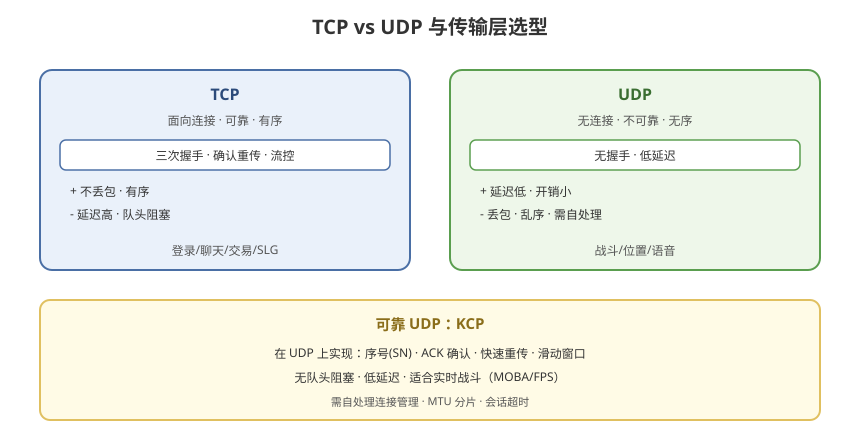

# 02 - 网络基础与架构选型

## 学习目标
- 掌握 TCP / UDP 的区别与选型
- 理解 WebSocket、KCP 等传输层方案
- 能根据游戏类型选择网络架构

---



## 1. 传输层协议：TCP vs UDP

### 1.1 TCP（传输控制协议）
```
特点：
  - 面向连接（三次握手）
  - 可靠传输（确认、重传）
  - 有序（序号保证顺序）
  - 流量控制、拥塞控制

优缺点：
  + 可靠，不丢包
  + 有序，无需处理乱序
  - 延迟高（重传等待）
  - 队头阻塞（Head-of-Line Blocking）
```

### 1.2 UDP（用户数据报协议）
```
特点：
  - 无连接
  - 不可靠（可能丢、乱序、重复）
  - 无顺序保证
  - 无流量控制

优缺点：
  + 延迟低（无需握手/重传）
  + 适合实时性要求高的场景
  - 需自行处理丢包/乱序/可靠性
```

### 1.3 对比总结
| 维度 | TCP | UDP |
|------|-----|-----|
| 连接 | 面向连接 | 无连接 |
| 可靠性 | 可靠 | 不可靠 |
| 有序性 | 有序 | 无序 |
| 延迟 | 高 | 低 |
| 开销 | 高 | 低 |
| 适用 | 登录/聊天/交易 | 战斗/位置/语音 |

---

## 2. 传输层方案选型

### 2.1 纯 TCP
```
适用：非实时或对可靠性要求高的系统
  - 登录、注册、支付
  - 聊天、邮件、商城
  - SLG（回合制）
```

### 2.2 纯 UDP
```
适用：实时性优先的战斗系统
  - 位置同步
  - 射击判定
  - 语音
```

### 2.3 可靠 UDP（RUDP）
```
在 UDP 上自行实现可靠性（类似 KCP）
  - 序号、ACK、重传
  - 选择性重传
  - 无队头阻塞
适用：既要实时又要可靠的场景（MOBA 战斗）
```

### 2.4 常见方案对比
| 方案 | 协议 | 可靠性 | 延迟 | 适用 |
|------|------|--------|------|------|
| Socket (TCP) | TCP | 高 | 中 | 登录/交易 |
| Socket (UDP) | UDP | 无 | 低 | 位置/语音 |
| **KCP** | UDP | 可配置 | 低 | 实时战斗 |
| **ENet** | UDP | 可靠 | 低 | 游戏专用 |
| WebSocket | TCP | 高 | 中 | Web/小游戏 |
| WebRTC | UDP | 可靠 | 低 | P2P/音视频 |

---

## 3. KCP 深入

### 3.1 什么是 KCP
```
KCP 是一个基于 UDP 的快速可靠传输协议
作者：云风（Skywind）
GitHub：skywind3000/kcp
特点：在"可靠性"与"传输速度"之间做优化
```

### 3.2 KCP 的可靠性机制
```
1. 分段（Split）：
   - 把大消息拆成小段发送
   - 避免超 MTU 被 IP 层分片

2. 序号（SN）：
   - 每个分段有唯一序号
   - 用于排序和去重

3. ACK 确认：
   - 接收方返回 ACK（确认序号）
   - 发送方据此判断是否需重传

4. 重传（Retransmission）：
   - 超时未确认 → 重传
   - 快速重传（连续收到重复 ACK）

5. 滑动窗口（Flow Control）：
   - 控制发送速率
   - 避免拥塞
```

### 3.3 KCP vs TCP 重传
```
TCP：丢包时阻塞，等待超时重传（延迟大）
KCP：快速重传 + 无队头阻塞（延迟低）

KCP 的不足：
  - 需自行处理连接管理（没有三次握手）
  - 需自行处理会话超时
  - 需自行处理 MTU 分片策略
```

---

## 4. 游戏网络架构选型

### 4.1 单机/局域网
```
架构：客户端直连（或通过主机托管）
适用：小规模、Demo、本地对战
特点：简单、无服务器成本
```

### 4.2 客户端-服务器（C/S）
```
架构：
  客户端（Unity）↔ 服务器（权威）
适用：MMORPG、FPS、MOBA
特点：服务器权威、防作弊强、负载集中
```

### 4.3 分布式服务器
```
架构：
  客户端 → 网关（Gateway）
             → 逻辑服（Game Server）
             → 数据库（DB）

适用：大型多人在线、区服架构
特点：水平扩展、负载均衡、容灾
```

### 4.4 对等网络（P2P）
```
架构：客户端之间直连，无中心服务器
适用：小规模实时对战（RTS、格斗）
特点：延迟低（就近）、无服务器成本
缺点：防作弊难、NAT 穿透难
```

### 4.5 选型决策树
```
游戏类型？
├─ 大型MMO → 分布式 C/S（服务器权威 + 状态同步）
├─ FPS → 权威服务器 + 状态同步 + 预测
├─ MOBA/格斗 → 服务器 + 帧同步（或状态同步）
├─ RTS → P2P 帧同步 或 服务器帧同步
├─ SLG → C/S（回合制，TCP足够）
├─ 休闲/棋牌 → C/S（逻辑简单）
└─ Web/小游戏 → WebSocket
```

---

## 5. 网络架构的部署考量

### 5.1 服务器部署
```
单区单服：
  - 一个逻辑服承载一个区
  - 简单，但容量有限

多区多服：
  - 按服务器开服
  - 玩家进入不同区服

分区分线：
  - 同一世界内多线（线=副本实例）
  - 频道/线路切换

全球部署：
  - 多地域节点
  - 就近接入（延迟优化）
```

### 5.2 网关与逻辑服分离
```
网关（Gateway）：
  - 负责连接管理
  - 负责转发消息
  - 负责安全（限流、校验）

逻辑服（Game Server）：
  - 负责游戏逻辑
  - 负责状态维护
  - 可水平扩展

好处：
  - 网关屏蔽内部细节
  - 逻辑服可独立扩缩容
  - 玩家断线重连经网关转发
```

---

## 6. 学习检查点

- [ ] 掌握 TCP 与 UDP 的本质区别
- [ ] 理解 KCP 的可靠性机制（序号/ACK/重传）
- [ ] 能根据游戏类型选择网络架构
- [ ] 理解网关与逻辑服分离的设计
