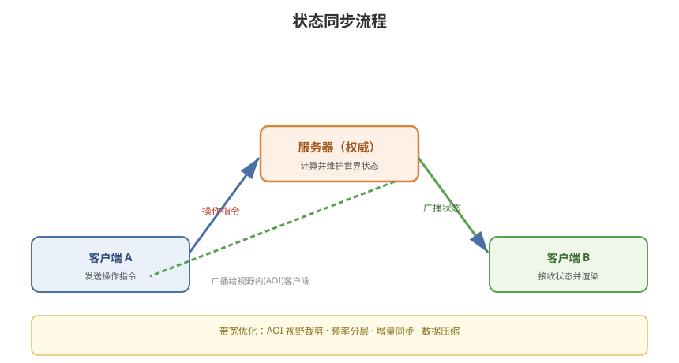

# 03 - 状态同步详解

## 学习目标
- 理解状态同步的原理和流程
- 掌握状态同步的数据结构和实现
- 学会处理状态同步的性能优化

---



## 1. 状态同步原理

### 1.1 核心思想
```
服务器是"真相"（Truth）：
  - 服务器维护所有物体的状态
  - 客户端发送操作指令
  - 服务器更新状态
  - 服务器把状态广播给所有客户端
```

### 1.2 流程图
```
客户端 A ──操作指令──> 服务器 ──更新状态──> 广播给所有客户端
客户端 B ──────────────────────────────> 接收状态并渲染
客户端 C ──────────────────────────────> 接收状态并渲染
```

### 1.3 谁拥有权威
```
服务器权威（推荐）：
  - 服务器计算最终状态
  - 客户端只是"表现层"
  - 防作弊强

客户端权威：
  - 客户端计算自己的状态发给服务器
  - 服务器只是转发
  - 适合"主人"场景（RPG 里的角色）
  - 有作弊风险，需服务器校验
```

---

## 2. 状态同步的数据设计

### 2.1 同步的状态类型
```
1. 实体状态：
   - 位置 Position
   - 朝向 Rotation
   - 速度 Velocity
   - 动画状态（可选）

2. 属性状态：
   - HP / MP / 等级
   - 装备
   - Buff / Debuff

3. 世界状态：
   - NPC 位置
   - 掉落物
   - 环境变化（时间、天气）
```

### 2.2 状态消息结构
```
消息类型：位置同步
{
  "type": "EntityPositionUpdate",
  "entityId": 1001,          // 实体 ID
  "position": [10, 2, 30],   // 位置
  "rotation": [0, 45, 0],    // 朝向
  "velocity": [5, 0, 0],     // 速度
  "timestamp": 1234567890    // 服务器时间戳
}
```

### 2.3 消息协议（Protobuf 示例）
```protobuf
message EntityPositionUpdate {
    int64 entity_id = 1;
    Vector3 position = 2;
    Vector3 rotation = 3;
    Vector3 velocity = 4;
    int64 server_time = 5;
}

message Vector3 {
    float x = 1;
    float y = 2;
    float z = 3;
}
```

---

## 3. 状态同步流程实现

### 3.1 客户端 → 服务器（操作指令）
```csharp
// 客户端发送移动指令
public class ClientInputController : MonoBehaviour
{
    void Update()
    {
        float h = Input.GetAxis("Horizontal");
        float v = Input.GetAxis("Vertical");

        // 构造移动输入
        var moveMsg = new MoveInputMessage
        {
            direction = new Vector2(h, v),
            sequence = inputSequence++  // 指令序号
        };

        // 发送给服务器
        NetworkManager.Send(moveMsg);
    }
}
```

### 3.2 服务器 → 客户端（状态广播）
```csharp
// 服务器广播位置状态
public class GameServerLogic
{
    void BroadcastEntityStates()
    {
        foreach (var entity in entities.Values)
        {
            var stateMsg = new EntityPositionUpdate
            {
                entityId = entity.Id,
                position = entity.Position,
                rotation = entity.Rotation,
                velocity = entity.Velocity,
                serverTime = GetServerTime()
            };

            // 广播给所有相关客户端
            foreach (var client in GetNearbyClients(entity))
            {
                client.Send(stateMsg);
            }
        }
    }
}
```

### 3.3 客户端 → 渲染（接收状态）
```csharp
// 客户端接收服务器状态并更新渲染
public class RemoteEntity : MonoBehaviour
{
    public EntityState targetState;  // 目标状态（插值用）

    // 收到服务器状态
    public void OnStateReceived(EntityPositionUpdate msg)
    {
        targetState.Position = msg.position;
        targetState.Rotation = msg.rotation;
        // 具体插值算法见第 7 章
    }
}
```

---

## 4. 状态同步的性能优化

### 4.1 带宽优化
```
1. 视野裁剪（AOI）：
   - 只同步"我看到/靠近"的实体
   - 减少广播数量

2. 频率控制：
   - 位置同步频率（10~30 Hz）
   - 属性同步（低频率，有变化才发）

3. 增量同步：
   - 只发变化的状态
   - 没有变化不广播

4. 数据压缩：
   - 位置用定点数/短整型
   - 向量量化（角度用字节）
```

### 4.2 AOI（Area of Interest）视野管理
```
原理：每个客户端只关心周围一定范围内的实体

实现：
  九宫格 / 网格分区
  十字链表（跨服场景）
  四叉树 / 空间哈希

好处：
  - 广播量从 O(N) 降到 O(视野内数量)
  - 关键性能优化点
```

### 4.3 广播频率分层
```
高频率（每帧/10-20Hz）：位置、朝向
中频率（每100ms）：HP 变化、Buff 刷新
低频率（事件触发）：拾取、交易、进入副本
```

### 4.4 消息合并
```
把多个小消息合并为一个包发送
减少包头开销、减少系统调用
```

---

## 5. 状态同步的优缺点

### 5.1 优点
```
+ 服务器权威，防作弊能力强
+ 逻辑集中在服务器，便于热更/更新
+ 客户端逻辑简单（只管表现）
+ 支持任意数量玩家（大世界）
```

### 5.2 缺点
```
- 带宽占用大（每次广播所有状态）
- 延迟感知明显（操作要等服务器确认）
- 服务器压力大（承担所有逻辑计算）
- 对网络抖动敏感（状态跳跃）
```

### 5.3 适用场景
```
- MMORPG（魔兽世界、原神）
- 大型多人射击（守望先锋）
- 多人在线竞技（王者荣耀的王者峡谷）
- 大世界探索
```

---

## 6. 状态同步实践要点

### 6.1 状态一致性的保障
```
1. 服务器时间戳统一
2. 客户端时钟同步
3. 状态版本号（解决乱序）
4. 冲突解决规则（谁优先）
```

### 6.2 客户端表现优化
```
1. 插值平滑（见第 7 章）
2. 预测本地操作（减少延迟感）
3. 丢失连接处理（重连、重同步）
```

### 6.3 实战：MMORPG 位置同步
```
服务器：10 Hz 广播玩家位置（AOI 范围内）
客户端：
  - 本地玩家：预测 + 直接移动
  - 远程玩家：插值平滑
  - 服务器修正：位置偏移过大时回弹
```

---

## 7. 学习检查点

- [ ] 理解状态同步的权威模型
- [ ] 能设计位置/属性同步的数据结构
- [ ] 掌握 AOI 视野管理优化
- [ ] 理解状态同步的带宽和延迟优化
