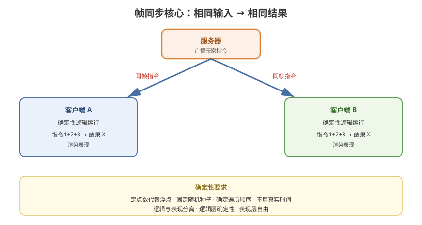

# 04 - 帧同步详解

## 学习目标
- 深入理解帧同步（Lockstep）的原理
- 掌握确定性（Determinism）的核心要求
- 学会帧同步的实现和常见问题处理

---



## 1. 帧同步原理

### 1.1 核心思想
```
所有客户端运行"相同的游戏逻辑"
服务器只广播"玩家的操作指令"
客户端用相同输入 + 相同规则 → 得到相同结果

关键：结果是"确定性的"
      相同输入 → 相同输出（无论哪个客户端）
```

### 1.2 流程图
```
玩家输入 → 打包成"指令" → 服务器
                                ↓
                   广播给所有客户端
                                ↓
   客户端A 用指令跑逻辑 → 结果1
   客户端B 用指令跑逻辑 → 结果1（相同！）
   客户端C 用指令跑逻辑 → 结果1（相同！）
```

### 1.3 同步粒度
```
帧同步的"帧" ≠ 渲染帧
它是"逻辑帧"（Logic Frame / Tick）

固定逻辑帧率：
  通常 30 或 20 Tick/s
  每个 Tick 收集输入 → 广播 → 执行
```

---

## 2. 确定性（Determinism）要求

帧同步的核心前提：**逻辑必须确定**。

### 2.1 确定性破坏者
| 因素 | 问题 |
|------|------|
| 浮点数 | 不同平台精度不同（ARM vs x86） |
| 随机数 | 随机种子不同 → 不同结果 |
| 字典/哈希遍历 | 遍历顺序不稳定 → 结果不同 |
| 多线程 | 执行顺序不确定 |
| 时间相关 | 依赖真实时间 → 不一致 |
| 物理引擎 | 浮点计算 + 平台差异 |

### 2.2 确定性编码规范
```
1. 用整数定点数代替浮点数
   float → int（乘以缩放因子）
   position = x * 1000（毫米精度）

2. 随机数用固定种子
   逻辑层的随机数用种子初始化
   不同客户端用相同种子

3. 遍历用确定顺序
   不使用 Dictionary（顺序不定）
   用 List + 排序

4. 不使用真实时间
   用逻辑帧号驱动
   Time.deltaTime → 固定逻辑帧

5. 物理用确定性物理
   不用 Unity 默认 PhysX（浮点不确定）
   用确定性物理库 / 自己实现
```

---

## 3. 帧同步实现

### 3.1 核心结构
```csharp
// 输入指令
public struct GameInput
{
    public int frame;      // 逻辑帧号
    public int playerId;   // 玩家 ID
    public int inputCode;  // 操作码（移动方向/技能等）
    public int data;       // 附加数据
}

// 一帧内所有玩家的输入
public class FrameInput
{
    public int frame;
    public List<GameInput> inputs;
}
```

### 3.2 输入采集与发送
```csharp
public class InputCollector : MonoBehaviour
{
    public int logicFrame;       // 当前逻辑帧
    private List<GameInput> pendingInputs = new List<GameInput>();

    void Update()
    {
        // 每帧采集玩家操作
        GameInput input = new GameInput
        {
            frame = logicFrame,
            playerId = LocalPlayer.Id,
            inputCode = ReadInputCode(),
            data = ReadInputData()
        };
        pendingInputs.Add(input);
    }

    // 逻辑帧触发时发送本帧输入
    void OnLogicFrame(int frame)
    {
        NetworkManager.SendInput(pendingInputs);
        pendingInputs.Clear();
    }
}
```

### 3.3 逻辑执行（确定性）
```csharp
public class GameLogicSimulation
{
    private int currentFrame;
    private Dictionary<int, FrameInput> receivedInputs;

    // 驱动逻辑帧（固定频率）
    public void Tick()
    {
        // 等待本帧所有玩家的输入齐全
        if (!HasAllInputs(currentFrame)) return;

        var frameInput = receivedInputs[currentFrame];

        // 执行确定性逻辑
        ApplyInputs(frameInput);
        UpdateEntities();
        ResolveCollisions();

        currentFrame++;
    }

    // 确定性更新：不能用 Time.deltaTime
    void UpdateEntities()
    {
        foreach (var entity in entities)
        {
            // 用固定步长更新
            entity.Move(logicStepTime);
        }
    }
}
```

### 3.4 逻辑帧驱动
```csharp
public class LogicFrameDriver : MonoBehaviour
{
    public const int LOGIC_FPS = 30;
    private float accumulator;

    void Update()
    {
        // 固定时间步长累积器（比协程更稳定）
        accumulator += Time.deltaTime;
        while (accumulator >= 1f / LOGIC_FPS)
        {
            GameLogic.Tick();
            accumulator -= 1f / LOGIC_FPS;
        }
    }
}
```

---

## 4. 帧同步的同步策略

### 4.1 锁定步进（Lockstep）
```
所有客户端必须"同一帧一起推进"
  所有客户端完成第 N 帧 → 一起进入第 N+1 帧
  （慢的客户端拖住所有人）

优点：严格一致
缺点：一个卡顿全部卡
```

### 4.2 乐观帧同步（Optimistic）
```
客户端不必等所有人
  自己推进，落后帧赶超
  服务器定期校验一致性

优点：流畅
缺点：可能出现短暂不一致（可回滚）
```

### 4.3 混合策略
```
客户端本地推进 + 服务器确认
  延迟容忍范围（如 2 帧）内自由推进
  超出则等待或回滚
```

---

## 5. 帧同步的缺点与对策

### 5.1 主要缺点
```
1. 逻辑必须在所有客户端一致
   → 任何平台差异都会导致"不同步"

2. 逻辑复杂度受限
   → 不能依赖物理引擎、复杂 AI

3. 不适合大规模世界
   → 所有客户端都要跑全部逻辑

4. 延迟敏感
   → 最慢的玩家拖累所有人
```

### 5.2 对策
```
1. 严格确定性规范（见第 2 节）
2. 逻辑与表现分离
   - 逻辑层：确定性的战斗逻辑
   - 表现层：华丽的渲染（AI、特效）
3. 服务器做逻辑校验（反作弊）
4. 延迟补偿（第 7 章）
```

---

## 6. 帧同步实践要点

### 6.1 逻辑与表现分离架构
```
┌────────────────────────────┐
│        表现层（渲染）        │
│   特效 / 动画 / UI / 相机   │
├────────────────────────────┤
│        逻辑层（确定性）      │
│   移动 / 战斗 / 判定 / AI   │
├────────────────────────────┤
│        帧同步核心            │
│   输入采集 / 逻辑帧 / 广播   │
└────────────────────────────┘
```

### 6.2 回放（Replay）
```
帧同步天然支持回放：
  记录所有帧的输入 → 重放输入 → 重演整场战斗
  用于观战、复盘、反作弊审计
```

### 6.3 断线重连
```
客户端重连：
  服务器下发"当前帧号 + 从某帧开始的输入"
  客户端从该帧重新跑逻辑 → 追上当前帧
```

---

## 7. 学习检查点

- [ ] 理解帧同步"相同输入 → 相同结果"的核心
- [ ] 掌握确定性编码的规范（定点数、种子、遍历顺序）
- [ ] 能实现输入采集 + 逻辑帧驱动的帧同步
- [ ] 理解 Lockstep 与乐观帧同步的区别
- [ ] 知道帧同步的适用场景和局限
