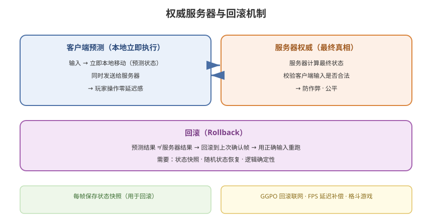

# 06 - 权威服务器与回滚机制

## 学习目标
- 理解服务器权威架构的意义
- 掌握客户端预测与回滚（Rollback）机制
- 学会回滚技术的实现和优化

---



## 1. 服务器权威架构

### 1.1 什么是服务器权威
```
服务器是"唯一真相"（Authoritative Server）：
  - 服务器运行最终的游戏逻辑
  - 客户端输入只是"建议"
  - 服务器计算结果才是最终状态
  - 客户端只是展示服务器状态
```

### 1.2 权威模型的意义
```
1. 防作弊：
   - 客户端无法伪造状态
   - 服务器校验一切

2. 一致性：
   - 所有客户端以服务器状态为准
   - 天然一致

3. 公平性：
   - 所有玩家受相同规则约束
```

### 1.3 权威范围
| 内容 | 权威方 |
|------|--------|
| 角色位置 | 服务器 |
| 血量/伤害 | 服务器 |
| 掉落/奖励 | 服务器 |
| 技能效果 | 服务器 |
| 玩家输入 | 客户端（采集） |
| 表现层（特效） | 客户端 |

---

## 2. 权威服务器的延迟问题

### 2.1 问题
```
服务器权威的代价：延迟
客户端输入 → 服务器 → 结果 → 客户端
  单向延迟假设 50ms → RTT 100ms

玩家操作后：
  等待 100ms 才能看到结果
  → 明显卡顿、不跟手
```

### 2.2 解决方案
```
1. 客户端预测（Client Prediction）
   - 本地立即执行输入
   - 不等服务器

2. 回滚（Rollback）
   - 服务器结果与本地预测不同时
   - 回滚到服务器状态

3. 插值（Interpolation）
   - 平滑显示其他实体
```

---

## 3. 客户端预测（Client Prediction）

### 3.1 原理
```
本地玩家：
  输入 → 立即本地执行（预测）
  同时发送给服务器
  服务器确认/修正

远程玩家：
  收到服务器状态 → 插值平滑显示
```

### 3.2 预测实现
```csharp
public class LocalPlayerPrediction : MonoBehaviour
{
    public int predictedState;   // 本地预测状态
    public int serverState;      // 服务器状态

    void Update()
    {
        var input = ReadInput();

        // 1. 本地立即执行（预测）
        ApplyInputLocally(input);

        // 2. 发送给服务器
        NetworkManager.Send(input);
    }

    void ApplyInputLocally(GameInput input)
    {
        // 用本地逻辑预测移动
        transform.position += input.moveDir * Time.deltaTime;
    }

    // 收到服务器状态
    public void OnServerState(ServerState state)
    {
        serverState = state.Version;
        // 如果服务器状态与本地预测一致，什么都不做
        // 如果不一致，回滚
    }
}
```

### 3.3 预测的适用
```
适合：角色移动、射击方向（可预测）
不适合：伤害结算、掉落（需服务器）
```

---

## 4. 回滚（Rollback）机制

### 4.1 什么是回滚
```
回滚 = 帧同步/预测中，发现服务器状态与本地不一致时
      放弃本地预测，回到服务器状态

常见于格斗游戏（GGPO / Rollback）
```

### 4.2 回滚原理
```
1. 本地用预测输入运行逻辑（快速响应）
2. 服务器广播正确输入
3. 若预测输入 ≠ 服务器输入：
   - 回滚到"上次确认的帧"
   - 用正确输入重新运行
   - 更新到当前帧
```

### 4.3 回滚实现（状态快照）
```csharp
// 保存每帧的状态快照（用于回滚）
public class ReplayBuffer
{
    private List<StateSnapshot> snapshots = new List<StateSnapshot>();

    public struct StateSnapshot
    {
        public int frame;
        public EntityState[] entityStates;
        public RandomState randomState;
    }

    // 每帧保存快照
    public void SaveSnapshot(int frame, EntityState[] states)
    {
        snapshots.Add(new StateSnapshot
        {
            frame = frame,
            entityStates = states,
            randomState = RandomManager.SaveState()  // 保存随机种子状态
        });
    }

    // 回滚到指定帧
    public StateSnapshot RollbackTo(int frame)
    {
        return snapshots.Find(s => s.frame == frame);
    }

    // 从某帧开始重新模拟
    public void ResimulateFrom(int frame)
    {
        var snap = RollbackTo(frame);
        RestoreState(snap);          // 恢复快照
        RandomManager.Restore(snap.randomState);  // 恢复随机状态

        // 用正确输入重跑到当前帧
        for (int f = frame; f <= currentFrame; f++)
        {
            ApplyFrameInput(inputs[f]);
        }
    }
}
```

### 4.4 回滚要求
```
回滚必须确定性：
  - 逻辑无副作用
  - 随机数可恢复
  - 不依赖外部状态
  - 物理可重放（或保存物理状态）
```

---

## 5. 服务器权威 + 回滚的实战流程

### 5.1 FPS 射击判定
```
客户端：
  玩家瞄准 → 本地立即开火（预测）
  命中结果发给服务器

服务器：
  校验命中（射线检测）→ 是否有效
  广播伤害结果

回滚场景：
  客户端预测命中了 → 服务器判定没命中
  → 客户端回滚（显示未命中）
```

### 5.2 格斗游戏（Rollback Netcode）
```
GGPO（Good Game, Peace Out）：
  一种成熟的回滚联网方案

原理：
  每帧保存状态快照
  延迟大时用预测输入运行
  服务器/对手确认后回滚到真实输入
```

---

## 6. 状态快照与带宽

### 6.1 快照大小优化
```
回滚需要保存每帧快照 → 内存/带宽开销
优化：
  1. 只保存"有变化"的状态（增量）
  2. 状态压缩（定点数）
  3. 定期保存全量 + 中间增量
```

### 6.2 快照频率
```
太高：带宽大
太低：回滚精度差

建议：
  每帧保存（格斗游戏）
  每 2~3 帧保存 + 增量恢复（一般竞技）
```

---

## 7. 服务器权威的进阶

### 7.1 服务器授权与校验分离
```
服务器未必每帧运行完整逻辑
而是"抽帧校验"：
  - 客户端自己跑逻辑（预测）
  - 服务器定期校验关键节点
  - 不一致则重同步
```

### 7.2 确定性服务器
```
服务器也运行确定性逻辑（帧同步的服务器版）
  - 服务器为权威
  - 客户端执行同样逻辑
  - 服务器广播确认帧
```

### 7.3 服务器权威的挑战
```
1. 服务器计算压力大（全量逻辑）
2. 服务器单点风险
3. 服务器逻辑与客户端分离（两套代码）
   → 用确定性逻辑 + 逻辑/表现分离解决
```

---

## 8. 学习检查点

- [ ] 理解服务器权威架构的意义
- [ ] 掌握客户端预测的原理和实现
- [ ] 理解回滚机制和状态快照
- [ ] 了解 GGPO 等回滚联网方案
- [ ] 能设计权威服务器 + 回滚的实战方案
