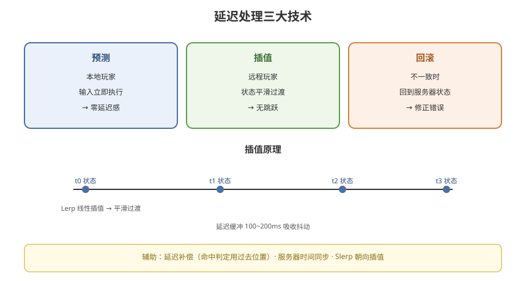

# 07 - 预测与插值算法

## 学习目标
- 掌握客户端预测的核心算法
- 深入理解插值（Interpolation）平滑技术
- 学会处理延迟补偿

---



## 1. 延迟处理总览

```
延迟处理的三大技术：
  1. 预测（Prediction）：本地立即执行输入
  2. 插值（Interpolation）：平滑显示远程实体
  3. 回滚（Rollback）：不一致时修正（见第 6 章）
```

### 1.1 谁用谁
```
本地玩家：预测（立即响应）
远程玩家：插值（平滑跟随）
服务器：权威校验 + 广播
```

---

## 2. 客户端预测（Client Prediction）

### 2.1 原理回顾
```
输入 → 本地立即执行（预测状态）
    → 同时发服务器
服务器 → 确认（或修正）
客户端 → 收到服务器状态 → 与预测对比
```

### 2.2 预测实现（移动）
```csharp
public class PredictMovement : MonoBehaviour
{
    private float serverTimestamp;
    private Vector3 serverPosition;
    private bool isLocal;

    void Update()
    {
        if (!isLocal) return;

        var input = ReadInput();

        // 1. 本地预测移动
        Vector3 predictedPos = transform.position + input.moveDir * speed * Time.deltaTime;
        transform.position = predictedPos;

        // 2. 记录本地预测状态（带序号）
        localStates.Enqueue(new LocalState
        {
            sequence = inputSequence++,
            position = predictedPos,
            timestamp = Time.time
        });

        // 3. 发送输入给服务器
        NetworkManager.SendInput(input);
    }

    // 服务器确认
    public void OnServerConfirm(ServerState serverState)
    {
        // 找到对应序号的本地预测
        var predicted = localStates.Find(s => s.sequence == serverState.sequence);

        // 误差很小 → 忽略（服务器权威）
        if (Vector3.Distance(predicted.position, serverState.position) > 0.1f)
        {
            // 误差大 → 修正（回滚到服务器状态）
            transform.position = serverState.position;
        }

        // 清理已确认的状态
        localStates.RemoveAll(s => s.sequence <= serverState.sequence);
    }
}
```

### 2.3 预测的边界
```
可预测：移动、旋转、本地动画状态
不可预测：伤害结果、掉落、NPC 行为
```

---

## 3. 插值（Interpolation）平滑

### 3.1 为什么需要插值
```
服务器广播频率有限（10~30Hz）
客户端渲染帧率高（60Hz）
→ 中间帧需要"补"出来
→ 否则远程实体一跳一跳（卡顿）
```

### 3.2 插值原理
```
收到状态 A（时间t1）
收到状态 B（时间t2）
在 t1~t2 之间，平滑地从 A 过渡到 B
```

### 3.3 线性插值（Lerp）
```csharp
public class RemoteEntitySmoothing : MonoBehaviour
{
    public Vector3 prevPosition;
    public Vector3 targetPosition;
    public float startTime;

    // 收到服务器状态
    public void OnStateReceived(Vector3 newPos)
    {
        prevPosition = transform.position;
        targetPosition = newPos;
        startTime = Time.time;
    }

    void Update()
    {
        // 用时间比例做线性插值
        float t = (Time.time - startTime) / interpolationInterval;
        t = Mathf.Clamp01(t);
        transform.position = Vector3.Lerp(prevPosition, targetPosition, t);
    }
}
```

### 3.4 延迟缓冲（Interpolation Buffer）
```
插值需要"缓冲"：
  不立即显示最新状态
  而是保留 100~200ms 的缓冲
  让状态有时间"平滑到达"

原理：
  服务器状态 → 进入缓冲队列
  客户端延迟 150ms 播放
  → 平滑连续

代价：远程实体有 150ms 延迟（可接受）
```

```csharp
public class InterpolationBuffer
{
    private Queue<BufferedState> buffer = new Queue<BufferedState>();
    public float delay = 0.15f;  // 150ms 缓冲

    public void Push(BufferedState state)
    {
        buffer.Enqueue(state);
    }

    public bool TryGet(out Vector3 position, float now)
    {
        // 找到目标时间点的状态进行插值
        // 具体实现见下方
    }
}
```

---

## 4. 插值算法进阶

### 4.1 使用速度预测的插值
```
线性插值只用了位置
更好的做法：结合速度预测下一步位置
```

### 4.2 运动学插值
```csharp
// 用上次位置 + 速度预测当前位置
public class KinematicInterpolation
{
    public Vector3 lastPosition;
    public Vector3 lastVelocity;
    public float lastTimestamp;

    public Vector3 PredictPosition(float now)
    {
        float dt = now - lastTimestamp;
        // 直线运动预测（可加加速度）
        return lastPosition + lastVelocity * dt;
    }
}
```

### 4.3 朝向插值
```csharp
// 朝向用四元数球面插值（Slerp）
transform.rotation = Quaternion.Slerp(fromRot, toRot, t);

// 为什么用 Slerp 不用 Lerp？
// Slerp 沿球面路径旋转，角度变化均匀
// Lerp 是直线插值，可能导致旋转不均匀
```

---

## 5. 延迟补偿（Lag Compensation）

### 5.1 什么是延迟补偿
```
网络游戏中的公平性问题：
  玩家 A（低延迟）vs 玩家 B（高延迟）

如果没有延迟补偿：
  射击时以"当前时刻"判定
  高延迟玩家打不到目标（目标已离开）

延迟补偿：
  服务器用"过去时刻"的目标位置判定
  → 谁看到什么就判定什么
```

### 5.2 命中判定延迟补偿（FPS）
```csharp
// 服务器侧：回放目标过去位置进行命中判定
public class ServerHitDetection
{
    // 每个实体保存过去 N 帧的位置历史
    private Dictionary<int, Queue<PositionHistory>> history;

    public bool CheckHit(int shooterId, Vector3 aimDir, float latency)
    {
        // 用射手视野延迟（RTT/2）回放目标位置
        float compensationTime = latency / 2f;
        foreach (var target in GetTargetsInAim(aimDir))
        {
            // 取目标在"射手看到它的时刻"的位置
            var pastPos = GetPastPosition(target.Id, compensationTime);
            if (IsHit(aimDir, pastPos))
                return true;
        }
        return false;
    }
}
```

### 5.3 移动时预测的延迟补偿
```
客户端用预测跑自己的移动
服务器用"过去的服务器状态"与客户端预测比对
  → 客户端预测与服务器历史的误差在容忍范围内
  → 客户端继续用预测
  → 误差过大则回滚
```

---

## 6. 时钟同步

### 6.1 为什么需要时钟同步
```
不同设备的系统时间不同
需要统一的时间基准：
  - 消息时间戳
  - 插值缓冲
  - 延迟测量
```

### 6.2 服务器时间同步（SNTP 思路）
```csharp
// 简单的时间同步算法
public class TimeSync
{
    public float offset;   // 本地与服务器的时间差

    public void Sync()
    {
        long t0 = GetLocalTime();
        SendRequest();
        ReceiveResponse(serverTime: tServer);
        long t1 = GetLocalTime();

        // 往返延迟
        long rtt = t1 - t0;
        // 时间偏移
        offset = (tServer - t0) - rtt / 2;
    }

    public long GetServerTime()
    {
        return GetLocalTime() + offset;
    }
}
```

### 6.3 时间戳使用
```
服务器时间戳：
  - 状态消息（用于插值排序）
  - 命中判定（延迟补偿）
  - 回放（按时间重放）

客户端必须用"服务器时间"而非本地时间
```

---

## 7. 插值与预测的常见问题

### 7.1 抖动（Jitter）
```
网络延迟波动 → 状态到达不规律
→ 用缓冲区吸收抖动
→ 插值平滑

抖动容忍：
  缓冲 100~200ms
  延迟标准差越大，缓冲越多
```

### 7.2 实体穿模
```
远程实体插值过程中
  可能穿过墙壁（直线插值）
解决：
  1. 碰撞检测（插值路径检测）
  2. 障碍物感知（服务器/客户端）
  3. 更智能的插值（沿可行路径）
```

### 7.3 预测与服务器状态冲突
```
本地预测 vs 服务器状态不一致：
  - 误差小 → 忽略（保持服务器权威）
  - 误差大 → 回滚修正

平滑回滚：
  不要瞬移
  用较快的插值"吸附"到服务器状态
```

---

## 8. 学习检查点

- [ ] 掌握客户端预测的原理和实现
- [ ] 理解插值平滑和延迟缓冲
- [ ] 掌握 Slerp、运动学插值等进阶算法
- [ ] 理解延迟补偿（Lag Compensation）原理
- [ ] 会做服务器时间同步
- [ ] 能处理插值的抖动、穿模问题
