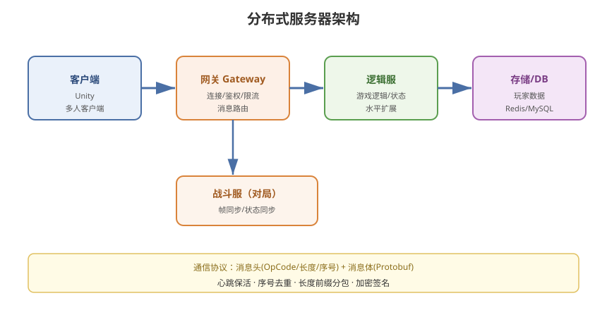

# 08 - 服务器架构与通信协议

## 学习目标
- 掌握游戏服务器的架构模式
- 理解消息编解码与序列化
- 学会设计高效的游戏通信协议

---



## 1. 服务器架构模式

### 1.1 单体架构（Monolith）
```
一个服务器进程承载所有逻辑
  - 登录、战斗、聊天、存储
  - 简单，但扩展性差

适用：小游戏、原型、中小规模
```

### 1.2 分布式架构
```
按功能拆分多个服务：
  网关（Gateway）
  登录服（Login Server）
  逻辑服（Game Server）
  战斗服（Battle Server）
  聊天服（Chat Server）
  存储/数据库

适用：大型游戏、高并发
```

### 1.3 分区分服 vs 大世界
```
分区分服：
  - 玩家分配到不同区服
  - 各服独立运行
  - 跨服需要额外机制

大世界（无缝地图）：
  - 所有玩家在统一世界
  - 服务器集群共享状态
  - 难度高（状态一致、跨服）
```

---

## 2. 服务器核心架构

### 2.1 网关层（Gateway）
```
职责：
  - 接受客户端连接
  - 验证身份（Token）
  - 限流/防攻击
  - 消息路由（转发给逻辑服）
  - 断线重连管理
```

### 2.2 逻辑层（Game Server）
```
职责：
  - 运行游戏逻辑
  - 维护世界状态
  - 广播消息
  - 处理玩家请求
```

### 2.3 存储层（Storage / DB）
```
职责：
  - 玩家数据持久化
  - 排行榜、社交
  - 日志

架构：
  MySQL / MongoDB / Redis
  缓存层（热数据）+ 落盘（冷数据）
```

### 2.4 架构图
```
客户端 ──→ 网关 ──→ 逻辑服 ──→ 存储/DB
   ↑          ↑        │
   └── 登录服 ┘        └──→ 战斗服（对局）
```

---

## 3. 消息编解码与序列化

### 3.1 消息结构设计
```
消息头（Header）+ 消息体（Body）

Header：
  - 消息 ID（OpCode）
  - 长度
  - 序号（Sequence）
  - 时间戳（可选）
  - 标志位（加密/压缩）

Body：
  - 序列化后的数据
```

### 3.2 二进制协议（效率高）
```
推荐：Protobuf / FlatBuffers
  - 体积小
  - 解析快
  - 跨语言

不推荐：JSON/XML
  - 体积大
  - 解析慢
  - 适合调试/低性能场景
```

### 3.3 Protobuf 示例
```protobuf
// 登录请求
message LoginRequest {
    string token = 1;
    string device_id = 2;
    int32 version = 3;
}

// 登录响应
message LoginResponse {
    int32 result = 1;
    PlayerInfo player = 2;
    int64 server_time = 3;
}

// 移动指令
message MoveInput {
    int32 sequence = 1;
    float x = 2;
    float y = 3;
}
```

### 3.4 消息 ID 约定
```
按模块分段：
  1001~1999 登录/账号
  2001~2999 角色/背包
  3001~3999 战斗
  4001~4999 聊天/社交
  9000+    系统/心跳
```

---

## 4. 通信协议设计要点

### 4.1 心跳机制
```
目的：
  - 检测连接是否存活
  - 保持 NAT 端口映射
  - 测量延迟

实现：
  客户端定时发心跳（如 5s）
  服务器回复
  超时判定断线
```

### 4.2 消息序号与去重
```
UDP 场景需要：
  - 序号（Sequence）
  - 接收方去重
  - 乱序重排

TCP 场景：
  天然有序（内核保证）
  只需防粘包/拆包
```

### 4.3 粘包/拆包（TCP）
```
TCP 是字节流，无消息边界
→ 需自行分包：

长度前缀法：
  [消息长度 int][消息体...]
  [消息长度 int][消息体...]

变长编码：
  首字节表示长度（0~127 直接，128 用扩展）
```

```csharp
// 长度前缀分包
public class PacketParser
{
    private MemoryStream buffer = new MemoryStream();

    public List<byte[]> Feed(byte[] data)
    {
        List<byte[]> packets = new List<byte[]>();
        buffer.Write(data, 0, data.Length);

        buffer.Position = 0;
        while (buffer.Length - buffer.Position >= 4)
        {
            // 读长度前缀
            byte[] lenBytes = new byte[4];
            buffer.Read(lenBytes, 0, 4);
            int length = BitConverter.ToInt32(lenBytes, 0);

            if (buffer.Length - buffer.Position < length)
                break;  // 数据不完整，等待下次

            byte[] body = new byte[length];
            buffer.Read(body, 0, length);
            packets.Add(body);
        }

        // 保留未消费的部分
        // ... 实际需处理剩余数据
        return packets;
    }
}
```

---

## 5. 加密与安全

### 5.1 传输层加密
```
HTTPS / WSS（TCP 场景）
DTLS（UDP 场景）
自定义加密（性能优先）
```

### 5.2 应用层安全
```
1. 消息签名（防篡改）
   HMAC-SHA256

2. 防重放（防重复）
   时间戳 + Nonce

3. 登录鉴权
   Token（短期有效）
   Session（会话管理）
```

### 5.3 游戏特有的防作弊
```
服务器权威校验（见第 6、9 章）
指令频率限制
异常行为检测
```

---

## 6. 服务器性能优化

### 6.1 线程模型
```
单线程（Game Loop）：
  - 逻辑简单、无并发问题
  - 适合帧同步/逻辑服

多线程（Actor/线程池）：
  - 并发处理
  - 需处理共享状态
  - 适合状态同步/大世界
```

### 6.2 异步 IO
```
非阻塞 IO（事件驱动）：
  - 高并发连接
  - 减少线程阻塞
  - 推荐框架：EpoII / IOCP / libuv
```

### 6.3 负载均衡
```
水平扩展：
  - 多逻辑服分片
  - 网关负载均衡
  - 按玩家/区域路由
```

---

## 7. 通信框架选型

### 7.1 C# 服务端框架
```
Kestrel / ASP.NET Core（HTTP）
.NET Socket / DotNetty
ProtoActor（Actor 模型）
```

### 7.2 游戏服务端框架
```
国外：
  Photon Server / SpatialOS
  Mirror / FishNet（Unity 客户端集成）

国内（Unity 项目常用）：
  ET 框架（服务器 + 客户端一体）
  GameFramework
  Tcp 自定义 + KCP
```

### 7.3 客户端网络层
```
Unity：
  Mirror（简单可靠）
  FishNet（现代、支持 UDP）
  Netcode for GameObjects（官方）
  自研（KCP/ENet + Protobuf）
```

---

## 8. 学习检查点

- [ ] 理解网关/逻辑服/存储的分层架构
- [ ] 掌握消息头 + 消息体的协议设计
- [ ] 会用 Protobuf 设计游戏协议
- [ ] 理解 TCP 粘包/拆包的解决
- [ ] 掌握心跳、序号、去重等机制
- [ ] 了解服务端框架和客户端网络库选型
