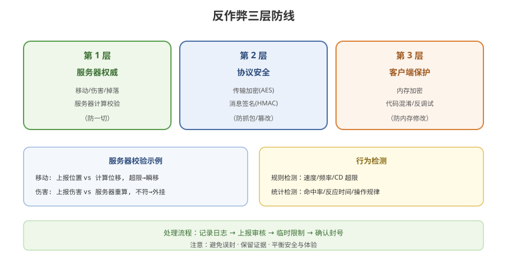

# 09 - 反作弊与防外挂

## 学习目标
- 理解游戏作弊的方式和原理
- 掌握服务器侧的反作弊手段
- 学会客户端保护与外挂检测

---



## 1. 作弊方式概述

### 1.1 作弊者想做什么
```
1. 修改游戏数据（金币、血量、无敌）
2. 获取他人信息（透视、雷达）
3. 自动操作（外挂脚本、自动瞄准）
4. 加速/减速（修改时间）
5. 伪造操作（重复技能、瞬移）
```

### 1.2 作弊的根源
```
外挂能生效 = 客户端能影响游戏结果
→ 解决思路：
  1. 服务器权威（结果服务器定）
  2. 客户端数据加密/混淆
  3. 行为检测
```

---

## 2. 服务器权威反作弊（最有效）

### 2.1 核心原则
```
一切影响游戏结果的决策由服务器做
客户端输入只是"建议"，服务器决定"是否接受"
```

### 2.2 校验点
```
1. 移动校验：
   服务器计算移动结果
   客户端上报位置 → 与服务器计算比对
   差异过大 → 判定瞬移/加速

2. 伤害校验：
   伤害值由服务器计算
   客户端上报 → 服务器重新计算
   不符 → 判定外挂

3. 物品校验：
   掉落、合成、交易全部服务器处理
   客户端请求 → 服务器验证 → 执行
```

### 2.3 服务器校验实现
```csharp
// 移动校验示例
public class MoveValidator
{
    // 服务器验证客户端上报的位置
    public bool ValidateMove(int playerId, Vector3 reportedPos, float time)
    {
        var player = GetPlayer(playerId);

        // 计算允许的最大位移（速度 × 时间）
        float maxMove = player.Speed * (time - player.LastSyncTime);
        float actualMove = Vector3.Distance(reportedPos, player.LastPosition);

        // 超出合理范围 → 判定异常
        if (actualMove > maxMove * 1.5f)  // 1.5倍容差
        {
            LogCheat(playerId, "SpeedHack", reportedPos);
            return false;  // 拒绝
        }

        // 正常更新
        player.LastPosition = reportedPos;
        player.LastSyncTime = time;
        return true;
    }
}
```

---

## 3. 反外挂的常用手段

### 3.1 服务器侧
| 手段 | 原理 |
|------|------|
| 服务器权威 | 结果服务器决定 |
| 指令校验 | 服务器验证指令合法性 |
| 频率限制 | 防止疯狂发指令 |
| 行为分析 | 检测异常行为模式 |
| 随机校验 | 不定时校验客户端状态 |

### 3.2 客户端侧
| 手段 | 原理 |
|------|------|
| 数据加密 | 内存数据加密 |
| 代码混淆 | 防止反编译 |
| 内存完整性检测 | 检测内存修改 |
| 检测调试器 | 检测调试环境 |
| 热更代码校验 | 防止修改热更代码 |

### 3.3 帧同步的反作弊
```
帧同步的问题：客户端本地计算，服务器无权威

对策：
  1. 服务器也跑确定性逻辑（权威帧同步）
     校验客户端上报结果
  2. 服务器校验输入：
     客户端输入 → 服务器合法性校验
     （移动速度、技能 CD、位置范围）
  3. 关键结果服务器确认
```

---

## 4. 数据安全与加密

### 4.1 内存加密
```
游戏数据（金币、HP）不能明文存内存
  外挂扫描内存修改数值

解决：加密存储
  - XOR / 自定义加密
  - 关键数值加"校验值"
  - 定期用服务器数据校验
```

```csharp
// 加密数值示例
public class EncryptedValue
{
    private int encryptedValue;
    private int key;
    private int checksum;

    public int Value
    {
        get
        {
            // 解密
            int value = encryptedValue ^ key;
            // 校验是否被篡改
            if (checksum != ComputeChecksum(value))
                return 0;  // 检测到篡改
            return value;
        }
        set
        {
            encryptedValue = value ^ key;
            checksum = ComputeChecksum(value);
        }
    }

    private int ComputeChecksum(int value)
    {
        return (value * 31 + key) % 1000003;
    }
}
```

### 4.2 网络协议加密
```
1. 传输加密（防抓包）：
   AES / 自定义流加密

2. 消息签名（防篡改）：
   HMAC 签名，服务器校验

3. 反重放（防重复操作）：
   时间戳 + 序号 + 服务器校验
```

---

## 5. 行为检测（智能反作弊）

### 5.1 规则检测
```
硬性规则：
  - 移动速度超限
  - 攻击频率超限
  - 技能 CD 异常
  - 位置跳跃
```

### 5.2 统计检测
```
异常统计模式：
  - 命中率异常（100% 爆头）
  - 反应时间异常（<50ms 自动反应）
  - 操作规律性（固定间隔）
  - 战果异常（全胜、多倍资源）
```

### 5.3 行为分析示例
```csharp
// 检测自动瞄准（Aimbot）
public class AimbotDetector
{
    private Queue<float> reactionTimes = new Queue<float>();

    // 每次命中上报反应时间
    public void OnHitReport(float reactionTime)
    {
        reactionTimes.Enqueue(reactionTime);
        if (reactionTimes.Count > 100) reactionTimes.Dequeue();

        // 人类最小反应约 100~150ms
        // 持续低于 50ms → 疑似自动瞄准
        if (reactionTimes.Count > 20)
        {
            float avg = reactionTimes.Average();
            if (avg < 50f)
                ReportSuspicion("AimbotDetected");
        }
    }
}
```

---

## 6. 反作弊架构设计

### 6.1 三层防线
```
第 1 层：服务器权威（防一切）
第 2 层：协议安全（防抓包/篡改）
第 3 层：客户端保护（防内存修改）
```

### 6.2 反作弊流程
```
检测到疑似作弊：
  1. 记录日志（证据）
  2. 上报后台（审核）
  3. 临时限制（观察）
  4. 确认后封号（处理）
```

### 6.3 反作弊注意事项
```
1. 不要过度误封（影响正常玩家）
2. 记录完整证据（可申诉）
3. 更新反作弊规则（外挂也在进化）
4. 平衡：安全 vs 性能 vs 体验
```

---

## 7. 反作弊的挑战与趋势

### 7.1 挑战
```
1. 客户端无法绝对信任
   所有客户端数据都可能被修改

2. 反外挂是军备竞赛
   外挂不断进化

3. 性能与安全平衡
   过度校验影响体验
```

### 7.2 趋势
```
1. 服务器权威（回归核心）
   结果全在服务器

2. AI 行为检测
   机器学习识别外挂模式

3. 云端反作弊
   云游戏（客户端无数据可改）

4. 区块链（争议）
   部分游戏用于防篡改（争议大）
```

---

## 8. 学习检查点

- [ ] 理解作弊的根源和类型
- [ ] 掌握服务器权威反作弊的核心
- [ ] 会实现移动/伤害的服务器校验
- [ ] 了解内存加密和协议加密
- [ ] 能设计行为检测规则
- [ ] 理解反作弊的架构和平衡
