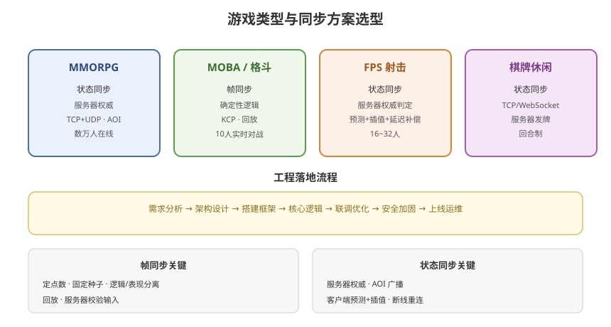

# 10 - 工程实践与案例

## 学习目标
- 掌握网络同步的工程落地流程
- 通过真实案例理解方案选型
- 学会搭建最小可运行的网络同步框架

---



## 1. 工程落地流程

### 1.1 从零到上线
```
需求分析（游戏类型 → 同步方案）
    ↓
架构设计（服务器/协议/同步方案）
    ↓
搭建框架（网络层/消息层/同步层）
    ↓
核心逻辑（确定性逻辑 或 服务器权威）
    ↓
联调优化（延迟/带宽/稳定性）
    ↓
安全加固（防作弊/加密）
    ↓
上线运维（监控/热更/回滚）
```

### 1.2 关键技术决策点
```
1. 同步方案：状态 vs 帧同步
2. 传输协议：TCP vs UDP vs KCP
3. 序列化：Protobuf vs JSON
4. 服务器架构：单体 vs 分布式
5. 权威模型：服务器权威 vs 客户端
6. 延迟处理：预测/插值/回滚
```

---

## 2. 案例一：MOBA 对战（帧同步）

### 2.1 需求
```
类型：5v5 实时对战
人数：10 人
节奏：快节奏，需低延迟
观战：需要
```

### 2.2 方案
```
同步方案：帧同步（确定性逻辑）
传输：KCP（可靠 UDP）
服务器：逻辑服转发输入 + 权威校验
序列化：Protobuf
```

### 2.3 架构
```
客户端 → 网关 → 逻辑服（转发输入）
              ↓
         广播输入给所有人
              ↓
客户端确定性执行 → 一致结果
```

### 2.4 关键技术
```
- 确定性：定点数、固定种子、确定遍历
- 帧率：固定 30 Tick/s
- 回放：记录输入重放
- 回滚：服务器校验输入，不一致回滚
- 延迟：插值 + 客户端预测
```

---

## 3. 案例二：MMORPG 大世界（状态同步）

### 3.1 需求
```
类型：大型多人在线
人数：数万人在线
世界：无缝大世界
持久化：玩家数据保存
```

### 3.2 方案
```
同步方案：状态同步（服务器权威）
传输：TCP（登录/聊天）+ UDP（位置）
服务器：分布式（网关/逻辑服/存储）
序列化：Protobuf
```

### 3.3 架构
```
客户端 → 网关 → 逻辑服（分片）
              ↓
         世界状态 + AOI
              ↓
         广播给视野内客户端
              ↓
         存储层（持久化）
```

### 3.4 关键技术
```
- AOI 视野管理（广播优化）
- 服务器权威（防作弊）
- 客户端预测 + 插值
- 分片负载均衡
- 断线重连 + 状态重同步
```

---

## 4. 案例三：FPS 射击（状态同步 + 预测）

### 4.1 需求
```
类型：第一人称射击
人数：16~32 人
节奏：极快，延迟最敏感
判定：命中判定要公平
```

### 4.2 方案
```
同步方案：状态同步（服务器权威）
传输：KCP（实时战斗）
命中判定：延迟补偿（Lag Compensation）
```

### 4.3 关键技术
```
- 服务器权威判定命中
- 客户端预测（本地立即响应）
- 延迟补偿（回放目标位置）
- 远程实体插值
- 反作弊（速度校验、命中率检测）
```

---

## 5. 案例四：休闲棋牌（状态同步 + TCP）

### 5.1 需求
```
类型：棋牌/休闲
人数：2~4 人/桌
节奏：慢（回合制）
安全：对公平性要求极高
```

### 5.2 方案
```
同步方案：状态同步（服务器权威）
传输：TCP / WebSocket
序列化：Protobuf
```

### 5.3 关键技术
```
- 服务器发牌（防作弊核心）
- 服务器判定胜负
- 重连（断线继续游戏）
- 数据加密（防看牌）
```

---

## 6. 最小可运行框架

### 6.1 网络层（客户端）
```csharp
// 简单网络管理器（KCP 或 Socket 封装）
public class NetworkManager : MonoBehaviour
{
    public static NetworkManager Instance { get; private set; }

    private Connection connection;
    private int sequence;

    void Awake()
    {
        Instance = this;
        connection = new Connection();  // 自研 KCP / Socket
    }

    public void Send(object message, int opCode)
    {
        byte[] data = Serialize(message);
        connection.Send(opCode, data, sequence++);
    }

    // 收到消息
    public void OnMessageReceived(int opCode, byte[] data)
    {
        var handler = MessageDispatcher.GetHandler(opCode);
        handler?.Handle(data);
    }
}
```

### 6.2 消息分发
```csharp
public static class MessageDispatcher
{
    private static Dictionary<int, IMessageHandler> handlers = new();

    public static void Register(int opCode, IMessageHandler handler)
    {
        handlers[opCode] = handler;
    }

    public static IMessageHandler GetHandler(int opCode)
    {
        return handlers.TryGetValue(opCode, out var h) ? h : null;
    }
}

public interface IMessageHandler
{
    void Handle(byte[] data);
}
```

### 6.3 同步层（帧同步示例）
```csharp
public class FrameSyncManager : MonoBehaviour
{
    public const int LOGIC_FPS = 30;

    private Queue<FrameInput> inputQueue = new Queue<FrameInput>();
    private int currentFrame;

    void Update()
    {
        // 采集输入
        CollectInput();

        // 驱动逻辑帧
        float accumulator = 0;
        accumulator += Time.deltaTime;
        while (accumulator >= 1f / LOGIC_FPS)
        {
            TickFrame();
            accumulator -= 1f / LOGIC_FPS;
        }
    }

    void TickFrame()
    {
        // 等所有玩家输入齐全
        if (!HasAllInputs(currentFrame)) return;

        var inputs = GetInputsForFrame(currentFrame);

        // 执行确定性逻辑
        GameLogicSimulation.Execute(inputs);

        // 渲染表现
        RenderFrame();

        currentFrame++;
    }
}
```

---

## 7. 性能与稳定性优化

### 7.1 性能优化清单
```
1. 消息合并（减少包数）
2. 增量同步（减少数据量）
3. 压缩（定点数/量化）
4. 插值缓冲（吸收抖动）
5. 心跳保活（稳定连接）
```

### 7.2 稳定性优化
```
1. 断线重连（状态重同步）
2. 重连后快速恢复
3. 服务器容灾（多机备份）
4. 数据持久化（防止丢失）
```

### 7.3 监控指标
```
- 在线人数 / 延迟分布
- 丢包率 / 重传率
- 服务器负载 / 带宽
- 消息成功率 / 错误率
- 外挂检测率
```

---

## 8. 学习检查点

- [ ] 能根据游戏类型选择同步方案
- [ ] 掌握网络同步的工程落地流程
- [ ] 理解 MOBA/MMO/FPS/棋牌的方案差异
- [ ] 能搭建最小可运行的网络同步框架
- [ ] 掌握性能与稳定性优化要点
