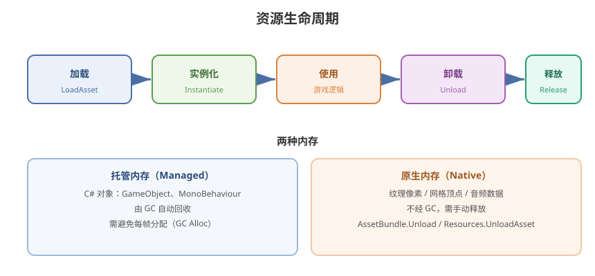

# 01 - Unity 资源系统概述

## 学习目标
- 理解 Unity 资源的生命周期和引用关系
- 掌握 Resources 目录的使用限制
- 建立完整的资源管理知识框架

---



## 1. Unity 中的资源类型

### 1.1 内部资源
- **Texture2D / Texture2DArray / Cubemap**：纹理
- **Mesh**：网格模型
- **Material**：材质
- **Shader**：着色器
- **AnimationClip**：动画片段
- **AudioClip**：音频
- **Font**：字体

### 1.2 复合资源
- **Prefab**：预制体（引用多个其他资源）
- **Scene**：场景文件
- **ScriptableObject**：数据容器

### 1.3 Streaming 资源
- **AssetBundle**：打包的独立资源包
- **Addressables**：基于 AssetBundle 的寻址系统
- **StreamingAssets**：原始文件目录

---

## 2. 资源生命周期

```
[加载] → [实例化] → [使用] → [卸载] → [释放内存]
```

### 2.1 加载方式对比
| 方式 | 加载速度 | 内存占用 | 灵活性 | 适用场景 |
|------|----------|----------|--------|----------|
| 场景引用 | 构建时打包进场景 | 随场景加载 | 低 | 常驻场景资源 |
| Resources | 即时的同步/异步 | 打包进包体 | 中 | 小型项目、原型 |
| AssetBundle | 异步加载 | 按需加载和卸载 | 高 | 大中型项目 |
| Addressables | 异步加载 | 引用计数管理 | 很高 | 现代推荐方案 |

### 2.2 资源引用关系
```
Scene → Prefab → Material → Texture
    → Prefab → Mesh
    → ScriptableObject → AudioClip
```

---

## 3. Resources 目录

### 3.1 工作原理
- `Assets/Resources/` 下的所有资源会被无差别打包进 APK/IPA
- 可通过 `Resources.Load()` 同步或异步加载
- **无论是否被使用，都会增大包体**

### 3.2 基本 API
```csharp
// 同步加载
GameObject prefab = Resources.Load<GameObject>("Prefabs/Player");
Texture2D tex = Resources.Load<Texture2D>("Textures/Icon");

// 加载所有同类型资源
Texture2D[] allTex = Resources.LoadAll<Texture2D>("Textures");

// 异步加载
ResourceRequest request = Resources.LoadAsync<GameObject>("Prefabs/Player");
request.completed += (op) =>
{
    GameObject obj = (op as ResourceRequest).asset as GameObject;
    Instantiate(obj);
};
```

### 3.3 Resources 的缺点
- 无法热更新（资源在包体内）
- 所有资源都打包，增大包体
- 资源卸载只能通过 `Resources.UnloadUnusedAssets()`
- 不适合商业化项目
- 启动时间随 Resources 内资源数量线性增长

### 3.4 何时使用 Resources
- 必须驻留在包体内的默认资源
- 原型开发阶段快速测试
- 极小的配置性 ScriptableObject
- **大型项目应尽量避免或仅存放少量必要资源**

---

## 4. StreamingAssets

### 4.1 特点
- 原封不动复制到目标平台的可读目录
- 不会被 Unity 序列化/压缩
- 可使用 `System.IO` 直接读取
- 路径因平台而异

### 4.2 路径获取
```csharp
// Android: jar:file:// + APK 内部路径
// iOS: Application.dataPath + "/Raw"
// 统一使用
string path = Application.streamingAssetsPath + "/config.json";
```

### 4.3 适用场景
- 初始 AssetBundle 存放
- 配置文件
- 视频文件等大文件

---

## 5. Asset 与 Object 的区别

### 5.1 关键概念
| 概念 | 说明 |
|------|------|
| **Asset** | 磁盘上的资源文件，如 `.png`、`.fbx` |
| **UnityEngine.Object** | 内存中的运行时实例 |
| **InstanceID** | 每个 Object 的唯一标识 |
| **GUID** | 每个 Asset 在 .meta 文件中的唯一标识 |
| **FileID** | Asset 内部子资源的标识 |

### 5.2 资源引用
```csharp
// 获取资源路径
string path = AssetDatabase.GetAssetPath(texture);
string guid = AssetDatabase.AssetPathToGUID(path);
```

---

## 6. 资源管理策略对比

```
方案一：Resources
  ├─ 优点：使用简单
  └─ 缺点：无法热更，包体大

方案二：AssetBundle + 自定义管理
  ├─ 优点：完全可控
  └─ 缺点：需自行管理依赖、引用计数、加载卸载

方案三：Addressables (推荐)
  ├─ 优点：引用计数自动管理、可视化分组、远程加载
  └─ 缺点：Unity 封装层，底层问题排查困难

方案四：第三方方案
  ├─ YooAsset (国内常用)
  ├─ XAsset
  └─ ET 框架内置资源系统
```

---

## 7. 内存类型

### 7.1 托管内存 vs 原生内存
```
托管内存:
  - C# 对象（GameObject, MonoBehaviour, Texture2D 的 C# 包装层）
  - 由 GC 管理

原生内存:
  - 纹理像素数据、网格顶点数据、音频数据
  - 不经过 GC
  - 通过 AssetBundle.Unload() / Resources.UnloadAsset() 释放
```

### 7.2 常见内存问题
- **重复资源**：同一个纹理被多个 AssetBundle 各自打包
- **资源泄漏**：加载后不卸载，引用丢失但内存未释放
- **峰值过高**：一次性加载大量资源导致 OOM

---

## 8. 学习检查点

- [ ] 能区分 Asset 和 Object 的概念
- [ ] 理解 Resources 目录的限制和适用场景
- [ ] 知道主流资源管理方案及其优劣
- [ ] 理解托管内存和原生内存的区别
