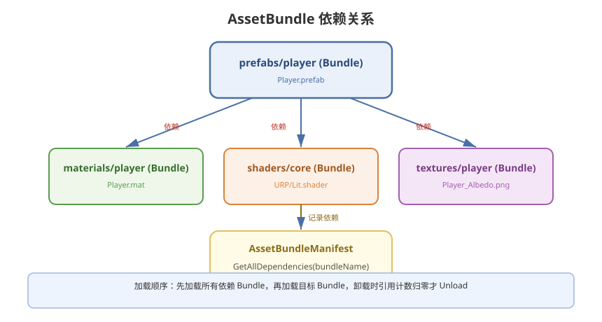

# 02 - AssetBundle 详解

## 学习目标
- 掌握 AssetBundle 的打包、加载、卸载全流程
- 理解依赖关系和引用计数管理
- 能独立搭建简易资源管理系统

---



## 1. AssetBundle 概述

AssetBundle 是 Unity 将一组资源打包成独立文件的技术方案，支持按需加载和远程更新。

### 1.1 文件结构
```
单个 AssetBundle:
  ├─ 序列化文件 (资源数据)
  ├─ .manifest 文件 (依赖信息)
  └─ .hash 文件 (版本校验)
```

### 1.2 核心流程
```
[标记资源] → [BuildPipeline 打包] → [部署到服务器] → 
[客户端下载] → [加载 AssetBundle] → [提取资源] → [卸载]
```

---

## 2. 打包 AssetBundle

### 2.1 设置 AssetBundle 名称
```csharp
// 方式1：Inspector 面板底部设置
// Assets → 选中资源/文件夹 → 底部 AssetBundle 栏

// 方式2：代码批量设置
AssetImporter importer = AssetImporter.GetAtPath("Assets/Prefabs/Player.prefab");
importer.assetBundleName = "character/player";
importer.assetBundleVariant = "ab";
```

### 2.2 构建 API
```csharp
using UnityEditor;
using System.IO;

public class AssetBundleBuilder
{
    [MenuItem("Tools/Build AssetBundles")]
    static void BuildAllAssetBundles()
    {
        string outputPath = "AssetBundles/" + EditorUserBuildSettings.activeBuildTarget;
        if (!Directory.Exists(outputPath))
            Directory.CreateDirectory(outputPath);

        BuildPipeline.BuildAssetBundles(outputPath,
            BuildAssetBundleOptions.ChunkBasedCompression,    // LZ4 压缩
            EditorUserBuildSettings.activeBuildTarget);
    }
}
```

### 2.3 压缩方式对比
| 方式 | 压缩率 | 加载速度 | 内存占用 | 推荐 |
|------|--------|----------|----------|------|
| 无压缩 | 1:1 | 最快 | 高 | 高速设备 |
| LZMA | 最高 | 解压慢，需全部解压 | 解压后高 | 不推荐 |
| **LZ4** | 中等 | 按需解压，快速 | 低 | **推荐** |

```csharp
// LZ4 按块压缩 - 推荐
BuildAssetBundleOptions.ChunkBasedCompression
```

---

## 3. 加载 AssetBundle

### 3.1 五种加载方式
```csharp
// 1. 从本地文件加载 (同步)
AssetBundle ab = AssetBundle.LoadFromFile(path);

// 2. 从本地文件加载 (异步)
AssetBundleCreateRequest request = AssetBundle.LoadFromFileAsync(path);
yield return request;
AssetBundle ab = request.assetBundle;

// 3. 从内存字节加载
AssetBundle ab = AssetBundle.LoadFromMemory(bytes);

// 4. 从流加载
AssetBundle ab = AssetBundle.LoadFromStream(stream);

// 5. UnityWebRequest 从网络加载
using (UnityWebRequest uwr = UnityWebRequestAssetBundle.GetAssetBundle(url))
{
    yield return uwr.SendWebRequest();
    AssetBundle ab = DownloadHandlerAssetBundle.GetContent(uwr);
}
```

### 3.2 性能对比
| 方式 | CRC 校验 | 内存分配 | 推荐度 |
|------|----------|----------|--------|
| `LoadFromFile` | 支持 | 最少 | **优先使用** |
| `LoadFromFileAsync` | 支持 | 最少 | 优先使用 |
| `LoadFromMemory` | 不支持 | 高（需加载全部字节到内存） | 按需 |
| `UnityWebRequest` | 缓存支持 | 中等 | 远程下载用 |

---

## 4. 从 AssetBundle 提取资源

### 4.1 API
```csharp
// 加载单个资源（注意：必须是泛型 T，不能是基类 Object）
GameObject prefab = ab.LoadAsset<GameObject>("Player");

// 加载子资源（如 FBX 内的子 Mesh）
Sprite sprite = ab.LoadAsset<Sprite>("Atlas/Icon_Gold");

// 加载所有资源
Object[] allAssets = ab.LoadAllAssets();

// 异步加载
AssetBundleRequest loadRequest = ab.LoadAssetAsync<GameObject>("Player");
loadRequest.completed += (op) =>
{
    GameObject prefab = ((AssetBundleRequest)op).asset as GameObject;
};
```

### 4.2 注意点
```csharp
// 错误：泛型参数必须与资源实际类型匹配
Texture2D tex = ab.LoadAsset<UnityEngine.Object>("Icon") as Texture2D;  // 浪费

// 正确
Texture2D tex = ab.LoadAsset<Texture2D>("Icon");
```

---

## 5. 依赖管理

### 5.1 手动管理依赖
```csharp
// 加载依赖的 AssetBundle
AssetBundle shaderBundle = AssetBundle.LoadFromFile("Bundles/shader");
AssetBundle matBundle = AssetBundle.LoadFromFile("Bundles/material");

Material mat = matBundle.LoadAsset<Material>("PlayerMat");
// mat 内部引用了 shaderBundle 中的 Shader
```

### 5.2 使用 manifest 自动管理
```csharp
AssetBundle mainfestAB = AssetBundle.LoadFromFile("Bundles/AssetBundles");
AssetBundleManifest manifest = mainfestAB.LoadAsset<AssetBundleManifest>("AssetBundleManifest");

string[] deps = manifest.GetAllDependencies("prefabs/player");
foreach (string dep in deps)
{
    AssetBundle.LoadFromFile("Bundles/" + dep);
}
```

### 5.3 加载架构推荐
```csharp
public class AssetBundleManager : MonoBehaviour
{
    private Dictionary<string, AssetBundle> loadedBundles = new Dictionary<string, AssetBundle>();
    private Dictionary<string, int> referenceCount = new Dictionary<string, int>();
    private AssetBundleManifest manifest;

    public AssetBundle LoadBundle(string bundleName)
    {
        // 1. 加载所有依赖
        string[] deps = manifest.GetAllDependencies(bundleName);
        foreach (string dep in deps)
        {
            LoadBundleInternal(dep);
        }

        // 2. 加载目标 Bundle
        return LoadBundleInternal(bundleName);
    }

    private AssetBundle LoadBundleInternal(string bundleName)
    {
        if (!loadedBundles.ContainsKey(bundleName))
        {
            AssetBundle ab = AssetBundle.LoadFromFile(GetBundlePath(bundleName));
            loadedBundles[bundleName] = ab;
            referenceCount[bundleName] = 0;
        }
        referenceCount[bundleName]++;
        return loadedBundles[bundleName];
    }

    public void UnloadBundle(string bundleName, bool unloadAllLoadedObjects)
    {
        if (!loadedBundles.ContainsKey(bundleName)) return;

        referenceCount[bundleName]--;
        if (referenceCount[bundleName] <= 0)
        {
            loadedBundles[bundleName].Unload(unloadAllLoadedObjects);
            loadedBundles.Remove(bundleName);
            referenceCount.Remove(bundleName);
        }
    }
}
```

---

## 6. 卸载 AssetBundle

### 6.1 Unload 参数
```csharp
// unloadAllLoadedObjects = false
// - 只释放 AssetBundle 文件映射
// - 已提取的资源实例保留
// - 后续无法从该 Bundle 提取新资源
// - 必须在 LoadAsset 完成后调用
assetBundle.Unload(false);

// unloadAllLoadedObjects = true
// - 释放 AssetBundle 本身 + 所有从中提取的资源
// - 已有引用会变成 Missing Reference
assetBundle.Unload(true);
```

### 6.2 安全卸载流程
```csharp
// 1. 加载 Bundle
AssetBundle ab = AssetBundle.LoadFromFile(path);

// 2. 提取资源（保持引用）
GameObject prefab = ab.LoadAsset<GameObject>("Player");
Instantiate(prefab);

// 3. 安全卸载（释放文件句柄，保留资源实例）
ab.Unload(false);

// 4. 最终清理（场景切换时）
Resources.UnloadUnusedAssets();
System.GC.Collect();
```

---

## 7. CRC 校验与完整性

```csharp
// 构建时获取 CRC
uint crc;
BuildPipeline.GetCRCForAssetBundle(bundlePath, out crc);

// 加载时校验
AssetBundle ab = AssetBundle.LoadFromFile(path, crc);  // 校验失败返回 null
```

---

## 8. 目录结构推荐

```
StreamingAssets/
├── AssetBundles/               ← 随包首包资源
│   ├── AssetBundles            ← 总 Manifest Bundle
│   ├── shaders/              
│   ├── scenes/
│   └── prefabs/
│       ├── character/
│       │   ├── player.ab
│       │   └── player.ab.manifest
└── first_source.bin            ← 首包标识

PersistentDataPath/              ← 可写目录，热更下载存放
└── Download/
    └── AssetBundles/           ← 增量/更新的 Bundle
```

---

## 9. 学习检查点

- [ ] 能独立编写 AssetBundle 打包脚本
- [ ] 理解 LZ4 压缩的优势和使用场景
- [ ] 能正确管理 AssetBundle 依赖关系
- [ ] 能区分 Unload(false) 和 Unload(true) 的应用场景
