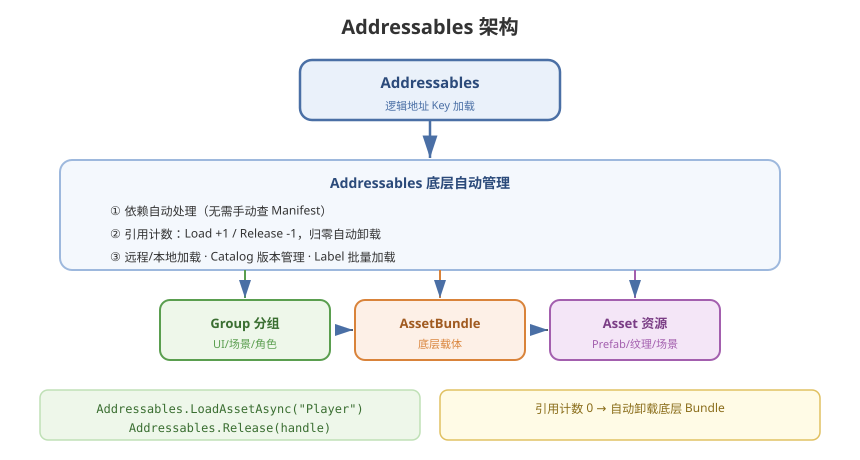

# 03 - Addressables 系统

## 学习目标
- 掌握 Addressables 的核心概念和 API
- 能独立配置和使用 Addressables 资源系统
- 理解 Addressables 的底层机制

---



## 1. Addressables 概述

Addressable Assets 是 Unity 官方提供的资源管理系统，基于 AssetBundle 但提供了更高级的抽象层。

### 1.1 核心优势
- **地址加载**：通过字符串 Key 而非文件路径加载
- **自动依赖管理**：自动处理 Bundle 依赖
- **引用计数**：内置引用追踪和自动卸载
- **远程加载**：内置 CDN / HTTP 支持
- **可视化分组**：Group 编辑器直观管理

### 1.2 对比传统 AssetBundle
| 维度 | AssetBundle | Addressables |
|------|-------------|--------------|
| 加载方式 | 文件路径 / 文件名 | 逻辑地址 (Key) |
| 依赖管理 | 手动查 manifest | **自动** |
| 内存管理 | 手动引用计数 | **自动引用计数** |
| 远程加载 | 自行实现 | **内置支持** |
| 版本管理 | 自行实现 | **哈希/目录版本** |
| 学习曲线 | 低 | 中 |

---

## 2. 安装与配置

### 2.1 安装
```
Window → Package Manager → 搜索 "Addressables" → Install
```

### 2.2 基本配置
```csharp
// 初始化
Addressables.InitializeAsync();

// 通过 AddressablesAssetSettings 配置
// - Profile: 定义资源路径模板 (Local/Remote)
// - Group: 逻辑分组
// - BuildPath / LoadPath: 构建和加载路径
```

### 2.3 Profile 变量
```
[UnityEditor.EditorUserBuildSettings.activeBuildTarget]

// 本地
LocalBuildPath:    "Library/com.unity.addressables/aa/[BuildTarget]"
LocalLoadPath:     "{Library/com.unity.addressables/aa/[BuildTarget]}"

// 远程
RemoteBuildPath:   "ServerData/[BuildTarget]"
RemoteLoadPath:    "http://localhost:8000/[BuildTarget]"
```

---

## 3. 资源标记与分组

### 3.1 创建 Addressable 资源
```
方式1: 选中资源 → Inspector → 勾选 "Addressable"
方式2: 拖拽资源到 Addressables Groups 窗口
方式3: 代码标记
```

```csharp
// 代码标记为 Addressable
string guid = AssetDatabase.AssetPathToGUID("Assets/Textures/MyTex.png");
AddressableAssetSettings settings = AddressableAssetSettingsDefaultObject.Settings;
settings.CreateOrMoveEntry(guid, settings.DefaultGroup);
```

### 3.2 Group 分组策略
| Group | 内容 | 打包策略 |
|-------|------|----------|
| `AlwaysIncluded` | 引擎必需的 Shader、字体 | 随包 |
| `UI_Common` | 通用 UI 图集 | 独立 Bundle |
| `Scene_Main` | 主场景资源 | 独立 Bundle |
| `Character_Player` | 玩家角色资源 | 打包在一起 |
| `Character_NPC` | NPC 资源 | 按需分包 |
| `Sounds` | 音频 | 统一打包 |
| `DLC` | 扩展内容 | 远程下载 |

### 3.3 Label 标签
```csharp
// 加载时使用 Label 批量加载
Addressables.LoadAssetsAsync<GameObject>("Enemy", null);
Addressables.LoadAssetsAsync<Texture2D>("UI_Icon", null);
```

---

## 4. 加载 API

### 4.1 基本加载
```csharp
// 同步（不推荐，可能阻塞）
GameObject prefab = Addressables.LoadAssetAsync<GameObject>("Player").WaitForCompletion();

// 异步 - 回调
Addressables.LoadAssetAsync<GameObject>("Player").Completed += handle =>
{
    if (handle.Status == AsyncOperationStatus.Succeeded)
    {
        GameObject prefab = handle.Result;
        Instantiate(prefab);
    }
};

// 异步 - 协程
AsyncOperationHandle<GameObject> handle = Addressables.LoadAssetAsync<GameObject>("Player");
yield return handle;
GameObject prefab = handle.Result;

// 异步 - async/await (推荐)
async void LoadPlayerAsync()
{
    AsyncOperationHandle<GameObject> handle = Addressables.LoadAssetAsync<GameObject>("Player");
    await handle.Task;
    if (handle.Status == AsyncOperationStatus.Succeeded)
    {
        Instantiate(handle.Result);
    }
}
```

### 4.2 实例化
```csharp
// 直接实例化（更方便）
Addressables.InstantiateAsync("Player").Completed += handle =>
{
    GameObject player = handle.Result;
    // 释放时自动调用 Addressables.ReleaseInstance
};
```

### 4.3 场景加载
```csharp
AsyncOperationHandle<SceneInstance> sceneHandle = Addressables.LoadSceneAsync("Level01", LoadSceneMode.Single);
await sceneHandle.Task;

// 卸载场景
Addressables.UnloadSceneAsync(sceneHandle);
```

### 4.4 批量加载
```csharp
// 按 Key 列表加载
List<string> keys = new List<string> { "Enemy_Goblin", "Enemy_Orc", "Enemy_Dragon" };
AsyncOperationHandle<IList<GameObject>> handle = Addressables.LoadAssetsAsync<GameObject>(
    keys,
    obj => { /* 每个加载完的回调 */ },
    Addressables.MergeMode.Union
);
```

---

## 5. 释放与内存管理

### 5.1 释放方式
```csharp
// 释放加载的资源
Addressables.Release(handle);

// 释放实例化的 GameObject
Addressables.ReleaseInstance(gameObject);

// 根据结果对象释放（需记录 handle 映射）
Addressables.Release(prefabInstance);
```

### 5.2 引用计数自动管理
```csharp
// Addressables 内部维护引用计数
// 每次 Load 引用 +1，每次 Release 引用 -1
// 引用归零时自动卸载 AssetBundle

// 示例场景
AsyncOperationHandle<GameObject> handle1 = Addressables.LoadAssetAsync<GameObject>("Player");
AsyncOperationHandle<GameObject> handle2 = Addressables.LoadAssetAsync<GameObject>("Player");
// Player 的引用计数 = 2

Addressables.Release(handle1);  // 引用计数 = 1
Addressables.Release(handle2);  // 引用计数 = 0 → 卸载 Bundle
```

### 5.3 最佳实践
```csharp
public class AddressableController : MonoBehaviour
{
    private AsyncOperationHandle<GameObject> handle;

    async void Start()
    {
        handle = Addressables.LoadAssetAsync<GameObject>("Enemy");
        await handle.Task;
        if (handle.Status == AsyncOperationStatus.Succeeded)
        {
            Instantiate(handle.Result);
        }
    }

    void OnDestroy()
    {
        // 必须释放！
        Addressables.Release(handle);
    }
}
```

---

## 6. 远程资源管理

### 6.1 远端路径配置
```csharp
// AddressableAssetSettings → Build & Load Paths
// RemoteLoadPath: "http://cdn.example.com/game/{version}"
```

### 6.2 下载流程
```csharp
// 检查下载大小
AsyncOperationHandle<long> getSizeHandle = Addressables.GetDownloadSizeAsync("DLC");
long downloadSize = getSizeHandle.Result;

if (downloadSize > 0)
{
    // 下载
    AsyncOperationHandle downloadHandle = Addressables.DownloadDependenciesAsync("DLC", true);
    downloadHandle.Completed += op =>
    {
        Debug.Log("下载完成！");
    };

    // 下载进度
    while (!downloadHandle.IsDone)
    {
        float progress = downloadHandle.PercentComplete;
        yield return null;
    }
}
```

### 6.3 目录版本管理
```
// 服务器目录结构
ServerData/
└── StandaloneWindows64/
    ├── catalog_2024.01.01.0.hash
    ├── catalog_2024.01.01.0.json
    └── Bundles/
        ├── bundle_xxx.bundle
        └── ...
```

---

## 7. 常见问题与解决

### 7.1 循环引用
```
问题: Prefab A 引用 Material B，Material B 又引用了 Texture C
      → Addressables 自动处理依赖，无需手动干预
```

### 7.2 重复打包
```
解决: 使用 Analyze → "Check Duplicate Bundle Dependencies"
      → 将共享资源移到单独的 Group
```

### 7.3 加载性能
```csharp
// 首包预加载
Addressables.DownloadDependenciesAsync("CoreGroup");

// 预热常用资源
Addressables.LoadAssetAsync<GameObject>("Player");
```

---

## 8. 学习检查点

- [ ] 能独立配置 Addressables 的 Profile 和 Group
- [ ] 掌握 async/await 和协程两种加载方式
- [ ] 理解引用计数机制和正确释放时机
- [ ] 能实现远程资源下载和版本管理

---

## 9. 深入教程

本章是资源管理专题里的 **Addressables 速览**，用来选型和对齐概念。从零操作、Catalog 热更、Content Update、与 HybridCLR 协同等，见独立专题：

- [01 - 从零接入与 Play Mode](/Addressables/01-从零接入与PlayMode)
- [08 - 资源热更常用方法](/Addressables/08-资源热更常用方法)
- [11 - 工程实践与排错](/Addressables/11-工程实践与排错)
