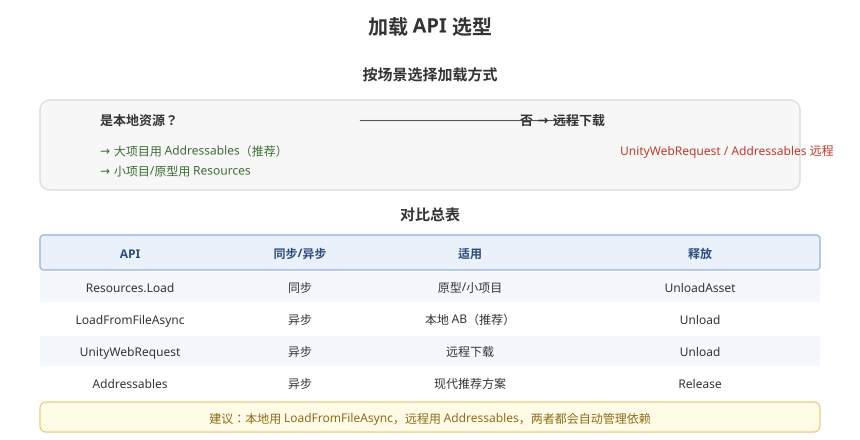

# 04 - 资源加载与卸载

## 学习目标
- 掌握所有资源加载 API 的优劣和使用场景
- 建立完整的资源加载-卸载生命周期管理
- 学会设计资源池和缓存系统

---



## 1. 加载 API 全景图

### 1.1 加载方式对比总表
| API | 同步/异步 | 挂载点 | 释放方式 | 适用场景 |
|-----|-----------|--------|----------|----------|
| `Resources.Load` | 同步 | Resources 目录 | `UnloadAsset` | 原型、小项目 |
| `Resources.LoadAsync` | 异步 | Resources 目录 | `UnloadAsset` | 原型 |
| `AssetBundle.LoadFromFile` | 同步 | 文件系统 | `Unload` | 本地 Bundle |
| `AssetBundle.LoadFromFileAsync` | 异步 | 文件系统 | `Unload` | **推荐（本地）** |
| `UnityWebRequest` | 异步 | 网络 | `Unload` | 远程下载 |
| `Addressables` | 异步 | 自动管理 | `Release` | **推荐** |

---

## 2. 异步加载模式

### 2.1 协程模式
```csharp
IEnumerator LoadAssetCoroutine(string bundlePath, string assetName)
{
    AssetBundleCreateRequest bundleRequest = AssetBundle.LoadFromFileAsync(bundlePath);
    yield return bundleRequest;

    AssetBundle ab = bundleRequest.assetBundle;
    AssetBundleRequest assetRequest = ab.LoadAssetAsync<GameObject>(assetName);
    yield return assetRequest;

    GameObject prefab = assetRequest.asset as GameObject;
    Instantiate(prefab);

    ab.Unload(false);
}
```

### 2.2 async/await 模式（推荐）
```csharp
async Task<GameObject> LoadAssetAsync(string bundlePath, string assetName)
{
    AssetBundleCreateRequest bundleRequest = AssetBundle.LoadFromFileAsync(bundlePath);
    await bundleRequest;

    AssetBundle ab = bundleRequest.assetBundle;
    AssetBundleRequest assetRequest = ab.LoadAssetAsync<GameObject>(assetName);
    await assetRequest;

    GameObject prefab = assetRequest.asset as GameObject;
    ab.Unload(false);
    return prefab;
}
```

### 2.3 加载队列模式
```csharp
public class LoadQueue
{
    private Queue<Func<Task>> queue = new Queue<Func<Task>>();
    private bool isLoading = false;

    public void Enqueue(Func<Task> task)
    {
        queue.Enqueue(task);
        if (!isLoading) ProcessQueue();
    }

    private async void ProcessQueue()
    {
        isLoading = true;
        while (queue.Count > 0)
        {
            await queue.Dequeue()();
        }
        isLoading = false;
    }
}
```

### 2.4 优先级加载
```csharp
public enum LoadPriority
{
    Immediate = 0,  // 立即加载（阻塞 UI）
    High = 1,       // 高优先级（当前帧需要的）
    Normal = 2,     // 普通
    Background = 3  // 后台预加载
}
```

---

## 3. 资源生命周期管理

### 3.1 完整生命周期
```csharp
public class ResourceLifecycle : IDisposable
{
    private AssetBundle assetBundle;
    private UnityEngine.Object loadedAsset;
    private int instanceCount;

    // 加载
    public async Task LoadAsync(string bundlePath, string assetName)
    {
        var request = AssetBundle.LoadFromFileAsync(bundlePath);
        await request;
        assetBundle = request.assetBundle;

        var assetRequest = assetBundle.LoadAssetAsync<GameObject>(assetName);
        await assetRequest;
        loadedAsset = assetRequest.asset;
    }

    // 实例化（引用计数 +1）
    public GameObject Instantiate()
    {
        if (loadedAsset == null) return null;
        instanceCount++;
        return GameObject.Instantiate(loadedAsset) as GameObject;
    }

    // 销毁实例（引用计数 -1）
    public void DestroyInstance(GameObject instance)
    {
        GameObject.Destroy(instance);
        instanceCount--;
    }

    // 卸载（实例数为 0 时）
    public void Unload()
    {
        if (instanceCount > 0) return;
        if (assetBundle != null)
        {
            assetBundle.Unload(true);
            assetBundle = null;
        }
        loadedAsset = null;
    }

    public void Dispose()
    {
        Unload();
    }
}
```

---

## 4. 资源缓存系统设计

### 4.1 LRU 缓存（Least Recently Used）
```csharp
public class LRUCache<TKey, TValue>
{
    private readonly int capacity;
    private readonly Dictionary<TKey, LinkedListNode<CacheItem>> cache;
    private readonly LinkedList<CacheItem> lruList;

    private class CacheItem
    {
        public TKey Key;
        public TValue Value;
    }

    public LRUCache(int capacity)
    {
        this.capacity = capacity;
        cache = new Dictionary<TKey, LinkedListNode<CacheItem>>(capacity);
        lruList = new LinkedList<CacheItem>();
    }

    public bool TryGet(TKey key, out TValue value)
    {
        if (cache.TryGetValue(key, out var node))
        {
            lruList.Remove(node);
            lruList.AddFirst(node);  // 移到头部
            value = node.Value.Value;
            return true;
        }
        value = default;
        return false;
    }

    public void Put(TKey key, TValue value)
    {
        if (cache.TryGetValue(key, out var node))
        {
            node.Value.Value = value;
            lruList.Remove(node);
            lruList.AddFirst(node);
            return;
        }

        if (cache.Count >= capacity)
        {
            // 移除最久未使用
            var last = lruList.Last;
            cache.Remove(last.Value.Key);
            lruList.RemoveLast();
        }

        var newItem = new CacheItem { Key = key, Value = value };
        var newNode = new LinkedListNode<CacheItem>(newItem);
        cache[key] = newNode;
        lruList.AddFirst(newNode);
    }

    public void Clear()
    {
        cache.Clear();
        lruList.Clear();
    }
}
```

### 4.2 资源缓存集成
```csharp
public class AssetCache
{
    private LRUCache<string, UnityEngine.Object> assetLRU;
    private Dictionary<string, AssetBundle> bundleCache;

    public AssetCache(int maxAssets = 100)
    {
        assetLRU = new LRUCache<string, UnityEngine.Object>(maxAssets);
        bundleCache = new Dictionary<string, AssetBundle>();
    }

    public GameObject GetAsset(string key)
    {
        if (assetLRU.TryGet(key, out var obj))
            return obj as GameObject;
        return null;
    }

    public void CacheAsset(string key, UnityEngine.Object asset)
    {
        assetLRU.Put(key, asset);
    }
}
```

---

## 5. GameObject 池 (Object Pool)

### 5.1 基础实现
```csharp
public class ObjectPool<T> where T : MonoBehaviour
{
    private Queue<T> pool = new Queue<T>();
    private T prefab;
    private Transform parent;

    public ObjectPool(T prefab, int preloadCount, Transform parent = null)
    {
        this.prefab = prefab;
        this.parent = parent;
        for (int i = 0; i < preloadCount; i++)
        {
            pool.Enqueue(CreateInstance());
        }
    }

    private T CreateInstance()
    {
        T obj = GameObject.Instantiate(prefab, parent);
        obj.gameObject.SetActive(false);
        return obj;
    }

    public T Get()
    {
        T obj = pool.Count > 0 ? pool.Dequeue() : CreateInstance();
        obj.gameObject.SetActive(true);
        return obj;
    }

    public void Return(T obj)
    {
        obj.gameObject.SetActive(false);
        pool.Enqueue(obj);
    }
}

// 使用示例
ObjectPool<Bullet> bulletPool = new ObjectPool<Bullet>(bulletPrefab, 30);
Bullet bullet = bulletPool.Get();
bulletPool.Return(bullet);
```

---

## 6. 卸载策略

### 6.1 时机选择
| 时机 | 方法 | 开销 |
|------|------|------|
| 场景切换 | `Resources.UnloadUnusedAssets()` | 高（遍历所有对象） |
| 资源不再使用 | `AssetBundle.Unload(false)` | 低 |
| 内存警告 | 主动释放缓存资源 | 中 |
| 切后台 | 释放非必要资源 | 视情况 |

### 6.2 分帧卸载
```csharp
IEnumerator UnloadBundlesOverTime(List<AssetBundle> bundles, int perFrame = 3)
{
    int count = 0;
    foreach (var bundle in bundles)
    {
        bundle.Unload(false);
        count++;
        if (count >= perFrame)
        {
            count = 0;
            yield return null;  // 分散到多帧
        }
    }
    Resources.UnloadUnusedAssets();
}
```

---

## 7. 加载性能监控

```csharp
public class LoadProfiler
{
    public struct LoadRecord
    {
        public string assetName;
        public float loadTimeMs;
        public long memoryBytes;
    }

    public static async Task<LoadRecord> ProfileLoad(Func<Task> loadFunc, string assetName)
    {
        var sw = Stopwatch.StartNew();
        long memBefore = GC.GetTotalMemory(false);

        await loadFunc();

        long memAfter = GC.GetTotalMemory(false);
        sw.Stop();

        return new LoadRecord
        {
            assetName = assetName,
            loadTimeMs = sw.ElapsedMilliseconds,
            memoryBytes = memAfter - memBefore
        };
    }
}
```

---

## 8. 学习检查点

- [ ] 能根据场景选择合适的加载 API
- [ ] 掌握协程和 async/await 加载方式
- [ ] 能独立实现资源缓存和对象池
- [ ] 知道资源卸载的正确时机和方法
