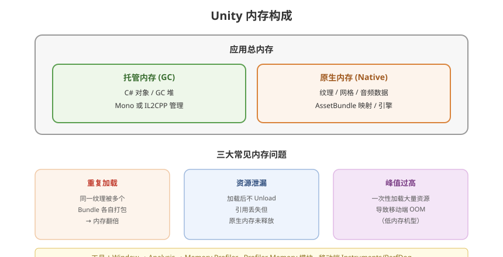

# 05 - 内存管理与优化

## 学习目标
- 理解 Unity 内存模型和分配机制
- 掌握内存分析和泄漏排查工具
- 建立移动端内存优化方法论

---



## 1. Unity 内存模型

### 1.1 内存架构
```
┌─────────────────────────────────────┐
│           应用总内存                  │
├──────────────────┬──────────────────┤
│   托管内存 (Mono/IL2CPP) │  原生内存 (Native)   │
├──────────────────┼──────────────────┤
│ C# 对象          │ 纹理数据           │
│ GC 堆            │ 网格数据           │
│ 值类型栈         │ 音频数据           │
│                  │ AssetBundle 映射   │
│                  │ 引擎内部分配       │
└──────────────────┴──────────────────┘
```

### 1.2 IL2CPP 内存管理
- IL2CPP 将 C# 转为 C++ 后，托管对象仍由 GC 管理
- 但 GC 的阈值和行为与 Mono 不同
- IL2CPP 下值类型优化更好（更少装箱）

---

## 2. 内存分析工具

### 2.1 Memory Profiler
```
Window → Analysis → Memory Profiler
```
- **Unity Objects** 页：所有 UnityEngine.Object 实例
- **All Of Memory** 页：托管 + 原生内存全貌
- **Memory Map**：内存分布可视化

### 2.2 Profiler (Memory 模块)
```
详细数据：
- Total Allocated: 总分配内存
- Texture Memory: 纹理内存
- Mesh Memory: 网格内存
- Audio Memory: 音频内存
- GC Allocated: GC 分配量（每帧）
```

### 2.3 运行时内存查询
```csharp
// 获取各种内存数据
long totalAllocated = Profiler.GetTotalAllocatedMemoryLong();
long totalReserved = Profiler.GetTotalReservedMemoryLong();
long monoUsed = Profiler.GetMonoUsedSizeLong();
long monoHeap = Profiler.GetMonoHeapSizeLong();

// GC 信息
long gcMemory = GC.GetTotalMemory(false);
int gcCollectionCount = GC.CollectionCount(0);
```

### 2.4 移动端工具
| 平台 | 工具 |
|------|------|
| iOS | Instruments (Allocations / VM Tracker) |
| Android | Android Studio Memory Profiler |
| 通用 | PerfDog |

---

## 3. 常见内存问题与解决

### 3.1 纹理内存问题
```csharp
// 问题：加载了过大分辨率的纹理
// 解决：设置纹理最大尺寸
TextureImporter importer = (TextureImporter)AssetImporter.GetAtPath("Assets/Textures/MyTex.png");
importer.maxTextureSize = 1024;  // 移动端建议 ≤ 1024
importer.SaveAndReimport();

// 运行时压缩
texture.Compress(false);         // 高质量压缩
texture.Compress(true);          // 高质量 + 渐进式

// 释放 Read/Write 内存拷贝
texture.Apply(false, true);      // updateMipmaps, makeNoLongerReadable
```

```csharp
// 运行时检查纹理内存
long textureMemory = 0;
var textures = Resources.FindObjectsOfTypeAll<Texture2D>();
foreach (var tex in textures)
{
    textureMemory += Profiler.GetRuntimeMemorySizeLong(tex);
}
Debug.Log($"纹理内存: {textureMemory / 1024.0 / 1024.0:F2} MB");
```

### 3.2 网格内存问题
```csharp
// Read/Write Enabled 导致双份内存
// 解决：关闭不需要的 Read/Write
ModelImporter importer = AssetImporter.GetAtPath("Assets/Meshes/MyMesh.fbx") as ModelImporter;
importer.isReadable = false;  // 运行时不需要读取顶点数据
importer.SaveAndReimport();

// 顶点压缩
importer.optimizeMeshVertices = true;
importer.optimizeMeshPolygons = true;
```

### 3.3 AssetBundle 内存泄漏
```csharp
// 场景1：忘记卸载
AssetBundle ab = AssetBundle.LoadFromFile(path);
GameObject prefab = ab.LoadAsset<GameObject>("Player");
Instantiate(prefab);
// 漏：没有 ab.Unload(false);

// 场景2：重复加载相同 Bundle
void LoadPlayer()
{
    AssetBundle ab = AssetBundle.LoadFromFile(path); // 每次都创建新的！
    // ...
}
// 解决：缓存已加载的 Bundle
```

---

## 4. GC 优化

### 4.1 避免每帧分配
```csharp
// 不好：每帧 new
void Update()
{
    List<Enemy> enemies = new List<Enemy>();  // 每帧分配
    FindEnemies(enemies);
}

// 好：复用
private List<Enemy> enemies = new List<Enemy>();
void Update()
{
    enemies.Clear();
    FindEnemies(enemies);
}
```

### 4.2 字符串优化
```csharp
// 不好：字符串拼接
string path = "Bundles/" + bundleName + "/" + assetName;

// 好：StringBuilder 或缓存
private StringBuilder sb = new StringBuilder(128);
sb.Clear();
sb.Append("Bundles/");
sb.Append(bundleName);
sb.Append("/");
sb.Append(assetName);
string path = sb.ToString();
```

### 4.3 装箱避免
```csharp
// 不好：值类型装箱
int count = 10;
object boxed = count;          // 装箱
Debug.Log("Count: " + count);  // 隐式装箱（+ string）

// 好
Debug.LogFormat("Count: {0}", count);
```

### 4.4 对象池扩展
```csharp
// 不仅是 GameObject，普通 C# 对象也可池化
public class ListPool<T>
{
    private static Stack<List<T>> pool = new Stack<List<T>>();
    public static List<T> Get() => pool.Count > 0 ? pool.Pop() : new List<T>();
    public static void Return(List<T> list) { list.Clear(); pool.Push(list); }
}
```

---

## 5. 移动端内存上限

### 5.1 各平台参考
| 平台 | 建议内存上限 | 备注 |
|------|-------------|------|
| iOS 1GB 设备 | ~350 MB | iPhone 6 等级 |
| iOS 2GB 设备 | ~800 MB | iPhone 7/8 |
| iOS 3GB+ 设备 | ~1.2 GB | iPhone X+ |
| Android 2GB | ~350-500 MB | 不同厂商有差异 |
| Android 4GB | ~800 MB | |
| Android 6GB+ | ~1.5 GB | |

### 5.2 内存分级策略
```csharp
public enum MemoryLevel
{
    Low,    // < 2GB RAM 设备：低质量纹理、简化 Shader
    Medium, // 2-4GB：标准质量
    High    // 4GB+：高质量
}

MemoryLevel GetMemoryLevel()
{
    long totalMemory = SystemInfo.systemMemorySize; // MB
    if (totalMemory < 2048) return MemoryLevel.Low;
    if (totalMemory < 4096) return MemoryLevel.Medium;
    return MemoryLevel.High;
}
```

---

## 6. 内存峰值控制

### 6.1 分帧加载
```csharp
IEnumerator LoadLargeResources()
{
    yield return StartCoroutine(LoadTextureSet1());
    yield return StartCoroutine(LoadTextureSet2());
    yield return StartCoroutine(LoadTextureSet3());
    // 每一批加载完等待 GC
    Resources.UnloadUnusedAssets();
    System.GC.Collect();
}
```

### 6.2 内存预警处理
```csharp
void Start()
{
    Application.lowMemory += OnLowMemory;
}

void OnLowMemory()
{
    // 释放非必要缓存
    TextureCache.Clear();
    AudioCache.Clear();
    Resources.UnloadUnusedAssets();
    System.GC.Collect();
}
```

---

## 7. 内存优化 Checklist

- [ ] 纹理：压缩格式 (ASTC/ETC2)、尺寸 ≤ 1024、MipMap 按需、关闭 Read/Write
- [ ] 网格：关闭 Read/Write、顶点压缩、LOD 合理使用
- [ ] 音频：使用压缩格式 (Vorbis)、短音频用 Decompress On Load、长音频用 Streaming
- [ ] AssetBundle：正确时机 Unload(false)、避免重复加载
- [ ] 代码：无每帧 GC Alloc、字符串缓存、对象池
- [ ] 场景：场景切换时全面清理
- [ ] UI：图集合批、关闭 Raycast Target

---

## 8. 学习检查点

- [ ] 会使用 Memory Profiler 定位内存泄漏
- [ ] 理解托管/原生内存的区别和优化方向
- [ ] 能独立完成移动端内存优化
- [ ] 掌握 GC 友好编程习惯
