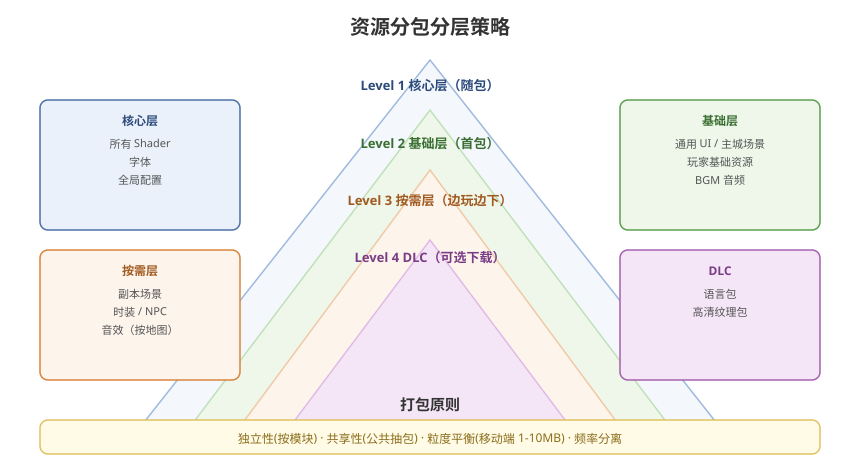

# 06 - 资源打包策略

## 学习目标
- 掌握资源包的划分原则和策略
- 理解依赖分析和公共资源抽取
- 能设计完整的首包/增量更新方案

---



## 1. 资源包划分原则

### 1.1 核心原则
```
1. 独立性：场景/功能模块独立成包
2. 共享性：公共依赖抽取为独立包
3. 粒度平衡：包不过大（加载慢）也不过小（IO 频繁）
4. 频率分离：高频资源单独成包，低频资源合并
```

### 1.2 包大小建议
| 平台 | 建议单包大小 | 原因 |
|------|-------------|------|
| PC | 10-100 MB | 磁盘 IO 性能好 |
| 移动端 | 1-10 MB | 内存和网络限制 |
| 小游戏/WebGL | ≤ 5 MB | 网络传输限制 |

---

## 2. 首包与分包策略

### 2.1 首包 (First Package)
```
首包 = 安装包 (APK/IPA) 内资源
├── 启动场景资源 (Logo/加载界面)
├── 核心 Shader
├── 通用 UI 框架
├── 主城/大厅场景
├── 全局配置
└── 初始 AssetBundle 清单
```

### 2.2 分包维度
```
按功能模块:
  ├── core/           ← 核心库（Shader、字体、通用材质）
  ├── ui/
  │   ├── ui_common   ← 通用 UI (按钮、弹窗)
  │   └── ui_xxx      ← 各系统 UI
  ├── scene/
  │   ├── scene_main  ← 主城
  │   └── scene_level ← 关卡
  ├── character/
  │   ├── player      ← 玩家角色
  │   ├── npc         ← NPC
  │   └── enemy       ← 敌人
  └── effect/
      ├── skill_fx    ← 技能特效
      └── ui_fx       ← UI 特效
```

---

## 3. 依赖分析与公共提取

### 3.1 依赖关系检测
```csharp
// Editor 脚本：分析 Bundle 依赖
[MenuItem("Tools/Analyze Dependencies")]
static void AnalyzeDependencies()
{
    string bundleName = "prefabs/player";
    string[] dependencies = AssetDatabase.GetAssetBundleDependencies(bundleName, true);

    Debug.Log($"[{bundleName}] 依赖以下 Bundle:");
    foreach (string dep in dependencies)
    {
        Debug.Log($"  → {dep}");
    }
}
```

### 3.2 公共资源抽取
```
问题场景:
  - Player Bundle 包含 Texture A
  - Enemy Bundle 也包含了 Texture A
  → 重复打包，浪费内存

解决方案:
  创建 shared/ 公共 Bundle:
  └── shared/
      ├── shared_textures   ← 公共纹理
      ├── shared_shaders    ← 公共 Shader
      └── shared_materials  ← 公共材质
```

```csharp
// 检测重复资源
[MenuItem("Tools/Find Duplicate Assets")]
static void FindDuplicateAssets()
{
    Dictionary<string, List<string>> assetToBundles = new Dictionary<string, List<string>>();

    foreach (string bundleName in AssetDatabase.GetAllAssetBundleNames())
    {
        foreach (string assetPath in AssetDatabase.GetAssetPathsFromAssetBundle(bundleName))
        {
            if (!assetToBundles.ContainsKey(assetPath))
                assetToBundles[assetPath] = new List<string>();
            assetToBundles[assetPath].Add(bundleName);
        }
    }

    foreach (var kvp in assetToBundles)
    {
        if (kvp.Value.Count > 1)
        {
            Debug.Log($"重复资源: {kvp.Key} 出现在: {string.Join(", ", kvp.Value)}");
        }
    }
}
```

---

## 4. 版本管理与增量更新

### 4.1 版本号体系
```
完整版本号: 主版本.次版本.资源版本.补丁版本
示例: 1.2.301.5
  ├── 1: 主版本（大版本更新）
  ├── 2: 次版本（功能更新）
  ├── 301: 资源版本（AssetBundle 变更）
  └── 5: 补丁版本（Bug 修复）
```

### 4.2 增量更新原理
```csharp
// 构建时生成 Hash 文件
string hashFilePath = $"{buildPath}/{bundleName}.hash";
uint crc;
BuildPipeline.GetCRCForAssetBundle(bundlePath, out crc);
string hashContent = crc.ToString();
File.WriteAllText(hashFilePath, hashContent);

// 运行时比对
public static bool IsBundleUpdated(string bundleName, uint remoteCRC)
{
    string localHashPath = GetLocalPath(bundleName) + ".hash";
    if (!File.Exists(localHashPath)) return true;

    string localHashStr = File.ReadAllText(localHashPath);
    uint localCRC = uint.Parse(localHashStr);
    return localCRC != remoteCRC;
}
```

### 4.3 差分包 (delta)
```
文件对比逻辑:
1. 服务端维护每个版本的文件 CRC 列表
2. 客户端上报当前版本号
3. 服务端计算差异列表并下发
4. 客户端仅下载有变化的 Bundle
```

---

## 5. 打包自动化脚本

```csharp
// 完整打包流程
public class FullBuildPipeline
{
    public static void Build()
    {
        // 1. 清理
        Directory.Delete(outputPath, true);
        Directory.CreateDirectory(outputPath);

        // 2. 设置所有 AssetBundle 名称
        AssetDatabase.RemoveUnusedAssetBundleNames();
        SetAllBundleNames();

        // 3. 构建
        BuildAssetBundleOptions options =
            BuildAssetBundleOptions.ChunkBasedCompression |
            BuildAssetBundleOptions.ForceRebuildAssetBundle |
            BuildAssetBundleOptions.DeterministicAssetBundle;

        AssetBundleManifest manifest = BuildPipeline.BuildAssetBundles(
            outputPath, options, EditorUserBuildSettings.activeBuildTarget);

        // 4. 生成版本文件
        GenerateVersionFile(manifest);

        // 5. 生成元信息
        GenerateMetadata(manifest);

        // 6. 拷贝到发布目录
        CopyToReleaseDirectory();

        AssetDatabase.Refresh();
    }

    static void GenerateVersionFile(AssetBundleManifest manifest)
    {
        var versions = new Dictionary<string, string>();
        foreach (string bundleName in manifest.GetAllAssetBundles())
        {
            string hash = manifest.GetAssetBundleHash(bundleName).ToString();
            versions[bundleName] = hash;
        }
        string json = JsonUtility.ToJson(new VersionData { bundles = versions });
        File.WriteAllText($"{outputPath}/version.json", json);
    }
}
```

---

## 6. 实战：MMORPG 项目打包方案

```
资源分类:
  Level 1 - 核心层（永远随包）
    ├── shaders_core      所有 Shader
    ├── fonts            所有字体
    └── configs          配置文件

  Level 2 - 基础层（首包大部分）
    ├── ui_common        通用 UI
    ├── scene_main       主城（大场景，首包）
    ├── player_base      玩家基础资源
    └── audio_bgm       背景音乐

  Level 3 - 按需加载（边玩边下载）
    ├── scene_dungeon_xxx 各副本场景
    ├── costume_xxx      时装（动态按需）
    ├── npc_xxx          NPC
    └── audio_sfx_xxx    音效（按地图）

  Level 4 - DLC（可选下载）
    ├── language_xxx     语言包
    └── hd_textures     高清纹理包
```

---

## 7. 学习检查点

- [ ] 能根据项目规模设计合理的分包策略
- [ ] 会检测和消除重复打包的公共资源
- [ ] 理解版本管理和增量更新原理
- [ ] 能编写完整的自动化打包脚本
