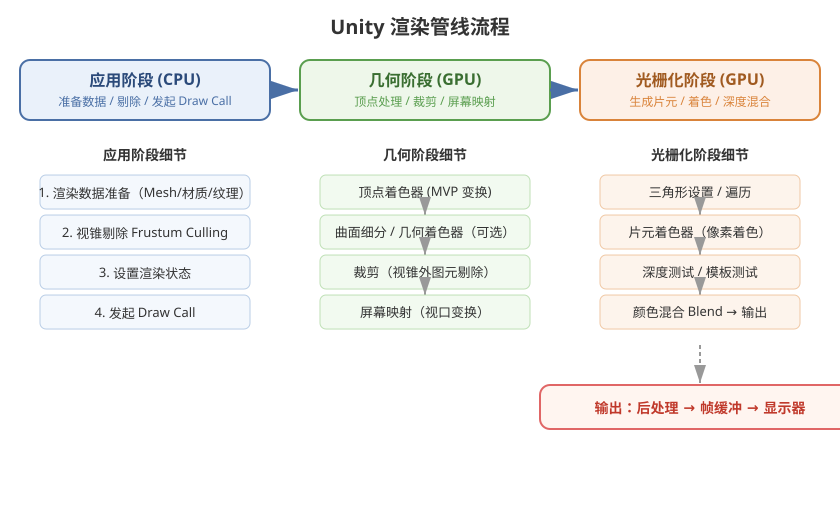

# 01 - 基础概念与渲染管线

## 学习目标
- 理解 GPU 渲染管线的工作流程
- 掌握 Shader 在渲染管线中的位置和作用
- 了解不同渲染管线的差异

---



## 1. 什么是 Shader？

Shader 是运行在 GPU 上的小程序，用于控制图形渲染的各个环节。Unity 中的 Shader 决定了物体在屏幕上如何显示。

### Shader 的三种核心类型
| 类型 | 作用 |
|------|------|
| 顶点着色器 (Vertex Shader) | 处理每个顶点的位置变换、法线变换等 |
| 片元着色器 (Fragment Shader) | 处理每个像素的最终颜色输出 |
| 几何着色器 / 曲面细分 | 可选阶段，生成或细分几何体 |

---

## 2. 渲染管线工作流程

```
[应用阶段] → [几何阶段] → [光栅化阶段]
```

### 2.1 应用阶段 (CPU)
- 准备渲染数据（模型、材质、纹理）
- 视锥体剔除（Frustum Culling）
- 设置渲染状态
- 发起 Draw Call

### 2.2 几何阶段 (GPU)
```
顶点着色器 → 曲面细分 → 几何着色器 → 裁剪 → 屏幕映射
```
- **顶点着色器**：模型空间 → 世界空间 → 观察空间 → 裁剪空间 (MVP 变换)
- **可选阶段**：曲面细分着色器、几何着色器
- **裁剪**：剔除视锥体外的图元
- **屏幕映射**：裁剪空间 → 屏幕坐标 (视口变换)

### 2.3 光栅化阶段 (GPU)
```
三角形设置 → 三角形遍历 → 片元着色器 → 逐片元操作
```
- **三角形设置**：计算三角形边界信息
- **三角形遍历**：检查哪些像素被三角形覆盖，生成片元
- **片元着色器**：计算每个片元的颜色
- **逐片元操作**：深度测试、模板测试、混合等

---

## 3. Unity 中的渲染管线

### 3.1 内置渲染管线 (Built-in RP)
- Unity 传统渲染管线
- 可配置性强，但底层优化受限
- 通过 `Tags` 和 `Pass` 控制渲染顺序

### 3.2 URP (Universal Render Pipeline)
- 轻量级、可编程的渲染管线
- 使用 `Shader Graph` 可视化创作
- 需要 Shader 声明兼容性

### 3.3 HDRP (High Definition Render Pipeline)
- 面向高端平台的写实渲染管线
- 支持高级光照、体积效果等

---

## 4. 关键概念

### 4.1 Draw Call
每次 CPU 向 GPU 发起的渲染指令。减少 Draw Call 是性能优化的关键。

### 4.2 批处理 (Batching)
- **静态批处理**：标记为 Static 的物体合并网格
- **动态批处理**：运行时对符合条件的物体自动合并
- **SRP Batcher**：URP/HDRP 中的高效批处理机制

### 4.3 渲染顺序
```
Background (1000) → Geometry (2000) → AlphaTest (2450) → 
Transparent (3000) → Overlay (4000)
```

---

## 5. 推荐学习资源

- 《Unity Shader 入门精要》- 冯乐乐
- 《Real-Time Rendering》第四版
- Unity 官方文档：Rendering Pipelines
- Catlike Coding - Rendering 系列教程

---

## 6. 学习检查点

- [ ] 能够画出完整的渲染管线流程图
- [ ] 理解 MVP 矩阵变换的每一步
- [ ] 知道 URP 和 Built-in RP 的区别
- [ ] 理解 Draw Call 和批处理的概念
