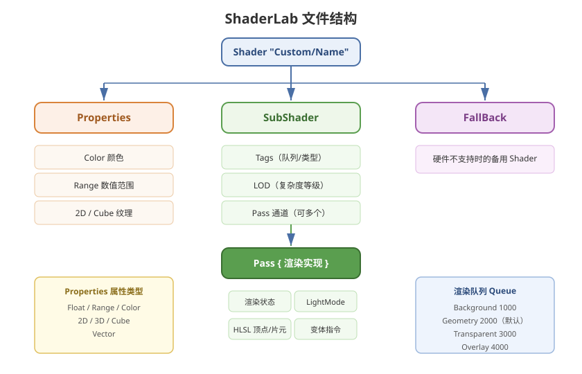

# 02 - ShaderLab 语法基础

## 学习目标
- 掌握 ShaderLab 的基本语法结构
- 理解 Properties、SubShader、Pass 的作用
- 学会书写简单的 Shader 代码

---



## 1. ShaderLab 基本结构

```hlsl
Shader "Custom/MyShader"
{
    Properties { /* 材质面板属性 */ }
    SubShader { /* 渲染实现 */ }
    FallBack "Diffuse"
}
```

### 1.1 Shader 命名规范
- `"Category/ShaderName"` 格式
- 建议使用 `Custom/` 前缀存放自定义 Shader
- 例如：`"Custom/Character/ToonShading"`

---

## 2. Properties 属性块

定义在材质 Inspector 面板中可调节的参数。

```hlsl
Properties
{
    _Color ("主颜色", Color) = (1,1,1,1)
    _MainTex ("主纹理", 2D) = "white" {}
    _Glossiness ("光滑度", Range(0,1)) = 0.5
    _Metallic ("金属度", Range(0,1)) = 0.0
    _NormalMap ("法线贴图", 2D) = "bump" {}
    _CubeMap ("环境贴图", Cube) = "" {}
    _DetailTex ("细节纹理", 2D) = "gray" {}
}
```

### 2.1 属性类型速查表
| 类型 | 语法 | 示例 |
|------|------|------|
| 数值 | `Float`, `Range(min,max)` | `_Cutoff ("Cutoff", Range(0,1)) = 0.5` |
| 颜色 | `Color` | `_Color ("Color", Color) = (1,0,0,1)` |
| 纹理 | `2D`, `3D`, `Cube` | `_MainTex ("Tex", 2D) = "white" {}` |
| 向量 | `Vector` | `_Vector ("Vector", Vector) = (0,0,0,0)` |

### 2.2 默认纹理值
| 值 | 含义 |
|----|------|
| `"white" {}` | 全白纹理 |
| `"black" {}` | 全黑纹理 |
| `"gray" {}` | 灰色纹理 |
| `"bump" {}` | 法线贴图默认值（蓝色） |
| `"red" {}` | 红色纹理 |

---

## 3. SubShader 与 Tags

```hlsl
SubShader
{
    Tags
    {
        "RenderType" = "Opaque"        // 渲染类型
        "Queue" = "Geometry"           // 渲染队列
        "RenderPipeline" = "UniversalRenderPipeline"  // 指定管线
        "ForceNoShadowCasting" = "True"
        "IgnoreProjector" = "True"
        "PreviewType" = "Plane"
    }
    
    LOD 200
    
    Pass
    {
        // 渲染 Pass 实现
    }
}
```

### 3.1 渲染队列 (Queue)
| Queue | 值 | 用途 |
|-------|-----|------|
| Background | 1000 | 天空盒等背景 |
| Geometry | 2000 | 不透明几何体（默认） |
| AlphaTest | 2450 | 需要 Alpha 测试的物体 |
| Transparent | 3000 | 半透明物体 |
| Overlay | 4000 | 叠加效果（镜头光晕等） |

可以使用 `"Queue"="Geometry+1"` 微调顺序。

### 3.2 RenderType 常用值
- `"Opaque"` - 不透明
- `"Transparent"` - 透明
- `"TransparentCutout"` - 透明裁剪
- `"Background"` - 背景
- `"Overlay"` - 叠加

### 3.3 LOD (Level of Detail)
```hlsl
LOD 200   // Shader 内部复杂度等级
```
- 配合 `Shader.maximumLOD` 使用
- Quality Settings 中可控制全局 LOD 上限

---

## 4. Pass 通道

一个 SubShader 可包含多个 Pass，每个 Pass 执行一次完整的渲染。

```hlsl
Pass
{
    Name "MyPass"
    
    Tags
    {
        "LightMode" = "ForwardBase"  // 光照模式
    }
    
    Cull Back       // 背面剔除
    ZWrite On       // 深度写入
    ZTest LEqual    // 深度测试
    Blend SrcAlpha OneMinusSrcAlpha  // 混合模式
    
    HLSLPROGRAM
    #pragma vertex vert
    #pragma fragment frag
    
    // ... 顶点/片元着色器代码
    ENDHLSL
}
```

### 4.1 渲染状态
| 状态 | 选项 | 说明 |
|------|------|------|
| `Cull` | `Back` / `Front` / `Off` | 面剔除模式 |
| `ZWrite` | `On` / `Off` | 是否写入深度缓冲 |
| `ZTest` | `LEqual` / `Always` / `Less` 等 | 深度测试模式 |
| `Blend` | 源因子 目标因子 | 颜色混合模式 |
| `ColorMask` | `RGBA` / `RGB` / `0` | 颜色通道掩码 |

### 4.2 LightMode 标签 (URP)
| LightMode | 用途 |
|-----------|------|
| `UniversalForward` | URP 前向渲染主光照 |
| `UniversalGBuffer` | URP 延迟渲染 |
| `ShadowCaster` | 阴影投射通道 |
| `DepthOnly` | 深度预通道 |
| `Meta` | 光照贴图烘焙 |
| `SRPDefaultUnlit` | 不受光照的默认通道 |

---

## 5. 着色器代码 - HLSL 基础

### 5.1 在 URP 中使用 HLSL
```hlsl
HLSLPROGRAM
#pragma vertex vert
#pragma fragment frag

#include "Packages/com.unity.render-pipelines.universal/ShaderLibrary/Core.hlsl"

// 变量声明需与 Properties 名称一致
CBUFFER_START(UnityPerMaterial)
    float4 _Color;
    float4 _MainTex_ST;
    float _Glossiness;
CBUFFER_END

TEXTURE2D(_MainTex);
SAMPLER(sampler_MainTex);

struct Attributes
{
    float4 positionOS : POSITION;
    float2 uv : TEXCOORD0;
    float3 normalOS : NORMAL;
};

struct Varyings
{
    float4 positionCS : SV_POSITION;
    float2 uv : TEXCOORD0;
};

Varyings vert(Attributes IN)
{
    Varyings OUT;
    OUT.positionCS = TransformObjectToHClip(IN.positionOS.xyz);
    OUT.uv = TRANSFORM_TEX(IN.uv, _MainTex);
    return OUT;
}

float4 frag(Varyings IN) : SV_Target
{
    float4 texColor = SAMPLE_TEXTURE2D(_MainTex, sampler_MainTex, IN.uv);
    return texColor * _Color;
}
ENDHLSL
```

### 5.2 常用 URP 变换函数
| 函数 | 作用 |
|------|------|
| `TransformObjectToHClip(posOS)` | 模型空间 → 裁剪空间 |
| `TransformObjectToWorld(posOS)` | 模型空间 → 世界空间 |
| `TransformWorldToHClip(posWS)` | 世界空间 → 裁剪空间 |
| `GetVertexNormalInputs(normalOS)` | 法线空间变换 |
| `TRANSFORM_TEX(uv, texName)` | 纹理 UV 缩放偏移 |

---

## 6. CGPROGRAM vs HLSLPROGRAM

| | CGPROGRAM | HLSLPROGRAM |
|------|-----------|-------------|
| 适用管线 | 内置管线 | URP / HDRP / 自定义 SRP |
| 包含库 | `UnityCG.cginc` | URP 的 `Core.hlsl` |
| 推荐度 | 老项目维护 | **新项目推荐** |

---

## 7. FallBack 与 Fallback Shader

```hlsl
FallBack "Universal Render Pipeline/Lit"  // URP
FallBack "Diffuse"                        // 内置管线
FallBack Off                              // 无备用
```

当所有 SubShader 都不支持当前硬件时，使用 FallBack 指定的 Shader。

---

## 8. 学习检查点

- [ ] 能独立写出带 Properties 的 Shader 框架
- [ ] 理解 Queue 和 RenderType 的作用与搭配
- [ ] 掌握 HLSL 基础语法和 URP 变换函数
- [ ] 知道 CGPROGRAM 和 HLSLPROGRAM 的使用场景
