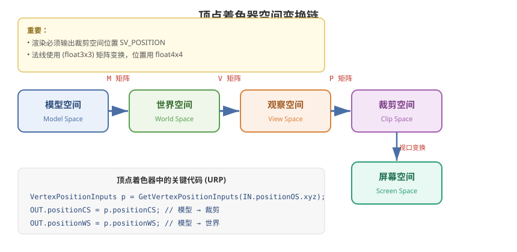

# 03 - 顶点片元着色器

## 学习目标
- 精通顶点着色器和片元着色器的编写
- 理解顶点数据结构和插值器
- 掌握常用的数学变换和材质效果

---



## 1. 顶点着色器 (Vertex Shader)

### 1.1 核心职责
- 将顶点从模型空间变换到裁剪空间
- 传递插值数据给片元着色器
- 逐顶点计算（数量 = 顶点数）

### 1.2 输入结构 (Attributes)
```hlsl
struct Attributes
{
    float4 positionOS : POSITION;     // 模型空间顶点位置
    float3 normalOS   : NORMAL;       // 模型空间法线
    float4 tangentOS  : TANGENT;      // 模型空间切线
    float2 uv         : TEXCOORD0;    // 第一套 UV
    float2 uv2        : TEXCOORD1;    // 第二套 UV（光照贴图用）
    float4 color      : COLOR;        // 顶点颜色
};
```

### 1.3 输出结构 (Varyings)
```hlsl
struct Varyings
{
    float4 positionCS : SV_POSITION;    // 裁剪空间位置（必须）
    float2 uv         : TEXCOORD0;      // 传递 UV
    float3 positionWS : TEXCOORD1;      // 世界空间位置
    float3 normalWS   : TEXCOORD2;      // 世界空间法线
    float3 viewDirWS  : TEXCOORD3;      // 世界空间视线方向
};
```

### 1.4 空间变换核心代码
```hlsl
Varyings vert(Attributes IN)
{
    Varyings OUT;

    // 关键变换链
    VertexPositionInputs posInputs = GetVertexPositionInputs(IN.positionOS.xyz);
    OUT.positionCS = posInputs.positionCS;   // 裁剪空间
    OUT.positionWS = posInputs.positionWS;   // 世界空间

    VertexNormalInputs normalInputs = GetVertexNormalInputs(IN.normalOS, IN.tangentOS);
    OUT.normalWS = normalInputs.normalWS;

    OUT.uv = IN.uv;
    return OUT;
}
```

---

## 2. 片元着色器 (Fragment Shader)

### 2.1 核心职责
- 计算每个像素的最终颜色
- 纹理采样、光照计算、混合等
- 逐像素执行（数量 = 屏幕像素 × 覆盖次数）

### 2.2 基本框架
```hlsl
float4 frag(Varyings IN) : SV_Target
{
    // 1. 纹理采样
    float4 albedo = SAMPLE_TEXTURE2D(_MainTex, sampler_MainTex, IN.uv);

    // 2. 数据归一化
    float3 normalWS = normalize(IN.normalWS);

    // 3. 光照计算
    Light mainLight = GetMainLight();
    float NdotL = saturate(dot(normalWS, mainLight.direction));
    float3 diffuse = albedo.rgb * mainLight.color * NdotL;

    // 4. 输出
    return float4(diffuse, albedo.a);
}
```

---

## 3. PBR 材质实现

### 3.1 PBR 核心属性
| 属性 | 描述 |
|------|------|
| Albedo | 基础反射率颜色 |
| Metallic | 金属度 (0=非金属, 1=金属) |
| Smoothness | 光滑度（影响高光和反射） |
| Normal | 法线方向（法线贴图） |
| AO | 环境光遮蔽 |

### 3.2 简单 PBR Shader 示例
```hlsl
TEXTURE2D(_MainTex);        SAMPLER(sampler_MainTex);
TEXTURE2D(_MetallicGloss);  SAMPLER(sampler_MetallicGloss);
TEXTURE2D(_NormalMap);      SAMPLER(sampler_NormalMap);
TEXTURE2D(_OcclusionMap);   SAMPLER(sampler_OcclusionMap);

float4 frag(Varyings IN) : SV_Target
{
    float4 albedo = SAMPLE_TEXTURE2D(_MainTex, sampler_MainTex, IN.uv);
    float3 normalTS = UnpackNormal(SAMPLE_TEXTURE2D(_NormalMap, sampler_NormalMap, IN.uv));
    float4 metallicGloss = SAMPLE_TEXTURE2D(_MetallicGloss, sampler_MetallicGloss, IN.uv);
    float occlusion = SAMPLE_TEXTURE2D(_OcclusionMap, sampler_OcclusionMap, IN.uv).r;

    float metallic = metallicGloss.r;
    float smoothness = metallicGloss.a;
    float3 normalWS = normalize(IN.normalWS);

    // 获取主光源
    Light mainLight = GetMainLight();
    float NdotL = saturate(dot(normalWS, mainLight.direction));

    // 漫反射
    float3 diffuse = albedo.rgb * mainLight.color * NdotL;

    // 高光（简化版）
    float3 viewDir = normalize(GetWorldSpaceViewDir(IN.positionWS));
    float3 halfDir = normalize(mainLight.direction + viewDir);
    float NdotH = saturate(dot(normalWS, halfDir));
    float specular = pow(NdotH, smoothness * 256.0);

    float3 ambient = SampleSH(normalWS) * albedo.rgb * occlusion;

    float3 finalColor = diffuse + specular * mainLight.color * smoothness + ambient;

    return float4(finalColor, albedo.a);
}
```

---

## 4. 常用数学公式

### 4.1 常用函数
```hlsl
dot(a, b)       // 点积 - 用于计算夹角
cross(a, b)     // 叉积 - 用于求法线/垂直方向
normalize(v)    // 归一化 - 转为单位向量
lerp(a, b, t)   // 线性插值
saturate(x)     // 钳制到 [0, 1]
step(edge, x)   // 阶跃函数
smoothstep(a,b,x) // 平滑阶跃
pow(x, n)       // 幂运算
reflect(I, N)   // 反射向量
fwidth(x)       // 像素导数
ddx(x), ddy(x)  // 水平和垂直像素导数
```

### 4.2 常用计算
```hlsl
// 菲涅尔效果
float fresnel = pow(1.0 - saturate(dot(normalWS, viewDirWS)), _FresnelPower);

// 世界空间 → 裁剪空间
float4 posCS = TransformWorldToHClip(positionWS);

// 屏幕空间 UV
float2 screenUV = positionCS.xy / positionCS.w * 0.5 + 0.5;

// 旋转 2D UV
float2 RotateUV(float2 uv, float angle) {
    float s = sin(angle);
    float c = cos(angle);
    return float2(uv.x * c - uv.y * s, uv.x * s + uv.y * c);
}
```

---

## 5. Shader Variants (变体)

### 5.1 多编译指令
```hlsl
#pragma multi_compile _ _MAIN_LIGHT_SHADOWS
#pragma multi_compile _ _SHADOWS_SOFT
#pragma multi_compile_fog

// Shader Feature（仅编译用到的变体）
#pragma shader_feature _NORMALMAP
#pragma shader_feature _EMISSION
```

### 5.2 条件编译
```hlsl
#ifdef _NORMALMAP
    float3 normalTS = UnpackNormal(SAMPLE_TEXTURE2D(_NormalMap, sampler_NormalMap, IN.uv));
#else
    float3 normalTS = float3(0, 0, 1);
#endif
```

---

## 6. 学习检查点

- [ ] 能独立编写顶点着色器中的空间变换代码
- [ ] 掌握片元着色器中的漫反射和高光计算
- [ ] 理解 PBR 各属性的物理含义
- [ ] 知道 multi_compile 和 shader_feature 的区别
