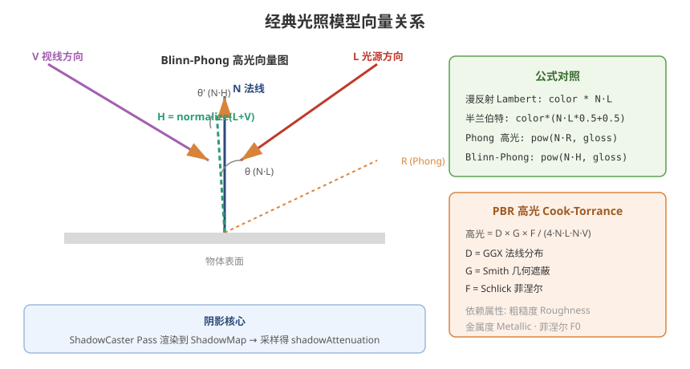

# 04 - 光照模型与阴影

## 学习目标
- 理解经典光照模型的数学原理
- 掌握 URP 中光照数据的获取方式
- 学会实现阴影和全局光照

---



## 1. 光照模型总览

### 1.1 经典光照模型分解
```
最终颜色 = 环境光 + 漫反射 + 高光反射 + 自发光
```

### 1.2 各分量说明
| 分量 | 描述 | 依赖 |
|------|------|------|
| 环境光 (Ambient) | 间接光照，模拟全局光照 | 环境光颜色、球谐函数 |
| 漫反射 (Diffuse) | 光线在粗糙表面均匀散射 | 光源方向、法线方向 |
| 高光反射 (Specular) | 光滑表面的镜面反射 | 视线方向、法线、高光度 |
| 自发光 (Emission) | 物体自身发出的光 | 自发光颜色/贴图 |

---

## 2. 漫反射模型

### 2.1 Lambert（基础漫反射）
```hlsl
float NdotL = saturate(dot(normalWS, lightDir));
float3 diffuse = albedo.rgb * lightColor * NdotL;
```
特点：背面全黑，过渡均匀。

### 2.2 Half-Lambert（半兰伯特）
```hlsl
float NdotL = dot(normalWS, lightDir) * 0.5 + 0.5;
float3 diffuse = albedo.rgb * lightColor * NdotL;
```
特点：背面有微弱光照，常用于卡通渲染。

---

## 3. 高光反射模型

### 3.1 Phong 模型
```hlsl
float3 reflectDir = reflect(-lightDir, normalWS);
float RdotV = saturate(dot(reflectDir, viewDir));
float specular = pow(RdotV, _Gloss * 256.0);
```

### 3.2 Blinn-Phong 模型（性能更优）
```hlsl
float3 halfDir = normalize(lightDir + viewDir);
float NdotH = saturate(dot(normalWS, halfDir));
float specular = pow(NdotH, _Gloss * 256.0);
```

### 3.3 Cook-Torrance (PBR 高光)
```hlsl
// D: 法线分布函数 (GGX)
float D = GGX(NdotH, roughness);

// G: 几何遮蔽函数 (Smith)
float G = SmithG(NdotL, NdotV, roughness);

// F: 菲涅尔 (Schlick)
float3 F = F_Schlick(F0, VdotH);

float3 specular = (D * G * F) / (4.0 * NdotL * NdotV + 0.001);
```

---

## 4. URP 光照系统

### 4.1 获取主光源
```hlsl
// URP 标准方式
Light mainLight = GetMainLight();
float3 lightDir = mainLight.direction;
float3 lightColor = mainLight.color;
float shadowAtten = mainLight.shadowAttenuation;
float distanceAtten = mainLight.distanceAttenuation;
```

### 4.2 获取附加光源（前向渲染）
```hlsl
int pixelLightCount = GetAdditionalLightsCount();
for (int i = 0; i < pixelLightCount; i++)
{
    Light light = GetAdditionalLight(i, IN.positionWS);
    float3 NdotL = saturate(dot(normalWS, light.direction));
    diffuse += albedo.rgb * light.color * NdotL * light.distanceAttenuation * light.shadowAttenuation;
}
```

### 4.3 球谐函数 (SH) - 环境光探针
```hlsl
// 获取间接漫反射（考虑 Light Probe）
float3 ambient = SampleSH(normalWS);

// 自定义 SH 系数（用于实现自定义全局光照）
float3 shAmbient = SHEvalLinearL0L1(normalWS, _SHAr, _SHAg, _SHAb);
```

### 4.4 反射探针
```hlsl
// 获取天空反射
float3 reflection = GlossyEnvironmentReflection(reflectDir, roughness, 1.0);
```

---

## 5. 阴影系统

### 5.1 主光源阴影
```hlsl
// 阴影坐标计算
float4 shadowCoord = TransformWorldToShadowCoord(IN.positionWS);

// 获取阴影衰减
Light mainLight = GetMainLight(shadowCoord);
float shadow = mainLight.shadowAttenuation; // 0=阴影中, 1=完全照亮

// 应用到最终颜色
float3 finalColor = (diffuse + specular) * shadow + ambient;
```

### 5.2 必须的 ShadowCaster Pass
```hlsl
Pass
{
    Name "ShadowCaster"
    Tags { "LightMode" = "ShadowCaster" }

    HLSLPROGRAM
    #pragma vertex ShadowPassVertex
    #pragma fragment ShadowPassFragment
    #include "Packages/com.unity.render-pipelines.universal/ShaderLibrary/Shadows.hlsl"

    float3 _LightDirection;

    Varyings ShadowPassVertex(Attributes IN)
    {
        Varyings OUT;
        float3 posWS = TransformObjectToWorld(IN.positionOS.xyz);
        float3 normalWS = TransformObjectToWorldNormal(IN.normalOS);
        OUT.positionCS = TransformWorldToHClip(ApplyShadowBias(posWS, normalWS, _LightDirection));
        return OUT;
    }

    float4 ShadowPassFragment(Varyings IN) : SV_Target
    {
        return 0; // 实际由 GPU 的 Shadowmap 机制处理
    }
    ENDHLSL
}
```

### 5.3 阴影质量设置 (URP Asset)
```csharp
// 通过代码修改阴影设置
UniversalRenderPipelineAsset urpAsset = 
    GraphicsSettings.currentRenderPipeline as UniversalRenderPipelineAsset;
urpAsset.shadowDistance = 100.0f;              // 阴影距离
urpAsset.shadowCascadeCount = 4;               // 级联阴影数
urpAsset.shadowDepthBias = 1.0f;               // 深度偏移
urpAsset.shadowNormalBias = 1.0f;              // 法线偏移
urpAsset.supportsSoftShadows = true;           // 软阴影
```

### 5.4 接收阴影
需要在 Shader 中添加变体关键字：
```hlsl
#pragma multi_compile _ _MAIN_LIGHT_SHADOWS
#pragma multi_compile _ _MAIN_LIGHT_SHADOWS_CASCADE
#pragma multi_compile _ _SHADOWS_SOFT
```

---

## 6. 光照模型对比与选择

| 光照模型 | 性能 | 视觉 | 适用场景 |
|----------|------|------|----------|
| Lambert + Blinn-Phong | 高 | 基础 | 低端设备、风格化 |
| PBR (Standard) | 中 | 写实 | 主流项目 |
| PBR + 皮肤/布料扩展 | 中高 | 写实 | 角色、时装 |
| 卡通 (Toon/Cel) | 高 | 风格化 | 二次元、卡通 |

---

## 7. 实战：卡通渲染 (Toon Shading)

```hlsl
float4 frag(Varyings IN) : SV_Target
{
    float3 normalWS = normalize(IN.normalWS);
    Light mainLight = GetMainLight();
    float NdotL = dot(normalWS, mainLight.direction);

    // 阶梯化漫反射
    float diffuse = smoothstep(0.0, 0.01, NdotL * 0.5 + 0.5);
    // 多级色阶
    float toonDiffuse = floor(diffuse * _ToonSteps) / _ToonSteps;

    // 描边高光
    float3 viewDir = GetWorldSpaceViewDir(IN.positionWS);
    float3 halfDir = normalize(mainLight.direction + viewDir);
    float specular = step(1.0 - _SpecularSize, dot(normalWS, halfDir));

    return float4(albedo.rgb * toonDiffuse + specular * albedo.rgb * 2, 1);
}
```

---

## 8. 学习检查点

- [ ] 能区分并实现 Lambert、Blinn-Phong、PBR 光照模型
- [ ] 掌握 URP 的 Light 结构体使用方法
- [ ] 能正确配置和实现阴影投射与接收
- [ ] 理解球谐函数和反射探针的作用
