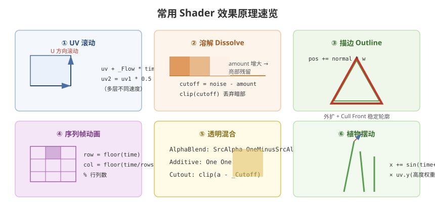

# 05 - 常用 Shader 效果

## 学习目标
- 掌握项目中高频使用的 Shader 效果实现
- 理解每一类效果的数学原理
- 能够在项目中灵活组合运用

---



## 1. UV 动画效果

### 1.1 UV 滚动（瀑布、河流）
```hlsl
// 单一方向滚动
float2 uv = IN.uv + float2(_ScrollX, _ScrollY) * _Time.y;

// 多层滚动，不同速度（纵深效果）
float2 uv1 = IN.uv + float2(0.1, 0.3) * _Time.y;
float2 uv2 = IN.uv + float2(0.05, 0.15) * _Time.y * 0.5;
float4 layer1 = SAMPLE_TEXTURE2D(_Tex1, sampler_Tex1, uv1);
float4 layer2 = SAMPLE_TEXTURE2D(_Tex2, sampler_Tex2, uv2);
float4 result = lerp(layer1, layer2, 0.5);
```

### 1.2 UV 扰动 / 扭曲
```hlsl
// 使用噪声图扭曲 UV
float2 noiseUV = IN.uv + _Time.y * _NoiseSpeed;
float noise = SAMPLE_TEXTURE2D(_NoiseTex, sampler_NoiseTex, noiseUV).r;
float2 distortedUV = IN.uv + (noise - 0.5) * _DistortStrength;
float4 color = SAMPLE_TEXTURE2D(_MainTex, sampler_MainTex, distortedUV);
```

### 1.3 极坐标 UV
```hlsl
float2 PolarUV(float2 uv, float2 center)
{
    float2 delta = uv - center;
    float radius = length(delta) * 2.0;
    float angle = atan2(delta.y, delta.x) / (2.0 * PI);
    return float2(radius, angle);
}
```

---

## 2. 溶解效果 (Dissolve)

```hlsl
TEXTURE2D(_DissolveTex); SAMPLER(sampler_DissolveTex);
float _DissolveAmount;   // 0 = 完整, 1 = 完全消失
float _DissolveEdgeWidth;
float4 _DissolveEdgeColor;

float4 frag(Varyings IN) : SV_Target
{
    float4 baseColor = SAMPLE_TEXTURE2D(_MainTex, sampler_MainTex, IN.uv);
    float dissolve = SAMPLE_TEXTURE2D(_DissolveTex, sampler_DissolveTex, IN.uv).r;

    // 溶解阈值判断
    float cutoff = dissolve - _DissolveAmount;
    clip(cutoff);  // 小于0的像素直接丢弃

    // 边缘发光
    float edge = smoothstep(0, _DissolveEdgeWidth, cutoff);
    float4 finalColor = lerp(_DissolveEdgeColor, baseColor, edge);

    return finalColor;
}
```

---

## 3. 描边效果 (Outline)

### 3.1 顶点外扩法
```hlsl
Varyings vert(Attributes IN)
{
    Varyings OUT;

    // 沿法线方向外扩顶点
    float3 posOS = IN.positionOS.xyz + IN.normalOS * _OutlineWidth;

    OUT.positionCS = TransformObjectToHClip(posOS);
    OUT.color = _OutlineColor;

    return OUT;
}

float4 frag(Varyings IN) : SV_Target
{
    return IN.color;
}
```

### 3.2 后处理描边（Sobel 算子）
```hlsl
// 在屏幕空间对深度/法线纹理做边缘检测
float SobelDepth(float2 uv)
{
    float2 texelSize = _MainTex_TexelSize.xy;

    float tl = SAMPLE_TEXTURE2D(_CameraDepthTexture, sampler_CameraDepthTexture, uv + float2(-1,-1) * texelSize).r;
    float t  = SAMPLE_TEXTURE2D(_CameraDepthTexture, sampler_CameraDepthTexture, uv + float2( 0,-1) * texelSize).r;
    float tr = SAMPLE_TEXTURE2D(_CameraDepthTexture, sampler_CameraDepthTexture, uv + float2( 1,-1) * texelSize).r;
    float l  = SAMPLE_TEXTURE2D(_CameraDepthTexture, sampler_CameraDepthTexture, uv + float2(-1, 0) * texelSize).r;
    float r  = SAMPLE_TEXTURE2D(_CameraDepthTexture, sampler_CameraDepthTexture, uv + float2( 1, 0) * texelSize).r;
    float bl = SAMPLE_TEXTURE2D(_CameraDepthTexture, sampler_CameraDepthTexture, uv + float2(-1, 1) * texelSize).r;
    float b  = SAMPLE_TEXTURE2D(_CameraDepthTexture, sampler_CameraDepthTexture, uv + float2( 0, 1) * texelSize).r;
    float br = SAMPLE_TEXTURE2D(_CameraDepthTexture, sampler_CameraDepthTexture, uv + float2( 1, 1) * texelSize).r;

    float horizontal = tl * -1 + l * -2 + bl * -1 + tr * 1 + r * 2 + br * 1;
    float vertical   = tl * -1 + t * -2 + tr * -1 + bl * 1 + b * 2 + br * 1;

    return sqrt(horizontal * horizontal + vertical * vertical);
}
```

---

## 4. 序列帧动画

```hlsl
float4 frag(Varyings IN) : SV_Target
{
    float row = floor(_Time.y * _Speed) % _RowCount;
    float col = floor(_Time.y * _Speed / _RowCount) % _ColumnCount;

    float2 cellUV = IN.uv / float2(_ColumnCount, _RowCount);
    cellUV.x += col / _ColumnCount;
    cellUV.y += row / _RowCount;

    return SAMPLE_TEXTURE2D(_MainTex, sampler_MainTex, cellUV);
}
```

---

## 5. 透明与混合

### 5.1 Alpha Blend（常见半透明）
```hlsl
Blend SrcAlpha OneMinusSrcAlpha
ZWrite Off
```

### 5.2 Additive（叠加发光）
```hlsl
Blend One One
ZWrite Off
```

### 5.3 Alpha Cutout（裁剪透明）
```hlsl
float a = SAMPLE_TEXTURE2D(_MainTex, sampler_MainTex, IN.uv).a;
clip(a - _Cutoff);
```

---

## 6. 双面渲染与植物效果

### 6.1 双面渲染
```hlsl
Cull Off

// 片元着色器中翻转背面法线
float3 normalWS = IN.normalWS;
if (!IN.isFrontFace)
{
    normalWS = -normalWS;
}
```

### 6.2 植物随风摆动
```hlsl
Varyings vert(Attributes IN)
{
    Varyings OUT;

    float3 posOS = IN.positionOS.xyz;

    // 高度混合（根部不动）
    float height = IN.uv.y;
    float windStrength = height * _WindStrength;

    // 多层不同频率的摆动
    float noise1 = sin(_Time.y * _WindSpeed + posOS.x * _WindDensity) * windStrength;
    float noise2 = cos(_Time.y * _WindSpeed * 1.3 + posOS.z * _WindDensity) * windStrength * 0.5;

    posOS.x += noise1 + noise2;
    posOS.z += noise1 * 0.7 + noise2 * 0.3;

    OUT.positionCS = TransformObjectToHClip(posOS);
    OUT.uv = IN.uv;
    return OUT;
}
```

---

## 7. 纹理混合

### 7.1 地形多层混合
```hlsl
// 使用遮罩纹理控制混合权重
float4 mask = SAMPLE_TEXTURE2D(_SplatMap, sampler_SplatMap, IN.uv);
float4 layer1 = SAMPLE_TEXTURE2D(_Tex1, sampler_Tex1, IN.uv * _Tile1);
float4 layer2 = SAMPLE_TEXTURE2D(_Tex2, sampler_Tex2, IN.uv * _Tile2);
float4 layer3 = SAMPLE_TEXTURE2D(_Tex3, sampler_Tex3, IN.uv * _Tile3);
float4 layer4 = SAMPLE_TEXTURE2D(_Tex4, sampler_Tex4, IN.uv * _Tile4);

float4 result = layer1 * mask.r + layer2 * mask.g + layer3 * mask.b + layer4 * mask.a;
```

### 7.2 细节纹理叠加
```hlsl
float4 baseTex = SAMPLE_TEXTURE2D(_MainTex, sampler_MainTex, IN.uv);
float4 detailTex = SAMPLE_TEXTURE2D(_DetailTex, sampler_DetailTex, IN.uv * _DetailTile);
float4 result = baseTex * detailTex * 2.0;  // 乘法叠加
```

---

## 8. 渐变与颜色调整

```hlsl
// 亮度
float luminance = dot(color.rgb, float3(0.299, 0.587, 0.114));

// 对比度
float3 contrast = (color.rgb - 0.5) * _Contrast + 0.5;

// 饱和度
float3 gray = luminance.xxx;
float3 sat = lerp(gray, color.rgb, _Saturation);

// HSV → RGB
float3 HSV2RGB(float3 hsv) { /* ... */ }
```

---

## 9. 学习检查点

- [ ] 能独立实现 UV 流动、溶解、描边效果
- [ ] 理解透明混合三种模式的写法与差异
- [ ] 掌握植物摆动等顶点动画
- [ ] 知道如何团队协作约定 Shader 效果参数命名规范
