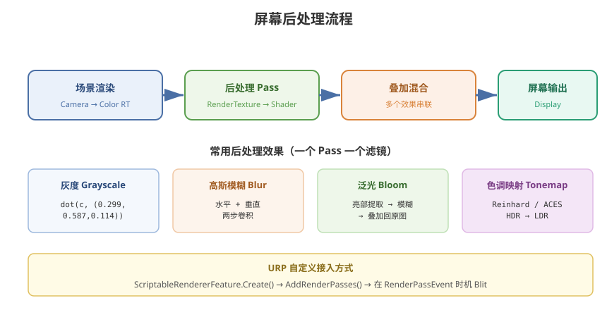

# 06 - 后处理效果

## 学习目标
- 理解屏幕后处理的工作原理
- 掌握 URP 下自定义 Renderer Feature 的开发
- 能独立实现常用后处理效果

---



## 1. 后处理概述

后处理 (Post-Processing) 是在场景渲染完成后，对全屏图像进行二次处理的阶段。

### 1.1 工作流程
```
场景渲染 → 获取 RenderTexture → 后处理 Shader → 输出到屏幕
```

### 1.2 URP 后处理实现方式
| 方式 | 难度 | 灵活性 | 适用场景 |
|------|------|--------|----------|
| Volume 组件 + 内置效果 | 低 | 低 | 常规项目 |
| 自定义 Renderer Feature | 中 | 高 | 定制后处理 |
| Custom Pass (URP 14+) | 中 | 高 | 精细化控制 |

---

## 2. 自定义 Renderer Feature

### 2.1 基础结构 (C#)
```csharp
using UnityEngine;
using UnityEngine.Rendering;
using UnityEngine.Rendering.Universal;

public class CustomBlitRenderFeature : ScriptableRendererFeature
{
    [System.Serializable]
    public class Settings
    {
        public Material blitMaterial;
        public RenderPassEvent renderPassEvent = RenderPassEvent.AfterRenderingTransparents;
    }

    public Settings settings = new Settings();
    private CustomBlitPass blitPass;

    public override void Create()
    {
        blitPass = new CustomBlitPass(settings);
    }

    public override void AddRenderPasses(ScriptableRenderer renderer, ref RenderingData renderingData)
    {
        if (settings.blitMaterial != null)
        {
            renderer.EnqueuePass(blitPass);
        }
    }
}
```

### 2.2 自定义 Render Pass (C#)
```csharp
public class CustomBlitPass : ScriptableRenderPass
{
    private Material material;
    private RenderPassEvent renderPassEvent;
    private RenderTargetIdentifier source;
    private RenderTargetHandle tempTexture;

    public CustomBlitPass(CustomBlitRenderFeature.Settings settings)
    {
        this.material = settings.material;
        this.renderPassEvent = settings.renderPassEvent;
        tempTexture.Init("_TempTexture");
    }

    public override void Execute(ScriptableRenderContext context, ref RenderingData renderingData)
    {
        CommandBuffer cmd = CommandBufferPool.Get("CustomBlitPass");

        RenderTextureDescriptor descriptor = renderingData.cameraData.cameraTargetDescriptor;
        descriptor.depthBufferBits = 0;

        source = renderingData.cameraData.renderer.cameraColorTarget;

        cmd.GetTemporaryRT(tempTexture.id, descriptor);
        cmd.Blit(source, tempTexture.Identifier(), material);
        cmd.Blit(tempTexture.Identifier(), source);
        context.ExecuteCommandBuffer(cmd);

        cmd.ReleaseTemporaryRT(tempTexture.id);
        CommandBufferPool.Release(cmd);
    }
}
```

### 2.3 后处理 Shader
```hlsl
Shader "Hidden/CustomPostProcess"
{
    SubShader
    {
        Cull Off
        ZWrite Off
        ZTest Always

        Pass
        {
            HLSLPROGRAM
            #pragma vertex Vert
            #pragma fragment Frag

            #include "Packages/com.unity.render-pipelines.universal/ShaderLibrary/Core.hlsl"

            TEXTURE2D(_MainTex);
            SAMPLER(sampler_MainTex);
            float4 _MainTex_TexelSize;

            struct Attributes
            {
                float4 pos : POSITION;
                float2 uv : TEXCOORD0;
            };

            struct Varyings
            {
                float4 pos : SV_POSITION;
                float2 uv : TEXCOORD0;
            };

            Varyings Vert(Attributes IN)
            {
                Varyings OUT;
                OUT.pos = TransformObjectToHClip(IN.pos.xyz);
                OUT.uv = IN.uv;
                return OUT;
            }

            float4 Frag(Varyings IN) : SV_Target
            {
                return SAMPLE_TEXTURE2D(_MainTex, sampler_MainTex, IN.uv);
            }
            ENDHLSL
        }
    }
}
```

---

## 3. 常用后处理效果实现

### 3.1 灰度
```hlsl
half4 Frag(Varyings IN) : SV_Target
{
    half4 col = SAMPLE_TEXTURE2D(_MainTex, sampler_MainTex, IN.uv);
    half gray = dot(col.rgb, half3(0.299, 0.587, 0.114));
    return half4(gray.xxx, col.a);
}
```

### 3.2 高斯模糊
```hlsl
// 两步：水平 + 垂直
half4 FragHorizontal(Varyings IN) : SV_Target
{
    half4 col = 0;
    half kernel[5] = { 0.227027, 0.1945946, 0.1216216, 0.054054, 0.016216 };

    for (int i = -4; i <= 4; i += 2)
    {
        half weight = kernel[abs(i) / 2];
        col += SAMPLE_TEXTURE2D(_MainTex, sampler_MainTex,
            IN.uv + half2(i * _MainTex_TexelSize.x * _BlurSize, 0)) * weight;
    }
    return col;
}

half4 FragVertical(Varyings IN) : SV_Target
{
    // 同上，但偏移在 Y 方向
    // ...
}
```

### 3.3 泛光 (Bloom)
```hlsl
half4 FragBloom(Varyings IN) : SV_Target
{
    half4 col = SAMPLE_TEXTURE2D(_MainTex, sampler_MainTex, IN.uv);
    half brightness = dot(col.rgb, half3(0.2126, 0.7152, 0.0722));

    half4 extract = brightness > _Threshold ? col : half4(0, 0, 0, 0);
    return extract;
}
// 提取亮部后做模糊，再混合回原图
```

### 3.4 色调映射 (Tone Mapping)
```hlsl
// Reinhard
half3 Reinhard(half3 color)
{
    return color / (color + 1.0);
}

// ACES
half3 ACES(half3 color)
{
    half a = 2.51;
    half b = 0.03;
    half c = 2.43;
    half d = 0.59;
    half e = 0.14;
    return saturate((color * (a * color + b)) / (color * (c * color + d) + e));
}
```

### 3.5 老电影效果
```hlsl
half4 Frag(Varyings IN) : SV_Target
{
    half4 col = SAMPLE_TEXTURE2D(_MainTex, sampler_MainTex, IN.uv);

    // 1. 复古色调
    half3 sepia;
    sepia.r = dot(col.rgb, half3(0.393, 0.769, 0.189));
    sepia.g = dot(col.rgb, half3(0.349, 0.686, 0.168));
    sepia.b = dot(col.rgb, half3(0.272, 0.534, 0.131));

    // 2. 噪点
    half noise = frac(sin(dot(IN.uv * _Time.y, half2(12.9898, 78.233))) * 43758.5453);
    sepia += noise * _NoiseAmount;

    // 3. 暗角 (Vignette)
    half2 dist = IN.uv - 0.5;
    half vignette = 1.0 - dot(dist, dist) * _VignetteAmount;

    return half4(sepia * vignette, col.a);
}
```

---

## 4. 深度相关效果

### 4.1 雾效
```hlsl
// URP 中获取深度
half sceneDepth = SAMPLE_TEXTURE2D_X(_CameraDepthTexture, sampler_CameraDepthTexture, IN.uv);
half sceneDepthLinear = LinearEyeDepth(sceneDepth, _ZBufferParams);

half fogFactor = exp(-_FogDensity * sceneDepthLinear);
fogFactor = saturate(fogFactor);

half4 fogColor = half4(_FogColor.rgb, 1.0);
half4 col = SAMPLE_TEXTURE2D(_MainTex, sampler_MainTex, IN.uv);
return lerp(fogColor, col, fogFactor);
```

### 4.2 深度渐变（水下效果）
```hlsl
half depth = LinearEyeDepth(sceneDepth, _ZBufferParams);
half depthDiff = depth - LinearEyeDepth(IN.position.z, _ZBufferParams);
half fade = saturate(depthDiff * _WaterFade);
half4 waterColor = half4(0, 0.3, 0.5, 1.0);
return lerp(sceneColor, waterColor, fade);
```

---

## 5. RenderPassEvent 时机

| 枚举值 | 插入时机 |
|--------|----------|
| `BeforeRendering` | 渲染开始前 |
| `BeforeRenderingShadows` | 阴影渲染前 |
| `AfterRenderingShadows` | 阴影渲染后 |
| `BeforeRenderingOpaques` | 不透明物体前 |
| `AfterRenderingOpaques` | 不透明物体后 |
| `BeforeRenderingSkybox` | 天空盒前 |
| `AfterRenderingSkybox` | 天空盒后 |
| `BeforeRenderingTransparents` | 透明物体前 |
| `AfterRenderingTransparents` | 透明物体后 |
| `AfterRendering` | 渲染结束后 |

---

## 6. 性能注意事项

- 后处理 Shader 的执行次数 = 屏幕像素 × Pass 数量，注意复杂度
- 多个后处理尽量合并在单个 Pass 中
- 合理使用 `half` 精度（移动端友好）
- 考虑使用 `_MainTex_TexelSize` 降低采样分辨率再上采样

---

## 7. 学习检查点

- [ ] 能独立搭建自定义 Renderer Feature
- [ ] 实现过一个完整的后处理效果（模糊/泛光/色调映射）
- [ ] 理解 RenderPassEvent 时机选择
- [ ] 会使用深度纹理实现屏幕空间效果

> SSAO、SSR、SSGI、接触阴影及其管线能力边界，见
> [屏幕空间光照效果](/UnityLighting/11-屏幕空间光照效果)。
