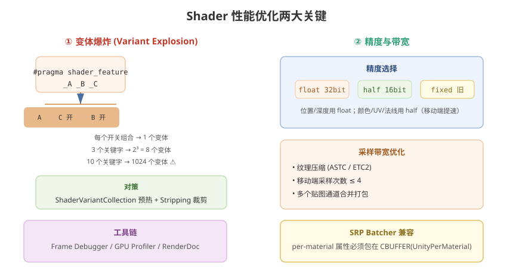

# 07 - Shader 性能优化

## 学习目标
- 掌握 Shader 性能分析工具和方法
- 学会识别和解决常见 Shader 性能瓶颈
- 建立移动端 Shader 优化思维

---



## 1. 性能分析工具

### 1.1 Unity Frame Debugger
```
Window → Analysis → Frame Debugger
```
- 逐 Draw Call 查看渲染过程
- 查看每个 Draw Call 使用的 Shader
- 检查不合理的渲染顺序

### 1.2 Profiler
```
Window → Analysis → Profiler
```
- `GPU Usage` 模块：GPU 耗时分布
- `Rendering` 模块：Draw Call 数量、SetPass Call、批处理统计

### 1.3 移动端 GPU 分析工具
| 平台 | 工具 |
|------|------|
| iOS | Xcode GPU Frame Capture |
| Android | Snapdragon Profiler / Mali Offline Compiler |
| 通用 | RenderDoc |

### 1.4 URP 性能统计
```csharp
// 运行时获取渲染统计
RenderingDebugger.Stats stats = new RenderingDebugger.Stats();
```

---

## 2. 复杂度优化

### 2.1 指令数优化（ALU 限制）
```hlsl
// 不好：多次重复计算
float3 dir1 = normalize(v);
float3 dir2 = normalize(v);  // 重复！

// 好：缓存结果
float3 dir = normalize(v);
float result1 = dot(dir, w1);
float result2 = dot(dir, w2);

// 不好：复杂表达式直接用于 clip
clip(sqrt(pow(a, 2) + pow(b, 2)) - threshold);

// 好：简化为平方比较（省去 sqrt）
clip(a * a + b * b - threshold * threshold);
```

### 2.2 纹理采样数优化（带宽限制）
```hlsl
// 不好：逐像素多次采样大纹理
float4 t1 = SAMPLE_TEXTURE2D(_Tex1, sampler_Tex1, uv);
float4 t2 = SAMPLE_TEXTURE2D(_Tex2, sampler_Tex2, uv); // 额外带宽

// 好：合并到一张纹理的通道中
float4 packed = SAMPLE_TEXTURE2D(_PackedTex, sampler_PackedTex, uv);
float metallic = packed.r;   // R 通道
float smoothness = packed.a;  // A 通道
float occlusion = packed.g;  // G 通道
```

### 2.3 减少变体数量
```hlsl
// 避免过多 keyword
// 不好
#pragma shader_feature _ _FEATURE_A _FEATURE_B _FEATURE_C  // 产生 8+ 变体

// 好：使用默认材质属性 + 运行时计算代替
#pragma shader_feature _FEATURE_A  // 仅 2 个变体
```

---

## 3. 精度选择

### 3.1 精度类型
| 类型 | 精度 | 移动端性能 | 使用场景 |
|------|------|-----------|----------|
| `float` | 32-bit | 较慢 | 世界空间位置、深度值 |
| `half` | 16-bit | 快 | 颜色、UV、法线方向（短向量） |
| `fixed` | 11-bit (旧) | 快 | 已废弃，用 half 替代 |

### 3.2 精度优化示例
```hlsl
// 不好：全用 float
float NdotL = dot(normalWS, lightDir);
float3 diffuse = albedo * lightColor * NdotL;

// 好：合理使用 half
half NdotL = saturate(dot(normalWS, lightDir));
half3 diffuse = albedo.rgb * lightColor.rgb * NdotL;
```

### 3.3 LOD 与精度
```hlsl
SubShader
{
    LOD 200  // 高配手机
    // 高精度、多效果
}
SubShader
{
    LOD 100  // 低配手机
    // 简化计算
}
```

---

## 4. 移动端优化专项

### 4.1 带宽优化
- 使用纹理压缩格式 (ASTC / ETC2 / PVRTC)
- 降低纹理分辨率（移动端 1024 通常足够）
- 使用 Mipmap 减少远处物体采样带宽

### 4.2 TBDR 架构优化 (Mali / Adreno / Apple GPU)
```hlsl
// TBDR 对依赖纹理采样的 discard/clip 敏感
// 尽量避免片元着色器中使用 discard
clip(value);  // 会破坏 Early-Z 优化，增加带宽

// 替代方案：使用 AlphaTest 队列或在顶点着色器判断
```

### 4.3 Overdraw 控制
- 优先渲染不透明物体
- 缩小半透明物体的渲染区域
- 使用 `ColorMask 0` 的 Pass 做深度预写入

---

## 5. SRP Batcher 兼容性

### 5.1 条件
```hlsl
// 必须使用 CBUFFER 包裹 per-material 属性
CBUFFER_START(UnityPerMaterial)
    float4 _Color;
    float _Metallic;
    float _Smoothness;
CBUFFER_END
```

### 5.2 不兼容的情况
- 使用 MaterialPropertyBlock 修改 CBUFFER 内属性
- Shader 中声明了旧版 `fixed` 类型变量

---

## 6. 常见优化 Checklist

### 6.1 Shader 层面
- [ ] 纹理采样数 ≤ 4（移动端）
- [ ] 合理使用 half 精度
- [ ] 避免在 Shader 中计算 `pow`、`sqrt` 等昂贵函数
- [ ] 超采样 / 循环展开合理
- [ ] CBUFFER 正确包裹属性
- [ ] 减少分支（`if` 在 GPU 中代价高）

### 6.2 材质层面
- [ ] 同材质实例数足够多（利用批处理）
- [ ] 减少 Material 实例数
- [ ] 纹理压缩格式正确
- [ ] 不必要的属性关闭（如不需要法线贴图就关掉）

### 6.3 渲染层面
- [ ] Shader Variant 数量可控
- [ ] 半透明物体排序正确，避免不必要渲染
- [ ] 阴影距离和分辨率合理
- [ ] Camera Far Clip Plane 不过大

---

## 7. Shader 编译优化

### 7.1 ShaderVariantCollection
```csharp
// 预热 Shader 变体
ShaderVariantCollection svc = Resources.Load<ShaderVariantCollection>("MyVariants");
svc.WarmUp();
```

### 7.2 Stripping 裁剪
```csharp
// 通过 IPrelocalShaderVariantStripper 裁剪不需要的变体
class MyStripper : IPreprocessShaders
{
    public int callbackOrder => 0;

    public void OnProcessShader(Shader shader, ShaderSnippetData snippet, IList<ShaderCompilerData> data)
    {
        // 移除不需要的变体
        for (int i = data.Count - 1; i >= 0; i--)
        {
            if (!ShouldIncludeVariant(data[i]))
            {
                data.RemoveAt(i);
            }
        }
    }
}
```

---

## 8. 性能测试方法

```
1. 确定基准场景和设备
2. 记录 Before 数据：FPS、Draw Call、SetPass Call、GPU ms
3. 逐一应用优化
4. 记录 After 数据对比
5. 使用低端机型验证（性能优化对低端机影响最大）
```

---

## 9. 学习检查点

- [ ] 会使用 Frame Debugger 和 Profiler 定位 Shader 瓶颈
- [ ] 能写出 SRP Batcher 兼容的 Shader
- [ ] 掌握移动端 Shader 优化套路
- [ ] 理解变体爆炸的危害和规避方法
