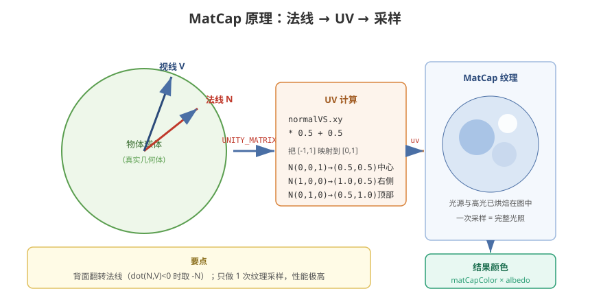

# 08 - MatCap 与风格化渲染

## 学习目标
- 深入理解 MatCap 的原理和优缺点
- 掌握卡通渲染的高级技法（Ramp、描边、边缘光、色阶）
- 学会组合多个风格化技巧

---



## 1. MatCap 原理详解

MatCap (Material Capture) 是一种用**一张纹理代表光照结果**的廉价渲染技巧。它把光照计算（漫反射+高光+环境）全部烘焙到一张球体贴图里。

### 1.1 核心原理
```
物体法线 N + 视线 V
    ↓
计算 v = N · (反映射后的法线)
    ↓
把法线方向映射为 UV 坐标
    ↓
直接采样 MatCap 纹理
```

MatCap 纹理通常是一张球的渲染图（球上已含光源），形似：
```
       ┌──────────┐
       │  ◆高光    │   ← 光源方向已烘焙
       │    (●)   │
       │          │
       └──────────┘
```

### 1.2 UV 计算
```hlsl
float2 MatCapUV(float3 normalWS, float3 viewDirWS)
{
    // 1. 把世界空间向量转到观察空间
    float3 normalVS = mul((float3x3)UNITY_MATRIX_V, normalWS);
    // 2. MatCap 公式：取法线 x,y 映射到 [0,1]
    float2 uv = normalVS.xy * 0.5 + 0.5;
    return uv;
}
```

### 1.3 完整 MatCap Shader (URP)
```hlsl
Shader "Custom/MatCap"
{
    Properties
    {
        _BaseColor ("Base Color", Color) = (1,1,1,1)
        _MatCapTex ("MatCap Texture", 2D) = "white" {}
        _MatCapStrength ("MatCap Strength", Range(0,2)) = 1.0
        _MainTex ("Albedo", 2D) = "white" {}
    }

    SubShader
    {
        Tags { "RenderType" = "Opaque" "Queue" = "Geometry" }

        Pass
        {
            HLSLPROGRAM
            #pragma vertex vert
            #pragma fragment frag

            #include "Packages/com.unity.render-pipelines.universal/ShaderLibrary/Core.hlsl"

            TEXTURE2D(_MatCapTex); SAMPLER(sampler_MatCapTex);
            TEXTURE2D(_MainTex); SAMPLER(sampler_MainTex);
            float4 _BaseColor;
            float _MatCapStrength;
            float4 _MainTex_ST;

            struct Attributes
            {
                float4 positionOS : POSITION;
                float3 normalOS : NORMAL;
                float2 uv : TEXCOORD0;
            };

            struct Varyings
            {
                float4 positionCS : SV_POSITION;
                float3 normalWS : TEXCOORD0;
                float3 viewDirWS : TEXCOORD1;
                float2 uv : TEXCOORD2;
            };

            Varyings vert(Attributes IN)
            {
                Varyings OUT;
                VertexPositionInputs posInputs = GetVertexPositionInputs(IN.positionOS.xyz);
                OUT.positionCS = posInputs.positionCS;

                VertexNormalInputs normalInputs = GetVertexNormalInputs(IN.normalOS);
                OUT.normalWS = normalInputs.normalWS;

                OUT.viewDirWS = GetWorldSpaceViewDir(posInputs.positionWS);
                OUT.uv = TRANSFORM_TEX(IN.uv, _MainTex);
                return OUT;
            }

            float4 frag(Varyings IN) : SV_Target
            {
                float3 normalWS = normalize(IN.normalWS);
                float3 viewDirWS = normalize(IN.viewDirWS);

                // 1. 反法线（MatCap 中背面用法线翻转更自然）
                float3 n = normalWS;
                // 视线与法线夹角：背面也显示颜色
                float dotNV = dot(viewDirWS, n);
                n = dotNV < 0 ? -n : n;

                // 2. 转到观察空间并映射 UV
                float3 normalVS = mul((float3x3)UNITY_MATRIX_V, n);
                float2 matCapUV = normalVS.xy * 0.5 + 0.5;

                // 3. 采样 MatCap
                float4 matCapColor = SAMPLE_TEXTURE2D(_MatCapTex, sampler_MatCapTex, matCapUV);

                // 4. 结合基础纹理
                float4 baseColor = SAMPLE_TEXTURE2D(_MainTex, sampler_MainTex, IN.uv) * _BaseColor;
                float3 finalColor = lerp(baseColor.rgb, matCapColor.rgb * baseColor.rgb, _MatCapStrength);

                return float4(finalColor, baseColor.a);
            }
            ENDHLSL
        }
    }
}
```

### 1.4 MatCap 优缺点
| 优点 | 缺点 |
|------|------|
| 性能极高（1 次纹理采样替代完整光照） | 光源固定，无法跟随场景灯光 |
| 可烘焙任意风格（卡通/写实/素描） | 需要额外生成 MatCap 贴图 |
| 视觉表现丰富（一个贴图多种效果） | 某些角度有"接缝"问题 |
| 不依赖场景光照探针 | 受模型顶点密度影响 |

### 1.5 MatCap 贴图制作方法
1. **3D 软件渲染法**：Maya/Blender 中放置光源渲染球体
2. **代码生成法**：用公式在 C# 中生成像素数据
3. **Photoshop 手绘法**：径向渐变 + 高光

```csharp
// C# 生成简易 MatCap 纹理
public Texture2D GenerateMatCapTexture(int size)
{
    Texture2D tex = new Texture2D(size, size, TextureFormat.RGB24, false);

    for (int y = 0; y < size; y++)
    {
        for (int x = 0; x < size; x++)
        {
            // 计算归一化坐标
            float nx = (x / (float)size) * 2.0f - 1.0f;
            float ny = (y / (float)size) * 2.0f - 1.0f;
            float dist = Mathf.Sqrt(nx * nx + ny * ny);
            if (dist > 1f) { tex.SetPixel(x, y, Color.black); continue; }

            // 计算球面法线
            Vector3 normal = new Vector3(nx, ny, Mathf.Sqrt(1 - dist * dist));
            normal.Normalize();

            // 光照方向（假想光源）
            Vector3 lightDir = new Vector3(0.3f, 0.8f, 0.5f).normalized;
            float diffuse = Mathf.Clamp01(Vector3.Dot(normal, lightDir));

            // 漫反射 + 高光
            Vector3 viewDir = new Vector3(0, 0, 1);
            Vector3 halfDir = (lightDir + viewDir).normalized;
            float spec = Mathf.Pow(Mathf.Max(0, Vector3.Dot(normal, halfDir)), 64);

            float r = diffuse * 0.8f + spec;
            float g = diffuse * 0.8f + spec;
            float b = diffuse * 1.0f + spec;
            tex.SetPixel(x, y, new Color(r, g, b));
        }
    }
    tex.Apply();
    return tex;
}
```

---

## 2. 卡通渲染 (Toon/Cel Shading)

### 2.1 Ramp 色阶贴图
```hlsl
// 使用 Ramp 纹理实现色阶漫反射（比 smoothstep 更可控）
TEXTURE2D(_ToonRamp); SAMPLER(sampler_ToonRamp);

float4 frag(Varyings IN) : SV_Target
{
    float3 normalWS = normalize(IN.normalWS);
    Light mainLight = GetMainLight();
    float NdotL = dot(normalWS, mainLight.direction);

    // 法线方向映射到 Ramp UV
    float rampCoord = NdotL * 0.5 + 0.5;
    float3 rampColor = SAMPLE_TEXTURE2D(_ToonRamp, sampler_ToonRamp, float2(rampCoord, 0)).rgb;

    // 注意 Ramp 贴图设置：Wrap Mode = Clamp，避免拉伸
    return float4(rampColor * _BaseColor.rgb, 1);
}
```

### 2.2 多级色阶（阶梯化）
```hlsl
// 把连续 NdotL 切成阶梯
float3 ToonDiffuse(float NdotL, float steps)
{
    // 简单阶梯
    float stepped = floor(NdotL * steps) / steps;
    // 或偏移让暗部更宽（二次元常见）
    float stepped2 = floor(NdotL * steps + 0.5) / steps;
    return stepped2;
}

// 高级：三色阶（高光-正常-阴影）
float Toon3Level(float NdotL)
{
    float shadow = step(_ShadowThreshold, NdotL);       // 阴影边界
    float highlight = step(_HighlightThreshold, NdotL); // 高光边界
    return 0.5 + shadow * 0.4 + highlight * 0.1;        // 组合
}
```

### 2.3 描边 (Outline) 三种实现
| 方式 | 原理 | 优缺点 |
|------|------|--------|
| 顶点外扩（双 Pass） | 先画背面放大模型 | 简单、角度不均匀 |
| 法线偏置 | 顶点沿法线偏移 | 依赖模型法线质量 |
| **外扩+正面裁剪** | Cull Front + 外扩 | 效果最稳定 |

```hlsl
// 反向面描边法（推荐）：描边 Pass 用 Cull Front
Pass
{
    Name "Outline"
    Cull Front        // 裁剪正面，只渲染背面
    ZWrite On

    HLSLPROGRAM
    #pragma vertex vert
    #pragma fragment frag

    float _OutlineWidth;
    float4 _OutlineColor;

    struct Attributes
    {
        float4 positionOS : POSITION;
        float3 normalOS : NORMAL;
    };

    struct Varyings
    {
        float4 positionCS : SV_POSITION;
    };

    Varyings vert(Attributes IN)
    {
        Varyings OUT;
        // 法线空间外扩（可改用 viewSpace 外扩避免透视畸变）
        float3 normalWS = TransformObjectToWorldNormal(IN.normalOS);
        float3 posWS = TransformObjectToWorld(IN.positionOS.xyz);
        posWS += normalWS * _OutlineWidth;
        OUT.positionCS = TransformWorldToHClip(posWS);
        return OUT;
    }

    float4 frag(Varyings IN) : SV_Target
    {
        return _OutlineColor;
    }
    ENDHLSL
}
```

---

## 3. 边缘光 (Rim Light)

### 3.1 菲涅尔边缘光
```hlsl
float4 frag(Varyings IN) : SV_Target
{
    float3 normalWS = normalize(IN.normalWS);
    float3 viewDirWS = normalize(IN.viewDirWS);

    // 法线与视线接近垂直 → 边缘 → 亮
    float rim = 1.0 - saturate(dot(normalWS, viewDirWS));
    rim = pow(rim, _RimPower);   // 控制边缘光宽度

    // 平滑过渡
    rim = smoothstep(_RimMin, _RimMax, rim);

    // 加入方向感（可选：只在光源侧发光）
    Light mainLight = GetMainLight();
    float rimLight = pow(1.0 - saturate(dot(normalWS, viewDirWS)), 3);
    float lightFacing = saturate(dot(viewDirWS, mainLight.direction));
    rimLight *= lightFacing;

    float3 base = SAMPLE_TEXTURE2D(_MainTex, sampler_MainTex, IN.uv).rgb;
    return float4(base + _RimColor.rgb * rim * _RimStrength, 1);
}
```

---

## 4. 色相偏移与色调

### 4.1 色相偏移 Shader
```hlsl
// HSV 互转
float3 RGB2HSV(float3 rgb)
{
    float4 p = (rgb.g < rgb.b) ? float4(rgb.bg, -1, 2.0 / 3.0) : float4(rgb.gb, 0, -1.0 / 3.0);
    float4 q = (rgb.r < p.x) ? float4(p.xyw, rgb.r) : float4(rgb.r, p.yzx);
    float d = q.x - min(q.w, q.y);
    float e = 1e-10;
    return float3(abs(q.z + (q.w - q.y) / (6 * d + e)), d / (q.x + e), q.x);
}

float3 HSV2RGB(float3 hsv)
{
    float4 k = float4(1, 2.0 / 3.0, 1.0 / 3.0, 3);
    float3 p = abs(frac(hsv.xxx + k.xyz) * 6 - k.www);
    return hsv.z * lerp(k.xxx, saturate(p - k.xxx), hsv.y);
}

// 用法：随时间旋转色相
float3 hsv = RGB2HSV(color.rgb);
hsv.x = frac(hsv.x + _HueShift);      // _HueShift 随时间变化
color.rgb = HSV2RGB(hsv);
```

---

## 5. 风格化实战组合

### 5.1 卡通 + 描边 + 边缘光 + MatCap 综合
```hlsl
Shader "Custom/ToonCombo"
{
    Properties
    {
        _BaseColor ("Base Color", Color) = (1,1,1,1)
        _MainTex ("Albedo", 2D) = "white" {}
        _MatCapTex ("MatCap", 2D) = "white" {}
        _RampTex ("Toon Ramp", 2D) = "white" {}
        _RimColor ("Rim Color", Color) = (1,0.5,0.5,1)
        _RimPower ("Rim Power", Range(0,8)) = 3
        _OutlineWidth ("Outline Width", Range(0,0.1)) = 0.02
        _OutlineColor ("Outline Color", Color) = (0,0,0,1)
    }

    SubShader
    {
        // Pass 1: 描边
        Pass
        {
            Cull Front
            HLSLPROGRAM
            #pragma vertex vert
            #pragma fragment frag
            float _OutlineWidth;
            float4 _OutlineColor;
            #include "Packages/com.unity.render-pipelines.universal/ShaderLibrary/Core.hlsl"
            struct A { float4 positionOS:POSITION; float3 normalOS:NORMAL; };
            struct V { float4 positionCS:SV_POSITION; };
            V vert(A i) {
                V o;
                float3 posWS = TransformObjectToWorld(i.positionOS.xyz);
                float3 nWS = TransformObjectToWorldNormal(i.normalOS);
                o.positionCS = TransformWorldToHClip(posWS + nWS * _OutlineWidth);
                return o;
            }
            float4 frag(V i):SV_Target { return _OutlineColor; }
            ENDHLSL
        }

        // Pass 2: 主渲染
        Pass
        {
            HLSLPROGRAM
            #pragma vertex vert
            #pragma fragment frag
            #include "Packages/com.unity.render-pipelines.universal/ShaderLibrary/Core.hlsl"
            #include "Packages/com.unity.render-pipelines.universal/ShaderLibrary/Lighting.hlsl"

            TEXTURE2D(_MainTex); SAMPLER(sampler_MainTex);
            TEXTURE2D(_MatCapTex); SAMPLER(sampler_MatCapTex);
            TEXTURE2D(_RampTex); SAMPLER(sampler_RampTex);
            float4 _BaseColor; float4 _RimColor;
            float _RimPower;

            struct A { float4 positionOS:POSITION; float3 normalOS:NORMAL; float2 uv:TEXCOORD0; };
            struct V { float4 positionCS:SV_POSITION; float3 normalWS:TEXCOORD0; float3 viewDirWS:TEXCOORD1; float2 uv:TEXCOORD2; };

            V vert(A i) {
                V o;
                VertexPositionInputs p = GetVertexPositionInputs(i.positionOS.xyz);
                o.positionCS = p.positionCS;
                VertexNormalInputs n = GetVertexNormalInputs(i.normalOS);
                o.normalWS = n.normalWS;
                o.viewDirWS = GetWorldSpaceViewDir(p.positionWS);
                o.uv = i.uv;
                return o;
            }

            float4 frag(V i):SV_Target
            {
                float3 n = normalize(i.normalWS);
                float3 v = normalize(i.viewDirWS);

                // 1. 卡通漫反射（Ramp）
                Light light = GetMainLight();
                float NdotL = dot(n, light.direction);
                float rampUV = NdotL * 0.5 + 0.5;
                float3 toonDiffuse = SAMPLE_TEXTURE2D(_RampTex, sampler_RampTex, float2(rampUV,0)).rgb;

                // 2. MatCap 细节高光
                float3 nVS = mul((float3x3)UNITY_MATRIX_V, n);
                float3 matCap = SAMPLE_TEXTURE2D(_MatCapTex, sampler_MatCapTex, nVS.xy * 0.5 + 0.5).rgb;

                // 3. 边缘光
                float rim = pow(1 - saturate(dot(n, v)), _RimPower);

                // 4. 合成
                float3 base = SAMPLE_TEXTURE2D(_MainTex, sampler_MainTex, i.uv).rgb * _BaseColor.rgb;
                float3 col = base * toonDiffuse * light.color;
                col += matCap * 0.3;                          // MatCap 叠加
                col += _RimColor.rgb * rim;                    // 边缘光
                return float4(col, 1);
            }
            ENDHLSL
        }
    }
}
```

---

## 6. 学习检查点

- [ ] 能独立实现 MatCap Shader 并理解 UV 映射原理
- [ ] 掌握 Ramp 卡通渲染和色阶控制
- [ ] 能组合描边、边缘光、MatCap 做出完整风格化效果
- [ ] 知道 MatCap 的局限性和适用场景
