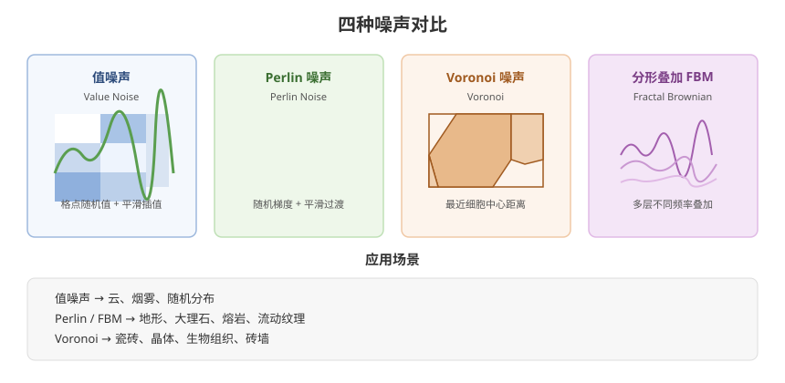

# 09 - 程序化纹理与噪声

## 学习目标
- 理解常见噪声函数的数学原理
- 掌握值噪声、Perlin 噪声、Voronoi 噪声
- 用噪声实现程序化材质（地形、流体、损坏效果）

---



## 1. 噪声函数基础

噪声是产生"随机但有连续性"值的技术，是程序化渲染的基础。

### 1.1 噪声类型对比
| 类型 | 特点 | 用途 |
|------|------|------|
| 值噪声 (Value Noise) | 低通滤波随机值，简单 | 云、烟雾 |
| **Perlin 噪声** | 平滑梯度，方向性好 | 地形、大理石 |
| **Voronoi 噪声** | 细胞状区域 | 瓷砖、晶体、生物组织 |
| 白噪声 | 完全随机不连续 | 颗粒、抖动 |
| 柏林/分形 (FBM) | 多层叠加，细节丰富 | 云、火焰、山脉 |

### 1.2 三维向量哈希
```hlsl
// 输入 3D 坐标返回 [0,1) 伪随机
float hash(float3 p)
{
    p = frac(p * 0.3183099 + 0.1);
    p *= 17.0;
    return frac(p.x * p.y * p.z * (p.x + p.y + p.z));
}

// 整数格点哈希（用于噪声）
float3 random3(float3 p)
{
    float3 q = float3(
        dot(p, float3(127.1, 311.7, 74.7)),
        dot(p, float3(269.5, 183.3, 246.1)),
        dot(p, float3(113.5, 271.9, 124.6)));
    return -1.0 + 2.0 * frac(sin(q) * 43758.5453123);
}
```

---

## 2. 值噪声 (Value Noise)

```hlsl
// 平滑插值：smoothstep 代替线性
float fade(float t) { return t * t * t * (t * (t * 6 - 15) + 10); }

// 2D 值噪声
float valueNoise(float2 uv)
{
    float2 i = floor(uv);
    float2 f = frac(uv);
    f = fade(f);

    float a = hash(float3(i, 0.0));
    float b = hash(float3(i + float2(1, 0), 0.0));
    float c = hash(float3(i + float2(0, 1), 0.0));
    float d = hash(float3(i + float2(1, 1), 0.0));

    return lerp(lerp(a, b, f.x), lerp(c, d, f.x), f.y);
}
```

---

## 3. Perlin 噪声

Perlin 噪声用**随机梯度**替代随机值，让噪声在格点间平滑过渡。

```hlsl
// 2D Perlin（经典实现）
float perlin2D(float2 p)
{
    float2 i = floor(p);
    float2 f = frac(p);
    float2 u = f * f * (3 - 2 * f);

    // 4 个角点的随机梯度
    float2 g00 = normalize(float2(hash(i), hash(i + float2(1,0))) - 0.5);
    float2 g10 = normalize(float2(hash(i + float2(1,0)), hash(i + float2(1,1))) - 0.5);
    float2 g01 = normalize(float2(hash(i + float2(0,1)), hash(i + float2(1,1))) - 0.5);
    float2 g11 = normalize(float2(hash(i + float2(1,1)), hash(i + float2(1,0))) - 0.5);

    // 每个角点的点积贡献
    float d00 = dot(g00, f);
    float d10 = dot(g10, f - float2(1, 0));
    float d01 = dot(g01, f - float2(0, 1));
    float d11 = dot(g11, f - float2(1, 1));

    // 双线性插值
    return lerp(lerp(d00, d10, u.x), lerp(d01, d11, u.x), u.y);
}
```

### 3.1 分形噪声 (FBM - Fractal Brownian Motion)
FBM 通过**叠加不同频率和幅度的噪声**产生丰富细节。

```hlsl
float fbm(float2 p, int octaves)
{
    float value = 0.0;
    float amplitude = 0.5;
    float frequency = 1.0;
    float sum = 0.0;

    for (int i = 0; i < octaves; i++)
    {
        value += amplitude * perlin2D(p * frequency);
        sum += amplitude;
        amplitude *= 0.5;       // 幅度衰减（每个八度减半）
        frequency *= 2.0;       // 频率加倍（细节加倍）
    }
    return value / sum;         // 归一化
}
```

### 3.2 FBM 变体
```hlsl
// 湍流 (Turbulence)：取绝对值产生尖峰（用于火焰）
float turbulence(float2 p, int octaves)
{
    float value = 0.0;
    float amp = 0.5, freq = 1.0, sum = 0.0;
    for (int i = 0; i < octaves; i++)
    {
        value += amp * abs(perlin2D(p * freq));  // abs 制造尖峰
        sum += amp;
        amp *= 0.5; freq *= 2.0;
    }
    return value / sum;
}

// 脊状噪声 (Ridge)：更锐利的山脉线条
float ridge(float2 p, int octaves)
{
    float value = 0.0;
    float amp = 0.5, freq = 1.0, sum = 0.0;
    for (int i = 0; i < octaves; i++)
    {
        float n = 1.0 - abs(perlin2D(p * freq));  // 反转 + 取正
        n = n * n;                                 // 平方加锐
        value += amp * n;
        sum += amp;
        amp *= 0.5; freq *= 2.0;
    }
    return value / sum;
}
```

---

## 4. Voronoi 噪声

Voronoi 把空间划分成细胞，常用于瓷砖、水泡、生物皮肤。

```hlsl
// 基础 Voronoi：找最近的细胞中心
float2 voronoi(float2 uv)
{
    float2 i = floor(uv);
    float2 f = frac(uv);

    float minDist = 8.0;
    float2 minPoint = float2(0, 0);

    // 遍历 3x3 邻域
    for (int y = -1; y <= 1; y++)
    {
        for (int x = -1; x <= 1; x++)
        {
            float2 neighbor = float2(x, y);
            // 随机点位置（每个细胞中心）
            float2 point = neighbor + hash(float3(i + neighbor, 0)).xy;
            // 点到中心距离
            float dist = distance(f, point);
            if (dist < minDist)
            {
                minDist = dist;
                minPoint = point;
            }
        }
    }
    return float2(minDist, minPoint.x + minPoint.y);
}

// 使用：渲染细胞边界
float4 frag(Varyings IN) : SV_Target
{
    float2 v = voronoi(IN.uv * _Scale);
    float cell = step(_EdgeWidth, v.x);       // 边界亮
    return float4(cell.xxx, 1);
}
```

### 4.1 Voronoi 应用：砖墙/晶体
```hlsl
// 带扰动：细胞边界不规则（生物组织感）
float voronoiNoise(float2 uv, float warp)
{
    float2 i = floor(uv);
    float2 f = frac(uv);
    float minDist = 1.0;
    for (int y = -1; y <= 1; y++)
    for (int x = -1; x <= 1; x++)
    {
        float2 neighbor = float2(x, y);
        // 用一次噪声扰动细胞中心位置
        float2 point = neighbor + 0.5 + 0.5 * sin(_Time.y + 6.28 * hash(float3(i + neighbor, 0)).xy) * warp;
        minDist = min(minDist, distance(f, point));
    }
    return minDist;
}
```

---

## 5. 程序化材质实战

### 5.1 大理石纹理
```hlsl
float4 frag(Varyings IN) : SV_Target
{
    // 1D 大理石：沿 X 轴的 FBM 噪声
    float p = IN.uv.x * _Frequency;
    float n = fbm(float2(p, p * 0.3), 5);

    // 正弦波 + 噪声混合
    float marble = sin(n * 8.0 + _Time.y) * 0.5 + 0.5;

    float3 base = _ColorA.rgb;
    float3 vein = _ColorB.rgb;
    return float4(lerp(base, vein, marble), 1);
}
```

### 5.2 流体/熔岩流动
```hlsl
float4 frag(Varyings IN) : SV_Target
{
    float2 uv = IN.uv * _Scale;
    uv.x += _Time.y * _FlowSpeed;  // 流动方向

    // 双八度 FBM 提供细节
    float flow = fbm(uv, 4);

    // 用 sin 加噪制造流动感
    float lava = sin(flow * 10.0 + uv.y * 5.0 - _Time.y * 2.0) * 0.5 + 0.5;

    // 亮红黄渐变（模拟熔岩温度）
    float3 hot = lerp(float3(0.2, 0, 0), float3(1, 0.6, 0), lava);
    float3 cool = float3(0.05, 0.03, 0.1);
    return float4(lerp(cool, hot, smoothstep(0.4, 0.8, lava)), 1);
}
```

### 5.3 地形高度生成 (C# + 噪声)
```csharp
public class TerrainGenerator : MonoBehaviour
{
    public int width = 256, height = 256;
    public float scale = 0.1f;
    public float heightMultiplier = 30f;

    void Start()
    {
        GenerateTerrain();
    }

    void GenerateTerrain()
    {
        Terrain terrain = GetComponent<Terrain>();
        float[,] heights = new float[width, height];

        for (int x = 0; x < width; x++)
        {
            for (int z = 0; z < height; z++)
            {
                // 多八度叠加：大型山体 + 中型起伏 + 细节
                float elevation = Mathf.PerlinNoise(
                    x * scale, z * scale) * 0.6f;
                elevation += Mathf.PerlinNoise(
                    x * scale * 2, z * scale * 2) * 0.25f;
                elevation += Mathf.PerlinNoise(
                    x * scale * 4, z * scale * 4) * 0.15f;

                heights[x, z] = elevation;
            }
        }

        terrain.terrainData.SetHeights(0, 0, heights);
    }
}
```

### 5.4 损坏/破败边缘
```hlsl
// 用 FBM 噪声做边缘侵蚀
float4 frag(Varyings IN) : SV_Target
{
    float2 uv = IN.uv * _Scale;

    // 一维噪声沿着 X 轴
    float n = fbm(float2(uv.y, _Time.y * _ErosionSpeed), 3);

    // 高度腐蚀：超过阈值部分被去掉
    float cutoff = smoothstep(_Erosion, 1.0, n);

    // 边缘凹凸
    float detail = fbm(uv * 3.0, 2) * 0.5;
    float3 col = _BaseColor.rgb * (0.7 + detail);

    return float4(col * cutoff, cutoff);  // alpha 用于裁剪/透明
}
```

---

## 6. 噪声性能注意事项

- **八度越多性能越差**（每层是完整噪声计算）
- 移动端建议 ≤ 3 个八度
- 可以把噪声烘焙成纹理，运行时直接采样（代价最低）
- 顶点着色器中计算噪声会比片元便宜（顶点少）

---

## 7. 学习检查点

- [ ] 能解释 Perlin 与值噪声的区别
- [ ] 能独立实现 FBM 分形叠加
- [ ] 掌握 Voronoi 及 3x3 邻域搜索写法
- [ ] 用噪声实现至少 2 个程序化材质
