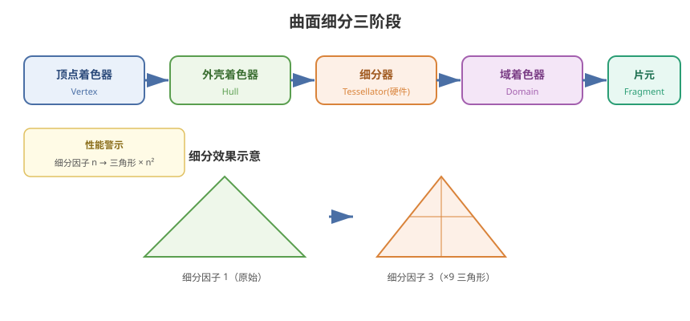

# 10 - 曲面细分与几何着色器

## 学习目标
- 理解曲面细分 (Tessellation) 的作用和三个阶段
- 掌握几何着色器 (Geometry Shader) 的用法
- 用细分/几何着色器实现草地、水波、爆炸等高级效果

---



## 1. 曲面细分概述

曲面细分让 GPU **动态增加网格三角形数量**，让低模在渲染时变细腻。

### 1.1 三个细分阶段
```
顶点着色器 → Hull Shader (外壳) → Tessellator (细分器) → Domain Shader (域) → 片元着色器
```

| 阶段 | HLSL 着色器 | 作用 |
|------|-------------|------|
| Hull (外壳) | `hull` | 决定细分程度、控制点 |
| Tessellator (细分器) | 无（硬件） | 按因子生成新顶点 |
| Domain (域) | `domain` | 插值出最终顶点位置 |

### 1.2 性能警告
- 每片原三角形细分因子 3，三角形数量是原来的 9 倍
- **细分因子过高会爆炸性增加顶点数**
- 移动端基本不可用，PC 高端场景才用

---

## 2. 曲面细分实现 (HLSL)

### 2.1 完整的细分 Shader 框架
```hlsl
Shader "Custom/Tessellation"
{
    Properties
    {
        _TessFactor ("Tess Factor", Range(1, 64)) = 6
    }

    SubShader
    {
        Pass
        {
            HLSLPROGRAM
            #pragma vertex vert
            #pragma hull hull
            #pragma domain domain
            #pragma fragment frag

            #include "Packages/com.unity.render-pipelines.universal/ShaderLibrary/Core.hlsl"

            float _TessFactor;

            struct Attributes
            {
                float4 positionOS : POSITION;
                float3 normalOS : NORMAL;
            };

            // Hull 控制点
            struct TessControlPoint
            {
                float4 positionOS : INTERNALTESSPOS;
                float3 normalOS : NORMAL;
            };

            // 细分因子结构（URP 需明确类型）
            struct TessFactors
            {
                float edge[3] : SV_TessFactor;
                float inside : SV_InsideTessFactor;
            };

            // --- Vertex: 预处理数据 ---
            TessControlPoint vert(Attributes IN)
            {
                TessControlPoint OUT;
                OUT.positionOS = IN.positionOS;
                OUT.normalOS = IN.normalOS;
                return OUT;
            }

            // --- Hull 常量函数：计算细分因子 ---
            TessFactors PatchConstantFunction(InputPatch<TessControlPoint, 3> patch)
            {
                TessFactors f;
                f.edge[0] = _TessFactor;
                f.edge[1] = _TessFactor;
                f.edge[2] = _TessFactor;
                f.inside = _TessFactor;
                return f;
            }

            // --- Hull：输出控制点 ---
            [domain("tri")]
            [partitioning("integer")]
            [outputtopology("triangle_cw")]
            [outputcontrolpoints(3)]
            [patchconstantfunc("PatchConstantFunction")]
            TessControlPoint hull(InputPatch<TessControlPoint, 3> patch, uint id : SV_OutputControlPointID)
            {
                return patch[id];
            }

            // --- Domain：根据重心坐标插值 ---
            struct DomainOutput
            {
                float4 positionCS : SV_POSITION;
                float3 normalWS : TEXCOORD0;
            };

            [domain("tri")]
            DomainOutput domain(
                TessFactors factors,
                OutputPatch<TessControlPoint, 3> patch,
                float3 barycentric : SV_DomainLocation)
            {
                DomainOutput OUT;

                // 重心插值位置
                float4 posOS =
                    patch[0].positionOS * barycentric.x +
                    patch[1].positionOS * barycentric.y +
                    patch[2].positionOS * barycentric.z;

                float3 normalOS =
                    patch[0].normalOS * barycentric.x +
                    patch[1].normalOS * barycentric.y +
                    patch[2].normalOS * barycentric.z;

                OUT.positionCS = TransformObjectToHClip(posOS.xyz);
                OUT.normalWS = TransformObjectToWorldNormal(normalOS);
                return OUT;
            }

            float4 frag(DomainOutput IN) : SV_Target
            {
                float3 lightDir = normalize(float3(0.5, 1, 0.5));
                float NdotL = saturate(dot(normalize(IN.normalWS), lightDir));
                return float4(NdotL, NdotL, NdotL, 1);
            }
            ENDHLSL
        }
    }
}
```

### 2.2 视距自适应细分
```hlsl
TessFactors PatchConstantFunction(InputPatch<TessControlPoint, 3> patch)
{
    TessFactors f;

    // 计算三角形中心到相机的距离
    float3 centerOS = (patch[0].positionOS + patch[1].positionOS + patch[2].positionOS) / 3.0;
    float3 centerWS = TransformObjectToWorld(centerOS.xyz);
    float3 viewDir = GetWorldSpaceViewDir(centerWS);
    float dist = length(viewDir);

    // 距离越远细分越少
    float factor = saturate(_MaxTess - dist * _DistanceScale);
    factor *= _TessFactor;

    f.edge[0] = f.edge[1] = f.edge[2] = factor;
    f.inside = factor;
    return f;
}
```

---

## 3. 几何着色器 (Geometry Shader)

几何着色器在**三角形生成后、光栅化前**执行，可以修改、删除或产生新的图元。

### 3.1 与片元着色器相比
| | 片元着色器 | 几何着色器 |
|------|-----------|------------|
| 执行次数 | 像素数 | 图元数（三角形） |
| 能增加图元 | 否 | **能**（输出多个图元） |
| 能修改图元结构 | 否 | **能** |
| 性能 | 高 | 低（瓶颈常见） |

### 3.2 几何着色器基础
```hlsl
#include "Packages/com.unity.render-pipelines.universal/ShaderLibrary/Core.hlsl"

// 输入：triangle（三角形）输出：TriangleStream
[maxvertexcount(3)]
void geom(triangle Varyings input[3], inout TriangleStream<Varyings> outStream)
{
    for (int i = 0; i < 3; i++)
    {
        outStream.Append(input[i]);  // 原样输出
    }
    outStream.RestartStrip();
}
```

### 3.3 面法线高亮
```hlsl
// 计算三角形面法线，输出为顶点颜色
[maxvertexcount(3)]
void geom(triangle Varyings input[3], inout TriangleStream<Varyings> outStream)
{
    // 用三角形两条边叉积求面法线
    float3 p0 = input[0].positionWS;
    float3 p1 = input[1].positionWS;
    float3 p2 = input[2].positionWS;
    float3 faceNormal = normalize(cross(p1 - p0, p2 - p0));

    for (int i = 0; i < 3; i++)
    {
        Varyings OUT = input[i];
        OUT.color = faceNormal * 0.5 + 0.5;   // 法线映射到颜色
        outStream.Append(OUT);
    }
    outStream.RestartStrip();
}
```

---

## 4. 几何着色器实战：草地生成

在几何着色器中将一个平面三角形"膨胀"成若干草叶。

```hlsl
// 设置渲染：将点/三角形生成 LineStream
#include "Packages/com.unity.render-pipelines.universal/ShaderLibrary/Core.hlsl"

float _GrassHeight;
float _GrassWidth;
float _WindStrength;

struct Attributes
{
    float4 positionOS : POSITION;
    float2 uv : TEXCOORD0;
};

struct Varyings
{
    float4 positionCS : SV_POSITION;
    float2 uv : TEXCOORD0;
    float3 normalWS : TEXCOORD1;
};

// 顶点着色器：照常变换
Varyings vert(Attributes IN)
{
    Varyings OUT;
    OUT.positionCS = TransformObjectToHClip(IN.positionOS.xyz);
    OUT.uv = IN.uv;
    OUT.normalWS = float3(0, 1, 0);
    return OUT;
}

// 几何着色器：把三角形替换为 N 片草叶（TriangleStream）
[maxvertexcount(30)]
void geom(triangle Varyings input[3], inout TriangleStream<Varyings> stream)
{
    float3 center = (input[0].positionCS.xyz + input[1].positionCS.xyz + input[2].positionCS.xyz) / 3.0;
    float2 uv = (input[0].uv + input[1].uv + input[2].uv) / 3.0;

    for (int i = 0; i < 6; i++)  // 6 片草叶
    {
        float angle = (i / 6.0) * 3.14159 * 2.0;
        float3 dir = float3(cos(angle), 0, sin(angle));

        // 草叶底端
        Varyings bottom = input[0];
        bottom.positionCS = float4(center, 1) + float4(dir * _GrassWidth, 0);
        bottom.uv = uv;

        // 草叶顶端（弯曲 + 摆动）
        Varyings top = bottom;
        float bend = 0.3 + 0.2 * sin(_Time.y * 3 + i);
        float3 topPos = float3(center + dir * _GrassWidth * 0.5, 0) + dir * _GrassHeight;
        topPos.y *= bend;
        // 摆动
        topPos.x += sin(_Time.y * 2 + i * 1.3) * _WindStrength;
        top.positionCS = float4(topPos, 1);

        // 沿草叶方向生成两个三角形（4 个顶点组成一个草叶矩形）
        stream.Append(bottom);
        stream.Append(top);
        stream.RestartStrip();
    }
}
```

---

## 5. 曲面细分实战：水面波浪

```hlsl
// 在 Domain Shader 中叠加正弦波，得到动态水面
[domain("tri")]
DomainOutput domain(
    TessFactors factors,
    OutputPatch<TessControlPoint, 3> patch,
    float3 barycentric : SV_DomainLocation)
{
    DomainOutput OUT;

    float4 posOS =
        patch[0].positionOS * barycentric.x +
        patch[1].positionOS * barycentric.y +
        patch[2].positionOS * barycentric.z;

    float3 normalOS =
        patch[0].normalOS * barycentric.x +
        patch[1].normalOS * barycentric.y +
        patch[2].normalOS * barycentric.z;

    // ---- 添加水面波浪位移 ----
    float2 uv = posOS.xz;
    float wave1 = sin(uv.x * 0.3 + _Time.y * 1.5) * 0.5;
    float wave2 = sin(uv.y * 0.5 + _Time.y * 1.0) * 0.3;
    float wave3 = sin((uv.x + uv.y) * 0.7 + _Time.y * 2.0) * 0.2;
    posOS.y += wave1 + wave2 + wave3;

    // 法线也随之变化（简化：用邻域差分近似）
    OUT.positionCS = TransformObjectToHClip(posOS.xyz);
    OUT.normalWS = TransformObjectToWorldNormal(normalOS);
    return OUT;
}
```

---

## 6. 性能与平台限制

| 平台 | 曲面细分 | 几何着色器 |
|------|----------|-----------|
| PC (DX11/12/Vulkan/Metal) | 支持 | 支持 |
| Android (OpenGL ES 3.x) | 部分支持 | **不支持** |
| iOS (Metal) | 支持 | **不支持** |
| WebGL | 不支持 | 不支持 |

> **重要**：几何着色器在移动端基本不可用，项目要做平台降级方案。

---

## 7. 学习检查点

- [ ] 理解细分三阶段（Hull/Domain/Tessellator）的职责
- [ ] 能写完整的曲面细分 Shader
- [ ] 掌握几何着色器 TriangleStream 输出
- [ ] 知道移动端不支持几何着色器，能设计降级方案
