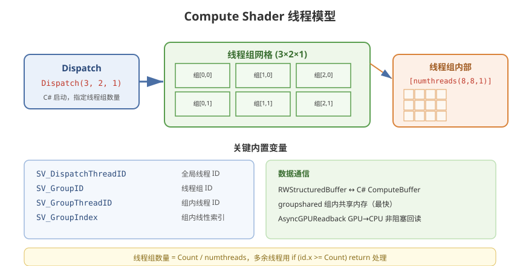

# 11 - Compute Shader 与 GPU 粒子

## 学习目标
- 理解 Compute Shader 的执行模型（线程组）
- 掌握 ComputeBuffer 和 Dispatch 的使用
- 用 Compute Shader 实现 GPU 粒子、流体等高效效果

---



## 1. Compute Shader 基础

Compute Shader (计算着色器) 让 GPU 执行**通用的并行计算**，不经过传统渲染管线。

### 1.1 与传统渲染对比
```
传统管线: 顶点 → 片元 → 深度 → 输出（面向画面）
Compute:  线程 0..N 并行执行任意计算（面向数据）
```

### 1.2 线程模型
```
Dispatch(3, 2, 1)      ← C# 端：启动线程组
  ├── 线程组 (3,2,1)
  └── 每组  [numthreads(8,8,1)] 线程
      └── 共 24×16×1 = 384 线程

线程组类似"分块"：GPU 一个 SM 调度一组
```

### 1.3 核心概念
| 概念 | 说明 |
|------|------|
| `Dispatch` | 启动计算，指定线程组数量 |
| `[numthreads]` | 每个线程组的线程数 |
| `SV_DispatchThreadID` | 全局线程 ID |
| `SV_GroupID` | 线程组 ID |
| `SV_GroupThreadID` | 组内线程 ID |
| `SV_GroupIndex` | 组内线程索引（线性） |
| `RWStructuredBuffer` | 可读写的结构化缓冲 |

---

## 2. 第一个 Compute Shader

### 2.1 Compute Shader (.compute)
```hlsl
#pragma kernel CSMain

// 可读写缓冲
RWStructuredBuffer<float3> ResultBuffer;

// 只读参数
float DeltaTime;

[numthreads(64, 1, 1)]
void CSMain(uint3 id : SV_DispatchThreadID)
{
    // id.x 是全局线程索引
    uint index = id.x;

    // 示例：计算随时间变化的颜色
    float phase = _Time.y * 0.5 + index * 0.01;
    ResultBuffer[index] = float3(
        sin(phase),
        sin(phase + 2.094),
        sin(phase + 4.188));
}
```

### 2.2 C# 调用
```csharp
using UnityEngine;
using System.Runtime.InteropServices;

public class ComputeExample : MonoBehaviour
{
    public ComputeShader computeShader;
    public int particleCount = 1000;
    public Material renderMaterial;

    private ComputeBuffer buffer;
    private float[] data;
    private int kernel;

    void Start()
    {
        // 1. 创建缓冲
        data = new float[particleCount * 3];
        buffer = new ComputeBuffer(particleCount, sizeof(float) * 3);

        // 2. 找到核函数
        kernel = computeShader.FindKernel("CSMain");

        // 3. 绑定
        computeShader.SetBuffer(kernel, "ResultBuffer", buffer);
        computeShader.SetFloat("DeltaTime", Time.deltaTime);

        // 4. Dispatch（启动 16 个线程组，每组 64 线程）
        int groupSize = particleCount / 64;
        computeShader.Dispatch(kernel, groupSize, 1, 1);
    }

    void Update()
    {
        computeShader.SetFloat("DeltaTime", Time.deltaTime);
        computeShader.Dispatch(kernel, particleCount / 64, 1, 1);
        renderMaterial.SetBuffer("_ParticleBuffer", buffer);
    }

    void OnDestroy()
    {
        buffer?.Release();
    }
}
```

---

## 3. GPU 粒子系统

用 Compute Shader 更新粒子位置，GPU 直接渲染，**CPU 零负担**。

### 3.1 粒子数据定义
```hlsl
// Compute 中粒子结构
struct Particle
{
    float3 position;
    float3 velocity;
    float life;        // 剩余生命
    float maxLife;     // 最大生命
    float4 color;
};
RWStructuredBuffer<Particle> Particles;
```

### 3.2 粒子更新核函数
```hlsl
#pragma kernel UpdateParticles

RWStructuredBuffer<Particle> Particles;
float DeltaTime;
float3 EmitterPos;
uint ParticleCount;

// 随机函数
float rand(float2 co)
{
    return frac(sin(dot(co, float2(12.9898, 78.233))) * 43758.5453);
}

[numthreads(64, 1, 1)]
void UpdateParticles(uint3 id : SV_DispatchThreadID)
{
    uint i = id.x;
    if (i >= ParticleCount) return;

    Particle p = Particles[i];

    p.life -= DeltaTime;
    if (p.life <= 0)
    {
        // 重生粒子（从发射点喷出）
        p.position = EmitterPos;
        float angle = rand(float2(i, 1)) * 6.28318;
        float speed = 2.0 + rand(float2(i, 2)) * 3.0;
        p.velocity = float3(cos(angle) * speed, 2.0, sin(angle) * speed);
        p.maxLife = p.life = 1.5 + rand(float2(i, 3));
        p.color = float4(1, 0.7, 0.3, 1);
    }
    else
    {
        // 物理更新：重力 + 阻尼
        p.velocity.y -= 9.8 * DeltaTime;
        p.position += p.velocity * DeltaTime;

        // 生命周期颜色衰减
        float t = p.life / p.maxLife;
        p.color.a = t;
        p.color.rgb = lerp(float3(0.3,0,0), float3(1,0.6,0.2), t);
    }

    Particles[i] = p;
}
```

### 3.3 粒子渲染 Shader
```hlsl
Shader "Custom/ParticleRenderer"
{
    SubShader
    {
        Pass
        {
            Blend One One
            ZWrite Off

            HLSLPROGRAM
            #pragma vertex vert
            #pragma fragment frag
            #include "Packages/com.unity.render-pipelines.universal/ShaderLibrary/Core.hlsl"

            // 与 Compute 一致的结构
            struct Particle
            {
                float3 position;
                float3 velocity;
                float life;
                float maxLife;
                float4 color;
            };

            StructuredBuffer<Particle> _ParticleBuffer;
            float _ParticleSize;

            struct Attributes
            {
                float4 positionOS : POSITION;
            };

            struct Varyings
            {
                float4 positionCS : SV_POSITION;
                float4 color : COLOR;
            };

            Varyings vert(Attributes IN, uint instanceID : SV_InstanceID)
            {
                Varyings OUT;
                Particle p = _ParticleBuffer[instanceID];

                // 粒子作为 billboard（面向相机）
                float3 worldPos = p.position;
                float3 viewPos = TransformWorldToView(worldPos);
                viewPos.xy += IN.positionOS.xy * _ParticleSize * p.life / p.maxLife;

                OUT.positionCS = TransformViewToHClip(viewPos);
                OUT.color = p.color;
                return OUT;
            }

            float4 frag(Varyings IN) : SV_Target
            {
                return IN.color;
            }
            ENDHLSL
        }
    }
}
```

### 3.4 C# 粒子系统控制器
```csharp
public class GPUParticleController : MonoBehaviour
{
    public ComputeShader particleCompute;
    public Material particleMaterial;
    public int particleCount = 10000;
    public float particleSize = 0.05f;

    private ComputeBuffer particleBuffer;
    private int kernel;
    private int stride = 32; // float3 + float3 + float + float + float4

    void Start()
    {
        kernel = particleCompute.FindKernel("UpdateParticles");
        particleBuffer = new ComputeBuffer(particleCount, stride, ComputeBufferType.Default);

        particleCompute.SetBuffer(kernel, "Particles", particleBuffer);
        particleCompute.SetInt("ParticleCount", particleCount);

        particleMaterial.SetBuffer("_ParticleBuffer", particleBuffer);
        particleMaterial.SetFloat("_ParticleSize", particleSize);

        // 通过 DrawProcedural 直接渲染 GPU 粒子
        // (配合 Graphics.DrawProcedural)
    }

    void Update()
    {
        particleCompute.SetFloat("DeltaTime", Time.deltaTime);
        particleCompute.SetVector("EmitterPos", transform.position);
        particleCompute.Dispatch(kernel, particleCount / 64, 1, 1);

        // 渲染
        Bounds bounds = new Bounds(transform.position, new Vector3(20, 20, 20));
        Graphics.DrawProcedural(particleMaterial, bounds,
            MeshTopology.Quads, 4, particleCount, null);
    }

    void OnDestroy()
    {
        particleBuffer?.Release();
    }
}
```

---

## 4. 数据交换：C# ↔ Compute

### 4.1 ComputeBuffer 类型
```csharp
ComputeBufferType.Default;              // 只读/读
ComputeBufferType.Raw;                  // 原始字节
ComputeBufferType.Append;               // 追加式（可计数）
ComputeBufferType.Structured;           // 结构化（常用）
ComputeBufferType.Counter;              // 计数缓冲
```

### 4.2 数据回读（慢，慎用）
```csharp
// 从 GPU 读回 CPU（阻塞管线，尽量避免每帧调用）
float[] cpuData = new float[particleCount * 3];
buffer.GetData(cpuData);
```

### 4.3 AsyncReadback（非阻塞，推荐）
```csharp
AsyncGPUReadbackRequest request = AsyncGPUReadback.Request(buffer);
// 延迟检查是否完成
StartCoroutine(WaitForReadback(request));
```

---

## 5. 高级：流体模拟 (Splat)

```
原理:
  每帧把流体速度/密度存储在两个 Buffer 中
  核函数 A: 计算速度散度 → 压力
  核函数 B: 投影修正速度（无散度）
  核函数 C: 平流更新密度

  ┌───────┐    ┌───────┐
  │  速度  │ ←→ │  密度  │
  └───────┘    └───────┘
     (双缓冲交替读写)
```

```hlsl
// 简单流体核心（雅可比迭代压力求解）
#pragma kernel JacobiPressure
RWStructuredBuffer<float> Pressure;
RWStructuredBuffer<float> Divergence;
uint Width;
float Alpha;

[numthreads(8, 8, 1)]
void JacobiPressure(uint3 id : SV_DispatchThreadID)
{
    uint idx = id.y * Width + id.x;

    float b = Divergence[idx];
    // 简单 4 邻域平均
    float sum = 0;
    sum += (id.x > 0)      ? Pressure[idx - 1] : 0;
    sum += (id.x < Width-1) ? Pressure[idx + 1] : 0;
    sum += (id.y > 0)      ? Pressure[idx - Width] : 0;
    sum += (id.y < Width-1) ? Pressure[idx + Width] : 0;

    Pressure[idx] = (sum + Alpha * b) / 4.0;
}
```

---

## 6. Compute Shader 性能要点

- **Buffer 大小**：线程组数量需能被 numthreads 整除，多余线程用 `if (i >= Count) return;` 处理
- **分支一致性**：线程组内尽量走同一分支（Warp Divergence）
- **共享内存** `groupshared` 用于组内数据共享，性能极高
- **双缓冲**：读写交替避免数据竞争
- **平台支持**：WebGL1 不支持，OpenGL ES 3.1+ / Metal / DX11+ 支持

---

## 7. 学习检查点

- [ ] 理解 Dispatch / 线程组 / numthreads 的关系
- [ ] 能创建 ComputeBuffer 并做双向数据传递
- [ ] 实现一个 GPU 粒子系统
- [ ] 理解双缓冲和线程组内通信的基本思想
