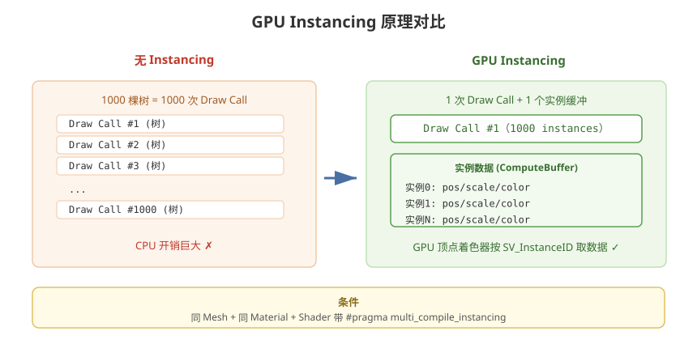

# 12 - GPU Instancing 与程序化渲染

## 学习目标
- 理解 GPU Instancing 的原理和适用场景
- 掌握 DrawMeshInstanced / DrawProcedural / Graphics.RenderMesh
- 结合 Compute Shader 实现百万级物体渲染

---



## 1. GPU Instancing 原理

GPU Instancing 让 GPU **一次渲染大量相同网格**，每实例只传差异数据（位置/颜色等），大幅减少 Draw Call。

### 1.1 对比
```
非 Instancing:  1000 棵树 = 1000 次 Draw Call
GPU Instancing: 1000 棵树 = 1 次 Draw Call (1000 instances)
```

### 1.2 限制
- 必须是**同一个 Mesh + 同一个 Material**
- 变体差异受限（属性通过 `UNITY_INSTANCING_BUFFER` 传入）
- 材质不同 / Mesh 不同无法合批

---

## 2. Shader 中的 Instancing

### 2.1 实例化变量声明
```hlsl
Shader "Custom/InstancedGrass"
{
    Properties { _Color ("Color", Color) = (1,1,1,1) }

    SubShader
    {
        Pass
        {
            HLSLPROGRAM
            #pragma vertex vert
            #pragma fragment frag
            #pragma multi_compile_instancing    // 开启实例化变体

            #include "Packages/com.unity.render-pipelines.universal/ShaderLibrary/Core.hlsl"

            CBUFFER_START(UnityPerMaterial)
                float4 _Color;
            CBUFFER_END

            // 实例化属性：每实例独有
            UNITY_INSTANCING_BUFFER_START(Props)
                UNITY_DEFINE_INSTANCED_PROP(float4, _InstanceColor)
            UNITY_INSTANCING_BUFFER_END(Props)

            struct Attributes
            {
                float4 positionOS : POSITION;
                UNITY_VERTEX_INPUT_INSTANCE_ID   // 实例 ID
            };

            struct Varyings
            {
                float4 positionCS : SV_POSITION;
                float4 color : TEXCOORD0;
                UNITY_VERTEX_OUTPUT_STEREO
            };

            Varyings vert(Attributes IN)
            {
                Varyings OUT;
                // 必须调用：初始化实例 ID
                UNITY_SETUP_INSTANCE_ID(IN);

                OUT.positionCS = TransformObjectToHClip(IN.positionOS.xyz);
                OUT.color = UNITY_ACCESS_INSTANCED_PROP(Props, _InstanceColor);
                return OUT;
            }

            float4 frag(Varyings IN) : SV_Target
            {
                return IN.color * _Color;
            }
            ENDHLSL
        }
    }
}
```

---

## 3. C# 实例化渲染

### 3.1 普通场景实例化
```csharp
using UnityEngine;
using System.Collections.Generic;

public class InstancingRenderer : MonoBehaviour
{
    public Mesh mesh;
    public Material material;
    public int instanceCount = 1000;

    private List<Matrix4x4> matrices = new List<Matrix4x4>();
    private List<Vector4> colors = new List<Vector4>();

    void Start()
    {
        // 生成实例数据
        for (int i = 0; i < instanceCount; i++)
        {
            Vector3 pos = Random.insideUnitSphere * 50;
            pos.y = 0;
            Quaternion rot = Quaternion.Euler(0, Random.value * 360, 0);
            Vector3 scale = Vector3.one * Random.Range(0.5f, 2f);

            matrices.Add(Matrix4x4.TRS(pos, rot, scale));
            colors.Add(new Vector4(Random.value, Random.value, Random.value, 1));
        }
    }

    void Update()
    {
        material.SetVectorArray("_InstanceColors", colors);

        // 基础实例化：一次绘制所有实例
        // 限制：每批最多 1023 个实例（内置管线）
        Graphics.DrawMeshInstanced(mesh, 0, material, matrices);
    }

    // 批量实例化（支持更多）
    void RenderWithBatches()
    {
        const int batchSize = 1000;
        for (int start = 0; start < matrices.Count; start += batchSize)
        {
            int count = Mathf.Min(batchSize, matrices.Count - start);
            List<Matrix4x4> batch = matrices.GetRange(start, count);
            Graphics.DrawMeshInstanced(mesh, 0, material, batch);
        }
    }
}
```

### 3.2 属性块方式（MaterialPropertyBlock）
```csharp
void RenderWithPropertyBlock()
{
    MaterialPropertyBlock props = new MaterialPropertyBlock();
    // 只对指定实例传独立颜色（其他用材质默认）
    props.SetColor("_Color", Color.red);
    Graphics.DrawMeshInstanced(mesh, 0, material, matrices, props);
}
```

### 3.3 新版 API：Graphics.RenderMesh (URP)
```csharp
public class RenderMeshExample : MonoBehaviour
{
    public Mesh mesh;
    public Material material;

    void Update()
    {
        var matrix = Matrix4x4.TRS(transform.position, transform.rotation, transform.localScale);
        var rp = new RenderParams(material);
        rp.matProps = new MaterialPropertyBlock();
        rp.shadowCastingMode = UnityEngine.Rendering.ShadowCastingMode.On;

        // 用 GPU 批量渲染（支持 Instance Count 更大）
        Graphics.RenderMeshPrimitives(rp, mesh, 0, 1);
    }
}
```

---

## 4. DrawProcedural：无网格渲染

DrawProcedural **不依赖 Mesh**，完全由 Shader 顶点着色器生成顶点。配合 Compute Shader 可实现百万粒子。

### 4.1 Shader 侧
```hlsl
Shader "Custom/ProceduralInstancing"
{
    SubShader
    {
        Pass
        {
            HLSLPROGRAM
            #pragma vertex vert
            #pragma fragment frag

            #include "Packages/com.unity.render-pipelines.universal/ShaderLibrary/Core.hlsl"

            // 实例数据来自 ComputeBuffer
            StructuredBuffer<float4> _InstanceData;
            float _Size;

            struct Attributes
            {
                uint instanceID : SV_InstanceID;
            };

            struct Varyings
            {
                float4 positionCS : SV_POSITION;
                float4 color : COLOR;
            };

            Varyings vert(Attributes IN)
            {
                Varyings OUT;
                // 直接从 Buffer 读实例数据
                float4 data = _InstanceData[IN.instanceID];
                float3 worldPos = data.xyz;

                // 生成一个面向相机的四方形
                float3 viewPos = TransformWorldToView(worldPos);
                float4 quadCorners[4] = {
                    float4(-1, -1, 0, 1), float4(1, -1, 0, 1),
                    float4(-1, 1, 0, 1), float4(1, 1, 0, 1)
                };
                // 需要传入 vertex id 才能做四边形，这里用 instanceID 简化
                OUT.positionCS = TransformViewToHClip(viewPos);
                OUT.color = float4(1, 1, 1, 1);
                return OUT;
            }

            float4 frag(Varyings IN) : SV_Target
            {
                return IN.color;
            }
            ENDHLSL
        }
    }
}
```

### 4.2 C# 调用 DrawProcedural
```csharp
void RenderProcedural()
{
    // 每实例 4 个顶点（四边形）
    int vertexCount = particleCount * 4;
    int instanceCount = particleCount;

    Bounds bounds = new Bounds(Vector3.zero, Vector3.one * 100);
    material.SetBuffer("_InstanceData", instanceBuffer);
    material.SetFloat("_Size", size);

    Graphics.DrawProcedural(material, bounds, MeshTopology.Quads,
        vertexCount, instanceCount);
}
```

---

## 5. GPU Instancing + Compute Shader 最佳组合

**经典方案：百万树木/草/粒子**

```
流程:
  Compute Shader 更新实例数据 (位置/颜色/大小)
       ↓ (写入 ComputeBuffer)
  渲染 Pass: DrawMeshInstancedIndirect / DrawProceduralIndirect
       ↓
  顶点着色器读 Buffer 中的实例数据
       ↓
  一次 Draw Call 渲染所有实例
```

### 5.1 Indirect 版本（GPU 自动控制实例数）
```csharp
public class InstancedForest : MonoBehaviour
{
    public ComputeShader updateShader;
    public Material renderMaterial;
    public int count = 100000;

    private ComputeBuffer instanceBuffer;
    private ComputeBuffer argsBuffer;

    void Start()
    {
        // 实例数据：位置(3) + 缩放(3) + 颜色(3)
        instanceBuffer = new ComputeBuffer(count, sizeof(float) * 9);

        // 初始化随机数据（也可由 Compute 生成）
        float[] data = new float[count * 9];
        for (int i = 0; i < count; i++)
        {
            data[i * 9]     = Random.Range(-50, 50);
            data[i * 9 + 1] = 0;
            data[i * 9 + 2] = Random.Range(-50, 50);
            data[i * 9 + 3] = Random.Range(0.5f, 2f);   // 缩放
            data[i * 9 + 4] = 1;
            data[i * 9 + 5] = 1;
            data[i * 9 + 6] = Random.Range(0, 1f);     // 颜色
            data[i * 9 + 7] = Random.Range(0, 1f);
            data[i * 9 + 8] = Random.Range(0, 1f);
        }
        instanceBuffer.SetData(data);

        // args: 索引数、实例数、起始索引、起始实例、保留
        argsBuffer = new ComputeBuffer(5, sizeof(int), ComputeBufferType.IndirectArguments);
        argsBuffer.SetData(new int[] { meshVertexCount, count, 0, 0, 0 });

        renderMaterial.SetBuffer("_InstanceData", instanceBuffer);
    }

    void Update()
    {
        Bounds bounds = new Bounds(Vector3.zero, new Vector3(200, 200, 200));
        // 间接渲染：实例数由 GPU args 缓冲决定
        Graphics.DrawMeshInstancedIndirect(renderMesh, 0, renderMaterial, bounds, argsBuffer);
    }

    void OnDestroy()
    {
        instanceBuffer?.Release();
        argsBuffer?.Release();
    }
}
```

---

## 6. GPU Instancing 适用场景

| 场景 | 是否适合 | 原因 |
|------|----------|------|
| 树木/草/石头 | ✅ 非常适合 | 同网格同材质 |
| 子弹/敌人/玩家 | ✅ 适合 | 可合并同类 |
| 建筑/道具 | ⚠️ 部分适合 | 需同材质分组 |
| 角色（骨骼动画） | ❌ 不适合 | 骨骼动画无法直接实例化 |
| UI | ❌ 不适合 | Unity UI 有自己的合批 |

---

## 7. 常见问题

### 7.1 实例化失效
```
检查：
  1. Shader 是否包含 #pragma multi_compile_instancing
  2. 顶点着色器是否调用 UNITY_SETUP_INSTANCE_ID
  3. 材质是否 SRP Batcher 与 GPU Instancing 冲突
  4. 是否混用了 MaterialPropertyBlock（会导致无法合批）
```

### 7.2 URP 与 Instancing
```csharp
// URP 中开启 instancing
// Graphics Settings → SRP Settings → 确保 "GPU Instancing" 支持
// URP Asset → Advanced → Instancing 开关
```

---

## 8. 学习检查点

- [ ] 理解 GPU Instancing 原理和限制
- [ ] 能在 Shader 中声明实例化属性
- [ ] 掌握 DrawMeshInstanced / DrawProcedural
- [ ] 能组合 Compute Shader 实现 Indirect 渲染
