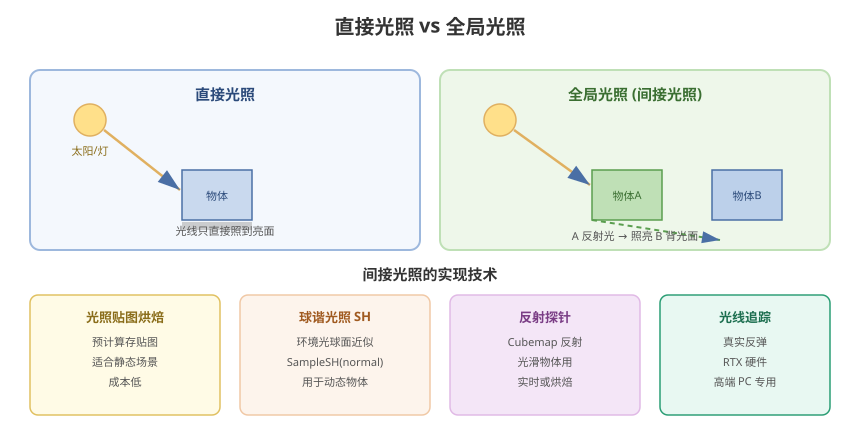

# 13 - 高级光照与全局光照

## 学习目标
- 理解全局光照 (GI) 的实现方式
- 掌握环境贴图、反射、球谐光照
- 掌握体积雾、光轴等高级光照效果

---



## 1. 全局光照概述

### 1.1 直接光照 vs 间接光照
```
直接光照: 光源直接照射（实时计算）
间接光照: 光在物体间反弹（本不可见，需模拟）

最终光照 = 直接光照 + 间接光照
```

### 1.2 实现方式
| 方式 | 原理 | 实时 | 成本 | 适用 |
|------|------|------|------|------|
| 烘焙光照图 | 预计算存贴图 | 否 | 低 | 静态场景 |
| 反射探针 | 预计算反射 | 是 | 中 | 光滑物体 |
| Light Probe | 采样点光照插值 | 是 | 低 | 动态物体 |
| 球谐光照 | 简化环境光 | 是 | 低 | 低成本 GI |
| **SSGI/Screen Space GI** | 屏幕空间近似 | 是 | 高 | 高端 PC |
| 光线追踪 | 真实反弹 | 是 | 极高 | 高端 PC |

---

## 2. 环境贴图反射

### 2.1 Cubemap 反射
```hlsl
// URP 获取环境贴图
float3 reflectDir = reflect(-viewDirWS, normalWS);

// 环境反射
float mip = 0;
float3 envColor = SAMPLE_TEXTURECUBE_LOD(unity_SpecCube0, samplerunity_SpecCube0,
    reflectDir, mip).rgb;
```

### 2.2 反射探针 (Reflection Probe)
```
创建: GameObject → Light → Reflection Probe
属性: Type (Baked/Realtime)、Resolution、Refresh Mode
用途: 光滑物体（金属、水面）的反射
```

```csharp
// 在 C# 中触发实时反射探针刷新
ReflectionProbe probe = GetComponent<ReflectionProbe>();
probe.RenderProbe();
```

### 2.3 视差环境映射 (PPM)
```hlsl
// 用高度图做视差偏移，让平面反射更立体
float3 PlanarReflection(float3 viewDir, float3 normal, float height)
{
    // 视差偏移
    float3 offset = viewDir / (viewDir.z + 0.001) * height * 0.5;
    return reflect(-viewDir + offset, normal);
}
```

---

## 3. 球谐光照 (Spherical Harmonics)

球谐函数 (SH) 用一组基函数近似低频环境光，成本极低。

### 3.1 原理
```
环境光 → 球面上每个方向的亮度
用 3 个系数 (L0) + 5 个系数 (L1) 的线性组合近似
→ 只需 3 个向量 (RGB 各一个 SH 系数向量)
```

### 3.2 在 Shader 中获取
```hlsl
// URP: 直接采样 SH
float3 ambient = SampleSH(normalWS);

// 手动使用 SH 系数（URP 自动填充）
float3 ambient = SHEvalLinearL0L1(normalWS, _SHAr, _SHAg, _SHAb);
```

### 3.3 自定义 SH 环境光
```hlsl
// 手动构建简单 SH（示例：单一方向的环境光）
float3 SimpleSH(float3 normal)
{
    // 模拟从上方来的柔和环境光
    float up = saturate(normal.y) * 0.6;      // 顶部更亮
    float down = saturate(-normal.y) * 0.1;   // 底部微弱
    float3 sky = float3(0.4, 0.5, 0.7);       // 天空色
    float3 ground = float3(0.2, 0.15, 0.1);   // 地面色
    return lerp(ground, sky, up + down);
}
```

---

## 4. 光照探针 (Light Probes)

Light Probes 为**动态物体**提供烘焙好的间接光照。

```
[Unity 场景]
  (Probe)  (Probe)  (Probe)
  (Probe)  [Player] (Probe)  ← 动态物体在探针之间插值
  (Probe)  (Probe)  (Probe)
```

### 4.1 配置
```
Lighting 窗口 → Light Probes → Generate
```
- 放置探针覆盖动态物体移动区域
- 探针越密，间接光照插值越平滑

### 4.2 在 Shader 中使用
```hlsl
// Unity 自动将插值结果填入 _LightProbeData
float3 indirect = SampleSH(normalWS);
// 或
float3 indirect = SampleLightmap(uv, normalWS);
```

---

## 5. 体积光 (Volumetric Light)

### 5.1 体积雾
```hlsl
// 视线方向步进采样（Ray Marching）
float3 GetVolumeLight(float3 worldPos, float3 viewDir, Light mainLight)
{
    const int STEPS = 16;
    float3 sampleDir = -viewDir;
    float density = 0;

    for (int i = 0; i < STEPS; i++)
    {
        float t = (i + 0.5) / STEPS * _VolumeDistance;
        float3 samplePos = worldPos + sampleDir * t;

        // 简化：用噪声密度
        float noise = fbm(samplePos.xz * _DensityScale + samplePos.y * 0.2, 3);
        density += noise * _Density;
    }
    density /= STEPS;

    // 阴影采样（体积光核心：光源方向遮挡）
    float shadow = GetMainLightShadow(samplePos);

    return mainLight.color * density * shadow;
}
```

### 5.2 URP 体积光（Renderer Feature）
```csharp
// 用后处理实现简易体积光
public class VolumeLightPass : ScriptableRenderPass
{
    public override void Execute(ScriptableRenderContext context, ref RenderingData renderingData)
    {
        CommandBuffer cmd = CommandBufferPool.Get("VolumeLight");

        // 把太阳方向、位置传给 Shader
        Vector4 lightPos = GetLightPositionWS();
        cmd.SetGlobalVector("_LightPositionWS", lightPos);

        // Blit 后处理
        cmd.Blit(source, tempTexture, volumeLightMaterial);
        cmd.Blit(tempTexture, target);
        context.ExecuteCommandBuffer(cmd);
        CommandBufferPool.Release(cmd);
    }
}
```

---

## 6. 视差/视锥大气散射

### 6.1 大气散射原理
```
阳光穿过大气 → 瑞利散射 (蓝色) + 米氏散射 (白色)
相机位置高度决定看到的效果
```

### 6.2 简化实现
```hlsl
// 简易大气散射（外发光效果）
float4 frag(Varyings IN) : SV_Target
{
    // 视线方向
    float3 viewDir = normalize(GetWorldSpaceViewDir(IN.positionWS));

    // 太阳方向
    float sunDot = dot(viewDir, _SunDirection);

    // 大气色（天顶蓝、地平线白）
    float3 zenith = float3(0.2, 0.45, 0.9);
    float3 horizon = float3(0.85, 0.9, 0.95);
    float h = saturate(viewDir.y);

    // 瑞利散射（天顶）
    float3 rayleigh = lerp(horizon, zenith, h);

    // 米氏散射（太阳周围光晕）
    float mie = pow(saturate(sunDot), _MieExponent);

    return float4(rayleigh + float3(1,0.9,0.7) * mie * _MieStrength, 1);
}
```

---

## 7. 光线追踪 (Ray Tracing)

### 7.1 Unity Ray Tracing
```
支持的 API: DX12 / Vulkan
配置: HDRP → Ray Tracing Settings
```

### 7.2 基本概念
| 技术 | 说明 |
|------|------|
| RTAO | 光线追踪环境光遮蔽 |
| RTGI | 光线追踪全局光照 |
| RTReflections | 光线追踪反射 |
| RTSkyLighting | 光线追踪天空光照 |

### 7.3 Shader 中使用光线追踪
```hlsl
// 自定义 Ray Tracing Shader
#pragma raytracing TestRayTracing

RWTexture2D<float4> Output;
float4x4 _CameraToWorld;

// 场景数据（需要生成 TLAS）
RaytracingAccelerationStructure _Scene;

struct RayPayload
{
    float3 color;
};

[shader("raygeneration")]
void RayGen()
{
    // 屏幕坐标
    uint2 index = DispatchRaysIndex().xy;
    float2 dims = DispatchRaysDimensions().xy;
    float2 d = (index / dims * 2 - 1);

    // 生成光线
    RayDesc ray;
    ray.Origin = _CameraToWorld._m03_m13_m23;
    ray.Direction = ...;  // 相机射线
    ray.TMin = 0.001;
    ray.TMax = 1000;

    RayPayload payload = { float3(0,0,0) };
    TraceRay(_Scene, 0, 0xFF, 0, 0, 0, ray, payload);

    Output[index] = float4(payload.color, 1);
}

[shader("closesthit")]
void ClosestHit(inout RayPayload payload, in BuiltInTriangleIntersectionAttributes attr)
{
    // 命中返回红色（示例）
    payload.color = float3(1, 0, 0);
}
```

> 注意：光线追踪仅高端 PC 可用，需支持 DX12 硬件 (RTX)

---

## 8. 高级光照效果清单

| 效果 | 难度 | 实现 | 应用 |
|------|------|------|------|
| 环境遮蔽 (AO) | 中 | SSAO / 烘焙 | 物体接触处暗角 |
| 接触阴影 | 中 | 屏幕空间 | 角色脚底阴影 |
| 自发光爆光 | 低 | Emission 属性 | 发光 UI |
| 次表面散射 (SSS) | 高 | 预积分 + 光衰减 | 皮肤/蜡烛 |
| 焦散 (Caustics) | 高 | 折射 + 焦点计算 | 水底光斑 |
| 闪烁光 (Flicker) | 低 | 噪声 + 明暗 | 灯/火把 |

### 8.1 次表面散射 (SSS) 简化
```hlsl
// 用 3 个 wrap 衰减模拟光穿透
float3 SSS(float NdotL, float thickness)
{
    // Wrap 光照：背光也能透光
    float s1 = saturate(NdotL * 0.5 + 0.5) * thickness;

    // 多层不同色（红皮透光感）
    float3 sss = float3(
        pow(s1, 4.0) * _ThicknessR,   // 红
        pow(s1, 8.0) * _ThicknessG,   // 绿
        pow(s1, 12.0) * _ThicknessB); // 蓝
    return sss;
}
```

---

## 9. 学习检查点

- [ ] 理解直接光照与间接光照的区别
- [ ] 掌握球谐光照和 Light Probe 的使用
- [ ] 能实现体积雾/大气散射等高级效果
- [ ] 了解光线追踪的基本原理和局限
