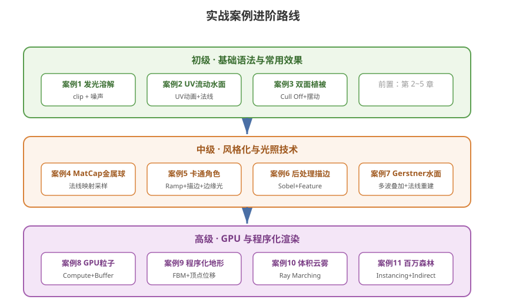

# 14 - Shader 实战案例合集（初中高级递进）

## 说明
本章从**初级 → 中级 → 高级**递进，每个案例给出完整可运行的 Shader/C# 代码与原理讲解。建议按顺序逐个动手实现，每个案例都总结**关键知识点**和**易错点**。

---



## 目录
| 级别 | 案例 | 核心知识点 |
|------|------|-----------|
| 初级 | 案例 1：发光溶解 | Alpha Clip、时间动画、边缘色 |
| 初级 | 案例 2：UV 流动水面 | UV 变换、多层纹理叠加 |
| 初级 | 案例 3：双面植被 | Cull Off、背面法线翻转、顶点摆动 |
| 中级 | 案例 4：MatCap 金属球 | 观察空间法线映射 |
| 中级 | 案例 5：完整卡通角色 | Ramp + 描边 + 边缘光组合 |
| 中级 | 案例 6：屏幕后处理描边 | 深度/法线 Sobel、Renderer Feature |
| 中级 | 案例 7：Gerster 波浪水面 | 多波叠加、法线重建、移动端水 |
| 高级 | 案例 8：GPU 粒子系统 | Compute Shader + DrawProcedural |
| 高级 | 案例 9：程序化地形 | FBM 噪声 + 顶点位移 + 颜色混合 |
| 高级 | 案例 10：体积云雾 | Ray Marching、噪声密度 |
| 高级 | 案例 11：百万森林 | GPU Instancing + Indirect |

---

# 一、初级案例

## 案例 1：发光溶解 (Dissolve)

### 效果
物体随时间从完整状态逐渐溶解消失，边缘有发光效果。常用于敌人死亡、场景切换。

### 完整 Shader (URP)
```hlsl
Shader "Custom/Case01_Dissolve"
{
    Properties
    {
        _MainTex ("Albedo", 2D) = "white" {}
        _DissolveTex ("Dissolve Noise", 2D) = "white" {}
        _Amount ("Dissolve Amount", Range(0,1)) = 0
        _EdgeWidth ("Edge Width", Range(0,0.5)) = 0.1
        _EdgeColor ("Edge Color", Color) = (1,0.5,0,1)
    }

    SubShader
    {
        Tags { "RenderType" = "Opaque" }

        Pass
        {
            HLSLPROGRAM
            #pragma vertex vert
            #pragma fragment frag
            #include "Packages/com.unity.render-pipelines.universal/ShaderLibrary/Core.hlsl"

            TEXTURE2D(_MainTex);     SAMPLER(sampler_MainTex);
            TEXTURE2D(_DissolveTex); SAMPLER(sampler_DissolveTex);
            float4 _MainTex_ST;
            float _Amount, _EdgeWidth;
            float4 _EdgeColor;

            struct Attributes
            {
                float4 positionOS : POSITION;
                float2 uv : TEXCOORD0;
            };

            struct Varyings
            {
                float4 positionCS : SV_POSITION;
                float2 uv : TEXCOORD0;
            };

            Varyings vert(Attributes IN)
            {
                Varyings OUT;
                OUT.positionCS = TransformObjectToHClip(IN.positionOS.xyz);
                OUT.uv = TRANSFORM_TEX(IN.uv, _MainTex);
                return OUT;
            }

            float4 frag(Varyings IN) : SV_Target
            {
                float4 base = SAMPLE_TEXTURE2D(_MainTex, sampler_MainTex, IN.uv);

                // 1. 采样噪声（作为溶解的"随机"依据）
                float noise = SAMPLE_TEXTURE2D(_DissolveTex, sampler_DissolveTex, IN.uv).r;

                // 2. 关键：clip 丢弃噪声小于溶解度的像素
                float cutoff = noise - _Amount;
                clip(cutoff);

                // 3. 边缘发光：cutoff 越接近 0 越靠近边缘
                float edge = smoothstep(0, _EdgeWidth, cutoff);
                float3 color = lerp(_EdgeColor.rgb, base.rgb, edge);

                // 4. 边缘提亮
                color += _EdgeColor.rgb * (1.0 - edge) * 2.0;

                return float4(color, base.a);
            }
            ENDHLSL
        }
    }
}
```

### C# 控制溶解
```csharp
public class DissolveController : MonoBehaviour
{
    public Material material;
    public float duration = 2f;
    private float progress;

    void Update()
    {
        progress += Time.deltaTime / duration;
        material.SetFloat("_Amount", progress);
        if (progress >= 1) Destroy(gameObject);
    }
}
```

### 关键知识点
1. `clip(x)`：x < 0 时丢弃该像素（配合不透明渲染）
2. 噪声纹理提供每个像素不同的"溶解时刻"
3. `smoothstep(0, width, cutoff)` 制作边缘过渡带

### 易错点
- 噪声纹理要设置 **Wrap Mode = Repeat**，否则接缝明显
- 溶解完成后物体应 `Destroy` 而不是继续渲染

---

## 案例 2：UV 流动水面

### 效果
水面纹理随时间滚动，两层纹理不同速度叠加产生立体流动感。

### 完整 Shader
```hlsl
Shader "Custom/Case02_FlowWater"
{
    Properties
    {
        _WaterTex ("Water Texture", 2D) = "bump" {}
        _FlowSpeed ("Flow Speed", Vector) = (0.1, 0.3, 0, 0)
        _Color ("Water Color", Color) = (0.2,0.5,0.8,0.6)
        _Gloss ("Gloss", Range(0,1)) = 0.8
    }

    SubShader
    {
        Tags { "Queue" = "Transparent" "RenderType" = "Transparent" }
        Blend SrcAlpha OneMinusSrcAlpha
        ZWrite Off

        Pass
        {
            HLSLPROGRAM
            #pragma vertex vert
            #pragma fragment frag
            #include "Packages/com.unity.render-pipelines.universal/ShaderLibrary/Core.hlsl"

            TEXTURE2D(_WaterTex); SAMPLER(sampler_WaterTex);
            float4 _WaterTex_ST;
            float2 _FlowSpeed;
            float4 _Color;
            float _Gloss;

            struct Attributes
            {
                float4 positionOS : POSITION;
                float2 uv : TEXCOORD0;
            };

            struct Varyings
            {
                float4 positionCS : SV_POSITION;
                float2 uv : TEXCOORD0;
            };

            Varyings vert(Attributes IN)
            {
                Varyings OUT;
                OUT.positionCS = TransformObjectToHClip(IN.positionOS.xyz);
                OUT.uv = TRANSFORM_TEX(IN.uv, _WaterTex);
                return OUT;
            }

            float4 frag(Varyings IN) : SV_Target
            {
                // 1. 两层不同速度的 UV
                float2 uv1 = IN.uv + _FlowSpeed * _Time.y;
                float2 uv2 = IN.uv - _FlowSpeed * _Time.y * 0.5;

                // 2. 采样两层纹理
                float4 tex1 = SAMPLE_TEXTURE2D(_WaterTex, sampler_WaterTex, uv1);
                float4 tex2 = SAMPLE_TEXTURE2D(_WaterTex, sampler_WaterTex, uv2);

                // 3. 混合（法线贴图用叠加更自然）
                float3 normal1 = UnpackNormal(tex1);
                float3 normal2 = UnpackNormal(tex2);
                float3 combinedNormal = normalize(normal1 + normal2);

                // 4. 简单高光（用混合法线）
                float3 lightDir = normalize(float3(0.5, 1, 0.3));
                float3 viewDir = normalize(float3(0, 1, 0.5));
                float3 halfDir = normalize(lightDir + viewDir);
                float spec = pow(saturate(dot(combinedNormal, halfDir)), _Gloss * 64);

                // 5. 输出（水面颜色 + 高光 + 透明度）
                float3 color = _Color.rgb + spec * float3(1, 1, 1);
                return float4(color, _Color.a);
            }
            ENDHLSL
        }
    }
}
```

### 关键知识点
1. `_Time.y`：秒数，驱动 UV 滚动
2. 法线贴图 `UnpackNormal` 解码 + 两层叠加
3. 透明队列 + `Blend SrcAlpha OneMinusSrcAlpha` + `ZWrite Off`

### 易错点
- 两层 UV 速度要**相反或不同**，否则两层纹理纹路叠在一起不动
- 透明物体注意渲染顺序，不要和多个透明物交错

---

## 案例 3：双面植被（草丛/树叶）

### 效果
双面可见 + 顶点随风摆动，用于大量低模植被。

### 完整 Shader
```hlsl
Shader "Custom/Case03_Grass"
{
    Properties
    {
        _BaseMap ("Base", 2D) = "white" {}
        _Color ("Tint", Color) = (1,1,1,1)
        _WindStrength ("Wind Strength", Range(0,1)) = 0.2
        _WindSpeed ("Wind Speed", Range(0,5)) = 1
    }

    SubShader
    {
        Tags { "RenderType" = "Opaque" }
        Cull Off   // 关键1：双面渲染

        Pass
        {
            HLSLPROGRAM
            #pragma vertex vert
            #pragma fragment frag
            #include "Packages/com.unity.render-pipelines.universal/ShaderLibrary/Core.hlsl"

            TEXTURE2D(_BaseMap); SAMPLER(sampler_BaseMap);
            float4 _BaseMap_ST;
            float4 _Color;
            float _WindStrength, _WindSpeed;

            struct Attributes
            {
                float4 positionOS : POSITION;
                float3 normalOS : NORMAL;
                float2 uv : TEXCOORD0;
            };

            struct Varyings
            {
                float4 positionCS : SV_POSITION;
                float2 uv : TEXCOORD0;
                float3 normalWS : TEXCOORD1;
                float3 viewDirWS : TEXCOORD2;
            };

            Varyings vert(Attributes IN)
            {
                Varyings OUT;
                float3 posOS = IN.positionOS.xyz;

                // 关键2：顶点随风摆动（根部不动）
                // uv.y 越高（越高处）摆动越大
                float heightFactor = IN.uv.y;

                // 基础正弦波
                float wave1 = sin(_Time.y * _WindSpeed + posOS.x * 2.0 + posOS.z) ;
                float wave2 = cos(_Time.y * _WindSpeed * 1.3 + posOS.z * 1.7);

                posOS.x += (wave1 * 0.5 + wave2 * 0.5) * _WindStrength * heightFactor;
                posOS.z += (wave1 * 0.3) * _WindStrength * heightFactor;

                OUT.positionCS = TransformObjectToHClip(posOS);
                OUT.uv = TRANSFORM_TEX(IN.uv, _BaseMap);

                VertexNormalInputs n = GetVertexNormalInputs(IN.normalOS);
                OUT.normalWS = n.normalWS;
                OUT.viewDirWS = GetWorldSpaceViewDir(TransformObjectToWorld(IN.positionOS.xyz));
                return OUT;
            }

            float4 frag(Varyings IN) : SV_Target
            {
                float4 tex = SAMPLE_TEXTURE2D(_BaseMap, sampler_BaseMap, IN.uv);

                // 关键3：双面法线翻转（背面光照一致）
                float3 normalWS = normalize(IN.normalWS);
                float3 viewDirWS = normalize(IN.viewDirWS);
                if (dot(normalWS, viewDirWS) < 0)
                    normalWS = -normalWS;

                // 简单漫反射
                float3 lightDir = normalize(float3(0.5, 1, 0.3));
                float NdotL = saturate(dot(normalWS, lightDir));

                return float4(tex.rgb * _Color.rgb * (NdotL * 0.8 + 0.2), tex.a);
            }
            ENDHLSL
        }
    }
}
```

### 关键知识点
1. `Cull Off` 双面渲染
2. **背面法线翻转**避免背光面全黑
3. 顶点 UV.y 作为摆动权重，保证根部固定

### 易错点
- 摆动幅度太大或频率过高会出现"跳变"
- 背面法线翻转要放在光照计算前

---

# 二、中级案例

## 案例 4：MatCap 金属球

### 效果
一个球体呈现烘焙好光源的金属质感，完全不用场景光照。见 08 章完整讲解，这里是**精简版+要点**。

```hlsl
float4 frag(Varyings IN) : SV_Target
{
    float3 normalWS = normalize(IN.normalWS);
    float3 viewDirWS = normalize(IN.viewDirWS);

    // 关键1：背面翻转（MatCap 经典处理）
    normalWS = dot(normalWS, viewDirWS) < 0 ? -normalWS : normalWS;

    // 关键2：法线转到观察空间，映射为 UV
    float3 normalVS = mul((float3x3)UNITY_MATRIX_V, normalWS);
    float2 uv = normalVS.xy * 0.5 + 0.5;

    // 关键3：直接采样 MatCap 纹理
    float4 matCap = SAMPLE_TEXTURE2D(_MatCapTex, sampler_MatCapTex, uv);

    // 关键4：和反照率混合
    return float4(IN.color.rgb * matCap.rgb, 1);
}
```

### 原理图
```
      观察空间法线
        N=(0,0,1)  →  UV=(0.5,0.5)  →  采样纹理中心
        N=(1,0,0)  →  UV=(1.0,0.5)  →  采样纹理右边缘
```

### 关键知识点
1. `UNITY_MATRIX_V` 世界→观察矩阵（法线直接乘 3x3 部分）
2. `normalVS.xy * 0.5 + 0.5` 把 [-1,1] 映射到 [0,1]
3. MatCap 一次采样代替完整光照，性能极高

### 易错点
- 法线要**归一化**后再转观察空间
- 翻转背面法线时用点积符号判断，防止朝向相反

---

## 案例 5：完整卡通角色渲染

### 效果
角色 = 基础 Ramp 色阶 + 描边 + 边缘光，这是二次元游戏标配。

### 主 Pass 关键代码
```hlsl
float4 frag(Varyings IN) : SV_Target
{
    float3 normalWS = normalize(IN.normalWS);
    float3 viewDirWS = normalize(IN.viewDirWS);
    Light light = GetMainLight();

    // 1. Ramp 卡通漫反射
    float NdotL = dot(normalWS, light.direction);
    float rampUV = NdotL * 0.5 + 0.5;
    float3 toon = SAMPLE_TEXTURE2D(_RampTex, sampler_RampTex, float2(rampUV, 0)).rgb;

    // 2. 硬阴影边界（可选）
    float shadow = smoothstep(_ShadowThreshold - 0.05, _ShadowThreshold + 0.05, NdotL);

    // 3. 边缘光（菲涅尔）
    float rim = pow(1 - saturate(dot(normalWS, viewDirWS)), _RimPower);

    // 4. 高光（阶梯化二次元高光）
    float3 halfDir = normalize(light.direction + viewDirWS);
    float NdotH = saturate(dot(normalWS, halfDir));
    float spec = step(_SpecThreshold, NdotH);

    // 5. 合成
    float3 base = SAMPLE_TEXTURE2D(_MainTex, sampler_MainTex, IN.uv).rgb;
    float3 color = base * toon * shadow * light.color;
    color += base * spec * _SpecColor.rgb;
    color += _RimColor.rgb * rim;
    return float4(color, 1);
}
```

### 描边 Pass（完整）
```hlsl
Pass
{
    Name "OUTLINE"
    Cull Front  // 只画背面作为轮廓
    ZWrite On

    HLSLPROGRAM
    #pragma vertex vert
    #pragma fragment frag
    #include "Packages/com.unity.render-pipelines.universal/ShaderLibrary/Core.hlsl"

    float _OutlineWidth;
    float4 _OutlineColor;

    struct A { float4 positionOS:POSITION; float3 normalOS:NORMAL; };
    struct V { float4 positionCS:SV_POSITION; };

    V vert(A IN)
    {
        V o;
        // 法线外扩（观察空间外扩可避免透视畸变）
        float3 normalWS = TransformObjectToWorldNormal(IN.normalOS);
        float3 posWS = TransformObjectToWorld(IN.positionOS.xyz);
        // 背面沿法线外扩
        posWS += normalWS * _OutlineWidth;
        o.positionCS = TransformWorldToHClip(posWS);
        return o;
    }
    float4 frag(V o) : SV_Target { return _OutlineColor; }
    ENDHLSL
}
```

### 关键知识点
1. **Ramp 贴图**：漫反射不再连续，而是查色阶表
2. **Cull Front 描边**：只画背面且外扩，轮廓均匀
3. `step()` 做出硬边二次元高光

### 易错点
- 描边宽度过大在屏幕边缘会失真（可用屏幕空间宽度修正）
- Ramp 贴图 Wrap 模式必须 **Clamp**，否则首尾接缝

---

## 案例 6：屏幕后处理描边 (Sobel)

### 效果
用深度/法线边缘检测为整个场景描边，实现水墨/漫画风格。

### 原理
```
Sobel 算子 = 检测像素与邻域的梯度
  ├─ 深度差异大 → 边缘
  └─ 法线差异大 → 边缘
```

### Shader
```hlsl
Shader "Hidden/Case06_Outline"
{
    SubShader
    {
        Cull Off ZWrite Off ZTest Always
        Pass
        {
            HLSLPROGRAM
            #pragma vertex Vert
            #pragma fragment Frag
            #include "Packages/com.unity.render-pipelines.universal/ShaderLibrary/Core.hlsl"

            TEXTURE2D(_MainTex); SAMPLER(sampler_MainTex);
            float4 _MainTex_TexelSize;

            // 深度纹理与法线纹理
            TEXTURE2D(_CameraDepthTexture); SAMPLER(sampler_CameraDepthTexture);
            TEXTURE2D(_CameraNormalsTexture); SAMPLER(sampler_CameraNormalsTexture);

            float _EdgeWidth;
            float _EdgeIntensity;
            float4 _EdgeColor;

            struct Attributes { float4 pos:POSITION; float2 uv:TEXCOORD0; };
            struct Varyings { float4 pos:SV_POSITION; float2 uv:TEXCOORD0; };

            Varyings Vert(Attributes IN)
            {
                Varyings OUT;
                OUT.pos = TransformObjectToHClip(IN.pos.xyz);
                OUT.uv = IN.uv;
                return OUT;
            }

            // 采样深度
            float SampleDepth(float2 uv)
            {
                float d = SAMPLE_TEXTURE2D(_CameraDepthTexture, sampler_CameraDepthTexture, uv).r;
                return LinearEyeDepth(d, _ZBufferParams);
            }

            // 深度 Sobel
            float DepthSobel(float2 uv)
            {
                float2 ts = _MainTex_TexelSize.xy * _EdgeWidth;
                float d00 = SampleDepth(uv + float2(-ts.x, -ts.y));
                float d01 = SampleDepth(uv + float2(0,     -ts.y));
                float d02 = SampleDepth(uv + float2(ts.x,  -ts.y));
                float d10 = SampleDepth(uv + float2(-ts.x, 0));
                float d12 = SampleDepth(uv + float2(ts.x,  0));
                float d20 = SampleDepth(uv + float2(-ts.x, ts.y));
                float d21 = SampleDepth(uv + float2(0,     ts.y));
                float d22 = SampleDepth(uv + float2(ts.x,  ts.y));

                float gx = -d00 - 2*d10 - d20 + d02 + 2*d12 + d22;
                float gy = -d00 - 2*d01 - d02 + d20 + 2*d21 + d22;
                return sqrt(gx*gx + gy*gy);
            }

            float4 Frag(Varyings IN) : SV_Target
            {
                float4 base = SAMPLE_TEXTURE2D(_MainTex, sampler_MainTex, IN.uv);

                // 边缘检测
                float edge = DepthSobel(IN.uv) * _EdgeIntensity;
                float outline = step(0.1, edge);   // 二值化

                // 描边混合
                float3 color = lerp(base.rgb, _EdgeColor.rgb, outline);
                return float4(color, 1);
            }
            ENDHLSL
        }
    }
}
```

### C# Renderer Feature（URP 接入）
```csharp
using UnityEngine;
using UnityEngine.Rendering;
using UnityEngine.Rendering.Universal;

public class OutlineRendererFeature : ScriptableRendererFeature
{
    public Material outlineMaterial;
    private OutlinePass pass;

    public override void Create()
    {
        pass = new OutlinePass(outlineMaterial);
    }

    public override void AddRenderPasses(ScriptableRenderer renderer, ref RenderingData renderingData)
    {
        renderer.EnqueuePass(pass);
    }

    class OutlinePass : ScriptableRenderPass
    {
        private Material mat;
        private RenderTargetIdentifier source;
        private RenderTargetHandle temp;

        public OutlinePass(Material m)
        {
            mat = m;
            renderPassEvent = RenderPassEvent.AfterRenderingTransparents;
            temp.Init("_TempRT");
        }

        public override void OnCameraSetup(CommandBuffer cmd, ref RenderingData renderingData)
        {
            source = renderingData.cameraData.renderer.cameraColorTarget;
        }

        public override void Execute(ScriptableRenderContext context, ref RenderingData renderingData)
        {
            CommandBuffer cmd = CommandBufferPool.Get();
            RenderTextureDescriptor desc = renderingData.cameraData.cameraTargetDescriptor;
            cmd.GetTemporaryRT(temp.id, desc);
            cmd.Blit(source, temp.Identifier());
            cmd.Blit(temp.Identifier(), source, mat);
            context.ExecuteCommandBuffer(cmd);
            cmd.ReleaseTemporaryRT(temp.id);
            CommandBufferPool.Release(cmd);
        }
    }
}
```

### 关键知识点
1. **深度纹理** `_CameraDepthTexture` 需 URP 开启 Depth Texture
2. **法线纹理** `_CameraNormalsTexture` 需开启 Normals
3. Sobel 是 3x3 梯度算子，检测边缘方向

### 易错点
- URP 需在 Asset 中勾选 `Depth Texture` / `Opaque Texture`
- 后处理 Blit 用 `cmd.Blit` 和临时 RT，不要直接读写

---

## 案例 7：Gerstner 波浪水面

### 效果
真实水波：多个 Gerstner 波叠加，顶点横向位移 + 法线重建。这是游戏水面的标准做法。

```hlsl
// Gerstner 波函数（返回位移和法线）
float3 GerstnerWave(
    float4 wave,  // x:方向角 y:波长 z:振幅 w:速度
    float3 p, float3 tangent, float3 binormal, out float3 normal)
{
    float steepness = wave.z * 20;   // 陡峭度
    float w = 6.28318 / wave.y;      // 频率
    float phase = w * dot(p, float3(wave.x, 0, 0)) + _Time.y * wave.w;
    float c = cos(phase);
    float s = sin(phase);
    float q = steepness / (w * wave.z * 10);

    // 位移
    float3 pos;
    pos.x = p.x + q * wave.x * c;
    pos.y = steepness * s;
    pos.z = p.z;

    // 法线
    normal.x = wave.x * w * q * c;
    normal.y = 1.0;
    normal.z = wave.y * w * q * c;
    return pos;
}

// 顶点着色器：叠加 3 个波
Varyings vert(Attributes IN)
{
    Varyings OUT;
    float3 pos = IN.positionOS.xyz;
    float3 tangent = float3(1, 0, 0);
    float3 binormal = float3(0, 0, 1);
    float3 normal = float3(0, 1, 0);

    // 定义 3 个波（不同方向/波长/速度）
    float4 w1 = float4(1, 8, 0.05, 1.2);
    float4 w2 = float4(0.6, 5, 0.08, 1.0);
    float4 w3 = float4(-0.8, 12, 0.03, 1.5);

    float3 n;
    pos = GerstnerWave(w1, pos, tangent, binormal, n); normal += n;
    pos = GerstnerWave(w2, pos, tangent, binormal, n); normal += n;
    pos = GerstnerWave(w3, pos, tangent, binormal, n); normal += n;

    OUT.positionCS = TransformObjectToHClip(pos);
    OUT.normalWS = normalize(TransformObjectToWorldNormal(normal));
    OUT.positionWS = TransformObjectToWorld(pos);
    return OUT;
}

// 片元：用重建法线做光照 + 反射
float4 frag(Varyings IN) : SV_Target
{
    float3 normalWS = normalize(IN.normalWS);
    float3 viewDir = normalize(GetWorldSpaceViewDir(IN.positionWS));

    // 菲涅尔（看水面越倾斜反射越强）
    float fresnel = pow(1.0 - saturate(dot(normalWS, viewDir)), 3);

    // 反射（用反射探针或简化天空色）
    float3 reflectDir = reflect(-viewDir, normalWS);
    float3 reflection = SAMPLE_TEXTURECUBE_LOD(_EnvMap, sampler_EnvMap, reflectDir, 0).rgb;

    // 漫反射
    Light light = GetMainLight();
    float NdotL = saturate(dot(normalWS, light.direction));

    // 合成：反射 * fresnel + 漫反射
    float3 waterColor = lerp(float3(0.05, 0.15, 0.3), float3(0.2, 0.4, 0.6), fresnel);
    float3 color = waterColor * NdotL * light.color;
    color += reflection * fresnel;
    return float4(color, 0.9);
}
```

### 关键知识点
1. Gerstner 波 = 正弦波 + **横向位移**（更真实水波）
2. 法线通过波参数解析重建（免法线贴图）
3. 菲涅尔控制反射强度（核心水面特征）

### 易错点
- 多个波要**方向不同**否则叠加成一个大波
- 法线要在世界空间归一化

---

# 三、高级案例

## 案例 8：GPU 粒子系统（完整版）

### 效果
10 万粒子全部在 GPU 上更新和渲染，CPU 几乎零负担。详见 11 章。

### Compute Shader (完整)
```hlsl
// ParticleUpdate.compute
#pragma kernel UpdateParticles

struct Particle
{
    float3 position;
    float3 velocity;
    float life;
    float maxLife;
};

RWStructuredBuffer<Particle> Particles;
float DeltaTime;
float3 EmitterPos;
float3 Gravity;
uint Count;

float rand(float2 co) { return frac(sin(dot(co, float2(12.9898, 78.233))) * 43758.5453); }

[numthreads(64, 1, 1)]
void UpdateParticles(uint3 id : SV_DispatchThreadID)
{
    if (id.x >= Count) return;
    Particle p = Particles[id.x];

    p.life -= DeltaTime;
    if (p.life <= 0)
    {
        // 重生
        float a = rand(float2(id.x, 0)) * 6.283;
        float sp = 1.5 + rand(float2(id.x, 1)) * 3;
        p.position = EmitterPos;
        p.velocity = float3(cos(a) * sp, 3, sin(a) * sp);
        p.maxLife = p.life = 1 + rand(float2(id.x, 2));
    }
    else
    {
        // 物理
        p.velocity += Gravity * DeltaTime;
        p.position += p.velocity * DeltaTime;
    }
    Particles[id.x] = p;
}
```

### C# 渲染 (DrawProceduralIndirect)
```csharp
using UnityEngine;
using UnityEngine.Rendering;

public class GPUParticles : MonoBehaviour
{
    public ComputeShader compute;
    public Material material;
    public int count = 100000;

    private ComputeBuffer particleBuffer;
    private ComputeBuffer argsBuffer;
    private int kernel;

    private static readonly int ParticlesID = Shader.PropertyToID("Particles");
    private static readonly int CountID = Shader.PropertyToID("Count");

    void Start()
    {
        kernel = compute.FindKernel("UpdateParticles");
        particleBuffer = new ComputeBuffer(count, sizeof(float) * 8); // 3+3+1+1
        compute.SetBuffer(kernel, ParticlesID, particleBuffer);
        compute.SetInt(CountID, count);

        // args: 顶点数(每粒子用四边形6顶点)、实例数、0,0,0
        argsBuffer = new ComputeBuffer(5, sizeof(int), ComputeBufferType.IndirectArguments);
        argsBuffer.SetData(new int[] { 6, count, 0, 0, 0 });

        material.SetBuffer(ParticlesID, particleBuffer);
    }

    void Update()
    {
        compute.SetFloat("DeltaTime", Time.deltaTime);
        compute.SetVector("EmitterPos", transform.position);
        compute.SetVector("Gravity", new Vector4(0, -9.8f, 0, 0));
        compute.Dispatch(kernel, count / 64, 1, 1);

        // 间接渲染（GPU 决定顶点数量）
        Bounds bounds = new Bounds(transform.position, Vector3.one * 100);
        Graphics.DrawProceduralIndirect(material, bounds, MeshTopology.Triangles, argsBuffer);
    }

    void OnDestroy()
    {
        particleBuffer?.Release();
        argsBuffer?.Release();
    }
}
```

### 渲染 Shader 要点
```hlsl
// 粒子 Shader：读取 Buffer，实例 ID 定位粒子
struct Particle { float3 position; float3 velocity; float life; float maxLife; };
StructuredBuffer<Particle> Particles;

Varyings vert(Attributes IN, uint instID : SV_InstanceID)
{
    Particle p = Particles[instID];
    // 用四边形生成 billboard（面向相机）
    float3 viewPos = TransformWorldToView(p.position);
    viewPos.xy += IN.positionOS.xy * _Size;
    OUT.positionCS = TransformViewToHClip(viewPos);
    return OUT;
}
```

### 关键知识点
1. `DrawProceduralIndirect` 参数由 GPU 缓冲控制
2. ComputeBuffer 布局必须与 Shader 结构体**逐字节一致**
3. `sv_instanceID` 访问每个粒子

### 易错点
- ComputeBuffer stride 用 `sizeof(float)*字段数`，别算错
- 释放缓冲用 `OnDestroy`，避免内存泄漏

---

## 案例 9：程序化地形渲染

### 效果
GPU 端用 FBM 噪声生成地形高度 + 分层配色 + 顶点光照，无需高度图。

### 顶点位移 + 片元着色
```hlsl
// 与 09 章配合：这是完整地形版
float fbm(float2 p, int oct)
{
    float v = 0, a = 0.5, s = 1.0, sum = 0;
    for (int i = 0; i < oct; i++)
    {
        v += a * hash(p * s);   // hash 噪声
        sum += a;
        a *= 0.5;
        s *= 2;
    }
    return v / sum;
}

Varyings vert(Attributes IN)
{
    Varyings OUT;
    float2 uv = IN.positionOS.xz * _Scale;

    // 分层噪声：大起伏 + 细节
    float height = fbm(uv, 5) * _Mountain;
    height += fbm(uv * 3, 3) * _Detail * 0.3;

    float3 pos = IN.positionOS.xyz;
    pos.y += height;

    OUT.positionCS = TransformObjectToHClip(pos);
    OUT.height = height;
    OUT.uv = uv;
    return OUT;
}

float4 frag(Varyings IN) : SV_Target
{
    float h = IN.height;

    // 高度分层配色（海/沙滩/草/山/雪）
    float3 water  = float3(0.1, 0.3, 0.5);
    float3 sand   = float3(0.76, 0.7, 0.5);
    float3 grass  = float3(0.2, 0.55, 0.2);
    float3 rock   = float3(0.4, 0.38, 0.35);
    float3 snow   = float3(0.9, 0.92, 0.95);

    float3 col = water;
    col = lerp(col, sand, smoothstep(0, 0.02, h));
    col = lerp(col, grass, smoothstep(0.05, 0.15, h));
    col = lerp(col, rock, smoothstep(0.25, 0.4, h));
    col = lerp(col, snow, smoothstep(0.6, 0.8, h));

    // 简化光照（用高度导数近似法线）
    float slope = fwidth(h);
    col *= 0.7 + 0.3 * saturate(1 - slope * 20);
    return float4(col, 1);
}
```

### 关键知识点
1. `fbm` 分形叠加：大起伏 + 细节
2. `smoothstep` 高度分层实现地形颜色过渡
3. `fwidth` 求导数近似坡度，做简单 AO

### 易错点
- 高度只位移 Y，注意 UV 用 xz 平面
- 细节八度太多性能差（移动端控制 ≤3）

---

## 案例 10：体积云雾 (Ray Marching)

### 效果
屏幕空间光线步进采样 3D 噪声密度，产生可穿越的体积云雾。

```hlsl
// 3D 噪声（简化值噪声）
float hash3(float3 p)
{
    p = frac(p * 0.3183 + 0.1);
    p *= 17.0;
    return frac(p.x * p.y * p.z * (p.x + p.y + p.z));
}

float noise3D(float3 p)
{
    float3 i = floor(p);
    float3 f = frac(p);
    f = f * f * (3 - 2 * f);

    float n = hash3(i);
    n = lerp(n, hash3(i + float3(1,0,0)), f.x);
    n = lerp(n, hash3(i + float3(0,1,0)), f.y);
    n = lerp(n, hash3(i + float3(1,1,0)), f.x * f.y);
    n = lerp(n, hash3(i + float3(0,0,1)), f.z);
    n = lerp(n, hash3(i + float3(1,0,1)), f.x * f.z);
    n = lerp(n, hash3(i + float3(0,1,1)), f.y * f.z);
    n = lerp(n, hash3(i + float3(1,1,1)), f.x * f.y * f.z);
    return n;
}

float fbm3D(float3 p, int oct)
{
    float v = 0, a = 0.5, s = 1, sum = 0;
    for (int i = 0; i < oct; i++)
    {
        v += a * noise3D(p * s);
        sum += a;
        a *= 0.5; s *= 2;
    }
    return v / sum;
}

// 片元：Ray Marching
float4 frag(Varyings IN) : SV_Target
{
    float3 ro = _WorldSpaceCameraPos;         // 射线起点 = 相机
    float3 rd = normalize(IN.rayDirWS);       // 视线方向

    float t = 0;
    float density = 0;
    const int STEPS = 32;
    float stepLen = _Distance / STEPS;

    for (int i = 0; i < STEPS; i++)
    {
        float3 pos = ro + rd * t;

        // 云层高度范围限制（增加密度在固定高度）
        float heightDensity = saturate((pos.y - _CloudBase) / (_CloudTop - _CloudBase));

        // 3D FBM 密度
        float n = fbm3D(pos * _Scale + float3(0, _Time.y * _Drift, 0), 4);
        float localDensity = saturate(n - _Threshold) * heightDensity;

        density += localDensity * stepLen * _DensityMul;
        t += stepLen;

        if (density > 1) break;   // 提前终止
    }

    // 云的颜色：越厚越白
    float3 cloudColor = lerp(float3(0.6, 0.7, 0.85), float3(1,1,1), density);
    float4 base = SAMPLE_TEXTURE2D(_MainTex, sampler_MainTex, IN.uv);

    // 与场景混合
    float3 final = lerp(base.rgb, cloudColor, saturate(density));
    return float4(final, 1);
}
```

### 关键知识点
1. **Ray Marching**：沿射线逐步采样密度并累计
2. 3D FBM 噪声提供空间连续的云密度
3. 提前终止优化（密度满 1 跳出循环）

### 易错点
- 射线方向要在顶点着色器中计算好（世界空间）
- 步长 × 采样数 = 有效距离，过小会穿模

---

## 案例 11：百万森林（Instancing + Indirect）

### 效果
一块地面渲染 10 万棵树/草，全部合批。详见 12 章。

### 综合代码
```csharp
public class MillionForest : MonoBehaviour
{
    public ComputeShader spawnShader;    // GPU 生成实例数据
    public Mesh treeMesh;
    public Material treeMaterial;
    public int treeCount = 100000;

    private ComputeBuffer instanceBuffer;
    private ComputeBuffer argsBuffer;
    private int kernel;

    void Start()
    {
        // 每实例: position(3) + scale(1) + rotationY(1) + color(3) = 8 floats
        instanceBuffer = new ComputeBuffer(treeCount, sizeof(float) * 8);

        // GPU 生成实例位置（随机分布在地面）
        kernel = spawnShader.FindKernel("SpawnTrees");
        spawnShader.SetBuffer(kernel, "Instances", instanceBuffer);
        spawnShader.SetInt("Count", treeCount);
        spawnShader.SetVector("GroundSize", new Vector4(100, 0, 100, 0));
        spawnShader.Dispatch(kernel, treeCount / 64, 1, 1);

        // Indirect 参数：网格索引数、实例数、...（实际顶点数从 mesh 读）
        argsBuffer = new ComputeBuffer(5, sizeof(int), ComputeBufferType.IndirectArguments);
        argsBuffer.SetData(new int[] { treeMesh.GetIndexCount(0), treeCount, 0, 0, 0 });

        treeMaterial.SetBuffer("_Instances", instanceBuffer);
    }

    void Update()
    {
        Bounds bounds = new Bounds(Vector3.zero, Vector3.one * 300);
        Graphics.DrawMeshInstancedIndirect(treeMesh, 0, treeMaterial,
            bounds, argsBuffer, 0, null, UnityEngine.Rendering.ShadowCastingMode.On);
    }

    void OnDestroy()
    {
        instanceBuffer?.Release();
        argsBuffer?.Release();
    }
}
```

### 实例化 Shader
```hlsl
Shader "Custom/ForestInstancing"
{
    SubShader
    {
        Pass
        {
            HLSLPROGRAM
            #pragma vertex vert
            #pragma fragment frag
            #pragma multi_compile_instancing
            #include "Packages/com.unity.render-pipelines.universal/ShaderLibrary/Core.hlsl"

            StructuredBuffer<float4> _Instances;  // xyz=pos w=scale/rot

            struct Attributes
            {
                float4 positionOS : POSITION;
                float3 normalOS : NORMAL;
                UNITY_VERTEX_INPUT_INSTANCE_ID
            };

            struct Varyings
            {
                float4 positionCS : SV_POSITION;
                float3 normalWS : TEXCOORD0;
            };

            Varyings vert(Attributes IN)
            {
                Varyings OUT;
                UNITY_SETUP_INSTANCE_ID(IN);

                // 从 Buffer 取实例数据
                float4 inst = _Instances[IN.instanceID];
                float3 worldPos = inst.xyz;
                float scale = inst.w;

                float3 pos = TransformObjectToWorld(IN.positionOS.xyz) * scale + worldPos;
                OUT.positionCS = TransformWorldToHClip(pos);
                OUT.normalWS = TransformObjectToWorldNormal(IN.normalOS);
                return OUT;
            }

            float4 frag(Varyings IN) : SV_Target
            {
                Light light = GetMainLight();
                float NdotL = saturate(dot(normalize(IN.normalWS), light.direction));
                return float4(0.2 + 0.6 * NdotL, 0.5 + 0.2 * NdotL, 0.2, 1);
            }
            ENDHLSL
        }
    }
}
```

### 关键知识点
1. `DrawMeshInstancedIndirect` 实例数由 GPU 缓冲控制
2. 实例数据可完全由 Compute Shader 生成（零 CPU 负担）
3. 位置/缩放/颜色全部读自 `StructuredBuffer`

### 易错点
- Indirect 参数第一个值必须等于 mesh 的索引数，否则渲染错乱
- 实例化 Shader 必须 `#pragma multi_compile_instancing`

---

## 学习路线总结

```
初级（第 1-7 章基础 + 案例 1-3）：
  ShaderLab 语法 → 基础光照 → 常用效果

中级（第 8-10 章 + 案例 4-7）：
  MatCap/卡通 → 程序化噪声 → 细分/几何着色器 → 后处理

高级（第 11-13 章 + 案例 8-11）：
  Compute Shader → GPU Instancing → 全局光照 → 光线追踪
```

建议顺序：
1. 先动手实现全部**初级案例**，掌握 ShaderLab + HLSL 基础
2. 再研究**中级案例**，理解原理后再看代码
3. 最后挑战**高级案例**，需要同时掌握 Compute + Buffer + 渲染管线
